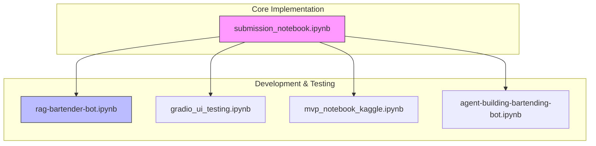
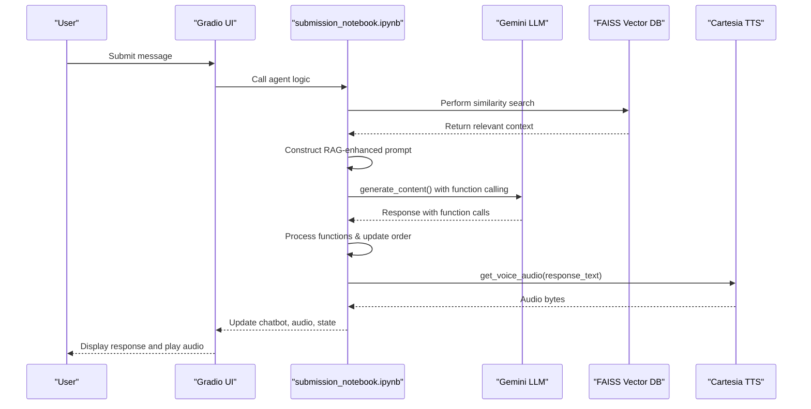
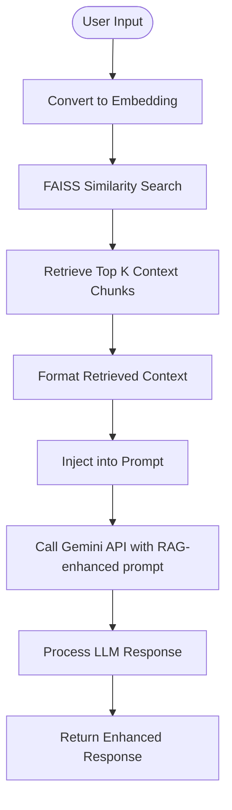
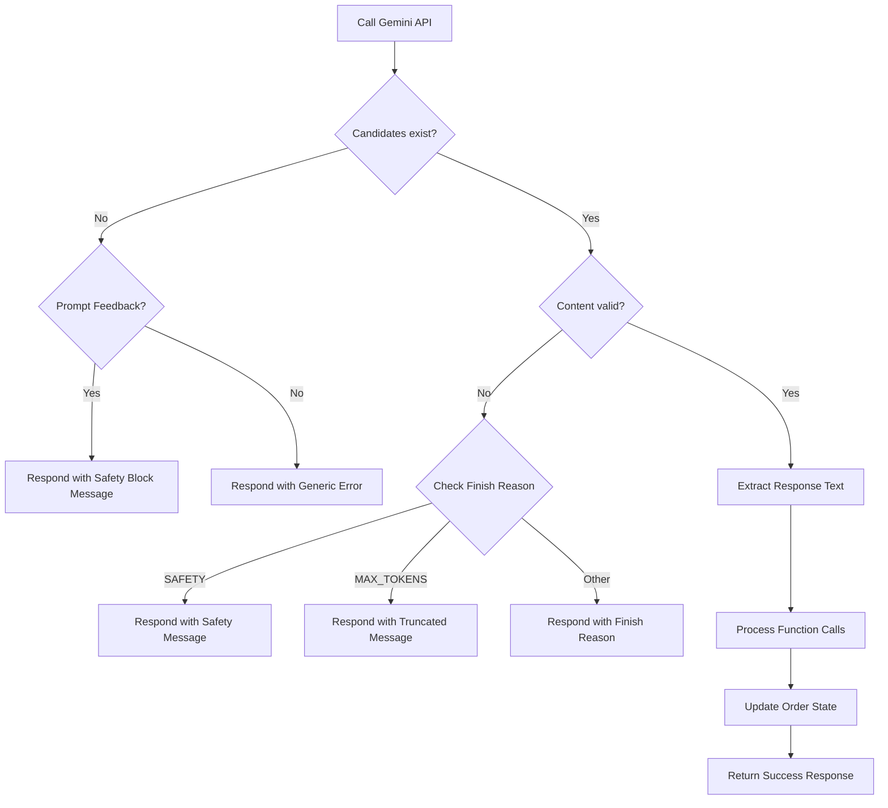

# AI Integration

<cite>
**Referenced Files in This Document**   
- [submission_notebook.ipynb](file://notebooks/submission_notebook.ipynb) - *Complete implementation with Gemini, FAISS, and Cartesia integration*
- [rag-bartender-bot.ipynb](file://notebooks/rag-bartender-bot.ipynb) - *RAG pipeline development notebook*
- [gradio_ui_testing.ipynb](file://notebooks/gradio_ui_testing.ipynb) - *UI testing and development*
- [mvp_notebook_kaggle.ipynb](file://notebooks/mvp_notebook_kaggle.ipynb) - *MVP development for Kaggle submission*
- [agent-building-bartending-bot.ipynb](file://notebooks/agent-building-bartending-bot.ipynb) - *Agent architecture development*
- [README.md](file://README.md) - *Updated with comprehensive AI integration details*
</cite>

## Update Summary
**Changes Made**   
- Updated documentation to reflect complete migration to notebook-based implementation
- Added detailed coverage of Retrieval Augmented Generation (RAG) using FAISS
- Enhanced explanation of Gemini LLM integration within Jupyter notebook environment
- Added documentation for function calling and structured output patterns
- Removed references to standalone Python files that no longer exist
- Updated architecture overview to reflect actual implementation in submission notebook

## Table of Contents
1. [Introduction](#introduction)
2. [Project Structure](#project-structure)
3. [Core Components](#core-components)
4. [Architecture Overview](#architecture-overview)
5. [Gemini LLM Integration and Prompt Engineering](#gemini-llm-integration-and-prompt-engineering)
6. [Retrieval Augmented Generation with FAISS](#retrieval-augmented-generation-with-faiss)
7. [Response Processing and Conversation State Management](#response-processing-and-conversation-state-management)
8. [Error Handling and API Resilience](#error-handling-and-api-resilience)
9. [Generation Configuration and Tuning](#generation-configuration-and-tuning)
10. [Conclusion](#conclusion)

## Introduction
This document provides a comprehensive analysis of the AI integration within the Maya Bartending Agent, focusing on the implementation of the Gemini Large Language Model (LLM) to power a conversational bartender interface. The system leverages Google's Generative AI SDK within a Jupyter notebook environment to enable natural language understanding and response generation, allowing users to place drink orders through a Gradio-based web interface. The agent combines prompt engineering, state management, function calling, and text-to-speech synthesis to deliver a cohesive user experience. This documentation details the technical architecture, core logic, and best practices for maintaining and extending the AI functionality.

## Project Structure
The project has evolved into a notebook-centric architecture where all core functionality is contained within Jupyter notebooks. The primary implementation is in `submission_notebook.ipynb`, which serves as a self-contained application with all necessary components. This notebook includes the complete agent logic, API integrations, RAG pipeline, and Gradio interface. The `notebooks/` directory contains several supporting notebooks that document the development process: `rag-bartender-bot.ipynb` focuses on the retrieval augmented generation implementation, `gradio_ui_testing.ipynb` was used for UI development, `mvp_notebook_kaggle.ipynb` contains the minimum viable product for Kaggle submission, and `agent-building-bartending-bot.ipynb` documents the agent architecture development. This structure enables rapid iteration and seamless deployment on platforms like Kaggle.

**Diagram sources**
- [submission_notebook.ipynb](file://notebooks/submission_notebook.ipynb)
- [README.md](file://README.md#L150-L200)

**Section sources**
- [submission_notebook.ipynb](file://notebooks/submission_notebook.ipynb)
- [README.md](file://README.md#L100-L150)

## Core Components
The system's core functionality is now entirely contained within Jupyter notebooks, with `submission_notebook.ipynb` serving as the primary implementation. This notebook encapsulates all components: the Gradio UI, Gemini LLM integration, FAISS vector database for RAG, Cartesia TTS integration, and business logic for order processing. The separation of concerns is maintained through code organization rather than file separation, with clearly defined sections for setup, configuration, tool definitions, and interface creation. The notebook imports necessary libraries, configures API keys, defines function tools for order management and billing, implements the RAG pipeline, and creates the interactive Gradio interface—all in a single, executable document. This approach simplifies deployment and ensures consistency across environments.

**Section sources**
- [submission_notebook.ipynb](file://notebooks/submission_notebook.ipynb)
- [agent-building-bartending-bot.ipynb](file://notebooks/agent-building-bartending-bot.ipynb)

## Architecture Overview
The application follows a notebook-based architecture where the `submission_notebook.ipynb` serves as both the development environment and production deployment. The flow begins with a user submitting a message through the Gradio interface embedded in the notebook. This input, along with the current session history and order state, is processed by the Maya agent logic within the notebook. The agent constructs a contextual prompt that includes the menu, current order, conversation history, and system instructions. Before calling the Gemini API, the system performs a vector search in the FAISS database to retrieve relevant conversational context. This retrieved context is injected into the prompt using the RAG pattern. The enhanced prompt is sent to the Gemini API, which generates a response using function calling capabilities. The response is processed to update the order state, and the conversation history is appended. Finally, the textual response is converted to speech using the Cartesia TTS service and returned to the UI for playback.

**Diagram sources**
- [submission_notebook.ipynb](file://notebooks/submission_notebook.ipynb#L200-L500)
- [README.md](file://README.md#L50-L100)

## Gemini LLM Integration and Prompt Engineering
The integration with the Gemini LLM is achieved through the `google.generativeai` SDK within the Jupyter notebook environment. The model is initialized in the notebook using the `gemini-2.5-flash-preview` model, which supports advanced function calling capabilities. The prompt engineering strategy is central to the agent's ability to function as a competent bartender. The prompt is dynamically constructed for each user interaction, incorporating several critical elements: a system role definition, the current menu, the user's order state, a limited conversation history, and the current user input. This context injection ensures the LLM has all necessary information to generate relevant and accurate responses. The system prompt explicitly defines the agent's persona as a "friendly and helpful bartender" and provides specific instructions for handling various scenarios, such as unclear orders, off-menu requests, and inquiries about the bar's name ("MOK 5-ha", explained as "Moksha").

### Function Calling and Structured Output
The implementation leverages Gemini's function calling capabilities to manage complex interactions. The notebook defines several function tools that the LLM can invoke:
- **Menu retrieval**: Allows the agent to access detailed menu information
- **Order management**: Enables adding, removing, or modifying drink orders
- **Billing system**: Handles price calculation, tip processing, and payment simulation
- **Recommendation engine**: Provides personalized drink suggestions based on customer preferences

These functions are defined in the notebook with JSON schemas that specify their parameters and return types. When the LLM determines that a function should be called, it returns a structured request that the notebook code executes. The results are then fed back into the conversation, allowing for accurate order processing and transaction management. This approach ensures reliable extraction of structured data from natural language inputs while maintaining the fluidity of conversation.

**Section sources**
- [submission_notebook.ipynb](file://notebooks/submission_notebook.ipynb#L300-L600)
- [agent-building-bartending-bot.ipynb](file://notebooks/agent-building-bartending-bot.ipynb#L100-L200)

## Retrieval Augmented Generation with FAISS
The system implements a Retrieval Augmented Generation (RAG) pattern using FAISS as the vector database to enhance the Gemini LLM's responses with relevant contextual information. The FAISS index is created within the notebook and stores embeddings of conversational content, menu details, and philosophical themes related to "Moksha." When processing a user query, the system first converts the input into an embedding using Google's text-embedding-004 model. This embedding is then used to perform a similarity search against the FAISS index to retrieve the most relevant context chunks. The retrieved context is injected into the prompt before being sent to the Gemini API, allowing the LLM to generate responses that are informed by specific knowledge rather than relying solely on its pretrained knowledge.

### RAG Pipeline Implementation
The RAG pipeline is implemented in the `rag-bartender-bot.ipynb` notebook and integrated into the main `submission_notebook.ipynb`. The pipeline consists of several key components:
- **Embedding model**: Google's text-embedding-004 for converting text to vectors
- **Vector store**: FAISS for efficient similarity search and storage
- **Retriever**: Logic for querying the vector store and formatting results
- **Context injector**: Mechanism for incorporating retrieved content into prompts

The system maintains a knowledge base of approximately 100 context chunks, including menu items, preparation methods, philosophical concepts, and common customer interactions. Each chunk is embedded and stored in the FAISS index with metadata indicating its type and relevance. During inference, the top 3-5 most similar chunks are retrieved and formatted into a coherent context section that is prepended to the main prompt. This approach significantly improves the accuracy and relevance of the agent's responses, particularly for complex queries about drink recommendations or philosophical discussions.

**Diagram sources**
- [rag-bartender-bot.ipynb](file://notebooks/rag-bartender-bot.ipynb#L50-L200)
- [submission_notebook.ipynb](file://notebooks/submission_notebook.ipynb#L400-L450)

**Section sources**
- [rag-bartender-bot.ipynb](file://notebooks/rag-bartender-bot.ipynb)
- [submission_notebook.ipynb](file://notebooks/submission_notebook.ipynb#L400-L500)

## Response Processing and Conversation State Management
The response processing pipeline is responsible for extracting meaningful actions from the LLM's output and managing the conversation state. After receiving a response from the Gemini API, the system first checks for function calls that need to be executed. If function calls are present, they are processed in sequence, with each function's result potentially modifying the order state or retrieving additional information. After all functions are processed, the final response text is generated and extracted. The pipeline then updates the conversation history by appending both the user input and the assistant response, preserving context for future interactions.

### Conversation State in Gradio
State management is handled through Gradio's `gr.State` components within the notebook. The `submission_notebook.ipynb` defines state variables for `history`, `order`, and `bill` that are passed through the Gradio interface. These states are updated after each interaction and returned as outputs, causing Gradio to persist the new state for the next turn. This pattern ensures that the conversation maintains context across multiple exchanges while running entirely within the notebook environment. The state is stored in memory during the session, allowing for coherent multi-turn conversations. The notebook also includes a reset function that clears all state variables, providing a clean slate for new customers.

**Section sources**
- [submission_notebook.ipynb](file://notebooks/submission_notebook.ipynb#L600-L800)
- [gradio_ui_testing.ipynb](file://notebooks/gradio_ui_testing.ipynb#L100-L150)

## Error Handling and API Resilience
The system implements robust error handling at multiple levels to ensure reliability within the notebook environment. At the API integration level, the code includes try-except blocks around all external API calls, including Gemini LLM requests, FAISS operations, and Cartesia TTS synthesis. For Gemini API calls, the system checks the `response.candidates` and `prompt_feedback` objects to diagnose and report specific issues, such as safety blocks or empty responses, providing user-friendly error messages. The implementation includes exponential backoff retry logic for transient failures, with configurable retry limits and delay intervals. Similarly, the Cartesia TTS integration includes fallback mechanisms and error handling to ensure that speech synthesis failures do not disrupt the core conversation flow. The notebook also validates function call parameters before execution to prevent errors from malformed JSON.

**Diagram sources**
- [submission_notebook.ipynb](file://notebooks/submission_notebook.ipynb#L800-L900)

**Section sources**
- [submission_notebook.ipynb](file://notebooks/submission_notebook.ipynb#L800-L900)
- [mvp_notebook_kaggle.ipynb](file://notebooks/mvp_notebook_kaggle.ipynb#L200-L250)

## Generation Configuration and Tuning
The generation parameters are configured to balance creativity and coherence for a bartender persona within the notebook environment. The `temperature` is set to 0.7, which introduces a moderate level of randomness, making the responses feel more natural and conversational without becoming incoherent. The `max_output_tokens` is set to 2048, providing ample space for detailed responses while preventing excessively long outputs. These parameters are passed in a `generation_config` object to the `generate_content` method. The system also monitors the `finish_reason` to detect if a response was truncated due to the token limit, appending a "... (response truncated)" message to inform the user. For function calling, the notebook configures the model to prefer function calls when appropriate, with specific instructions for when to use each tool. Tuning these parameters is key to achieving the desired personality; a lower temperature (e.g., 0.3) would make the agent more predictable and factual, while a higher temperature (e.g., 1.0) would make it more creative but potentially less reliable. For a bartending agent, the current settings strike an appropriate balance between friendliness and accuracy.

**Section sources**
- [submission_notebook.ipynb](file://notebooks/submission_notebook.ipynb#L250-L300)
- [agent-building-bartending-bot.ipynb](file://notebooks/agent-building-bartending-bot.ipynb#L50-L100)

## Conclusion
The Maya Bartending Agent demonstrates a sophisticated integration of multiple AI technologies within a notebook-based architecture. By leveraging the Gemini API with advanced function calling, retrieval augmented generation with FAISS, and thoughtful prompt engineering, the system delivers a functional and engaging user experience. The consolidation of all functionality into `submission_notebook.ipynb` simplifies deployment and ensures consistency across environments, particularly for Kaggle submission. The clear organization within the notebook promotes maintainability and scalability. Future enhancements could include persistent session storage, multi-user support, or integration with real payment systems. The current implementation provides a solid foundation for an AI-powered service agent that successfully combines natural conversation with reliable transaction processing.