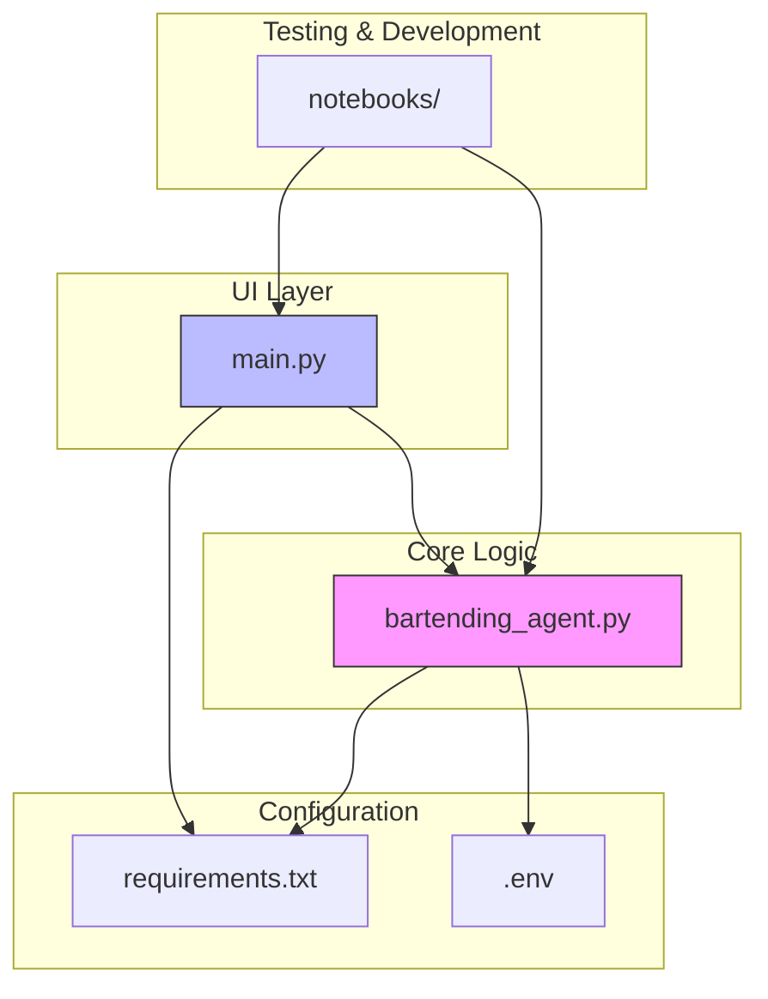
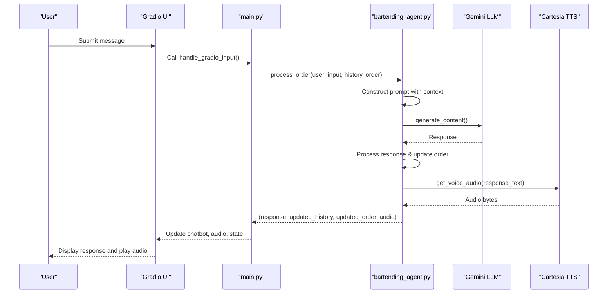
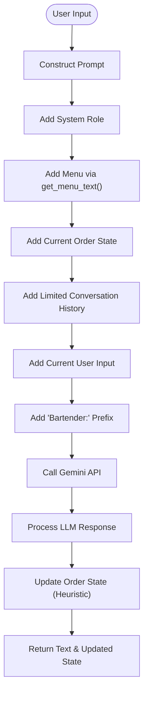
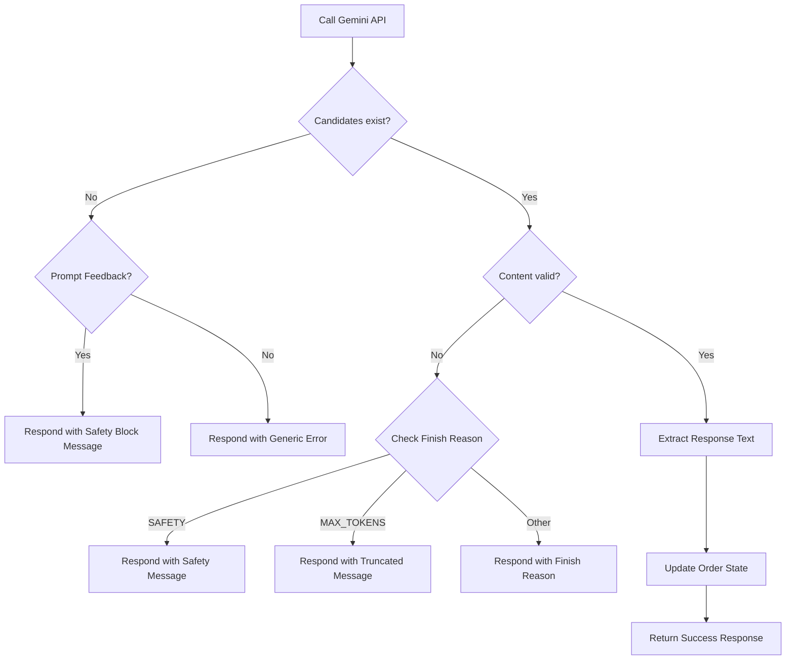

# AI Integration

<cite>
**Referenced Files in This Document**   
- [bartending_agent.py](file://bartending_agent.py)
- [main.py](file://main.py)
- [requirements.txt](file://requirements.txt)
</cite>

## Table of Contents
1. [Introduction](#introduction)
2. [Project Structure](#project-structure)
3. [Core Components](#core-components)
4. [Architecture Overview](#architecture-overview)
5. [Detailed Component Analysis](#detailed-component-analysis)
6. [Gemini LLM Integration and Prompt Engineering](#gemini-llm-integration-and-prompt-engineering)
7. [Response Processing and Conversation State Management](#response-processing-and-conversation-state-management)
8. [Error Handling and API Resilience](#error-handling-and-api-resilience)
9. [Generation Configuration and Tuning](#generation-configuration-and-tuning)
10. [Conclusion](#conclusion)

## Introduction
This document provides a comprehensive analysis of the AI integration within the Maya Bartending Agent, focusing on the implementation of the Gemini Large Language Model (LLM) to power a conversational bartender interface. The system leverages Google's Generative AI SDK to enable natural language understanding and response generation, allowing users to place drink orders through a Gradio-based web interface. The agent combines prompt engineering, state management, and text-to-speech synthesis to deliver a cohesive user experience. This documentation details the technical architecture, core logic, and best practices for maintaining and extending the AI functionality.

## Project Structure
The project is organized into a modular structure with distinct components for the AI logic, user interface, and configuration. The main application entry point is `main.py`, which initializes the Gradio interface and manages session state. The core AI logic, including LLM interaction and order processing, is encapsulated in `bartending_agent.py`. Notebooks in the `notebooks/` directory suggest iterative development and testing phases, particularly for Kaggle compatibility. Dependencies are managed via `requirements.txt`, which includes critical packages for LLM integration, retry logic, and speech synthesis.

**Diagram sources**
- [main.py](file://main.py#L1-L142)
- [bartending_agent.py](file://bartending_agent.py#L1-L374)
- [requirements.txt](file://requirements.txt#L1-L9)

**Section sources**
- [main.py](file://main.py#L1-L142)
- [bartending_agent.py](file://bartending_agent.py#L1-L374)

## Core Components
The system's core functionality is divided between two primary files. `main.py` serves as the UI controller, handling user input via Gradio and managing session state for conversation history and drink orders. It delegates the natural language processing and response generation to functions in `bartending_agent.py`. This separation of concerns ensures that the AI logic remains stateless and reusable. The `bartending_agent.py` module is responsible for initializing the Gemini LLM client, constructing prompts with dynamic context, calling the API, processing responses, and updating order state based on heuristic analysis of the LLM output. It also integrates with the Cartesia API for text-to-speech synthesis, providing an audio response to the user.

**Section sources**
- [main.py](file://main.py#L1-L142)
- [bartending_agent.py](file://bartending_agent.py#L1-L374)

## Architecture Overview
The application follows a client-server architecture where the Gradio interface acts as the frontend, and the Python backend processes user input using the Gemini LLM. The flow begins with a user submitting a message through the Gradio textbox. This input, along with the current session history and order state, is passed to the `process_order` function. The function constructs a contextual prompt that includes the menu, current order, conversation history, and a system instruction. This prompt is sent to the Gemini API, which generates a response. The response is then analyzed to update the order state, and the conversation history is appended. Finally, the textual response is converted to speech using the Cartesia TTS service and returned to the UI for playback.

**Diagram sources**
- [main.py](file://main.py#L25-L142)
- [bartending_agent.py](file://bartending_agent.py#L150-L374)

## Detailed Component Analysis
This section provides an in-depth examination of the key components that enable the AI-driven bartending experience, focusing on the integration points between the LLM, state management, and external services.

### Prompt Engineering Strategy
The prompt engineering strategy is central to the agent's ability to function as a competent bartender. The prompt is dynamically constructed for each user interaction, incorporating several critical elements: a system role definition, the current menu, the user's order state, a limited conversation history, and the current user input. This context injection ensures the LLM has all necessary information to generate relevant and accurate responses. The system prompt explicitly defines the agent's persona as a "friendly and helpful bartender" and provides specific instructions for handling various scenarios, such as unclear orders, off-menu requests, and inquiries about the bar's name ("MOK 5-ha", explained as "Moksha").

**Diagram sources**
- [bartending_agent.py](file://bartending_agent.py#L180-L250)

**Section sources**
- [bartending_agent.py](file://bartending_agent.py#L180-L250)

## Gemini LLM Integration and Prompt Engineering
The integration with the Gemini LLM is achieved through the `google.generativeai` SDK. The model is initialized once at the module level in `bartending_agent.py` using the `gemini-2.0-flash` model, ensuring efficient resource usage across requests. The `_call_gemini_api` function serves as a wrapper around the `model.generate_content()` method, incorporating retry logic via the `tenacity` library to handle transient API failures. The prompt is constructed as a list of strings, which are joined into a single string before being passed to the API. This approach allows for modular construction of the prompt context, making it easy to add or remove sections like the menu or order history.

### Context Injection and Conversation History
Context injection is implemented by programmatically building the `prompt_context` list. The menu is retrieved via the `get_menu_text()` function, which formats the static `menu` dictionary into a readable string. The current order state is formatted as a bulleted list of drink names and prices. The conversation history is limited to the last 10 entries to prevent the prompt from exceeding token limits, a common practice in LLM applications. This history is appended in chronological order, with each entry labeled by role (User or Assistant), providing the LLM with a clear dialogue context. The current user input is added at the end, followed by the "Bartender:" prefix, which acts as a trigger for the LLM to generate its response.

**Section sources**
- [bartending_agent.py](file://bartending_agent.py#L180-L250)

## Response Processing and Conversation State Management
The response processing pipeline is responsible for extracting meaningful actions from the LLM's output and managing the conversation state. After receiving a response from the Gemini API, the system first checks for errors or safety blocks. If the response is valid, the text is extracted and logged. The pipeline then uses a heuristic to update the drink order: it scans the response text for the name of a menu item and checks for keywords like "added" or "coming right up" to confirm an order has been placed. If a match is found and the item is not already the last in the order, it is appended to the `updated_order` list. This simple but effective method allows the system to maintain state without requiring complex parsing or a formal grammar.

### Conversation State in Gradio
State management is handled through Gradio's `gr.State` components. `main.py` defines two state variables: `history_state` and `order_state`, which are passed as inputs to the `handle_gradio_input` function. These states are updated within the `process_order` function and returned as outputs, causing Gradio to persist the new state for the next interaction. This pattern ensures that the core AI logic in `bartending_agent.py` remains stateless and focused on processing, while the UI framework manages the session lifecycle. The `clear_chat_state` function resets both states to empty lists, providing a clean slate for a new conversation.

**Section sources**
- [bartending_agent.py](file://bartending_agent.py#L252-L300)
- [main.py](file://main.py#L50-L70)

## Error Handling and API Resilience
The system implements robust error handling at multiple levels to ensure reliability. At the API integration level, the `tenacity_retry` decorator is applied to the `_call_gemini_api` function, enabling automatic retries for transient failures with exponential backoff. This handles common issues like network timeouts or rate limiting. Within the `process_order` function, a comprehensive try-except block catches any unhandled exceptions, preventing the application from crashing. The system checks the `response.candidates` and `prompt_feedback` objects to diagnose and report specific issues, such as safety blocks or empty responses, providing user-friendly error messages. Similarly, the `get_voice_audio` function includes retry logic and exception handling for the Cartesia TTS service, ensuring that a failure in speech synthesis does not disrupt the core conversation flow.

**Diagram sources**
- [bartending_agent.py](file://bartending_agent.py#L265-L300)

**Section sources**
- [bartending_agent.py](file://bartending_agent.py#L265-L300)

## Generation Configuration and Tuning
The generation parameters are configured to balance creativity and coherence for a bartender persona. The `temperature` is set to 0.7, which introduces a moderate level of randomness, making the responses feel more natural and conversational without becoming incoherent. The `max_output_tokens` is set to 2048, providing ample space for detailed responses while preventing excessively long outputs. These parameters are passed in a `config_dict` to the `generate_content` method. The system also monitors the `finish_reason` to detect if a response was truncated due to the token limit, appending a "... (response truncated)" message to inform the user. Tuning these parameters is key to achieving the desired personality; a lower temperature (e.g., 0.3) would make the agent more predictable and factual, while a higher temperature (e.g., 1.0) would make it more creative but potentially less reliable. For a bartending agent, the current settings strike an appropriate balance between friendliness and accuracy.

**Section sources**
- [bartending_agent.py](file://bartending_agent.py#L260-L263)

## Conclusion
The Maya Bartending Agent demonstrates a well-structured integration of a modern LLM into a conversational application. By leveraging the Gemini API with thoughtful prompt engineering, stateless function design, and robust error handling, the system delivers a functional and engaging user experience. The clear separation between the UI layer (`main.py`) and the AI logic (`bartending_agent.py`) promotes maintainability and scalability. Future enhancements could include a more sophisticated order extraction system using named entity recognition, integration with a vector database for Retrieval-Augmented Generation (RAG) to handle a larger menu, or dynamic adjustment of generation parameters based on user sentiment. The current implementation provides a solid foundation for an AI-powered service agent.