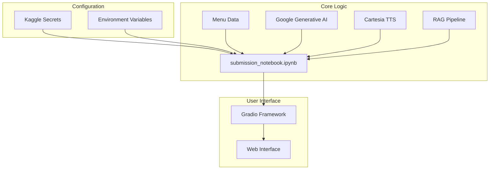
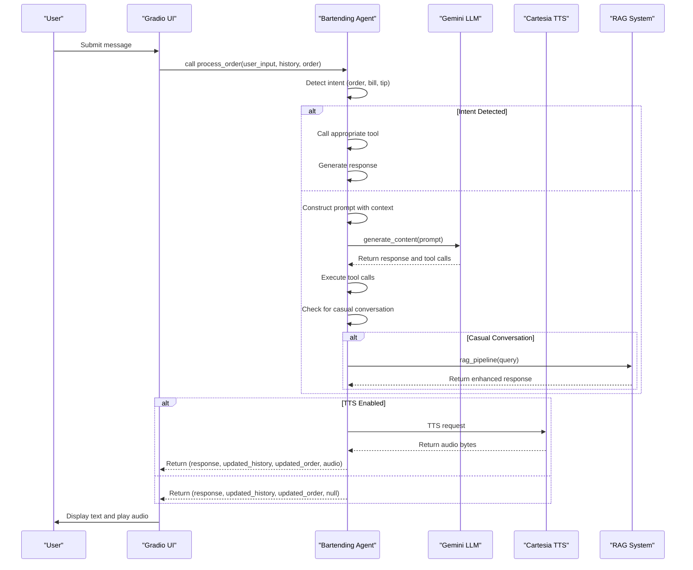
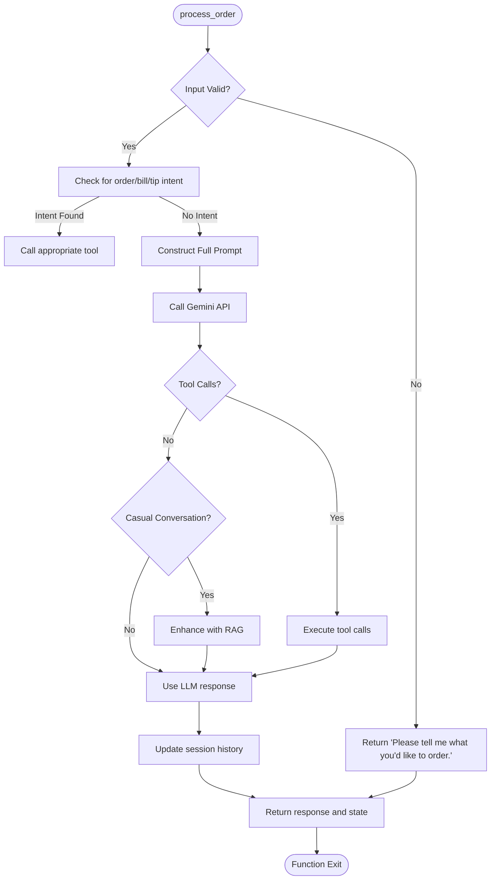
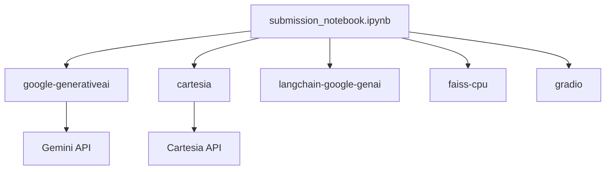

# Gemini LLM Integration

<cite>
**Referenced Files in This Document**   
- [bartending_agent.py](file://bartending_agent.py)
- [main.py](file://main.py)
- [submission_notebook.ipynb](file://notebooks/submission_notebook.ipynb) - *Updated in recent commit*
- [README.md](file://README.md) - *Updated in recent commit*
</cite>

## Update Summary
**Changes Made**   
- Updated model name from `gemini-2.0-flash` to `gemini-2.5-flash-preview-04-17` based on code changes
- Revised LLM initialization to use LangChain's `ChatGoogleGenerativeAI` and function calling
- Updated system prompt structure to include tool-based order management
- Added RAG implementation using FAISS and embeddings
- Incorporated structured tool definitions for menu, recommendations, and billing
- Removed heuristic order extraction in favor of explicit tool calling
- Updated error handling and retry mechanisms
- Added phase-based conversation management

## Table of Contents
1. [Introduction](#introduction)
2. [Project Structure](#project-structure)
3. [Core Components](#core-components)
4. [Architecture Overview](#architecture-overview)
5. [Detailed Component Analysis](#detailed-component-analysis)
6. [Dependency Analysis](#dependency-analysis)
7. [Performance Considerations](#performance-considerations)
8. [Troubleshooting Guide](#troubleshooting-guide)
9. [Conclusion](#conclusion)

## Introduction
This document provides a comprehensive analysis of the Gemini LLM integration within the Maya Bartending Agent, a conversational AI bartender application. The agent leverages Google's Generative AI SDK through LangChain to process natural language inputs, manage drink orders via function calling, and generate human-like responses. The system is designed with a stateful architecture that tracks conversation phases and uses Retrieval Augmented Generation (RAG) for enhanced personality. This documentation details the initialization and configuration of the Gemini model, the structure of the system prompt that defines the agent's persona, the data flow between components, and the strategies for handling errors and edge cases.

## Project Structure
The Maya Bartending Agent project is organized into a simple yet effective structure, separating core logic from the user interface. The main components are the `submission_notebook.ipynb` file, which contains the complete implementation including LLM integration, business logic, and Gradio interface. Utility notebooks are provided for testing, and dependencies are managed via inline installation. The application follows a modular design within a single notebook, allowing the core agent logic to be self-contained and easily deployable on Kaggle.



**Diagram sources**
- [submission_notebook.ipynb](file://notebooks/submission_notebook.ipynb#L1-L2887)

**Section sources**
- [submission_notebook.ipynb](file://notebooks/submission_notebook.ipynb#L1-L2887)

## Core Components
The core functionality of the Maya Bartending Agent is encapsulated in the `submission_notebook.ipynb` file, which contains all LLM interactions, business logic, and the Gradio interface. The notebook uses LangChain's `ChatGoogleGenerativeAI` for LLM integration, implementing function calling for order management, billing, and recommendations. The RAG system uses FAISS for vector storage and Google's embedding model for semantic search. The Gradio interface manages session state and provides a web-based user experience. The components communicate through a well-defined flow where user input is processed through the LLM with tool calling, and responses are enhanced with RAG when appropriate.

**Section sources**
- [submission_notebook.ipynb](file://notebooks/submission_notebook.ipynb#L1-L2887)

## Architecture Overview
The system architecture is a client-server model where the Gradio web application acts as the client, and the notebook logic serves as the backend service. The architecture uses a hybrid state management approach with global variables for conversation state and order history. When a user submits a message, the Gradio callback processes the input through a multi-step pipeline: intent detection for orders/bills/tips, LLM processing with tool calling, and RAG enhancement for casual conversation. The LLM generates responses and tool calls based on the system prompt and conversation context. If text-to-speech is enabled, the response is sent to the Cartesia API to generate audio. The updated state and audio are returned to the Gradio interface for display.



**Diagram sources**
- [submission_notebook.ipynb](file://notebooks/submission_notebook.ipynb#L1-L2887)

## Detailed Component Analysis

### Gemini LLM Initialization and Configuration
The Google Generative AI SDK is initialized using LangChain's `ChatGoogleGenerativeAI` class within the notebook. The API key is securely retrieved from Kaggle secrets using `UserSecretsClient`, with a fallback to environment variables. The model is configured with the specific version `'gemini-2.5-flash-preview-04-17'`, which differs from the previously documented `gemini-2.0-flash`. The initialization includes comprehensive error handling to ensure the application fails gracefully if API keys are missing.

#### Model Configuration Parameters
The generation parameters are defined within the LangChain LLM configuration and include:

```python
llm = ChatGoogleGenerativeAI(
    model="gemini-2.5-flash-preview-04-17",
    temperature=0.7,
    max_tokens=None,
    max_retries=3,
)
```

- **temperature**: Set to `0.7`, this value introduces a moderate level of randomness into the response generation, allowing Maya to be conversational and slightly creative while maintaining relevance.
- **max_tokens**: Set to `None`, allowing the model to generate responses of any length, with truncation handled by the system.
- **max_retries**: Set to `3`, providing built-in retry logic for transient API failures.

**Section sources**
- [submission_notebook.ipynb](file://notebooks/submission_notebook.ipynb#L70-L85)

### System Prompt and Persona Definition
The system prompt is dynamically constructed and serves as the foundation for Maya's persona, tone, and functional constraints. It is structured as a series of clear, imperative instructions that define Maya's role and behavior.

#### Prompt Structure
The prompt structure includes:

1. **Role Assignment**: `"You are Maya, a highly-skilled bartender at 'MOK 5-ha Bar'. MOK 5-ha means Moksha, representing spiritual liberation."` This establishes the core identity.
2. **Behavioral Guidelines**: Instructions to be friendly, conversational, and maintain a professional demeanor.
3. **Functional Constraints**: Explicit instructions to use specific tools for order management, billing, and recommendations.
4. **Tool Integration**: The prompt includes the menu content retrieved via the `get_menu` tool, ensuring the LLM has up-to-date information.
5. **Phase-Based Prompts**: Different prompts are used based on conversation phase (greeting, order taking, small talk, reorder prompt).

This structured approach ensures consistent behavior and proper tool usage.

**Section sources**
- [submission_notebook.ipynb](file://notebooks/submission_notebook.ipynb#L180-L220)

### Message Formatting and Context Management
User input and conversation history are formatted into the model's context window using LangChain's message types. This approach provides a structured way to manage the conversation.

#### Message Dictionary Structure
The conversation history is maintained as a list of dictionaries with role and content, which is converted to LangChain message types:

```python
# Convert Gradio history to LangChain message types
for entry in limited_history:
    role = entry.get("role")
    content = entry.get("content", "")
    if role == "user":
        messages.append(HumanMessage(content=content))
    elif role == "assistant":
        messages.append(AIMessage(content=content))
```

The history is limited to the last 10 entries to prevent prompt length issues. The system also tracks conversation state including turn count, phase, and small talk count to manage the interaction flow.

**Section sources**
- [submission_notebook.ipynb](file://notebooks/submission_notebook.ipynb#L210-L230)

### Intent Recognition, Order Extraction, and Response Generation
The LLM plays a central role in all aspects of the agent's functionality, with a significant shift from heuristic extraction to explicit tool calling.

- **Intent Recognition**: The system uses both LLM-based tool calling and regex-based intent detection for common requests (show order, get bill, pay bill, add tip).
- **Order Extraction**: The LLM is now explicitly instructed to use the `add_to_order` tool when a customer requests a drink, eliminating the need for heuristic extraction from response text.
- **Natural Response Generation**: The primary function of the LLM is to generate natural, conversational responses, with RAG enhancement for casual conversation.

**Section sources**
- [submission_notebook.ipynb](file://notebooks/submission_notebook.ipynb#L240-L280)

### Conversational Coherence and Handling Ambiguity
The agent maintains conversational coherence through multiple mechanisms:

1. **Conversation Phases**: The system tracks phases (greeting, order taking, small talk, reorder prompt) to guide the interaction flow.
2. **Phase Transitions**: After 4 turns of small talk, the agent prompts for additional orders.
3. **RAG Enhancement**: For casual conversation, responses are enhanced with retrieved passages from a personality library.
4. **Explicit Instructions**: The system prompt instructs the LLM to ask clarifying questions for ambiguous orders.

This ensures a natural conversation rhythm while maintaining functional reliability.

**Section sources**
- [submission_notebook.ipynb](file://notebooks/submission_notebook.ipynb#L180-L182)

### Tuning Generation Settings
The current settings (`temperature=0.7`, `max_retries=3`) balance creativity and reliability. For a bartender persona, this temperature allows for conversational variety while maintaining focus. The built-in retry mechanism handles transient API failures. Future tuning could explore:
- Lower temperature (0.3-0.5) for more deterministic responses in order processing
- Higher temperature (0.8-0.9) for more creative small talk
- Custom prompts for different conversation phases

**Section sources**
- [submission_notebook.ipynb](file://notebooks/submission_notebook.ipynb#L250-L255)

### Error Handling and Fallback Strategies
The code implements robust error handling at multiple levels:

- **API Initialization**: Critical errors during initialization result in clear warnings, allowing the application to continue without TTS functionality.
- **API Calls**: Built-in retry logic in LangChain handles transient errors.
- **Intent Detection**: Regex-based detection provides fast responses for common requests without LLM invocation.
- **RAG Fallback**: If RAG enhancement fails, the original LLM response is used.
- **Tool Calling**: Explicit tool usage ensures reliable order and billing management.



**Diagram sources**
- [submission_notebook.ipynb](file://notebooks/submission_notebook.ipynb#L240-L350)

## Dependency Analysis
The application relies on several external dependencies, primarily managed within the notebook. Key dependencies include `google-generativeai` for LLM interaction, `cartesia` for text-to-speech, `gradio` for the web interface, `langchain-google-genai` for LangChain integration, and `faiss-cpu` for vector storage. The use of `tenacity` for retry logic demonstrates good engineering practices. The code includes defensive programming with fallbacks when optional components are unavailable.



**Diagram sources**
- [submission_notebook.ipynb](file://notebooks/submission_notebook.ipynb#L1-L2887)

**Section sources**
- [submission_notebook.ipynb](file://notebooks/submission_notebook.ipynb#L1-L2887)

## Performance Considerations
The application's performance is influenced by external API calls to Gemini and Cartesia. The use of built-in retry logic helps mitigate transient network issues. The stateful design with global variables is optimized for single-user scenarios but limits scalability. The limitation of conversation history to 10 turns helps manage prompt size. The RAG system pre-computes embeddings for personality passages, improving response time. For production deployment, monitoring API response times and implementing a frontend loading state would improve user experience.

## Troubleshooting Guide
This section addresses common issues based on the code's error handling and logging.

- **"GOOGLE_API_KEY not found"**: This occurs if the `GOOGLE_API_KEY` is not set in Kaggle secrets or environment variables. Ensure the key is properly configured.
- **"CARTESIA_API_KEY not found"**: Verify the `CARTESIA_API_KEY` is set in Kaggle secrets and the `CARTESIA_VOICE_ID` is valid.
- **Irrelevant or Off-Topic Responses**: This may be due to the high temperature setting. Consider lowering the temperature parameter.
- **Hallucinations**: The tool-based approach for orders and billing significantly reduces hallucinations by requiring explicit tool calls.
- **Latency or Slow Responses**: This is typically due to network latency with external APIs. Check the logs for warnings about retries or timeouts.
- **No Audio Output**: Check the logs for warnings from the TTS system. Common causes include an empty response or failed TTS API call.

**Section sources**
- [submission_notebook.ipynb](file://notebooks/submission_notebook.ipynb#L75-L85)

## Conclusion
The Maya Bartending Agent effectively integrates the Gemini LLM to create a sophisticated conversational AI. The code demonstrates a well-structured design that combines LLM capabilities with traditional programming for reliable functionality. Key strengths include robust error handling, clear persona definition through the system prompt, effective use of RAG for personality enhancement, and a practical approach to state management. The integration of text-to-speech enhances the user experience. Future improvements could include multi-user session management, persistent conversation history, and expanded multilingual support.