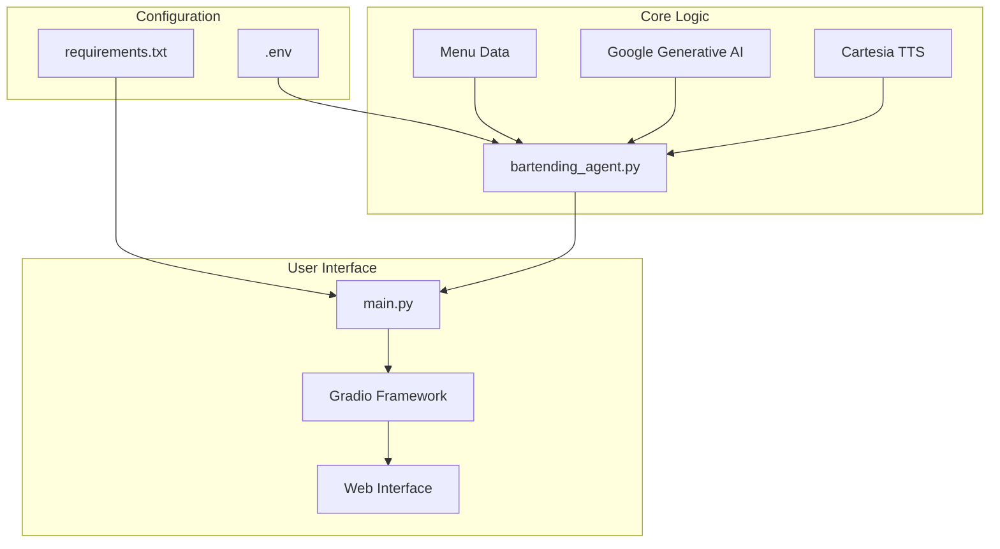
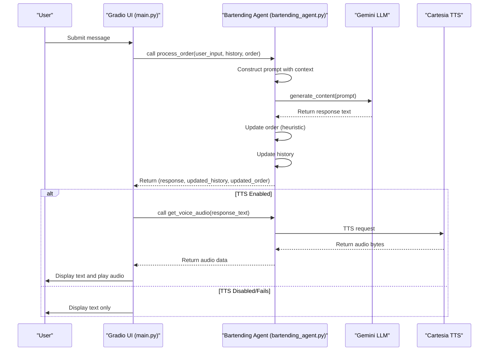
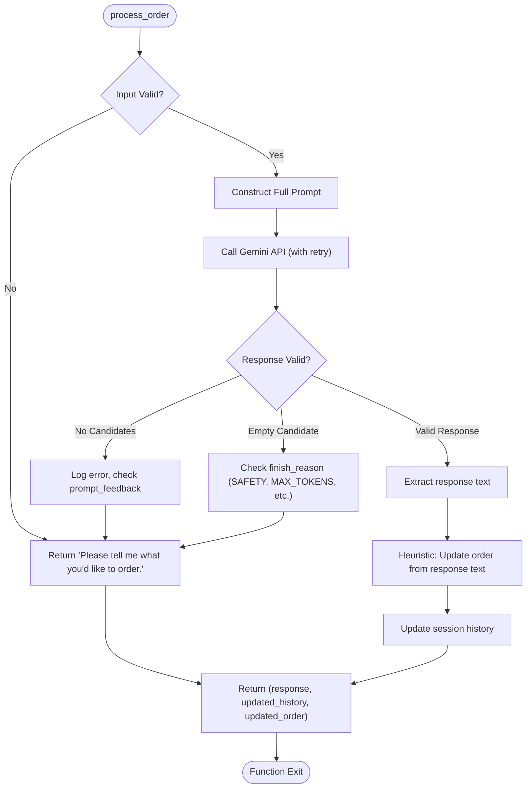
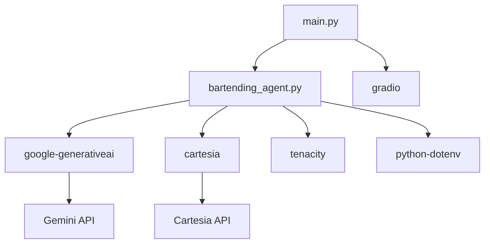

# Gemini LLM Integration

<cite>
**Referenced Files in This Document**   
- [bartending_agent.py](file://bartending_agent.py)
- [main.py](file://main.py)
</cite>

## Table of Contents
1. [Introduction](#introduction)
2. [Project Structure](#project-structure)
3. [Core Components](#core-components)
4. [Architecture Overview](#architecture-overview)
5. [Detailed Component Analysis](#detailed-component-analysis)
6. [Dependency Analysis](#dependency-analysis)
7. [Performance Considerations](#performance-considerations)
8. [Troubleshooting Guide](#troubleshooting-guide)
9. [Conclusion](#conclusion)

## Introduction
This document provides a comprehensive analysis of the Gemini LLM integration within the Maya Bartending Agent, a conversational AI bartender application. The agent leverages Google's Generative AI SDK to process natural language inputs, manage drink orders, and generate human-like responses. The system is designed with a stateless architecture, where conversation history and order state are managed externally by the Gradio interface and passed into the core logic functions. This documentation details the initialization and configuration of the Gemini model, the structure of the system prompt that defines the agent's persona, the data flow between components, and the strategies for handling errors and edge cases.

## Project Structure
The Maya Bartending Agent project is organized into a simple yet effective structure, separating core logic from the user interface. The main components are the `bartending_agent.py` module, which contains the LLM integration and business logic, and the `main.py` file, which defines the Gradio web interface. Utility notebooks are provided for testing, and dependencies are managed via `requirements.txt`. The application follows a modular design, allowing the core agent logic to be reused independently of the UI framework.



**Diagram sources**
- [bartending_agent.py](file://bartending_agent.py#L1-L375)
- [main.py](file://main.py#L1-L143)

**Section sources**
- [bartending_agent.py](file://bartending_agent.py#L1-L375)
- [main.py](file://main.py#L1-L143)

## Core Components
The core functionality of the Maya Bartending Agent is encapsulated in two primary files. The `bartending_agent.py` file is responsible for all interactions with the Gemini LLM, including model initialization, prompt construction, API calls, and response processing. It also contains the static menu data and the logic for updating the user's order based on the LLM's output. The `main.py` file serves as the entry point for the application, defining the Gradio interface and managing the session state (conversation history and order list). The two components communicate through a well-defined API: `main.py` passes user input and session state to the `process_order` function in `bartending_agent.py`, which returns a response, updated history, and updated order.

**Section sources**
- [bartending_agent.py](file://bartending_agent.py#L1-L375)
- [main.py](file://main.py#L1-L143)

## Architecture Overview
The system architecture is a client-server model where the Gradio web application acts as the client, and the `bartending_agent.py` module acts as the backend service. The architecture is stateless, meaning the `bartending_agent.py` module does not store any session data. Instead, the Gradio interface maintains the session state (history and order) using `gr.State` components. When a user submits a message, the Gradio callback `handle_gradio_input` collects the current state and passes it to the `process_order` function. This function constructs a prompt for the Gemini LLM, which includes the system instructions, the current menu, the user's order history, and the conversation history. The LLM generates a response, which is then used to update the session state. If text-to-speech is enabled, the response is also sent to the Cartesia API to generate audio. The updated state and audio are returned to the Gradio interface for display.



**Diagram sources**
- [bartending_agent.py](file://bartending_agent.py#L1-L375)
- [main.py](file://main.py#L1-L143)

## Detailed Component Analysis

### Gemini LLM Initialization and Configuration
The Google Generative AI SDK is initialized at the module level in `bartending_agent.py`, ensuring a single client instance is reused for all requests. The API key is securely retrieved from environment variables using `os.getenv("GEMINI_API_KEY")`, with a fallback to a `.env` file if the `python-dotenv` library is installed. The model is configured using the `GenerativeModel` class with the model name `'gemini-2.0-flash'`. A try-except block ensures that any failure during initialization (e.g., invalid API key, network issues) is logged and results in a fatal error, preventing the application from starting in an unstable state.

#### Model Configuration Parameters
The generation parameters are defined within the `_call_gemini_api` function and passed to the `generate_content` method via the `generation_config` dictionary. These parameters are crucial for shaping the behavior of the LLM to fit the bartender persona.

```python
config_dict = {
    'temperature': 0.7,
    'max_output_tokens': 2048,
}
```

- **temperature**: Set to `0.7`, this value introduces a moderate level of randomness into the response generation. This allows Maya to be conversational and slightly creative in her responses, avoiding robotic repetition, while still ensuring that her answers remain relevant and coherent to the user's input.
- **max_output_tokens**: Set to `2048`, this parameter limits the length of the generated response. This prevents excessively long replies and helps manage API costs and latency. The application includes logic to handle cases where the response is truncated due to this limit.
- **candidate_count**: This parameter is not explicitly set, so it defaults to `1`, meaning the model will return a single response candidate.

**Section sources**
- [bartending_agent.py](file://bartending_agent.py#L65-L85)

### System Prompt and Persona Definition
The system prompt is dynamically constructed within the `process_order` function and serves as the foundation for Maya's persona, tone, and functional constraints. It is not a static string but is built from a list of context strings that are joined together. This prompt is sent with every API call, ensuring the LLM has the necessary context for each interaction.

#### Prompt Structure
The prompt is structured as a series of clear, imperative instructions:

1.  **Role Assignment**: `"You are a friendly and helpful bartender taking drink orders."` This establishes the core identity.
2.  **Behavioral Guidelines**: `"Be conversational. Ask clarifying questions if the order is unclear."` This defines the desired tone and interaction style.
3.  **Functional Constraints**: Instructions for handling off-menu requests, displaying the current order, and explaining the bar's name ("MOK 5-ha" as "Moksha") provide specific operational rules.
4.  **Contextual Data**: The prompt includes the full menu, generated by the `get_menu_text()` function, and the current order state, ensuring the LLM has up-to-date information.
5.  **Conversation History**: The last 10 turns of the conversation are included to maintain context and coherence across multiple interactions.
6.  **Explicit Output Request**: The prompt ends with `"Bartender:"`, explicitly instructing the model to generate its response from the bartender's perspective.

This structured approach ensures that Maya consistently adheres to her role, provides accurate information about the menu, and maintains a natural flow of conversation.

**Section sources**
- [bartending_agent.py](file://bartending_agent.py#L180-L220)

### Message Formatting and Context Management
User input and conversation history are formatted into the model's context window using a list of strings, which are then joined with newlines to form a single prompt string. This method is straightforward and effective for the Gemini model.

#### Message Dictionary Structure
The conversation history is maintained as a list of dictionaries, where each dictionary has two keys:
- **role**: A string that is either `"user"` or `"assistant"`.
- **content**: A string containing the actual text of the message.

This structure is passed into the `process_order` function and used to build the prompt context. The history is limited to the last 10 entries (`history_limit = 10`) to prevent the prompt from becoming too long, which could increase costs and latency, and potentially cause the model to lose focus on the most recent interactions.

```python
# Example of a message dictionary
{"role": "user", "content": "I'd like a Margarita."}
{"role": "assistant", "content": "Sure thing! One Margarita coming right up."}
```

The `process_order` function appends the new user input and the LLM's response to a local copy of the history, which is then returned as the updated state. This stateless pattern ensures that the core logic is pure and predictable, with all state changes being explicit.

**Section sources**
- [bartending_agent.py](file://bartending_agent.py#L210-L230)

### Intent Recognition, Order Extraction, and Response Generation
The LLM plays a central role in all aspects of the agent's functionality.

- **Intent Recognition**: By processing the user's natural language input within the context of the system prompt and conversation history, the LLM inherently recognizes the user's intent (e.g., placing an order, asking about the menu, inquiring about the bar's name).
- **Order Extraction**: The LLM is not directly tasked with returning structured order data. Instead, the application uses a heuristic approach to extract order information from the LLM's natural language response. The `process_order` function scans the response text for the names of menu items and checks for keywords like "added" or "coming right up" to determine if an item should be added to the order. This simple but effective method avoids the complexity of structured output parsing.
- **Natural Response Generation**: The primary function of the LLM is to generate natural, conversational responses. The system prompt and the provided context (menu, order, history) guide the LLM to produce responses that are helpful, on-brand, and contextually appropriate.

**Section sources**
- [bartending_agent.py](file://bartending_agent.py#L240-L280)

### Conversational Coherence and Handling Ambiguity
The agent maintains conversational coherence by including a limited history of the conversation in every prompt sent to the LLM. This allows the model to understand the context of the current user input and generate a relevant response. For ambiguous or incomplete requests (e.g., "I want something fruity"), the system prompt explicitly instructs the LLM to "ask clarifying questions." This ensures that the agent does not make assumptions but instead engages the user in a dialogue to confirm their order, which is a critical behavior for a reliable bartending service.

**Section sources**
- [bartending_agent.py](file://bartending_agent.py#L180-L182)

### Tuning Generation Settings
The current settings (`temperature=0.7`, `max_output_tokens=2048`) strike a balance between creativity and reliability. For a bartender persona, a higher temperature (e.g., 0.8-0.9) could make Maya more playful and creative, but it also increases the risk of irrelevant or off-topic responses. A lower temperature (e.g., 0.3-0.5) would make her responses more deterministic and reliable but potentially more robotic. The `max_output_tokens` setting should be monitored; if responses are frequently truncated, it may need to be increased, but this should be balanced against performance and cost.

**Section sources**
- [bartending_agent.py](file://bartending_agent.py#L250-L255)

### Error Handling and Fallback Strategies
The code implements a robust error handling strategy at multiple levels.

- **API Initialization**: Critical errors during the initialization of the Gemini or Cartesia clients result in a fatal error, preventing the application from starting.
- **API Calls**: The `_call_gemini_api` function is decorated with `@tenacity_retry`, which automatically retries the call up to three times with exponential backoff if a transient error occurs (e.g., network timeout, server error).
- **Response Validation**: The `process_order` function checks the LLM's response for validity. If no candidates are returned, or if the response is blocked for safety reasons, a clear and user-friendly error message is generated.
- **Exception Handling**: A broad `try-except` block surrounds the core logic in `process_order`. If an unhandled exception occurs, a safe fallback response is returned, and the session state is preserved to prevent corruption.
- **TTS Fallback**: If the text-to-speech generation fails, the application continues to function, simply returning the text response without audio.



**Diagram sources**
- [bartending_agent.py](file://bartending_agent.py#L240-L350)

## Dependency Analysis
The application relies on several external dependencies, as defined in `requirements.txt`. The primary dependencies are `google-generativeai` for LLM interaction, `cartesia` for text-to-speech, and `gradio` for the web interface. The use of `tenacity` for retry logic and `python-dotenv` for environment variable management demonstrates good engineering practices. The code includes defensive programming by defining dummy decorators if `tenacity` is not available, allowing the application to run (without retries) rather than failing completely.



**Diagram sources**
- [requirements.txt](file://requirements.txt#L1-L9)
- [bartending_agent.py](file://bartending_agent.py#L1-L375)
- [main.py](file://main.py#L1-L143)

**Section sources**
- [requirements.txt](file://requirements.txt#L1-L9)

## Performance Considerations
The application's performance is primarily influenced by the latency of the external API calls to Gemini and Cartesia. The use of retries with exponential backoff helps mitigate transient network issues but can increase the total response time. The stateless design and the use of a single, reused model instance are performance optimizations. The limitation of the conversation history to 10 turns helps keep prompt sizes manageable, reducing both processing time and API costs. For production deployment, monitoring API response times and implementing a frontend loading state would improve the user experience.

## Troubleshooting Guide
This section addresses common issues based on the code's error handling and logging.

- **"GEMINI_API_KEY not found"**: This fatal error occurs if the `GEMINI_API_KEY` environment variable is not set. Ensure the key is present in the `.env` file or system environment.
- **"Failed to initialize Cartesia client"**: Verify the `CARTESIA_API_KEY` is set and the `CARTESIA_VOICE_ID` in `bartending_agent.py` is a valid ID from the Cartesia platform.
- **Irrelevant or Off-Topic Responses**: This may be due to a high temperature setting or an ambiguous prompt. Consider lowering the `temperature` parameter or refining the system prompt instructions.
- **Hallucinations (e.g., making up menu items)**: The system prompt instructs the LLM to refer to the provided menu, but hallucinations can still occur. The heuristic order update only adds items from the predefined `menu` dictionary, which acts as a safeguard against adding non-existent items to the order.
- **Latency or Slow Responses**: This is typically due to network latency with the external APIs. The retry logic can also contribute to delays. Check the logs for warnings about retries or timeouts.
- **No Audio Output**: Check the logs for warnings from `get_voice_audio`. Common causes include an empty response text, an uninitialized Cartesia client, or a failed TTS API call.

**Section sources**
- [bartending_agent.py](file://bartending_agent.py#L75-L85)
- [bartending_agent.py](file://bartending_agent.py#L130-L145)
- [bartending_agent.py](file://bartending_agent.py#L300-L350)

## Conclusion
The Maya Bartending Agent effectively integrates the Gemini LLM to create a functional and engaging conversational AI. The code demonstrates a well-structured, stateless design that separates concerns between the core logic and the user interface. Key strengths include robust error handling, clear persona definition through the system prompt, and a practical approach to state management. The integration of text-to-speech enhances the user experience. Future improvements could include more sophisticated order extraction (e.g., using structured outputs from the LLM), enhanced safety settings, and a more dynamic menu system.