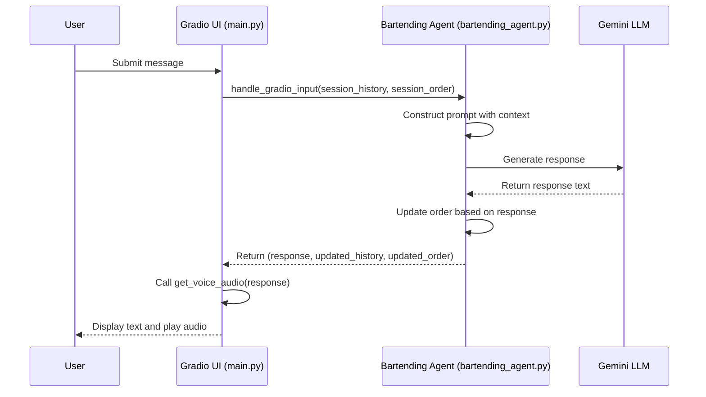
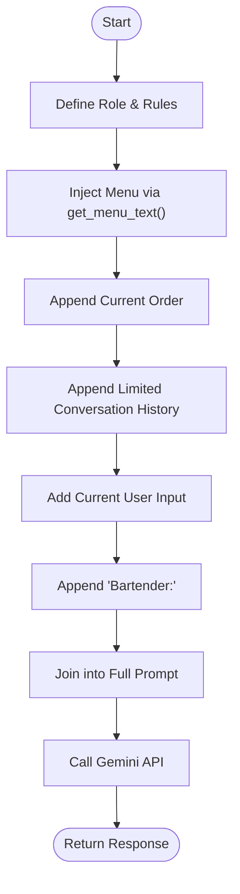
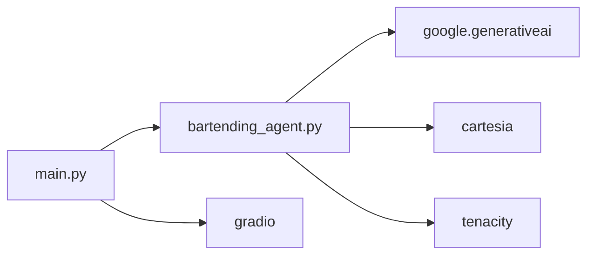

# Prompt Engineering Strategy

<cite>
**Referenced Files in This Document**   
- [bartending_agent.py](file://bartending_agent.py)
- [main.py](file://main.py)
</cite>

## Table of Contents
1. [Introduction](#introduction)
2. [Project Structure](#project-structure)
3. [Core Components](#core-components)
4. [Architecture Overview](#architecture-overview)
5. [Detailed Component Analysis](#detailed-component-analysis)
6. [Dependency Analysis](#dependency-analysis)
7. [Performance Considerations](#performance-considerations)
8. [Troubleshooting Guide](#troubleshooting-guide)
9. [Conclusion](#conclusion)

## Introduction
This document details the prompt engineering strategy used to define Maya’s behavior as an AI bartender. The system leverages a structured prompt template to establish Maya’s role, personality, and operational boundaries. Dynamic contextual data such as the current drink menu, active order, and conversation history are injected into the prompt to enable situational awareness. The design ensures Maya only serves drinks from the menu, responds conversationally, and maintains coherence across multi-turn interactions. This document analyzes the implementation in `bartending_agent.py`, including how the prompt is programmatically constructed, how structured outputs are encouraged, and how off-topic responses are mitigated.

## Project Structure
The project is organized into a modular structure with distinct components for core logic, user interface, and configuration. The main application files are `bartending_agent.py`, which contains the AI agent logic, and `main.py`, which defines the Gradio-based web interface. Supporting notebooks are used for testing and development, while `requirements.txt` manages dependencies.

```mermaid
graph TB
subgraph "Core Logic"
A[bartending_agent.py] --> B[process_order]
A --> C[get_menu_text]
A --> D[get_voice_audio]
end
subgraph "UI Layer"
E[main.py] --> F[Gradio Interface]
E --> G[handle_gradio_input]
end
A --> E : "Imported by"
F --> B : "Calls"
```

**Diagram sources**
- [bartending_agent.py](file://bartending_agent.py#L1-L375)
- [main.py](file://main.py#L1-L143)

**Section sources**
- [bartending_agent.py](file://bartending_agent.py#L1-L375)
- [main.py](file://main.py#L1-L143)

## Core Components
The core functionality of Maya is implemented in `bartending_agent.py`. The `process_order` function is central to the prompt engineering strategy, as it constructs the dynamic prompt using the current session state. The prompt includes Maya’s role definition, the drink menu, the current order, and the conversation history. This ensures Maya responds appropriately based on context. The `get_menu_text` function generates a formatted string of available drinks, which is embedded into the prompt. The `main.py` file orchestrates the interaction flow by managing session state and integrating text and voice responses.

**Section sources**
- [bartending_agent.py](file://bartending_agent.py#L150-L375)
- [main.py](file://main.py#L25-L143)

## Architecture Overview
The system follows a stateless, function-driven architecture where session state is passed explicitly between the UI and the agent logic. The Gradio interface in `main.py` maintains session state for conversation history and order, which is passed to `process_order` on each user input. The agent processes the input using a dynamically constructed prompt and returns a response along with updated state. Voice synthesis is handled separately using the Cartesia API.



**Diagram sources**
- [main.py](file://main.py#L45-L143)
- [bartending_agent.py](file://bartending_agent.py#L150-L375)

## Detailed Component Analysis

### Prompt Construction in process_order
The `process_order` function in `bartending_agent.py` is responsible for building the prompt that guides Maya’s behavior. It starts with a system message defining Maya’s role as a "friendly and helpful bartender" and includes instructions for handling various scenarios, such as unclear orders or requests for unavailable drinks. The current menu is injected using `get_menu_text()`, ensuring Maya only references available items.

```python
prompt_context = [
    "You are a friendly and helpful bartender taking drink orders.",
    "Be conversational. Ask clarifying questions if the order is unclear.",
    "If the user asks for something not on the menu, politely tell them and show the menu again.",
    "If the user asks to see their current order, list the items and their prices.",
    "\nHere is the menu:",
    get_menu_text(),
    "\nCurrent order:",
]
```

The current order and conversation history are appended to provide context. Only the last 10 turns of history are included to manage token usage. The prompt ends with "Bartender:" to signal the model to generate a response in character.

#### Prompt Template Flow


**Diagram sources**
- [bartending_agent.py](file://bartending_agent.py#L190-L220)

**Section sources**
- [bartending_agent.py](file://bartending_agent.py#L150-L250)

### Response Structuring and Output Control
To guide the model toward structured outputs, the prompt includes implicit hints. For example, when listing the current order, the format "- Drink Name ($Price)" is used in the prompt, encouraging the model to follow the same pattern. The system also uses heuristics to detect when a drink has been added to the order by scanning the response for keywords like "added" or "coming right up" in conjunction with a menu item name.

```python
if item_name_lower in response_lower and \
   any(add_word in response_lower for add_word in ["added", "adding", "got it", "sure thing", "order up", "coming right up"]):
    updated_order.append(item)
```

This ensures the order state is updated correctly even without structured output parsing.

### Mitigation of Off-Topic Responses
The prompt design enforces compliance with beverage service logic by explicitly stating boundaries. Maya is instructed to only serve drinks from the menu and to redirect requests for unavailable items. Safety settings in the Gemini API further prevent inappropriate responses. The system also handles edge cases such as empty input or API errors by returning safe fallback messages.

## Dependency Analysis
The application relies on several external libraries, including `google-generativeai` for LLM interaction, `gradio` for the web interface, and `cartesia` for text-to-speech. These dependencies are managed in `requirements.txt`. The `tenacity` library provides retry logic for API calls, improving reliability.



**Diagram sources**
- [requirements.txt](file://requirements.txt#L1-L9)
- [bartending_agent.py](file://bartending_agent.py#L1-L375)
- [main.py](file://main.py#L1-L143)

**Section sources**
- [requirements.txt](file://requirements.txt#L1-L9)
- [bartending_agent.py](file://bartending_agent.py#L1-L375)

## Performance Considerations
The system is designed to minimize latency by using the Gemini 2.0 Flash model, which is optimized for speed. The conversation history is limited to 10 turns to control prompt length and token usage. Retry logic with exponential backoff is implemented for API calls to handle transient failures. Voice synthesis is performed synchronously after text generation, which may introduce delay but ensures a cohesive user experience.

## Troubleshooting Guide
Common issues include missing API keys, which result in fatal errors during initialization. Ensure `GEMINI_API_KEY` and `CARTESIA_API_KEY` are set in the environment or `.env` file. If the voice ID is invalid, TTS will fail silently. Verify the `CARTESIA_VOICE_ID` in `bartending_agent.py`. If the model returns no candidates, check the prompt for safety violations or token limits.

**Section sources**
- [bartending_agent.py](file://bartending_agent.py#L50-L100)
- [bartending_agent.py](file://bartending_agent.py#L300-L350)

## Conclusion
The prompt engineering strategy for Maya effectively combines role definition, dynamic context injection, and response formatting to create a coherent and functional AI bartender. By leveraging session state and structured prompts, the system maintains context across interactions while adhering to operational boundaries. The modular design allows for easy customization of Maya’s tone or functionality by modifying the prompt template or extending the menu.