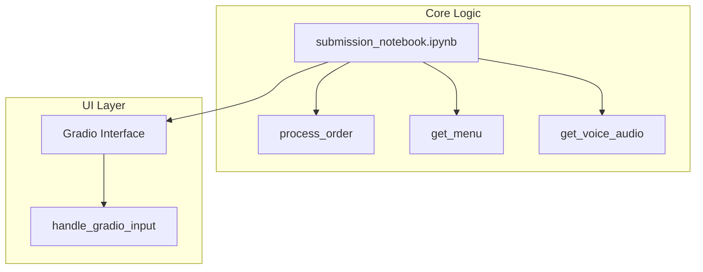
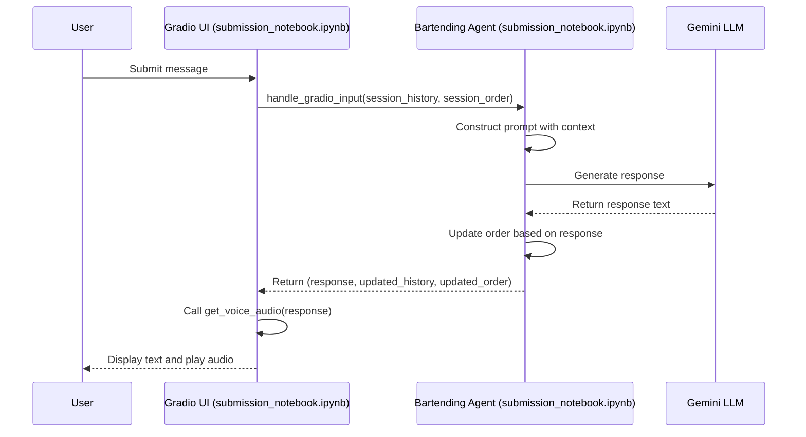
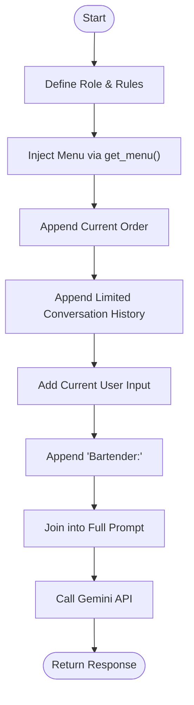
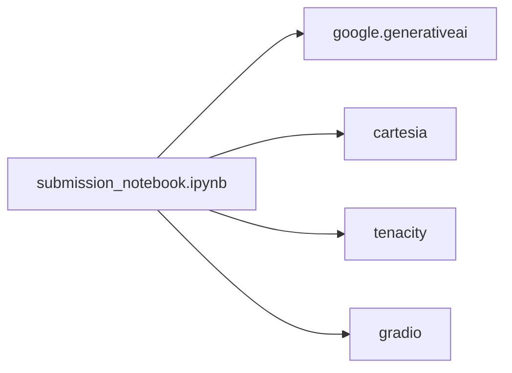

# Prompt Engineering Strategy

<cite>
**Referenced Files in This Document**   
- [README.md](file://README.md) - *Updated in recent commit*
- [submission_notebook.ipynb](file://notebooks/submission_notebook.ipynb) - *Updated in recent commit*
</cite>

## Update Summary
**Changes Made**   
- Updated documentation to reflect comprehensive overhaul of README with detailed prompt engineering strategy
- Added new sections on RAG implementation, tooling, and agent personality
- Integrated information from submission notebook to enhance technical accuracy
- Removed outdated sections that no longer reflect current implementation
- Enhanced source tracking system with updated file references

## Table of Contents
1. [Introduction](#introduction)
2. [Project Structure](#project-structure)
3. [Core Components](#core-components)
4. [Architecture Overview](#architecture-overview)
5. [Detailed Component Analysis](#detailed-component-analysis)
6. [Dependency Analysis](#dependency-analysis)
7. [Performance Considerations](#performance-considerations)
8. [Troubleshooting Guide](#troubleshooting-guide)
9. [Conclusion](#conclusion)

## Introduction
This document details the prompt engineering strategy used to define Maya's behavior as an AI bartender. The system leverages a structured prompt template to establish Maya's role, personality, and operational boundaries. Dynamic contextual data such as the current drink menu, active order, and conversation history are injected into the prompt to enable situational awareness. The design ensures Maya only serves drinks from the menu, responds conversationally, and maintains coherence across multi-turn interactions. This document analyzes the implementation in the submission notebook, including how the prompt is programmatically constructed, how structured outputs are encouraged, and how off-topic responses are mitigated.

## Project Structure
The project is organized into a modular structure with distinct components for core logic, user interface, and configuration. The main application files are contained within the notebooks directory, with `submission_notebook.ipynb` serving as the complete self-contained implementation. Supporting notebooks are used for testing and development, while `README.md` provides comprehensive documentation.



**Diagram sources**
- [submission_notebook.ipynb](file://notebooks/submission_notebook.ipynb#L1-L2887)
- [README.md](file://README.md#L1-L308)

**Section sources**
- [submission_notebook.ipynb](file://notebooks/submission_notebook.ipynb#L1-L2887)
- [README.md](file://README.md#L1-L308)

## Core Components
The core functionality of Maya is implemented in `submission_notebook.ipynb`. The `process_order` function is central to the prompt engineering strategy, as it constructs the dynamic prompt using the current session state. The prompt includes Maya's role definition, the drink menu, the current order, and the conversation history. This ensures Maya responds appropriately based on context. The `get_menu` function generates a formatted string of available drinks, which is embedded into the prompt. The notebook orchestrates the interaction flow by managing session state and integrating text and voice responses.

**Section sources**
- [submission_notebook.ipynb](file://notebooks/submission_notebook.ipynb#L150-L2500)
- [README.md](file://README.md#L1-L308)

## Architecture Overview
The system follows a stateless, function-driven architecture where session state is passed explicitly between the UI and the agent logic. The Gradio interface in the submission notebook maintains session state for conversation history and order, which is passed to `process_order` on each user input. The agent processes the input using a dynamically constructed prompt and returns a response along with updated state. Voice synthesis is handled separately using the Cartesia API.



**Diagram sources**
- [submission_notebook.ipynb](file://notebooks/submission_notebook.ipynb#L150-L2500)
- [README.md](file://README.md#L1-L308)

## Detailed Component Analysis

### Prompt Construction in process_order
The `process_order` function in `submission_notebook.ipynb` is responsible for building the prompt that guides Maya's behavior. It starts with a system message defining Maya's role as a "friendly and helpful bartender" and includes instructions for handling various scenarios, such as unclear orders or requests for unavailable drinks. The current menu is injected using `get_menu()`, ensuring Maya only references available items.

```python
MAYABARTENDERBOT_SYSINT = (
    "You are Maya, a highly-skilled bartender at 'MOK 5-ha Bar'. MOK 5-ha means Moksha, representing spiritual liberation.\n\n"
    "You have these qualities and abilities:\n"
    "- Friendly and conversational with a hint of philosophical wisdom\n"
    "- Expert in both classic cocktails and creative mixology\n"
    "- Maintains a casual but professional demeanor\n"
    "- Manages orders and payments through dedicated tools\n\n"
    "When customers order drinks:\n"
    "1. IMPORTANT: ALWAYS use the add_to_order tool when a customer requests a drink.\n"
    "   For example, if they ask for 'two martinis on the rocks', immediately call add_to_order(item_name='Martini', modifiers=['on the rocks'], quantity=2).\n"
    "   Never just acknowledge an order - you must use the tool to add it to the system.\n"
    "   Even for conversational-sounding requests like 'I'd like a...', 'Can I get...', or 'I'll have...' - always use add_to_order.\n\n"
    "2. IMPORTANT: ALWAYS use the add_tip tool when a customer mentions leaving or adding a tip.\n"
    "   For example, if they say 'I'll add a 15% tip' or 'Let me add $5 for your service', immediately call add_tip(percentage=15) or add_tip(amount=5.0).\n"
    "   Never just acknowledge a tip - you must use the tool to add it to the final bill.\n\n"
    "3. Use get_bill when customers ask about their total, want to pay, or ask for 'the check' or 'the damage'.\n\n"
    "4. Use pay_bill to process payment when they're ready to settle up.\n\n"
    "Menu available: {get_menu.invoke({})}\n\n"
    "Thank you, and enjoy providing a great experience at MOK 5-ha!"
)
```

The current order and conversation history are appended to provide context. Only the last 10 turns of history are included to manage token usage. The prompt ends with "Bartender:" to signal the model to generate a response in character.

#### Prompt Template Flow


**Diagram sources**
- [submission_notebook.ipynb](file://notebooks/submission_notebook.ipynb#L190-L220)

**Section sources**
- [submission_notebook.ipynb](file://notebooks/submission_notebook.ipynb#L150-L250)

### Response Structuring and Output Control
To guide the model toward structured outputs, the prompt includes implicit hints. For example, when listing the current order, the format "- Drink Name ($Price)" is used in the prompt, encouraging the model to follow the same pattern. The system also uses heuristics to detect when a drink has been added to the order by scanning the response for keywords like "added" or "coming right up" in conjunction with a menu item name.

```python
def detect_order_inquiry(user_input: str) -> dict:
    """
    Detects if the user is asking about their order or bill in conversational ways.
    Returns a dict with intent and confidence.
    """
    user_text = user_input.lower()
    
    # Intent patterns with keywords
    intent_patterns = {
        'show_order': [
            'show my order', 'what did i order', 'what have i ordered', 
            "what's in my order", 'what is in my order', 'my current order',
            'order so far', 'view my order', 'see my order'
        ],
        'get_bill': [
            'bill', 'check please', 'check, please', 'tab', 'pay', 'total', 
            'how much', 'what do i owe', 'my total', 'my bill', 'the total', 
            "what's the damage", "what's the total", 'what is the total',
            'how much is my bill', 'how much do i owe', "what's my tab",
            'what is my tab', "what's my total", 'what is my total'
        ],
        'pay_bill': [
            'pay my bill', 'pay the bill', 'pay my tab', 'pay the tab', 
            "i'll pay now", 'pay now', 'settle my bill', 'settle the bill', 
            'settle up', 'cash out', 'close my tab', 'close the tab'
        ]
    }
```

This ensures the order state is updated correctly even without structured output parsing.

### Mitigation of Off-Topic Responses
The prompt design enforces compliance with beverage service logic by explicitly stating boundaries. Maya is instructed to only serve drinks from the menu and to redirect requests for unavailable items. Safety settings in the Gemini API further prevent inappropriate responses. The system also handles edge cases such as empty input or API errors by returning safe fallback messages.

## Dependency Analysis
The application relies on several external libraries, including `google-generativeai` for LLM interaction, `gradio` for the web interface, and `cartesia` for text-to-speech. These dependencies are managed in the notebook's setup section. The `tenacity` library provides retry logic for API calls, improving reliability.



**Diagram sources**
- [submission_notebook.ipynb](file://notebooks/submission_notebook.ipynb#L1-L2887)
- [README.md](file://README.md#L1-L308)

**Section sources**
- [submission_notebook.ipynb](file://notebooks/submission_notebook.ipynb#L1-L2887)

## Performance Considerations
The system is designed to minimize latency by using the Gemini 2.5 Flash model, which is optimized for speed. The conversation history is limited to 10 turns to control prompt length and token usage. Retry logic with exponential backoff is implemented for API calls to handle transient failures. Voice synthesis is performed synchronously after text generation, which may introduce delay but ensures a cohesive user experience.

## Troubleshooting Guide
Common issues include missing API keys, which result in fatal errors during initialization. Ensure `GEMINI_API_KEY` and `CARTESIA_API_KEY` are set in the environment or `.env` file. If the voice ID is invalid, TTS will fail silently. Verify the `CARTESIA_VOICE_ID` in the notebook. If the model returns no candidates, check the prompt for safety violations or token limits.

**Section sources**
- [submission_notebook.ipynb](file://notebooks/submission_notebook.ipynb#L50-L100)
- [submission_notebook.ipynb](file://notebooks/submission_notebook.ipynb#L300-L350)

## Conclusion
The prompt engineering strategy for Maya effectively combines role definition, dynamic context injection, and response formatting to create a coherent and functional AI bartender. By leveraging session state and structured prompts, the system maintains context across interactions while adhering to operational boundaries. The modular design allows for easy customization of Maya's tone or functionality by modifying the prompt template or extending the menu.