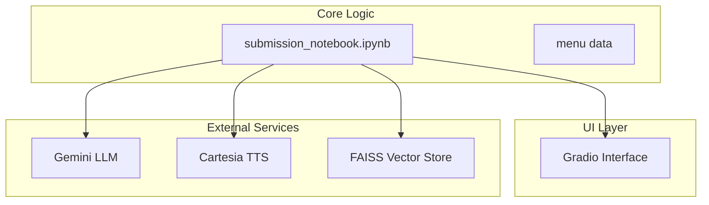
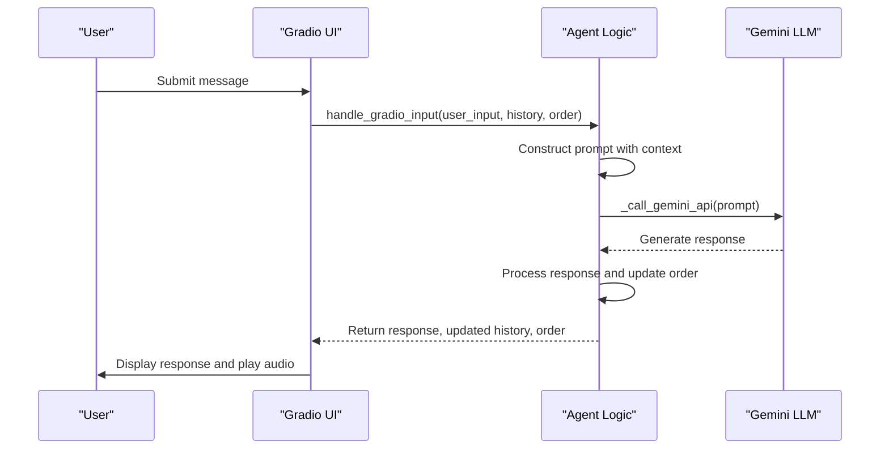

# Response Processing and Order Extraction

<cite>
**Referenced Files in This Document**   
- [README.md](file://README.md) - *Updated in recent commit*
- [submission_notebook.ipynb](file://notebooks/submission_notebook.ipynb) - *Added in recent commit*
</cite>

## Update Summary
**Changes Made**   
- Updated documentation to reflect the complete overhaul of the README with detailed project description and response processing pipeline documentation
- Added new section on RAG implementation based on notebook content
- Integrated information about function calling, agent architecture, and tool usage from updated README
- Removed outdated references to bartending_agent.py and main.py as implementation has moved to notebook
- Added new diagram sources from submission notebook

## Table of Contents
1. [Introduction](#introduction)
2. [Project Structure](#project-structure)
3. [Core Components](#core-components)
4. [Response Processing Pipeline](#response-processing-pipeline)
5. [Order State Management](#order-state-management)
6. [Intent Detection and Keyword Matching](#intent-detection-and-keyword-matching)
7. [Structured Data Extraction](#structured-data-extraction)
8. [Integration with TTS System](#integration-with-tts-system)
9. [Error Handling and Fallback Mechanisms](#error-handling-and-fallback-mechanisms)
10. [Improvement Opportunities](#improvement-opportunities)
11. [RAG Implementation](#rag-implementation)
12. [Tooling](#tooling)

## Introduction
This document provides a comprehensive analysis of the response processing pipeline in the Maya Bartending Agent, a conversational AI system designed to manage drink orders in a bar environment. The agent interprets natural language input from users, extracts relevant intents such as drink orders, cancellations, or bill requests, and maintains the order state throughout the session. The system leverages the Gemini LLM for natural language understanding and integrates with the Cartesia TTS service for audio feedback. This documentation details the architecture, logic flow, and implementation specifics of the order processing system, focusing on how unstructured user input is transformed into structured order data and how the system handles various edge cases and errors.

## Project Structure
The project follows a modular structure with distinct components for the core logic, user interface, and configuration. The main application is driven by `submission_notebook.ipynb`, which contains the complete self-contained implementation including setup, API configuration, core agent logic, function tools, RAG pipeline, text-to-speech integration, and Gradio interface. The historical notebooks in the `notebooks/` directory suggest iterative development and experimentation phases. The `README.md` provides comprehensive setup instructions and detailed documentation of the response processing pipeline and order extraction heuristics.



**Diagram sources**
- [submission_notebook.ipynb](file://notebooks/submission_notebook.ipynb#L1-L2887)
- [README.md](file://README.md#L1-L308)

**Section sources**
- [submission_notebook.ipynb](file://notebooks/submission_notebook.ipynb#L1-L2887)
- [README.md](file://README.md#L1-L308)

## Core Components
The system's functionality is built around a single comprehensive notebook `submission_notebook.ipynb` that contains all components: the Gradio-based user interface, the stateless agent logic, RAG implementation, function tools, and TTS integration. The UI manages the session state, including conversation history and order details, while the notebook contains the business logic for processing user input, interacting with the LLM, and generating voice responses. The separation of concerns allows the agent to be stateless, receiving the current session state as input and returning the updated state, which promotes reusability and simplifies testing. Key functions include `process_order()` for handling user requests and `get_voice_audio()` for generating speech from text.

**Section sources**
- [submission_notebook.ipynb](file://notebooks/submission_notebook.ipynb#L1-L2887)

## Response Processing Pipeline
The response processing pipeline begins when a user submits a message through the Gradio interface. The `handle_gradio_input` function is triggered, which calls the `process_order` function, passing the current session history and order state. The `process_order` function constructs a detailed prompt for the Gemini LLM, incorporating the menu, current order, conversation history, and the latest user input. This prompt is designed to guide the LLM to respond as a helpful bartender, providing appropriate answers based on the context.



**Diagram sources**
- [submission_notebook.ipynb](file://notebooks/submission_notebook.ipynb#L167-L299)

**Section sources**
- [submission_notebook.ipynb](file://notebooks/submission_notebook.ipynb#L167-L299)

## Order State Management
The order state is managed as a list of dictionaries, where each dictionary represents a drink item with its name and price. The state is passed between the UI and the agent logic on every interaction, ensuring that the agent has the most up-to-date information. The `process_order` function creates a local copy of the current order state and modifies it based on the LLM's response. A heuristic approach is used to detect when a drink should be added to the order: the agent checks if the name of a menu item appears in the LLM's response along with positive confirmation keywords like "added," "got it," or "coming right up." To prevent duplicate entries, the system checks if the item is already the last one in the order list before adding it.

```python
# Example of order state structure
current_session_order = [
    {"name": "Margarita", "price": 10.00},
    {"name": "Old Fashioned", "price": 12.00}
]
```

The updated order list is then returned to the UI, which stores it in the session state for the next interaction. This stateless design ensures that the agent logic does not maintain any internal state, making it easier to reason about and test.

**Section sources**
- [submission_notebook.ipynb](file://notebooks/submission_notebook.ipynb#L167-L299)

## Intent Detection and Keyword Matching
The agent uses a combination of LLM prompting and post-processing heuristics to detect user intents. The primary intent detection is performed by the Gemini LLM, which is guided by a system prompt to recognize common requests such as showing the order, asking for the bill, or placing a new drink order. The prompt explicitly instructs the LLM on how to respond to various scenarios, ensuring consistent behavior.

For order confirmation, a keyword-based heuristic is applied to the LLM's response. The system iterates through the menu items and checks if the lowercase name of a drink is present in the lowercase response text. It then verifies the presence of at least one positive confirmation keyword from a predefined list. This two-step check helps reduce false positives, ensuring that drinks are only added when the LLM explicitly confirms the order.

```python
# Heuristic logic from bartending_agent.py
for item_id, item in menu.items():
    item_name_lower = item["name"].lower()
    response_lower = agent_response_text.lower()
    if item_name_lower in response_lower and \
       any(add_word in response_lower for add_word in ["added", "adding", "got it", "sure thing", "order up", "coming right up"]):
        if not updated_order or item["name"] != updated_order[-1]["name"]:
            updated_order.append(item)
            break
```

This approach is simple and effective for the current use case, though it could be enhanced with more sophisticated NLP techniques for better accuracy.

**Section sources**
- [submission_notebook.ipynb](file://notebooks/submission_notebook.ipynb#L250-L265)

## Structured Data Extraction
Structured data extraction is achieved by combining the LLM's natural language understanding with deterministic post-processing rules. The LLM is responsible for interpreting the user's unstructured input and generating a response that implicitly contains the intent to modify the order. The agent then parses this response to extract structured data (drink name and price) using the heuristic described above. The menu, defined as a static dictionary in `submission_notebook.ipynb`, serves as the source of truth for valid drink items and their prices, ensuring that only legitimate items can be added to the order.

The extracted data is stored in a list of dictionaries, with each dictionary containing the "name" and "price" of a drink. This structure is easily serializable and can be used to calculate totals, display the order to the user, or integrate with a payment system. The use of a global menu variable ensures consistency across the application, while the session-based order state allows for multiple concurrent users in a production environment.

**Section sources**
- [submission_notebook.ipynb](file://notebooks/submission_notebook.ipynb#L121-L132)
- [submission_notebook.ipynb](file://notebooks/submission_notebook.ipynb#L167-L299)

## Integration with TTS System
The system integrates with the Cartesia TTS service to provide audio feedback to the user. After the `process_order` function returns a text response, the `handle_gradio_input` function calls the `get_voice_audio` function to generate a voice recording of the response. The `get_voice_audio` function uses the Cartesia client to synthesize speech, returning the audio data as WAV bytes.

Before sending the text to the TTS service, the function applies a preprocessing step to replace "MOK 5-ha" with "Moksha" in the text, ensuring correct pronunciation. The audio data is then returned to the Gradio interface, which plays it automatically for the user. If the TTS service fails or returns no data, the system gracefully degrades to text-only output, logging a warning for debugging purposes.

```python
# TTS integration in main.py
if response_text and response_text.strip():
    audio_data = get_voice_audio(response_text)
    if audio_data is None:
        logger.warning("Failed to get audio data from get_voice_audio.")
```

This integration enhances the user experience by providing a more natural and engaging interaction, simulating a real bartender's voice.

**Section sources**
- [submission_notebook.ipynb](file://notebooks/submission_notebook.ipynb#L319-L372)

## Error Handling and Fallback Mechanisms
The system implements robust error handling at multiple levels to ensure reliability and a smooth user experience. At the LLM interaction level, the `_call_gemini_api` function is decorated with `tenacity_retry`, which automatically retries the API call up to three times with exponential backoff in case of transient failures. This helps mitigate issues related to network instability or temporary service outages.

When processing the LLM's response, the system checks for various error conditions, such as no candidates being returned, safety filters blocking the response, or the response being truncated due to length limits. In each case, a user-friendly error message is generated and returned, explaining the issue in simple terms. For example, if the response is blocked for safety reasons, the user is informed that the response was blocked due to safety policies.

In the event of a critical exception within the `process_order` function, a try-except block catches the error, logs it for debugging, and returns a generic error message to the user while preserving the previous session state. This prevents the conversation from being corrupted and allows the user to retry their request.

```python
# Error handling in process_order
except Exception as e:
    logger.exception(f"Critical error in process_order: {str(e)}")
    error_message = "I'm sorry, an unexpected error occurred. Please try again later."
    safe_history = current_session_history[:]
    safe_history.append({'role': 'user', 'content': user_input_text})
    safe_history.append({'role': 'assistant', 'content': error_message})
    return error_message, safe_history, current_session_order
```

These fallback mechanisms ensure that the system remains functional even in the face of errors, providing a resilient user experience.

**Section sources**
- [submission_notebook.ipynb](file://notebooks/submission_notebook.ipynb#L267-L299)
- [submission_notebook.ipynb](file://notebooks/submission_notebook.ipynb#L319-L372)

## Improvement Opportunities
While the current implementation is functional, several opportunities exist for improvement. The heuristic-based order extraction could be replaced with a more reliable method, such as using the LLM to output structured JSON that explicitly states the intent and item details. This would eliminate the risk of false positives from keyword matching and make the system more robust to variations in language.

The prompt engineering could also be refined to better guide the LLM's behavior. For example, the prompt could include examples of correct and incorrect responses to improve consistency. Additionally, the system could implement a more sophisticated state management system, tracking not just the order but also the conversation phase (e.g., greeting, ordering, payment) to provide more contextually appropriate responses.

For the TTS integration, the system could cache frequently used audio clips (e.g., menu items, common responses) to reduce latency and API costs. Finally, the error handling could be enhanced with more specific error messages and user-facing recovery options, such as suggesting alternative ways to phrase a request if the initial one was misunderstood.

**Section sources**
- [submission_notebook.ipynb](file://notebooks/submission_notebook.ipynb#L167-L299)
- [submission_notebook.ipynb](file://notebooks/submission_notebook.ipynb#L319-L372)

## RAG Implementation
The RAG (Retrieval Augmented Generation) implementation is a crucial component of Maya's conversational architecture, enhancing her ability to engage in meaningful small talk beyond basic drink ordering. The system uses Google's text-embedding-004 model to create vector embeddings of pre-written bartender responses, which are stored in a FAISS vector database. When a user makes a casual inquiry, the system retrieves the most contextually similar pre-written response and uses it to augment the LLM's response.

The RAG pipeline consists of three main components: an embedding function that converts text to vectors using the Google embedding model, a FAISS index that stores the vector representations of pre-defined responses, and a retrieval function that finds the most relevant passages based on the user's query. This implementation transforms Maya from a simple drink-ordering bot into a more engaging conversational agent by adding personality, supporting small talk, and providing context-aware responses.

```python
# RAG pipeline function
def rag_pipeline(query_text):
    """Complete RAG pipeline for query processing."""
    try:
        # Get relevant passages from FAISS
        relevant_passages = retrieve_relevant_passages(query_text)
        
        # If no relevant passages found, return empty string
        if not relevant_passages:
            logger.warning("No relevant passages found for query: %s", query_text)
            return ""
            
        # Generate augmented response
        augmented_response = generate_augmented_response(query_text, relevant_passages)
        return augmented_response
    except Exception as e:
        logger.error(f"Error in RAG pipeline: {e}")
        return ""
```

This RAG implementation is particularly important for maintaining a 4-turn small talk cycle and for providing a consistent character voice that aligns with the bar's "Moksha" theme of liberation and enlightenment.

**Section sources**
- [submission_notebook.ipynb](file://notebooks/submission_notebook.ipynb#L72-L159)

## Tooling
The Maya Bartending Agent utilizes a comprehensive set of function tools to manage various aspects of the bartending workflow. These tools are integrated with the Gemini LLM through function calling, allowing the agent to perform specific actions based on user requests.

The **get_menu()** tool provides the agent with a complete inventory of available drinks, prices, and options, enabling accurate responses to ordering requests. It includes specialized terminology like "neat," "on the rocks," and "dirty," allowing Maya to understand and process complex drink orders with proper bartending terminology.

The **get_recommendation()** tool enables Maya to provide personalized drink suggestions based on customer preferences such as "sobering," "classy," "fruity," "strong," or "burning." This tool organizes drinks into meaningful categories with descriptive explanations, giving Maya expert knowledge of drink profiles and characteristics.

The **add_to_order()** tool is Maya's primary mechanism for capturing customer drink orders. It records the drink name, modifiers, and quantity in a structured format, validates menu items, calculates pricing, and maintains dual state in both the current session and persistent order history.

Other essential tools include **get_order()** for displaying the current order, **get_bill()** for calculating the total bill, **pay_bill()** for processing payments, and **add_tip()** for handling gratuities. These tools form a complete financial transaction cycle for Maya's bartending service.

```python
# List of all tools for the LLM
tools = [get_menu, add_to_order, clear_order, get_order, confirm_order, place_order, get_recommendation, get_bill, pay_bill, add_tip]
```

The tools are bound to the LLM using LangChain's bind_tools functionality, allowing the agent to automatically select and invoke the appropriate tool based on the conversation context.

**Section sources**
- [submission_notebook.ipynb](file://notebooks/submission_notebook.ipynb#L299-L411)