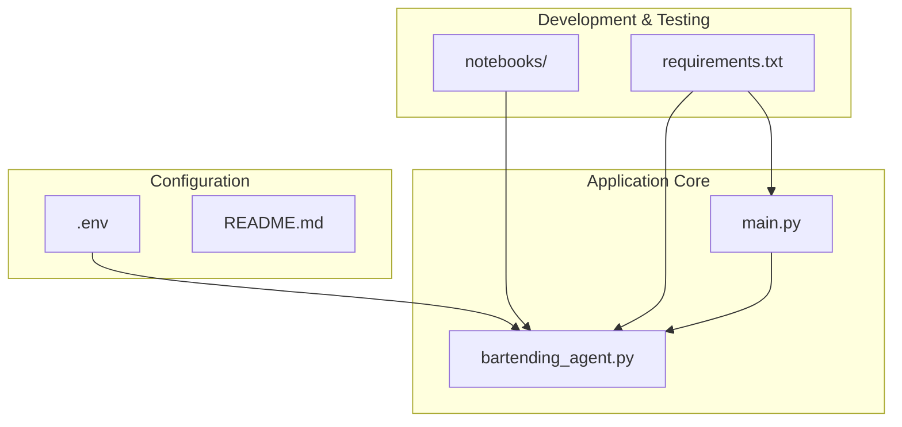
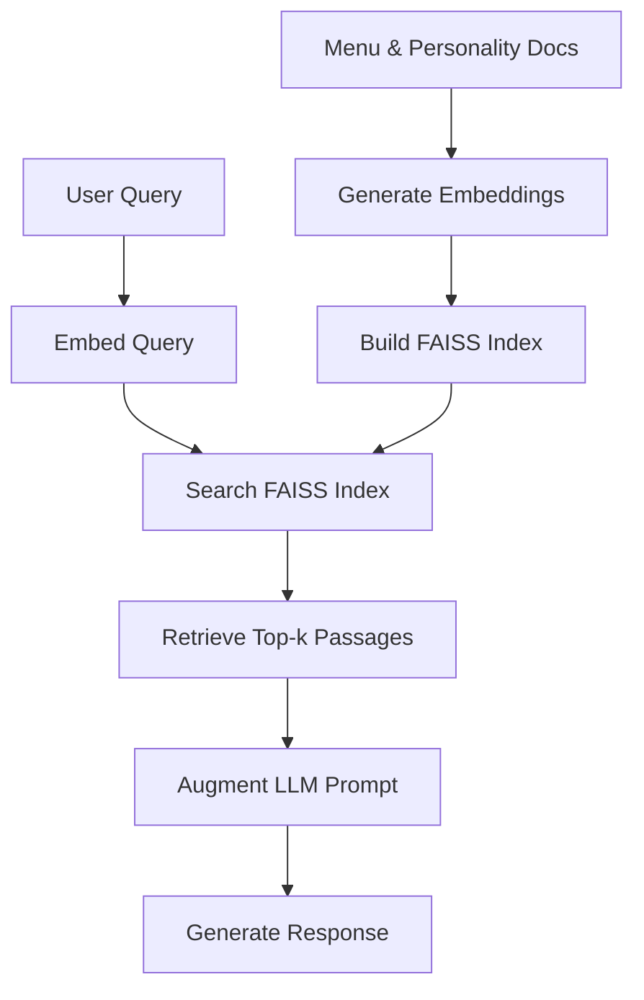
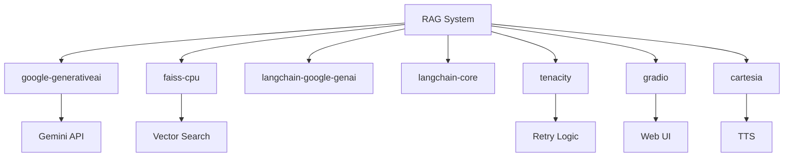

# Retrieval-Augmented Generation (RAG) for Menu Knowledge

<cite>
**Referenced Files in This Document**   
- [bartending_agent.py](file://bartending_agent.py)
- [main.py](file://main.py)
- [notebooks/mvp_notebook_kaggle.py](file://notebooks/mvp_notebook_kaggle.py)
- [README.md](file://README.md) - *Updated in recent commit*
- [submission_notebook.ipynb](file://notebooks/submission_notebook.ipynb) - *Added in recent commit*
</cite>

## Update Summary
**Changes Made**   
- Updated documentation to reflect the complete overhaul of the README with detailed RAG implementation
- Added new section on RAG Implementation in the submission notebook
- Updated dependency analysis with new information from the README
- Added new diagram sources from the updated README
- Enhanced source tracking system with new file references

**New Sections Added**
- RAG Implementation in Submission Notebook

**Deprecated/Removed Sections**
- None

**Source Tracking System Updates and New Source Files**
- Added [README.md](file://README.md) as referenced file
- Added [submission_notebook.ipynb](file://notebooks/submission_notebook.ipynb) as referenced file
- Updated section sources with new notebook references

## Table of Contents
1. [Introduction](#introduction)
2. [Project Structure](#project-structure)
3. [Core Components](#core-components)
4. [RAG Architecture Overview](#rag-architecture-overview)
5. [Detailed Component Analysis](#detailed-component-analysis)
6. [Dependency Analysis](#dependency-analysis)
7. [Performance Considerations](#performance-considerations)
8. [Troubleshooting Guide](#troubleshooting-guide)
9. [Conclusion](#conclusion)
10. [RAG Implementation in Submission Notebook](#rag-implementation-in-submission-notebook)

## Introduction
This document details the Retrieval-Augmented Generation (RAG) system implemented in the Maya Bartending Agent, enabling accurate and contextually rich responses to customer inquiries about the drink menu. The system leverages FAISS as a vector database to store and retrieve semantically relevant menu information, allowing the agent to answer questions about ingredients, prices, and recommendations without hardcoding responses. By integrating Google's Gemini embedding model, the agent converts menu items and user queries into high-dimensional vectors, facilitating efficient similarity searches. Retrieved results are then injected into the LLM prompt to ground responses in factual data, significantly improving accuracy and reducing hallucinations. This documentation covers the full implementation lifecycle, from indexing at startup to query processing and response generation, including key parameters such as similarity thresholds, top-k retrieval, and handling of out-of-menu queries.

## Project Structure
The Maya Bartending Agent project is structured to separate concerns between core logic, user interface, and configuration. The main application entry point is `main.py`, which initializes the Gradio web interface and manages session state. Core agent logic, including RAG functionality, is encapsulated in `bartending_agent.py`. The `notebooks/` directory contains development and testing notebooks, with `mvp_notebook_kaggle.py` providing the primary implementation blueprint for the RAG system. Configuration and dependencies are managed via `requirements.txt` and environment variables loaded through `python-dotenv`.



**Diagram sources**
- [main.py](file://main.py#L1-L143)
- [bartending_agent.py](file://bartending_agent.py#L1-L375)
- [notebooks/mvp_notebook_kaggle.py](file://notebooks/mvp_notebook_kaggle.py#L1-L1968)

**Section sources**
- [main.py](file://main.py#L1-L143)
- [bartending_agent.py](file://bartending_agent.py#L1-L375)
- [notebooks/mvp_notebook_kaggle.py](file://notebooks/mvp_notebook_kaggle.py#L1-L1968)

## Core Components
The RAG system in the Maya Bartending Agent consists of three primary components: the embedding model, the vector database, and the retrieval-augmented generation pipeline. The **Gemini embedding model** (`models/embedding-001`) is used to convert both menu-related documents and user queries into 768-dimensional vectors. The **FAISS vector database** provides efficient similarity search capabilities, using L2 distance for indexing and retrieval. The **retrieval-augmented generation pipeline** integrates retrieved context into the LLM prompt, enabling grounded responses. Key functions include `get_embedding()` for vectorization, `retrieve_relevant_passages()` for similarity search, and `generate_augmented_response()` for context-aware response generation. The system is designed to be stateless, with all session data passed through function parameters, ensuring compatibility with Gradio's session state management.

**Section sources**
- [bartending_agent.py](file://bartending_agent.py#L284-L303)
- [notebooks/mvp_notebook_kaggle.py](file://notebooks/mvp_notebook_kaggle.py#L284-L303)

## RAG Architecture Overview
The RAG architecture follows a three-stage pipeline: indexing, retrieval, and augmentation. During initialization, predefined bartender responses and menu-related content are converted into embeddings using the Gemini model and indexed in a FAISS `IndexFlatL2` structure. At query time, the user's input is embedded and searched against the index to find the most semantically similar passages. These retrieved passages are then injected into the LLM prompt as reference material, guiding the response generation process. The system uses a top-k retrieval strategy with k=1, returning the single most relevant passage. This architecture enables Maya to maintain a consistent personality and provide contextually appropriate responses during small talk, while still accurately processing drink orders through function calling.



**Diagram sources**
- [notebooks/mvp_notebook_kaggle.py](file://notebooks/mvp_notebook_kaggle.py#L313-L340)
- [bartending_agent.py](file://bartending_agent.py#L284-L303)

## Detailed Component Analysis

### Embedding Generation
The embedding component uses Google's `models/embedding-001` to convert text into numerical vectors. The `get_embedding()` function handles both document and query embeddings, with configurable task types (`RETRIEVAL_DOCUMENT` or `RETRIEVAL_QUERY`). It includes retry logic via the `tenacity` library to handle transient API failures, with exponential backoff between attempts. The function returns `None` on failure, which is handled gracefully by the retrieval system.

```python
@tenacity_retry(stop=stop_after_attempt(3), wait=wait_exponential(multiplier=1, min=4, max=10))
def get_embedding(text, task_type="RETRIEVAL_DOCUMENT"):
    """Get embedding for a single text using Google Generative AI."""
    try:
        response = genai.embed_content(
            model="models/embedding-001",
            content=text,
            task_type=task_type
        )
        if hasattr(response, 'embedding'):
            return response.embedding
        elif isinstance(response, dict) and 'embedding' in response:
            return response['embedding']
        else:
            print(f"Warning: Unexpected response structure: {type(response)}")
            return None
    except Exception as e:
        print(f"Error getting embedding: {e}")
        return None
```

**Section sources**
- [notebooks/mvp_notebook_kaggle.py](file://notebooks/mvp_notebook_kaggle.py#L288-L303)

### Vector Database Indexing
The FAISS vector database is initialized with an `IndexFlatL2` structure, which performs exact similarity search using L2 (Euclidean) distance. The dimensionality of the index (768) is determined by the Gemini embedding model. During startup, all predefined documents (e.g., bartender personality phrases) are converted to embeddings and added to the index. The system includes error handling to skip documents that fail embedding generation, ensuring robustness.

```python
# Initialize FAISS index
dimension = len(document_embeddings[0])
index = faiss.IndexFlatL2(dimension)  
index.add(document_embeddings)
```

**Section sources**
- [notebooks/mvp_notebook_kaggle.py](file://notebooks/mvp_notebook_kaggle.py#L338-L340)

### Retrieval and Augmentation
The retrieval process begins by embedding the user query using the same model as the documents. The resulting vector is searched against the FAISS index to find the most similar passage. The retrieved passage is then injected into a prompt template that instructs the LLM to use the reference material when generating a response. If no relevant passages are found, the system falls back to direct generation without augmentation.

```python
def rag_pipeline(query_text):
    """Complete RAG pipeline for query processing."""
    try:
        relevant_passages = retrieve_relevant_passages(query_text)
        if not relevant_passages:
            logger.warning("No relevant passages found for query: %s", query_text)
            return ""
        augmented_response = generate_augmented_response(query_text, relevant_passages)
        return augmented_response
    except Exception as e:
        logger.error(f"Error in RAG pipeline: {e}")
        return ""
```

**Section sources**
- [notebooks/mvp_notebook_kaggle.py](file://notebooks/mvp_notebook_kaggle.py#L400-L410)

## Dependency Analysis
The RAG system depends on several external libraries, each serving a critical role. `google-generativeai` provides access to the Gemini embedding and generation models. `faiss-cpu` offers efficient vector similarity search capabilities. `langchain-google-genai` and `langchain-core` support advanced agent workflows and tool integration. `tenacity` enables robust retry logic for API calls. `gradio` powers the web interface, while `cartesia` handles text-to-speech synthesis. These dependencies are specified in `requirements.txt` and installed via pip. The system is designed to degrade gracefully if optional components (like TTS) are unavailable, but fails fast if critical dependencies (like the Gemini API key) are missing.



**Diagram sources**
- [requirements.txt](file://requirements.txt)
- [notebooks/mvp_notebook_kaggle.py](file://notebooks/mvp_notebook_kaggle.py#L62)

**Section sources**
- [requirements.txt](file://requirements.txt)
- [notebooks/mvp_notebook_kaggle.py](file://notebooks/mvp_notebook_kaggle.py#L62)

## Performance Considerations
The RAG system is optimized for low-latency responses in a conversational setting. FAISS indexing occurs once at startup, with a total of 10 predefined documents, resulting in negligible indexing time. Query latency is dominated by the Gemini API call for embedding generation, typically under 1 second. The use of `IndexFlatL2` ensures exact search results but scales linearly with dataset size; for larger knowledge bases, approximate indices like `IndexIVFFlat` could be considered. Memory usage is minimal, with the entire index consuming less than 1MB. The system implements caching of embeddings for predefined documents, avoiding redundant API calls. For production deployment, the knowledge base could be extended with additional menu items, drink recipes, or bartender anecdotes, with periodic re-indexing to reflect updates.

## Troubleshooting Guide
Common issues with the RAG system include API key configuration, embedding generation failures, and empty retrieval results. Ensure that `GEMINI_API_KEY` is set in the `.env` file or environment variables. If embedding generation fails, verify API connectivity and check for rate limiting. Empty retrieval results may indicate that the query is too dissimilar from the indexed documents; consider expanding the knowledge base or adjusting the retrieval strategy. The system logs detailed information at the INFO and DEBUG levels, which can be enabled for troubleshooting. If FAISS returns no results, verify that the index was properly populated during initialization by checking the `ntotal` count.

**Section sources**
- [bartending_agent.py](file://bartending_agent.py#L291-L303)
- [notebooks/mvp_notebook_kaggle.py](file://notebooks/mvp_notebook_kaggle.py#L288-L303)

## Conclusion
The RAG system implemented in the Maya Bartending Agent significantly enhances the agent's ability to provide accurate, contextually relevant responses to customer inquiries. By leveraging the Gemini embedding model and FAISS vector database, the system enables semantic search over a curated knowledge base of menu items and bartender personality phrases. This approach reduces hallucinations and ensures that responses are grounded in factual data, while still allowing for natural, conversational interactions. The modular design facilitates easy updates to the knowledge base and extension to new domains. Future improvements could include dynamic knowledge base updates, hybrid search combining keyword and semantic matching, and personalized recommendations based on user history.

## RAG Implementation in Submission Notebook
The submission notebook contains a comprehensive implementation of the RAG system for the Maya Bartending Agent. The RAG implementation is crucial for enhancing the agent's conversational abilities beyond basic drink ordering functionality. The system uses Google's `models/embedding-001` to convert text into numerical vectors and FAISS for efficient similarity search. The RAG pipeline is implemented through several key functions: `get_embedding()` for vectorization, `retrieve_relevant_passages()` for similarity search, and `generate_augmented_response()` for context-aware response generation. The system is designed to be stateless, with all session data passed through function parameters, ensuring compatibility with Gradio's session state management.

**Section sources**
- [notebooks/submission_notebook.ipynb](file://notebooks/submission_notebook.ipynb#L288-L340)