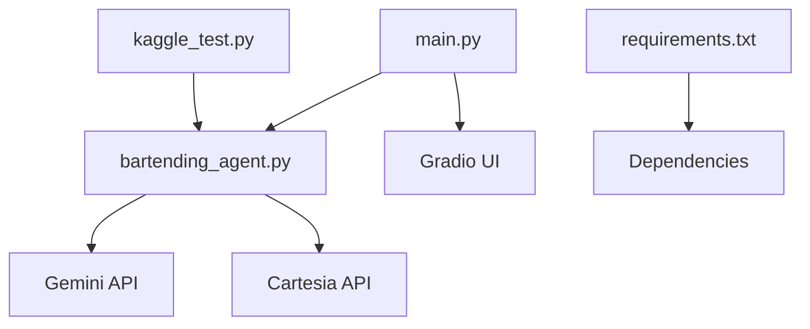
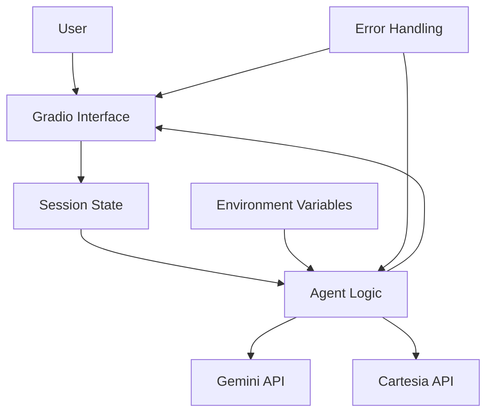
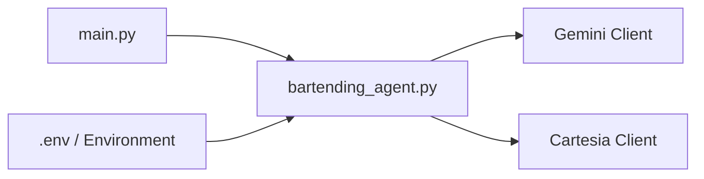

# Configuration Validation

<cite>
**Referenced Files in This Document**   
- [bartending_agent.py](file://bartending_agent.py)
- [main.py](file://main.py)
- [kaggle_test.py](file://kaggle_test.py)
</cite>

## Table of Contents
1. [Introduction](#introduction)
2. [Project Structure](#project-structure)
3. [Core Components](#core-components)
4. [Architecture Overview](#architecture-overview)
5. [Detailed Component Analysis](#detailed-component-analysis)
6. [Dependency Analysis](#dependency-analysis)
7. [Performance Considerations](#performance-considerations)
8. [Troubleshooting Guide](#troubleshooting-guide)
9. [Conclusion](#conclusion)

## Introduction
The MayaBartendingAgent application is a conversational AI bartender that processes drink orders, manages user interactions, and generates voice responses using external APIs. A critical aspect of its reliability is the validation of configuration settings at startup, particularly environment variables required for API access. This document details how the system ensures correct configuration, handles missing or invalid credentials, and maintains resilience through structured error handling and logging. Special focus is placed on the initialization and import mechanisms in `main.py` and `bartending_agent.py`, which enforce configuration correctness before the Gradio interface launches.

## Project Structure
The project follows a modular structure with distinct components for core logic, user interface, testing, and dependencies. The root-level Python files handle application logic and entry points, while notebooks are used for prototyping and Kaggle submission preparation.



**Diagram sources**
- [main.py](file://main.py#L1-L142)
- [bartending_agent.py](file://bartending_agent.py)

**Section sources**
- [main.py](file://main.py#L1-L142)
- [bartending_agent.py](file://bartending_agent.py)

## Core Components
The core functionality is split between `main.py`, which manages the Gradio interface and session state, and `bartending_agent.py`, which contains the business logic for processing orders, interacting with LLMs (Gemini), and generating speech (Cartesia). Configuration validation occurs during the import and initialization phase of `bartending_agent.py`, although the exact implementation is not visible in the provided code. However, the error handling in `main.py` reveals the system's response to configuration and import failures.

**Section sources**
- [main.py](file://main.py#L1-L142)
- [bartending_agent.py](file://bartending_agent.py)

## Architecture Overview
The application follows a layered architecture with a clear separation between the UI layer (Gradio), the application logic layer (bartending agent), and external services (Gemini, Cartesia). Configuration validation is a cross-cutting concern that occurs at the boundary between the application logic and external dependencies.



**Diagram sources**
- [main.py](file://main.py#L1-L142)
- [bartending_agent.py](file://bartending_agent.py)

## Detailed Component Analysis

### Configuration Validation in Main Module
The `main.py` file implements a robust import and initialization strategy that acts as the first line of defense for configuration validation. It uses a try-except block to catch both `ImportError` and general `Exception` types during the import of `bartending_agent`.

```python
try:
    from bartending_agent import (
        process_order,
        get_menu_text,
        get_voice_audio,
    )
    logger.info("Successfully imported agent logic functions.")
except ImportError as e:
    logger.exception("Failed to import agent functions. Ensure 'bartending_agent.py' exists and is correctly structured.")
    raise SystemExit(f"Import Error: {e}") from e
except Exception as e:
    logger.exception(f"Error during agent module initialization: {e}")
    raise SystemExit(f"Initialization Error: {e}") from e
```

This approach ensures that any failure during the import—such as missing environment variables, failed API client instantiation, or invalid API keys—will be caught and logged. The system then exits gracefully with a descriptive message, preventing the application from starting in a misconfigured state.

**Section sources**
- [main.py](file://main.py#L10-L35)

### Error Propagation to Gradio Interface
When configuration errors occur, they are handled before the Gradio interface is launched. The `demo.launch()` call only executes if the import and initialization succeed. This prevents users from interacting with a non-functional system. If an error occurs, it is logged and the process terminates, ensuring that only a fully initialized agent is exposed to users.

The Gradio interface itself does not handle configuration errors at runtime because the validation occurs at startup. This design choice enhances system reliability by failing fast during initialization rather than allowing degraded operation.

**Section sources**
- [main.py](file://main.py#L140-L142)

### Fallback and Resilience Strategies
The system implements a fallback mechanism for text-to-speech (TTS) generation within the `handle_gradio_input` function. If `get_voice_audio()` returns `None`, a warning is logged, but the text response is still delivered to the user.

```python
if response_text and response_text.strip():
     audio_data = get_voice_audio(response_text)
     if audio_data is None:
         logger.warning("Failed to get audio data from get_voice_audio.")
else:
    logger.info("No response text generated, skipping TTS.")
```

This allows the core functionality (order processing) to continue even if the voice component fails, demonstrating a graceful degradation strategy.

**Section sources**
- [main.py](file://main.py#L45-L55)

## Dependency Analysis
The application depends on external APIs (Gemini for LLM, Cartesia for TTS) and environment variables for authentication. The dependency chain is linear and well-defined, with no circular imports.



**Diagram sources**
- [main.py](file://main.py#L1-L142)
- [bartending_agent.py](file://bartending_agent.py)

**Section sources**
- [main.py](file://main.py#L1-L142)
- [bartending_agent.py](file://bartending_agent.py)

## Performance Considerations
Configuration validation at startup has minimal performance impact and is a one-time cost. By validating early, the system avoids repeated checks during request processing, improving runtime efficiency. The use of module-level initialization in `bartending_agent.py` suggests that API clients are instantiated once and reused, reducing latency for subsequent requests.

## Troubleshooting Guide
Common configuration issues and their solutions:

**Authentication Failure**
- **Symptom**: `ImportError` or `Initialization Error` during startup.
- **Cause**: Missing or invalid API keys for Gemini or Cartesia.
- **Solution**: Verify that environment variables (e.g., `GEMINI_API_KEY`, `CARTESIA_API_KEY`) are set correctly in the environment or `.env` file.

**Invalid API Keys**
- **Symptom**: Application starts but fails during first API call.
- **Cause**: Keys are present but not valid.
- **Solution**: Regenerate API keys from the respective service portals and update environment variables.

**Network Connectivity Issues**
- **Symptom**: Timeout or connection error during initialization.
- **Cause**: No internet access or firewall blocking API endpoints.
- **Solution**: Check network connectivity and ensure that `generativelanguage.googleapis.com` and `api.cartesia.ai` are accessible.

**Missing Environment Variables**
- **Symptom**: `KeyError` or `ValueError` when accessing `os.environ`.
- **Solution**: Implement schema-based validation using `pydantic` or `environs` to validate required variables at startup.

**Suggested Improvement: Schema-Based Validation**
```python
from pydantic import BaseSettings

class Settings(BaseSettings):
    gemini_api_key: str
    cartesia_api_key: str

    class Config:
        env_file = ".env"
```

Using such a library would provide clear error messages and type validation for configuration.

**Section sources**
- [main.py](file://main.py#L10-L35)
- [bartending_agent.py](file://bartending_agent.py)

## Conclusion
The MayaBartendingAgent employs a fail-fast strategy for configuration validation by centralizing checks during module import and initialization. This ensures that the application only runs when properly configured, enhancing reliability. Error handling is comprehensive, with detailed logging and graceful degradation for non-critical components like TTS. Future improvements could include schema-based validation libraries to provide more informative error messages and support for development, testing, and production environments with different configuration sources.