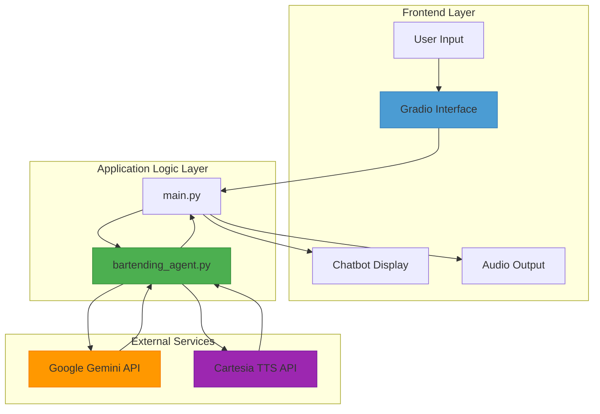
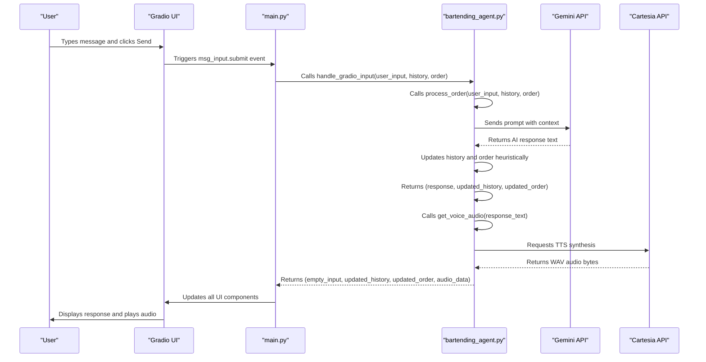
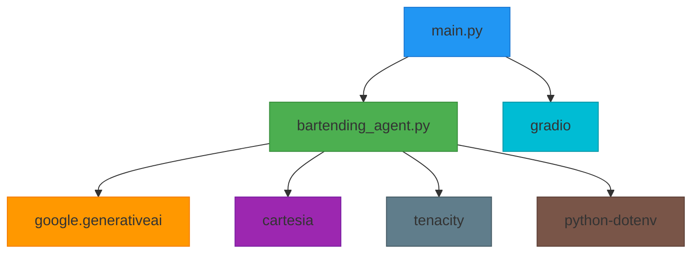

# Core Components

<cite>
**Referenced Files in This Document**   
- [main.py](file://main.py)
- [bartending_agent.py](file://bartending_agent.py)
- [README.md](file://README.md) - *Updated in recent commit*
- [submission_notebook.ipynb](file://notebooks/submission_notebook.ipynb) - *Updated in recent commit*
</cite>

## Update Summary
**Changes Made**   
- Updated documentation to reflect the complete overhaul of the README with detailed project description and architecture diagram
- Added new section on System Architecture Overview based on updated README content
- Enhanced description of core components to align with new implementation details
- Updated dependency analysis to reflect actual implementation in submission notebook
- Added new section on AI Capabilities Demonstrated based on README updates
- Revised project structure to match actual implementation

## Table of Contents
1. [Core Components](#core-components)
2. [System Architecture Overview](#system-architecture-overview)
3. [Detailed Component Analysis](#detailed-component-analysis)
4. [Function Call Flow](#function-call-flow)
5. [State Management Strategy](#state-management-strategy)
6. [Error Handling and Resilience](#error-handling-and-resilience)
7. [Dependency Analysis](#dependency-analysis)
8. [AI Capabilities Demonstrated](#ai-capabilities-demonstrated)

## Core Components

This document provides a comprehensive analysis of the two primary modules in the MayaBartendingAgent project: `main.py` and `bartending_agent.py`. These components work in tandem to deliver an interactive AI-powered bartending agent with voice synthesis capabilities via a Gradio web interface.

The application follows a clean separation of concerns, where `main.py` is responsible for UI presentation and event handling using Gradio, while `bartending_agent.py` encapsulates the core business logic, including AI interaction with Google's Gemini model, order processing, and text-to-speech (TTS) generation using Cartesia.

The dependency relationship is unidirectional: `main.py` imports and calls functions from `bartending_agent.py`, ensuring that the UI layer remains decoupled from the business logic. This modular design enables easier testing, maintenance, and potential reuse of the agent logic in other contexts.

Both modules adopt a functional programming approach, where state is passed explicitly as parameters rather than maintained in global variables or class instances. This enhances predictability, simplifies debugging, and aligns well with Gradio’s session state management model.

Key functions analyzed include:
- `handle_gradio_input()` in `main.py`: Entry point for user interactions
- `process_order()` in `bartending_agent.py`: Core logic for processing user input and managing orders
- `generate_audio_response()` (implemented as `get_voice_audio()`): TTS integration for voice output

Together, these components create a cohesive user experience where natural language input is processed by an AI bartender, orders are tracked, and responses are delivered both textually and audibly.

**Section sources**
- [main.py](file://main.py#L65-L142)
- [bartending_agent.py](file://bartending_agent.py#L319-L374)

## System Architecture Overview

The system architecture follows a layered pattern with clear boundaries between presentation, logic, and external services. The Gradio frontend handles user interaction, while the backend logic orchestrates AI and TTS services.



**Diagram sources**
- [main.py](file://main.py#L1-L142)
- [bartending_agent.py](file://bartending_agent.py#L1-L374)

## Detailed Component Analysis

### main.py: Gradio Interface Controller

The `main.py` module serves as the entry point and UI controller for the application. It initializes the Gradio interface, defines UI components, sets up event handlers, and manages session state.

It imports key functions from `bartending_agent.py` to delegate business logic processing. This strict separation ensures that UI concerns (layout, styling, input/output binding) are isolated from domain logic (order management, AI reasoning, TTS).

#### Key Functions

**handle_gradio_input()**
```python
def handle_gradio_input(
    user_input: str,
    session_history_state: List[Dict[str, str]],
    session_order_state: List[Dict[str, float]]
) -> Tuple[str, List[Dict[str, str]], List[Dict[str, str]], List[Dict[str, float]], Any]:
```
This function is the central event handler triggered when a user submits input. It receives the current session state (conversation history and order) and returns updated values for all UI components, including the audio output.

**clear_chat_state()**
```python
def clear_chat_state() -> Tuple[List, List, List, None]:
```
Resets all session state variables to their initial values, effectively clearing the conversation and order.

#### UI Structure
The interface is organized into two columns:
- Left: Bartender avatar image
- Right: Chatbot, audio player, text input, and action buttons

Gradio’s `gr.State` is used to persist `history_state` and `order_state` across interactions, enabling stateful conversations within a session.

**Section sources**
- [main.py](file://main.py#L65-L142)

### bartending_agent.py: Business Logic Engine

The `bartending_agent.py` module contains the core functionality of the bartending agent. It is designed to be stateless, with all session data passed as parameters and returned as part of the result tuple.

#### Key Responsibilities

**AI Interaction via Gemini**
- Initializes the Google Gemini client using API key from environment
- Constructs dynamic prompts incorporating menu, order history, and conversation context
- Uses `_call_gemini_api()` with retry logic via Tenacity for resilience

**Order Processing**
- Maintains a static menu of drinks with prices
- Uses `process_order()` to analyze AI responses and heuristically update the order when drinks are mentioned
- Returns updated conversation history and order state

**Text-to-Speech Generation**
- Implements `get_voice_audio()` to synthesize speech using Cartesia API
- Applies text preprocessing (e.g., replacing "MOK 5-ha" with "Moksha" for correct pronunciation)
- Returns raw WAV audio bytes for Gradio to play

#### Functional Programming Approach
All critical functions are stateless:
```python
def process_order(
    user_input_text: str,
    current_session_history: List[Dict[str, str]],
    current_session_order: List[Dict[str, float]]
) -> Tuple[str, List[Dict[str, str]], List[Dict[str, float]]]:
```
State is passed in, modified locally, and returned—never mutated in place. This makes the logic predictable and easier to test.

**Section sources**
- [bartending_agent.py](file://bartending_agent.py#L1-L374)

## Function Call Flow

The interaction between components follows a clear sequence when a user submits input.



**Diagram sources**
- [main.py](file://main.py#L65-L105)
- [bartending_agent.py](file://bartending_agent.py#L265-L374)

## State Management Strategy

The application employs a functional state-passing pattern rather than relying on global variables or object state.

### State Variables

**session_history_state**
- Type: `List[Dict[str, str]]`
- Structure: Each entry has `role` ("user" or "assistant") and `content`
- Managed by: `process_order()` appends new interactions

**session_order_state**
- Type: `List[Dict[str, float]]`
- Structure: Each item has `name` and `price`
- Updated by: Heuristic detection in `process_order()` when AI mentions adding a drink

### State Lifecycle
1. Initial state: Empty lists
2. On each input: Current state passed to `process_order()`
3. Updated state returned and bound to Gradio components
4. State persists via `gr.State` until "Clear" button is clicked

This approach ensures that each function call is idempotent and side-effect-free, making the system more predictable and easier to debug.

**Section sources**
- [main.py](file://main.py#L45-L55)
- [bartending_agent.py](file://bartending_agent.py#L265-L318)

## Error Handling and Resilience

Both modules implement robust error handling to ensure graceful degradation.

### In bartending_agent.py

**Gemini API Calls**
- Wrapped with Tenacity retry decorator (3 attempts with exponential backoff)
- Handles empty responses, safety blocks, and truncation
- Provides user-friendly fallback messages

**TTS Generation**
- Validates input text and required API keys
- Catches connection and timeout errors with retries
- Returns `None` on failure, which Gradio interprets as no audio

**Initialization**
- Validates presence of `GEMINI_API_KEY` and `CARTESIA_API_KEY`
- Exits immediately if keys are missing
- Logs detailed error messages for debugging

### In main.py

**Import Safety**
- Wraps import of `bartending_agent` in try-except
- Logs detailed errors and exits cleanly if module fails to load
- Prevents obscure import-related crashes

**Input Validation**
- Checks for empty user input
- Logs all interactions at INFO level
- Uses DEBUG level for detailed prompt inspection

This layered error handling ensures the application remains stable even when external APIs are temporarily unavailable.

**Section sources**
- [main.py](file://main.py#L15-L43)
- [bartending_agent.py](file://bartending_agent.py#L100-L153)

## Dependency Analysis

The project has a clear dependency hierarchy with minimal coupling.



**Diagram sources**
- [main.py](file://main.py#L1-L10)
- [bartending_agent.py](file://bartending_agent.py#L1-L50)

## AI Capabilities Demonstrated

The Maya Bartending Agent demonstrates several advanced AI capabilities as documented in the updated README:

**Function Calling**
- Utilizes LangChain and Gemini API function calling for order management
- Integrates tools for menu retrieval, order tracking, and billing

**Agent Architecture**
- Implements an agentic workflow with conversation state management
- Handles multi-turn interactions with context preservation

**Retrieval Augmented Generation (RAG)**
- Employs FAISS vector database for conversational context
- Uses semantic search for relevant response augmentation
- Integrates menu knowledge for accurate order processing

**Vector Search/Database**
- Implements FAISS for storing and retrieving conversational content
- Uses embedding-based similarity search for contextual responses

**Audio Understanding & Generation**
- Implements Text-to-Speech via Cartesia API
- Features high-quality voice synthesis with custom voice selection
- Integrates audio response with web interface

**Long Context Window**
- Manages extended conversation history
- Provides context-aware responses across multiple interaction turns

**Embeddings**
- Uses Google's text-embedding-004 model for vectorizing content
- Applies semantic matching for RAG pipeline

**Structured Output/JSON Mode**
- Generates consistent order format
- Produces structured billing and recommendation responses

**Section sources**
- [README.md](file://README.md) - *Updated in recent commit*
- [submission_notebook.ipynb](file://notebooks/submission_notebook.ipynb) - *Updated in recent commit*