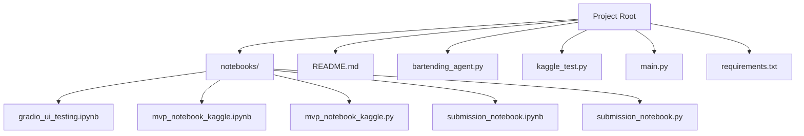
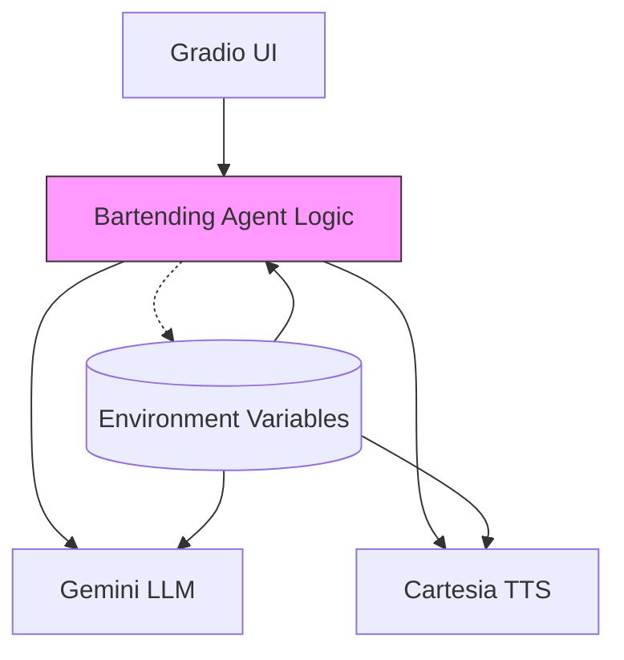
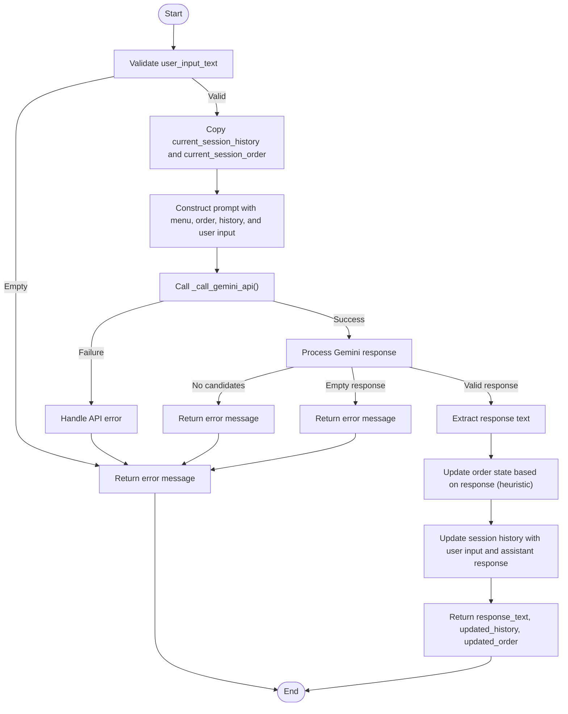
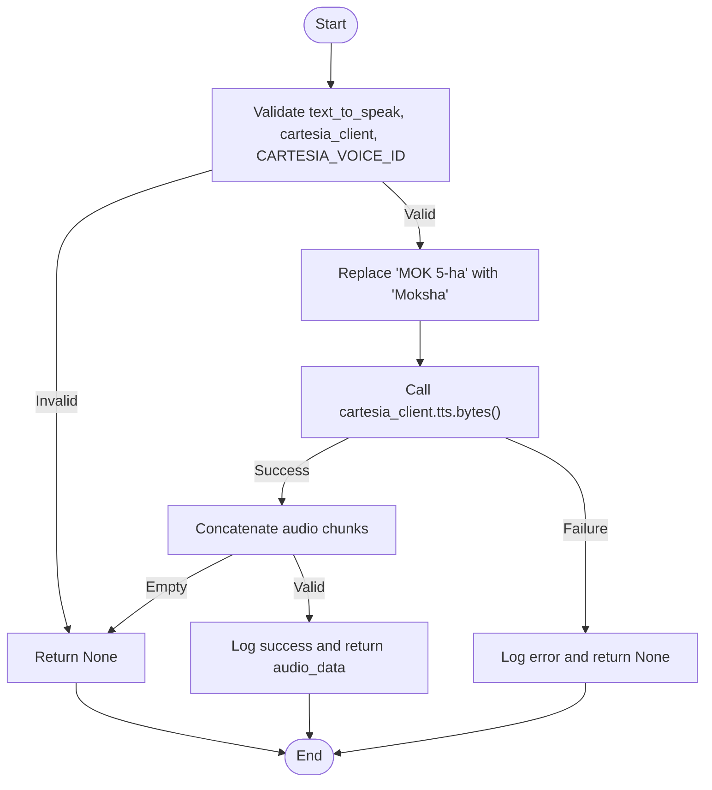
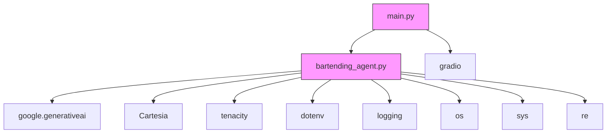

# bartending_agent.py - Core Business Logic

<cite>
**Referenced Files in This Document**   
- [bartending_agent.py](file://bartending_agent.py)
- [main.py](file://main.py)
</cite>

## Table of Contents
1. [Introduction](#introduction)
2. [Project Structure](#project-structure)
3. [Core Components](#core-components)
4. [Architecture Overview](#architecture-overview)
5. [Detailed Component Analysis](#detailed-component-analysis)
6. [Dependency Analysis](#dependency-analysis)
7. [Performance Considerations](#performance-considerations)
8. [Troubleshooting Guide](#troubleshooting-guide)
9. [Conclusion](#conclusion)

## Introduction
This document provides a comprehensive analysis of the `bartending_agent.py` module, which serves as the core business logic and AI integration layer for a conversational bartending agent. The agent processes user input, manages order state, interacts with the Gemini LLM for response generation, and integrates Cartesia for TTS audio synthesis. The implementation follows a stateless design pattern, where session state is managed externally (e.g., via Gradio) and passed into functions. The module demonstrates robust error handling, retry mechanisms, and environment configuration via dotenv. It is designed to be modular, reusable, and resilient to API failures.

## Project Structure
The project is organized into a flat structure with core modules, notebooks, and configuration files. The primary application logic resides in `bartending_agent.py`, while the user interface is defined in `main.py` using Gradio. Notebooks in the `notebooks/` directory are used for development, testing, and Kaggle submission. The `requirements.txt` file specifies all external dependencies.



**Diagram sources**
- [bartending_agent.py](file://bartending_agent.py)
- [main.py](file://main.py)

**Section sources**
- [bartending_agent.py](file://bartending_agent.py)
- [main.py](file://main.py)

## Core Components
The core components of the bartending agent are the `process_order()` function for handling user input and order state, the `_call_gemini_api()` function for interacting with the Gemini LLM, and the `get_voice_audio()` function for generating TTS audio via Cartesia. The module uses a static menu definition and relies on external state management for conversation history and order state. It employs the tenacity library for retrying API calls and uses environment variables for configuration. The implementation is stateless, meaning all state is passed as parameters and returned as part of the result, making it suitable for use in stateful UI frameworks like Gradio.

**Section sources**
- [bartending_agent.py](file://bartending_agent.py#L150-L374)

## Architecture Overview
The architecture is a layered system with a clear separation of concerns. The UI layer (Gradio) manages user interaction and session state. The business logic layer (`bartending_agent.py`) processes input, manages order state, and generates responses using the Gemini LLM. The integration layer handles external API calls to Gemini and Cartesia. Configuration is managed via environment variables, with fallback to a `.env` file. The system is designed to be stateless, with all session data passed between the UI and business logic on each interaction.



**Diagram sources**
- [bartending_agent.py](file://bartending_agent.py)
- [main.py](file://main.py)

## Detailed Component Analysis

### process_order Function Analysis
The `process_order()` function is the primary entry point for processing user input. It takes the current user input, session history, and order state, and returns a response along with updated history and order state. The function constructs a prompt for the Gemini LLM using the menu, current order, conversation history, and user input. It then calls the LLM and processes the response, updating the order state based on heuristics (e.g., if the response mentions adding a drink). The function includes comprehensive error handling and logging.



**Diagram sources**
- [bartending_agent.py](file://bartending_agent.py#L150-L300)

**Section sources**
- [bartending_agent.py](file://bartending_agent.py#L150-L300)

### _call_gemini_api Function Analysis
The `_call_gemini_api()` function is an internal utility that wraps the Gemini API call with retry logic using the tenacity library. It is decorated with `@tenacity_retry` to automatically retry the call up to three times with exponential backoff in case of transient failures. The function logs the API call and response, providing visibility into the interaction with the LLM. It uses the globally initialized Gemini model and passes the prompt content and generation configuration.

```mermaid
sequenceDiagram
participant P as process_order
participant C as _call_gemini_api
participant G as Gemini API
P->>C : generate_content(contents, config)
loop Retry up to 3 times
C->>G : HTTP POST /generateContent
alt Success
G-->>C : 200 OK + response
C-->>P : GenerateContentResponse
break Return
else Failure
C->>C : Wait (exponential backoff)
end
end
alt All retries fail
C-->>P : Exception
end
```

**Diagram sources**
- [bartending_agent.py](file://bartending_agent.py#L100-L130)

**Section sources**
- [bartending_agent.py](file://bartending_agent.py#L100-L130)

### get_voice_audio Function Analysis
The `get_voice_audio()` function generates TTS audio from text using the Cartesia API. It first validates the input and checks for required client and voice ID. It then preprocesses the text (e.g., replacing "MOK 5-ha" with "Moksha" for correct pronunciation) and calls the Cartesia API synchronously. The function uses a retry mechanism for network-related errors. It returns the audio data as bytes or None if the call fails.



**Diagram sources**
- [bartending_agent.py](file://bartending_agent.py#L300-L374)

**Section sources**
- [bartending_agent.py](file://bartending_agent.py#L300-L374)

## Dependency Analysis
The `bartending_agent.py` module has several external dependencies. It relies on `google-generativeai` for LLM interaction, `cartesia` for TTS, `tenacity` for retry logic, and `python-dotenv` for environment variable loading. These are specified in `requirements.txt`. The module also depends on the standard library modules `logging`, `os`, `sys`, and `re`. The `main.py` file depends on `gradio` for the UI and imports functions from `bartending_agent.py`. There are no circular dependencies.



**Diagram sources**
- [bartending_agent.py](file://bartending_agent.py)
- [main.py](file://main.py)
- [requirements.txt](file://requirements.txt)

**Section sources**
- [bartending_agent.py](file://bartending_agent.py)
- [main.py](file://main.py)
- [requirements.txt](file://requirements.txt)

## Performance Considerations
The performance of the bartending agent is primarily influenced by the latency of the external APIs (Gemini and Cartesia). The use of retry mechanisms can increase response time in case of failures. The prompt construction and response processing are lightweight and should not introduce significant overhead. The TTS generation is synchronous and blocks the main thread, which could affect UI responsiveness. For production use, consider using asynchronous TTS or caching common responses. The menu and static data are loaded once at module initialization, minimizing runtime overhead.

## Troubleshooting Guide
Common issues include missing API keys, invalid voice IDs, and API timeouts. Ensure that `GEMINI_API_KEY` and `CARTESIA_API_KEY` are set in the environment or `.env` file. Verify that `CARTESIA_VOICE_ID` is set to a valid ID from the Cartesia dashboard. Check the logs for error messages from the API calls. If the LLM response is blocked, it may be due to safety filters; review the prompt feedback. For TTS issues, ensure the text is not empty and the Cartesia client is properly initialized. Use the retry mechanisms to handle transient network errors.

**Section sources**
- [bartending_agent.py](file://bartending_agent.py)

## Conclusion
The `bartending_agent.py` module provides a robust and well-structured implementation of a conversational AI bartender. Its stateless design makes it easy to integrate with various UI frameworks. The use of retry mechanisms and comprehensive error handling ensures reliability. The integration with Gemini and Cartesia enables rich, multimodal interactions. The code is well-documented and follows best practices for configuration and logging. Future improvements could include asynchronous TTS, more sophisticated order parsing, and enhanced error recovery.