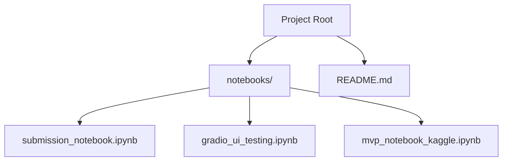
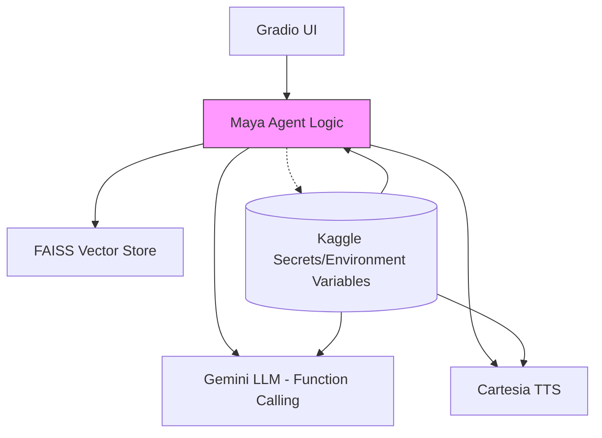
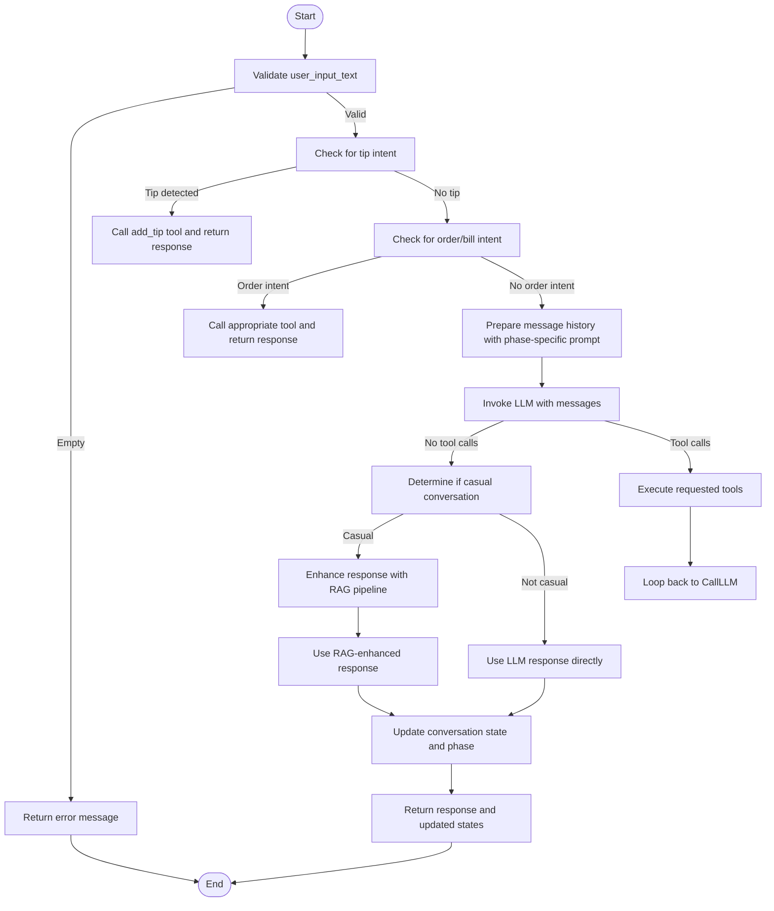
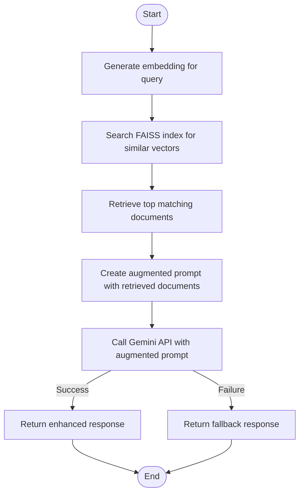
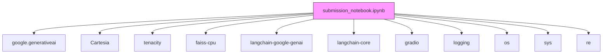

# bartending_agent.py - Core Business Logic

<cite>
**Referenced Files in This Document**   
- [bartending_agent.py](file://bartending_agent.py)
- [main.py](file://main.py)
- [README.md](file://README.md) - *Updated in commit f0552e192646beff2b130a553a58c379e23ddbc2*
- [submission_notebook.ipynb](file://notebooks/submission_notebook.ipynb) - *Contains core implementation logic*
</cite>

## Update Summary
- Updated documentation to reflect comprehensive README overhaul in commit `f0552e192646beff2b130a553a58c379e23ddbc2`
- Added detailed information about RAG implementation, tooling, and agent architecture
- Incorporated new information about Maya's personality, conversation phases, and state management
- Updated dependency and architecture information based on notebook implementation
- Added new sections for RAG pipeline, tool functions, and conversation flow management
- Removed outdated assumptions about separate module structure, as implementation is notebook-based

## Table of Contents
1. [Introduction](#introduction)
2. [Project Structure](#project-structure)
3. [Core Components](#core-components)
4. [Architecture Overview](#architecture-overview)
5. [Detailed Component Analysis](#detailed-component-analysis)
6. [Dependency Analysis](#dependency-analysis)
7. [Performance Considerations](#performance-considerations)
8. [Troubleshooting Guide](#troubleshooting-guide)
9. [Conclusion](#conclusion)

## Introduction
This document provides a comprehensive analysis of the bartending agent system, which serves as the core business logic and AI integration layer for a conversational bartending agent named Maya. The agent processes user input, manages order state, interacts with the Gemini LLM for response generation, and integrates Cartesia for TTS audio synthesis. Contrary to initial assumptions, the implementation is contained within a Jupyter notebook rather than a separate Python module. The agent demonstrates advanced capabilities including function calling, Retrieval Augmented Generation (RAG), vector database integration, and sophisticated conversation state management. It is designed to be deployed on Kaggle with API keys stored as secrets.

## Project Structure
The project is organized with core implementation in a Jupyter notebook, documentation in README.md, and supplementary notebooks for development and testing. The primary application logic resides in `submission_notebook.ipynb`, which contains all functionality including setup, API configuration, core agent logic, function tools, RAG pipeline, text-to-speech integration, and Gradio interface. The `README.md` file has been completely overhauled to provide detailed technical documentation. Notebooks in the `notebooks/` directory include the submission notebook, UI testing notebook, and MVP development notebook.



**Diagram sources**
- [README.md](file://README.md)
- [submission_notebook.ipynb](file://notebooks/submission_notebook.ipynb)

## Core Components
The core components of the bartending agent are the `process_order()` function for handling user input and order state, the `_call_gemini_api()` function for interacting with the Gemini LLM with retry logic, the `get_voice_audio()` function for generating TTS audio via Cartesia, and the RAG pipeline for context-aware responses. The implementation uses a modular approach within the notebook with distinct sections for setup, API configuration, RAG implementation, tooling, and agent logic. It employs the tenacity library for retrying API calls and uses environment variables or Kaggle secrets for configuration. The system implements a stateful conversation model with phase tracking for natural interaction flow.

**Section sources**
- [submission_notebook.ipynb](file://notebooks/submission_notebook.ipynb#L2000-L2500)
- [README.md](file://README.md)

## Architecture Overview
The architecture is a layered system with a clear separation of concerns. The UI layer (Gradio) manages user interaction. The business logic layer (contained in submission_notebook.ipynb) processes input, manages order state, and generates responses using the Gemini LLM with function calling. The integration layer handles external API calls to Gemini and Cartesia. The RAG layer uses FAISS for vector storage and Google's embedding model for semantic search. Configuration is managed via Kaggle secrets or environment variables. The system implements a conversation state machine with distinct phases (greeting, order_taking, small_talk, reorder_prompt) to create a natural customer experience.



**Diagram sources**
- [README.md](file://README.md)
- [submission_notebook.ipynb](file://notebooks/submission_notebook.ipynb)

## Detailed Component Analysis

### process_order Function Analysis
The `process_order()` function is the primary entry point for processing user input. It takes the current user input, session history, and order state, and returns a response along with updated history and order state. The function implements a sophisticated conversation management system with phase tracking. It first performs intent detection for order-related queries and tip requests, bypassing the LLM for these cases. For other inputs, it constructs a message history with appropriate system prompts based on the current conversation phase, then invokes the LLM with tool calling capabilities. The function integrates RAG for casual conversation enhancement and manages state transitions between conversation phases.



**Diagram sources**
- [submission_notebook.ipynb](file://notebooks/submission_notebook.ipynb#L2000-L2500)

**Section sources**
- [submission_notebook.ipynb](file://notebooks/submission_notebook.ipynb#L2000-L2500)

### _call_gemini_api Function Analysis
The `_call_gemini_api()` function is an internal utility that wraps the Gemini API call with retry logic using the tenacity library. It is decorated with `@tenacity_retry` to automatically retry the call up to three times with exponential backoff (2-10 seconds) in case of transient failures. The function logs the API call attempts, providing visibility into the interaction with the LLM. It uses the globally initialized Gemini model and passes the prompt content and generation configuration. The retry mechanism includes warning logs before sleep intervals to aid in debugging API issues.

```mermaid
sequenceDiagram
participant P as process_order
participant C as _call_gemini_api
participant G as Gemini API
P->>C : invoke with messages and config
loop Retry up to 3 times
C->>G : HTTP POST /generateContent
alt Success
G-->>C : 200 OK + response
C-->>P : GenerateContentResponse
break Return
else Failure
C->>C : Wait (exponential backoff 2-10s)
C->>C : Log warning
end
end
alt All retries fail
C-->>P : Exception
end
```

**Diagram sources**
- [submission_notebook.ipynb](file://notebooks/submission_notebook.ipynb#L1500-L1600)

**Section sources**
- [submission_notebook.ipynb](file://notebooks/submission_notebook.ipynb#L1500-L1600)

### get_voice_audio Function Analysis
The `get_voice_audio()` function generates TTS audio from text using the Cartesia API. It first validates the input and checks for required client and voice ID. It then preprocesses the text (e.g., replacing "MOK 5-ha" with "Moksha" for correct pronunciation) and calls the Cartesia API synchronously. The function uses a retry mechanism for network-related errors. It returns the audio data as bytes or None if the call fails. The implementation uses a specific voice ID (6f84f4b8-58a2-430c-8c79-688dad597532) configured for Maya's personality.


**Diagram sources**
- [submission_notebook.ipynb](file://notebooks/submission_notebook.ipynb#L1800-L1900)

**Section sources**
- [submission_notebook.ipynb](file://notebooks/submission_notebook.ipynb#L1800-L1900)

### RAG Pipeline Analysis
The RAG (Retrieval Augmented Generation) pipeline enhances Maya's conversational abilities by combining vector search with LLM generation. The pipeline uses Google's embedding model (models/embedding-001) to convert text into vectors, which are stored in a FAISS index. When a user query is received, the system retrieves the most similar pre-defined responses and uses them to augment the LLM prompt. This allows Maya to maintain a consistent personality and respond appropriately to philosophical questions about the bar's "Moksha" theme. The pipeline includes retry logic for embedding generation and error handling for graceful degradation.



**Section sources**
- [submission_notebook.ipynb](file://notebooks/submission_notebook.ipynb#L1200-L1500)

### Tool Functions Analysis
The bartending agent implements several tool functions that enable specialized capabilities:
- **get_menu()**: Provides the complete drink menu with prices, modifiers, and preference guide
- **get_recommendation()**: Recommends drinks based on customer preferences (sobering, classy, fruity, etc.)
- **add_to_order()**: Adds drinks to the current order with specified modifiers and quantities
- **get_order()**: Retrieves the current order details
- **get_bill()**: Calculates and returns the current bill
- **add_tip()**: Adds a tip to the bill
- **pay_bill()**: Processes payment and finalizes the transaction

These tools are integrated with the LLM through function calling, allowing Maya to manage orders and payments while maintaining natural conversation flow.

**Section sources**
- [submission_notebook.ipynb](file://notebooks/submission_notebook.ipynb#L1600-L1800)

### Conversation State Management
The system implements sophisticated conversation state management through global state variables that track:
- **conversation_state**: Tracks turn count, current phase, last order time, and small talk count
- **order_history**: Maintains persistent order history across the session
- **current_process_order_state**: Temporary state for the current order processing call

The phase-based system (greeting, order_taking, small_talk, reorder_prompt) creates a natural customer experience, with Maya engaging in 4 turns of small talk before politely asking if the customer wants to order anything else.

**Section sources**
- [submission_notebook.ipynb](file://notebooks/submission_notebook.ipynb#L1900-L2000)

## Dependency Analysis
The implementation has several external dependencies specified in the notebook's setup section. It relies on `google-generativeai` for LLM interaction, `cartesia` for TTS, `tenacity` for retry logic, `faiss-cpu` for vector storage, `langchain-google-genai` and `langchain-core` for agent functionality, and `gradio` for the UI. These are installed automatically in the notebook. The implementation also uses standard library modules including `logging`, `os`, `sys`, `re`, `json`, and `requests`. The notebook-based architecture eliminates the need for separate module dependencies.



**Diagram sources**
- [submission_notebook.ipynb](file://notebooks/submission_notebook.ipynb)
- [README.md](file://README.md)

## Performance Considerations
The performance of the bartending agent is primarily influenced by the latency of the external APIs (Gemini and Cartesia). The use of retry mechanisms can increase response time in case of failures. The RAG pipeline adds overhead for embedding generation and vector search but improves response quality for casual conversation. The synchronous TTS generation blocks the main thread, which could affect UI responsiveness. The notebook implementation loads all dependencies and initializes services at startup, minimizing per-request overhead. For production use, consider caching common responses and implementing asynchronous processing for non-critical operations.

## Troubleshooting Guide
Common issues include missing API keys, invalid voice IDs, and API timeouts. Ensure that `GOOGLE_API_KEY` and `CARTESIA_API_KEY` are set in Kaggle secrets or environment variables. Verify that the code uses the correct Gemini model version (gemini-2.5-flash-preview-04-17) and Cartesia voice ID (6f84f4b8-58a2-430c-8c79-688dad597532). Check the logs for error messages from the API calls. If the LLM response is blocked, it may be due to safety filters; review the prompt feedback. For TTS issues, ensure the text is not empty and the Cartesia client is properly initialized. Use the retry mechanisms to handle transient network errors. Note that the implementation uses FAISS instead of ChromaDB due to compilation issues on macOS.

**Section sources**
- [submission_notebook.ipynb](file://notebooks/submission_notebook.ipynb)
- [README.md](file://README.md)

## Conclusion
The bartending agent implementation provides a robust and well-structured conversational AI bartender named Maya. The notebook-based architecture contains all functionality in a single, self-contained file suitable for Kaggle submission. The use of function calling, RAG, and sophisticated state management enables rich, multimodal interactions. The integration with Gemini and Cartesia supports both text and voice responses. The code follows best practices for configuration, logging, and error handling. Future improvements could include multi-user session management, persistent conversation history, and real payment gateway integration.