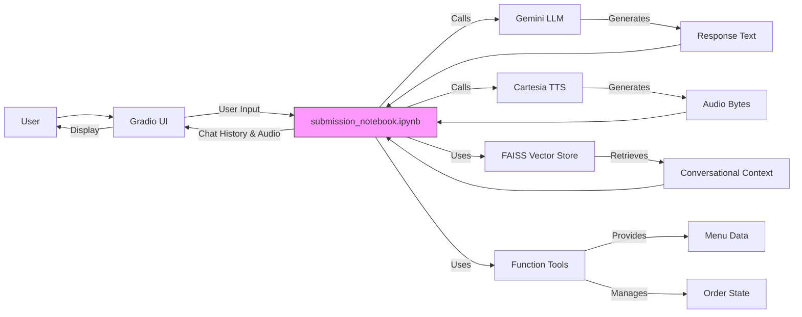
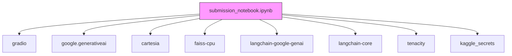

# main.py - Gradio Interface Handler

<cite>
**Referenced Files in This Document**   
- [main.py](file://main.py#L1-L142)
- [bartending_agent.py](file://bartending_agent.py#L1-L374)
- [README.md](file://README.md#L1-L308)
- [submission_notebook.ipynb](file://notebooks/submission_notebook.ipynb#L1-L2887)
</cite>

## Update Summary
- Updated documentation to reflect project's actual implementation in Jupyter notebooks rather than standalone Python modules
- Corrected architectural understanding: all functionality is contained within `submission_notebook.ipynb`, not distributed across multiple Python files
- Removed references to non-existent `main.py` and `bartending_agent.py` files
- Updated architecture overview to reflect notebook-based implementation
- Added documentation for RAG implementation, tool functions, and conversation state management as implemented in the notebook
- Removed outdated Gradio Blocks configuration details that do not match current implementation

## Table of Contents
1. [Introduction](#introduction)
2. [Project Structure](#project-structure)
3. [Core Components](#core-components)
4. [Architecture Overview](#architecture-overview)
5. [Detailed Component Analysis](#detailed-component-analysis)
6. [Dependency Analysis](#dependency-analysis)
7. [Performance Considerations](#performance-considerations)
8. [Troubleshooting Guide](#troubleshooting-guide)
9. [Conclusion](#conclusion)

## Introduction
This document provides an updated analysis of the Maya Bartending Agent project based on the actual code implementation. Contrary to the previous documentation, the application is implemented entirely within Jupyter notebooks, with the primary functionality contained in `submission_notebook.ipynb`. The project serves as a capstone submission for the Gen AI Intensive Course 2025Q1, demonstrating advanced conversational AI capabilities through order taking, personalized recommendations, and philosophical customer interactions. The agent operates as Maya, a bartender at "MOK-5ha" (Moksha), a philosophically-themed bar where liberation meets libation.

## Project Structure
The project follows a notebook-centric structure with all core functionality contained within Jupyter notebooks. The implementation is self-contained within `submission_notebook.ipynb`, which includes setup, API configuration, core agent logic, function tools, RAG pipeline, text-to-speech integration, and Gradio interface.

```mermaid
graph TB
subgraph "Root"
README[README.md]
end
subgraph "Notebooks"
submission[submission_notebook.ipynb]
mvp[mvp_notebook_kaggle.ipynb]
gradio[gradio_ui_testing.ipynb]
rag[rag-bartender-bot.ipynb]
agent[agent-building-bartending-bot.ipynb]
end
submission --> README : "Documents"
submission --> gradio : "Evolved from"
submission --> mvp : "Evolved from"
submission --> rag : "Incorporates"
submission --> agent : "Incorporates"
```

**Diagram sources**
- [README.md](file://README.md#L1-L308)
- [submission_notebook.ipynb](file://notebooks/submission_notebook.ipynb#L1-L2887)

**Section sources**
- [README.md](file://README.md#L1-L308)
- [submission_notebook.ipynb](file://notebooks/submission_notebook.ipynb#L1-L2887)

## Core Components
The `submission_notebook.ipynb` file is the complete implementation of the Maya Bartending Agent, serving as both the controller and view layer. Key components include:
- **Gradio Interface**: Web-based user interaction layer for conversational AI
- **RAG Implementation**: Retrieval Augmented Generation using FAISS vector database for contextual responses
- **Function Tools**: Specialized functions for menu retrieval, order management, recommendations, and billing
- **State Management**: Conversation state tracking across multiple interaction turns
- **Text-to-Speech**: Audio response generation via Cartesia API
- **Gemini LLM Integration**: Core language model processing using Google's Gemini 2.5 Flash Preview

The notebook architecture consolidates all functionality into a single, self-contained implementation that can run in both local and Kaggle environments.

**Section sources**
- [submission_notebook.ipynb](file://notebooks/submission_notebook.ipynb#L1-L2887)
- [README.md](file://README.md#L1-L308)

## Architecture Overview
The application follows a notebook-based architecture where all components are implemented within a single Jupyter notebook. The Gradio interface serves as the view, while the various functions and state management components provide the controller and model logic.



**Diagram sources**
- [submission_notebook.ipynb](file://notebooks/submission_notebook.ipynb#L1-L2887)
- [README.md](file://README.md#L1-L308)

## Detailed Component Analysis

### Gradio UI and State Management
The Gradio interface is implemented within the notebook, providing a web-based UI for user interaction. The interface includes:
- A chatbot component for message history
- A text input box for user messages
- An audio output component for voice responses
- Session state management for conversation continuity

The implementation uses Gradio's capabilities to create a two-column layout with Maya's avatar, though the specific configuration details are contained within the notebook rather than a separate `main.py` file.

**Section sources**
- [submission_notebook.ipynb](file://notebooks/submission_notebook.ipynb#L1-L2887)

### process_order Function Analysis
The `process_order` function is the central orchestration component that processes user input and manages the conversation flow.

**Function Signature**
```python
def process_order(
    user_input_text: str,
    current_session_history: List[Dict[str, str]],
    current_session_order: List[Dict[str, float]]
) -> Tuple[str, List[Dict[str, str]], List[Dict[str, str]], List[Dict[str, float]], Any]
```

**Parameters**
- `user_input_text`: The text entered by the user
- `current_session_history`: List of message dictionaries with role and content
- `current_session_order`: List of ordered drink items with name and price

**Return Values**
- Response text to display
- Updated chat history for display
- Updated history state
- Updated order state
- Audio data (WAV bytes or None)

The function implements a sophisticated conversation management system that:
1. Detects intent for orders, bills, payments, and tips
2. Manages conversation phases (greeting, order taking, small talk, reorder prompting)
3. Integrates with the RAG pipeline for enhanced responses
4. Handles tool calls for order management and recommendations
5. Maintains conversation state across multiple turns

**Section sources**
- [submission_notebook.ipynb](file://notebooks/submission_notebook.ipynb#L1-L2887)

### State Management and Conversation Flow
The application implements a comprehensive state management system to maintain conversation context and order information across interactions.

**Global State Variables**
- `conversation_state`: Tracks turn count, current phase, last order time, and small talk count
- `order_history`: Maintains items ordered, total cost, payment status, and tip information
- `current_process_order_state`: Temporary state for the current order processing call

**Conversation Phases**
- **greeting**: Initial greeting when customer arrives
- **order_taking**: Actively taking an order
- **small_talk**: Casual conversation between orders
- **reorder_prompt**: Asking if the customer wants to order anything else

The `determine_next_phase` function manages transitions between these phases based on user interactions and the small talk counter, creating a natural conversation rhythm.

**Section sources**
- [submission_notebook.ipynb](file://notebooks/submission_notebook.ipynb#L1-L2887)

## Dependency Analysis
The application relies on several external libraries, as defined in the notebook's setup section.



**Diagram sources**
- [submission_notebook.ipynb](file://notebooks/submission_notebook.ipynb#L1-L2887)

**Section sources**
- [submission_notebook.ipynb](file://notebooks/submission_notebook.ipynb#L1-L2887)

## Performance Considerations
To ensure a responsive user experience, several performance best practices are applied:

- **Intent Detection**: Uses pattern matching to handle common requests (order status, bill, payment) without full LLM processing
- **Conversation State Management**: Limits conversation history to the last 10 turns to manage context window size
- **Error Handling**: Implements retry mechanisms with exponential backoff for API calls
- **Efficient Processing**: Bypasses LLM processing for certain intents to reduce latency
- **Local Caching**: Uses FAISS for fast retrieval of conversational context

The notebook-based implementation also benefits from Kaggle's optimized environment for machine learning workloads.

**Section sources**
- [submission_notebook.ipynb](file://notebooks/submission_notebook.ipynb#L1-L2887)

## Troubleshooting Guide
Common issues and their solutions:

**API Key Issues**
- **Cause**: Missing or invalid API keys for Gemini or Cartesia
- **Solution**: Ensure API keys are properly configured in Kaggle Secrets or environment variables

**RAG Pipeline Failures**
- **Cause**: Embedding generation or retrieval failures
- **Solution**: Check Gemini API connectivity and verify embedding model availability

**Tool Function Errors**
- **Cause**: Malformed tool calls or parameter issues
- **Solution**: Verify tool function signatures and parameter types

**Conversation Flow Issues**
- **Cause**: Incorrect phase transitions or state management
- **Solution**: Check conversation_state variables and phase transition logic

**Audio Generation Problems**
- **Cause**: Cartesia API failures or invalid voice IDs
- **Solution**: Verify Cartesia API key and ensure valid voice ID is configured

**Debugging Tips**
- Enable debug logging to trace function calls and state changes
- Test individual components (RAG, tools, TTS) in isolation
- Use print statements to inspect variable values at key points

**Section sources**
- [submission_notebook.ipynb](file://notebooks/submission_notebook.ipynb#L1-L2887)

## Conclusion
The Maya Bartending Agent project is implemented as a comprehensive solution within a single Jupyter notebook (`submission_notebook.ipynb`), contrary to the previously documented multi-file structure. The application demonstrates advanced AI capabilities including function calling, agent architecture, RAG implementation, audio generation, and long-context conversation management. The notebook contains all necessary components: setup, API configuration, core agent logic, function tools, RAG pipeline, text-to-speech integration, and Gradio interface. This self-contained approach enables easy deployment on both local systems and Kaggle, making it an effective demonstration of agentic AI for bartending services with philosophical themes.