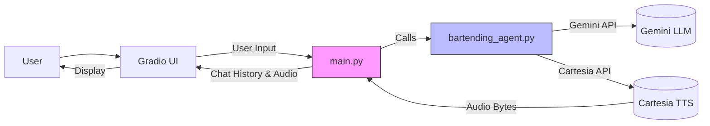
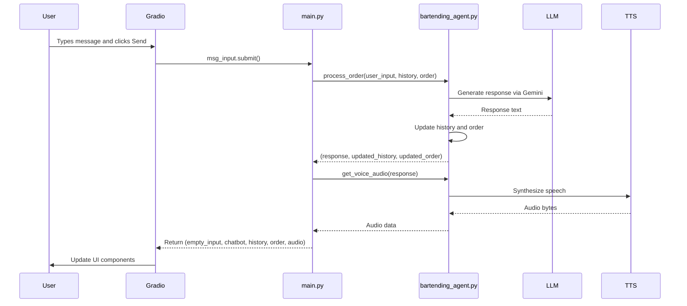
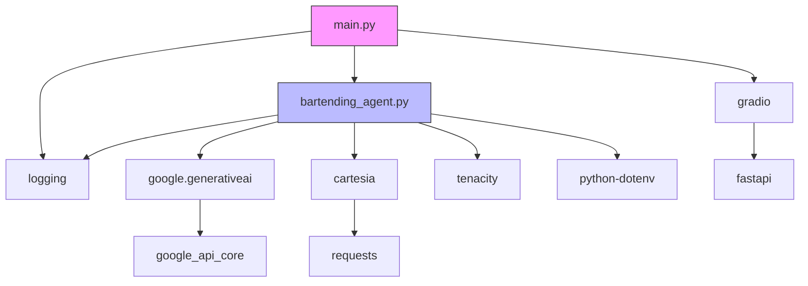

# main.py - Gradio Interface Handler

<cite>
**Referenced Files in This Document**   
- [main.py](file://main.py#L1-L142)
- [bartending_agent.py](file://bartending_agent.py#L1-L374)
</cite>

## Table of Contents
1. [Introduction](#introduction)
2. [Project Structure](#project-structure)
3. [Core Components](#core-components)
4. [Architecture Overview](#architecture-overview)
5. [Detailed Component Analysis](#detailed-component-analysis)
6. [Dependency Analysis](#dependency-analysis)
7. [Performance Considerations](#performance-considerations)
8. [Troubleshooting Guide](#troubleshooting-guide)
9. [Conclusion](#conclusion)

## Introduction
This document provides a comprehensive analysis of the `main.py` module in the MayaBartendingAgent project. The module serves as the controller and view layer, responsible for initializing the Gradio web interface, managing user interactions, and orchestrating backend logic from `bartending_agent.py`. It defines the UI components such as the chat interface, text input, audio output, and clear button, and sets up event callbacks for user submissions and session resets. The analysis includes the `handle_gradio_input()` function’s signature, parameters, and its role in integrating with backend services. Special attention is given to UI logic separation, state management, and performance optimization.

## Project Structure
The project follows a modular structure with distinct components for UI, business logic, configuration, and testing. The core application files are located at the root, while notebooks are stored in a dedicated directory for experimentation and development.

```mermaid
graph TB
subgraph "Root"
main[main.py]
agent[bartending_agent.py]
kaggle[kaggle_test.py]
requirements[requirements.txt]
README[README.md]
end
subgraph "Notebooks"
notebook1[gradio_ui_testing.ipynb]
notebook2[mvp_notebook_kaggle.ipynb]
notebook3[submission_notebook.ipynb]
end
main --> agent : "Uses"
main --> kaggle : "Related"
agent --> requirements : "Requires"
README --> main : "Documents"
```

**Diagram sources**
- [main.py](file://main.py#L1-L142)
- [bartending_agent.py](file://bartending_agent.py#L1-L374)
- [requirements.txt](file://requirements.txt#L1-L9)

**Section sources**
- [main.py](file://main.py#L1-L142)
- [README.md](file://README.md#L1-L35)

## Core Components
The `main.py` file is the primary entry point for the Gradio-based web application. It initializes the UI, manages session state, and connects user inputs to backend processing logic. Key components include:
- **Gradio Interface**: Built using `gr.Blocks` for flexible layout control.
- **State Management**: Uses `gr.State` to maintain chat history and order state across interactions.
- **Event Callbacks**: Handles user input submission and conversation clearing.
- **Audio Integration**: Integrates text-to-speech (TTS) via Cartesia for voice responses.

The `handle_gradio_input()` function orchestrates the flow by calling `process_order()` from `bartending_agent.py`, generating a textual response, and then synthesizing it into audio using `get_voice_audio()`.

**Section sources**
- [main.py](file://main.py#L1-L142)
- [bartending_agent.py](file://bartending_agent.py#L1-L374)

## Architecture Overview
The application follows a clean separation between UI (view) and business logic (model/controller). The Gradio interface in `main.py` acts as the view, while `bartending_agent.py` contains the core logic for processing orders, managing state, and interacting with external APIs (Gemini LLM and Cartesia TTS).



**Diagram sources**
- [main.py](file://main.py#L1-L142)
- [bartending_agent.py](file://bartending_agent.py#L1-L374)

## Detailed Component Analysis

### Gradio UI and State Management
The Gradio interface is defined using `gr.Blocks`, allowing for a structured layout with rows and columns. The UI includes:
- A chatbot component for message history
- A text input box for user messages
- An audio output component for voice responses
- A clear button to reset the session

Session state is managed using `gr.State` variables (`history_state`, `order_state`) which persist across interactions without relying on global variables.

```python
history_state = gr.State([])
order_state = gr.State([])
```

These states are passed as inputs to event handlers and updated via return values, ensuring functional purity and immutability.

#### Event Handling Flow


**Diagram sources**
- [main.py](file://main.py#L1-L142)
- [bartending_agent.py](file://bartending_agent.py#L1-L374)

**Section sources**
- [main.py](file://main.py#L1-L142)

### handle_gradio_input Function Analysis
The `handle_gradio_input()` function is the central callback that processes user input and updates the UI.

**Function Signature**
```python
def handle_gradio_input(
    user_input: str,
    session_history_state: List[Dict[str, str]],
    session_order_state: List[Dict[str, float]]
) -> Tuple[str, List[Dict[str, str]], List[Dict[str, str]], List[Dict[str, float]], Any]
```

**Parameters**
- `user_input`: The text entered by the user
- `session_history_state`: List of message dictionaries with role and content
- `session_order_state`: List of ordered drink items with name and price

**Return Values**
- Empty string to clear input box
- Updated chatbot display
- Updated history state
- Updated order state
- Audio data (WAV bytes or None)

The function calls `process_order()` to generate a response and update state, then calls `get_voice_audio()` to synthesize the response into speech. If no response is generated, TTS is skipped.

**Section sources**
- [main.py](file://main.py#L45-L85)

### State Immutability and Functional Purity
The application adheres to functional programming principles by avoiding mutable global state. Instead, state is passed as arguments and new state is returned. This ensures predictable behavior and simplifies debugging.

In `bartending_agent.py`, `process_order()` takes current state as input and returns updated state, never modifying the input directly. This pattern prevents side effects and makes the function easier to test.

```python
updated_history = current_session_history[:]
updated_order = current_session_order[:]
```

Local copies are created using slicing to prevent mutation of input lists.

**Section sources**
- [bartending_agent.py](file://bartending_agent.py#L200-L300)

## Dependency Analysis
The application relies on several external libraries, as defined in `requirements.txt`.



**Diagram sources**
- [requirements.txt](file://requirements.txt#L1-L9)
- [main.py](file://main.py#L1-L142)
- [bartending_agent.py](file://bartending_agent.py#L1-L374)

**Section sources**
- [requirements.txt](file://requirements.txt#L1-L9)

## Performance Considerations
To ensure a responsive user experience, several performance best practices are applied:

- **Minimize Data Transfer**: Only necessary state (history, order) is passed between frontend and backend.
- **Efficient State Updates**: Gradio components are updated selectively; only changed components are refreshed.
- **Caching and Retries**: The `tenacity` library is used to retry failed API calls with exponential backoff, improving reliability without blocking the UI.
- **Asynchronous TTS**: Although TTS is currently synchronous, the use of generators in Cartesia allows for potential streaming in the future.
- **Prompt Truncation**: Only the last 10 conversation turns are included in the prompt to Gemini, reducing token usage and latency.

Avoiding UI freezing is achieved by ensuring that long-running operations (LLM inference, TTS) are handled efficiently and that the Gradio interface is launched with `debug=True` for development, enabling hot reload.

**Section sources**
- [main.py](file://main.py#L1-L142)
- [bartending_agent.py](file://bartending_agent.py#L1-L374)

## Troubleshooting Guide
Common issues and their solutions:

**UI Freezing**
- **Cause**: Long-running TTS or LLM calls blocking the event loop.
- **Solution**: Ensure network connectivity and API key validity. Consider implementing asynchronous processing if freezing persists.

**State Persistence Issues**
- **Cause**: Incorrect handling of `gr.State` or mutation of input state.
- **Solution**: Always return new state objects; never modify input lists in place.

**Audio Not Playing**
- **Cause**: TTS failure or invalid audio data.
- **Solution**: Check Cartesia API key and voice ID. Verify that `get_voice_audio()` returns valid WAV bytes.

**Empty or Generic Responses**
- **Cause**: Gemini API safety filters or prompt formatting issues.
- **Solution**: Review prompt construction in `process_order()`. Check logs for block reasons.

**Debugging Tips**
- Enable debug logging in `main.py` and `bartending_agent.py`.
- Use `logger.debug()` to trace state changes.
- Test individual functions (e.g., `get_voice_audio()`) in isolation.

**Section sources**
- [main.py](file://main.py#L1-L142)
- [bartending_agent.py](file://bartending_agent.py#L1-L374)

## Conclusion
The `main.py` module effectively serves as the controller and view layer for the bartending agent application. It leverages Gradio to create an intuitive web interface while maintaining a clean separation from business logic in `bartending_agent.py`. The use of session state, functional purity, and robust error handling ensures a reliable and maintainable architecture. Performance is optimized through efficient state management and API call retries. This design supports easy debugging and future enhancements, such as adding asynchronous processing or expanding the menu system.