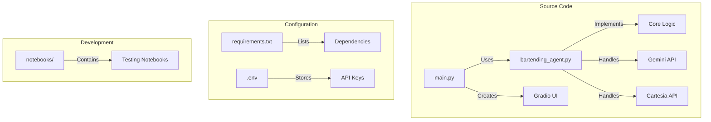
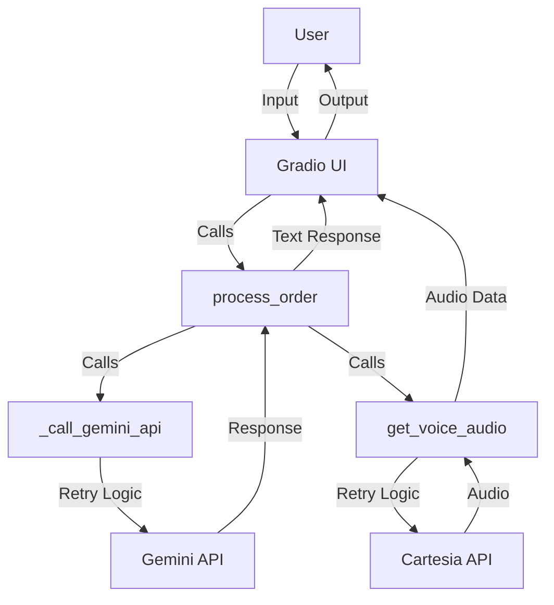
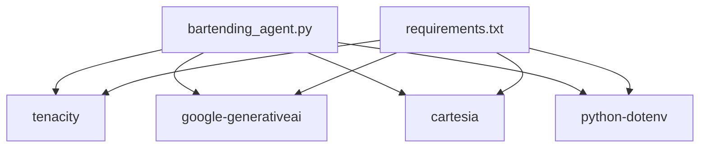

# API Retry Mechanisms

<cite>
**Referenced Files in This Document**   
- [bartending_agent.py](file://bartending_agent.py)
- [main.py](file://main.py)
- [requirements.txt](file://requirements.txt)
</cite>

## Table of Contents
1. [Introduction](#introduction)
2. [Project Structure](#project-structure)
3. [Core Components](#core-components)
4. [Architecture Overview](#architecture-overview)
5. [Detailed Component Analysis](#detailed-component-analysis)
6. [Dependency Analysis](#dependency-analysis)
7. [Performance Considerations](#performance-considerations)
8. [Troubleshooting Guide](#troubleshooting-guide)
9. [Conclusion](#conclusion)

## Introduction
This document provides a comprehensive analysis of the API retry mechanisms implemented in the Maya Bartending Agent, a conversational AI bartender system. The agent leverages the tenacity library to enhance resilience when interacting with external APIs, specifically Google's Gemini for natural language processing and Cartesia for text-to-speech (TTS) synthesis. The retry logic is critical for maintaining a smooth user experience in the face of transient network issues, temporary service outages, and rate limiting. This documentation details the configuration, implementation, and operational benefits of the retry system, providing insights into how it contributes to the overall fault tolerance of the application.

## Project Structure
The Maya Bartending Agent project is structured as a modular Python application with a clear separation of concerns. The core business logic and API interactions are encapsulated in `bartending_agent.py`, while the user interface is managed by `main.py` using the Gradio framework. The project includes a `notebooks` directory for development and testing, containing Jupyter notebooks that mirror the core logic. Configuration and dependencies are managed via a `.env` file and `requirements.txt`. This structure promotes maintainability and allows for stateless operation of the core agent functions, with session state managed by the Gradio interface.



**Diagram sources**
- [bartending_agent.py](file://bartending_agent.py)
- [main.py](file://main.py)

**Section sources**
- [bartending_agent.py](file://bartending_agent.py)
- [main.py](file://main.py)

## Core Components
The core components of the retry system are the `@tenacity_retry` decorator configurations applied to two critical functions: `_call_gemini_api` for LLM interactions and `get_voice_audio` for TTS synthesis. These functions are stateless and rely on globally initialized clients for Gemini and Cartesia. The retry logic is designed to be robust, with a fallback mechanism that provides a dummy decorator if the tenacity library is not installed, ensuring the application can still run, albeit without retry capabilities. The system uses exponential backoff to prevent overwhelming the external services during periods of instability.

**Section sources**
- [bartending_agent.py](file://bartending_agent.py#L147-L180)
- [bartending_agent.py](file://bartending_agent.py#L312-L374)

## Architecture Overview
The system architecture is a client-server model where the Gradio application acts as a server, hosting a web-based UI for user interaction. User input is processed by the `process_order` function in `bartending_agent.py`, which constructs a prompt for the Gemini API. The response from Gemini is then passed to the `get_voice_audio` function to generate spoken audio via the Cartesia API. The retry mechanisms are applied at the lowest level of these external API calls, creating a resilient foundation for the entire application. This layered approach ensures that transient failures in either the LLM or TTS service do not immediately result in a failed user request.



**Diagram sources**
- [bartending_agent.py](file://bartending_agent.py)
- [main.py](file://main.py)

## Detailed Component Analysis

### API Retry Configuration Analysis
The retry mechanisms are implemented using the tenacity library, which provides a powerful and flexible way to define retry behavior using decorators. The configuration is tailored to the specific characteristics and rate limits of each external service.

#### Gemini API Retry Configuration
The `_call_gemini_api` function is decorated with a retry configuration designed for a high-latency, high-value LLM call. It is configured to attempt the call up to three times (`stop_after_attempt(3)`). The wait time between retries follows an exponential backoff pattern with a multiplier of 1, starting at a minimum of 2 seconds and capping at 10 seconds (`wait_exponential(multiplier=1, min=2, max=10)`). This means the first retry will occur after 2 seconds, the second after 4 seconds, and if necessary, the third after 8 seconds (capped at 10). This configuration balances the need for recovery with the user's expectation for a timely response, as LLM calls are inherently slower.

```python
@tenacity_retry(
    stop=stop_after_attempt(3),
    wait=wait_exponential(multiplier=1, min=2, max=10),
    before_sleep=before_sleep_log(logger, logging.WARNING),
    reraise=True
)
def _call_gemini_api(prompt_content: List[str], config: Dict) -> ggenai.types.GenerateContentResponse:
    # API call implementation
    ...
```

**Diagram sources**
- [bartending_agent.py](file://bartending_agent.py#L147-L180)

#### Cartesia TTS API Retry Configuration
The `get_voice_audio` function has a retry configuration optimized for a faster, more frequent service. It also attempts up to three times but uses a shorter exponential backoff window, with a minimum wait of 1 second and a maximum of 5 seconds (`wait_exponential(multiplier=1, min=1, max=5)`). This reflects the expectation that TTS synthesis should be relatively quick, and longer delays would be more noticeable to the user. The retry logic is also more specific, targeting only `ConnectionError` and `TimeoutError` exceptions, which are the most likely transient failures for a network-based TTS service.

```python
@tenacity_retry(
    stop=stop_after_attempt(3),
    wait=wait_exponential(multiplier=1, min=1, max=5),
    retry=retry_if_exception_type(CARTESIA_RETRYABLE_EXCEPTIONS),
    before_sleep=before_sleep_log(logger, logging.WARNING),
    reraise=True
)
def get_voice_audio(text_to_speak: str) -> bytes | None:
    # TTS API call implementation
    ...
```

**Diagram sources**
- [bartending_agent.py](file://bartending_agent.py#L312-L374)

### Exponential Backoff and System Resilience
Exponential backoff is a critical strategy for preventing service overload during transient failures. When a service is under stress, a flood of immediate retry requests from many clients can exacerbate the problem, leading to a cascading failure. By increasing the delay between retry attempts, the system gives the external service time to recover. In this implementation, the combination of a limited number of attempts (3) and capped exponential backoff ensures that the agent will not retry indefinitely, providing a predictable upper bound on latency. This makes the system resilient to common issues like network blips or brief service hiccups without creating a denial-of-service condition.

### Logging and Exception Handling
The retry system includes the `before_sleep_log` callback, which logs a warning message before each retry attempt. This provides valuable visibility into the system's operation, allowing developers to monitor the frequency of retries and diagnose underlying issues. The `reraise=True` parameter ensures that if all retry attempts are exhausted, the original exception is re-raised. This is crucial for proper error propagation; it allows the calling function (`process_order`) to catch the exception and return a user-friendly error message, rather than having the retry decorator silently fail or mask the problem.

## Dependency Analysis
The retry functionality is dependent on the `tenacity` library, which is explicitly listed in the `requirements.txt` file. The code includes a robust fallback mechanism: if tenacity is not installed, a dummy decorator is defined, allowing the application to continue running without retry logic. This prevents a missing dependency from being a fatal error. The system also depends on the `google-generativeai` and `cartesia` libraries for the actual API calls. The retry logic is designed to handle transient failures from these services, making the overall application more robust despite its external dependencies.



**Diagram sources**
- [requirements.txt](file://requirements.txt)
- [bartending_agent.py](file://bartending_agent.py)

**Section sources**
- [requirements.txt](file://requirements.txt)
- [bartending_agent.py](file://bartending_agent.py)

## Performance Considerations
The retry configurations are tuned to balance reliability with user experience. For the Gemini API, the maximum potential delay due to retries is approximately 14 seconds (2 + 4 + 8 seconds of waiting, plus the time for the API calls themselves). For the Cartesia TTS, the maximum retry delay is about 7 seconds (1 + 2 + 4 seconds). These budgets are reasonable for a conversational agent, where users expect some processing time. However, in a high-throughput production environment, these settings might need adjustment. For instance, if the application is rate-limited by the API provider, the retry budget could be increased to handle longer recovery periods. Conversely, for a real-time application, the number of attempts might be reduced to minimize worst-case latency.

## Troubleshooting Guide
Common issues with the retry system can be diagnosed through the application logs. A high frequency of warning messages from `before_sleep_log` indicates that the external APIs are experiencing instability. If the logs show that retries are being exhausted, it may point to a more persistent problem, such as an invalid API key or a network configuration issue. To troubleshoot:
1.  Verify that the correct API keys are set in the environment or `.env` file.
2.  Check the network connectivity between the application and the external services.
3.  Monitor the logs for the specific exception types being caught by the retry logic.
4.  If the tenacity library is missing, ensure it is installed via `pip install tenacity`, as indicated by the warning message in the code.

**Section sources**
- [bartending_agent.py](file://bartending_agent.py#L28-L31)
- [requirements.txt](file://requirements.txt)

## Conclusion
The API retry mechanisms in the Maya Bartending Agent are a well-implemented example of building resilience into an AI application. By using the tenacity library with carefully tuned exponential backoff parameters, the system can gracefully handle the transient failures that are common in cloud-based APIs. The separation of retry logic into dedicated decorators keeps the core business logic clean and focused. The inclusion of logging and a fallback mechanism for missing dependencies demonstrates a mature approach to software engineering. This retry system is a key factor in delivering a reliable and professional user experience.