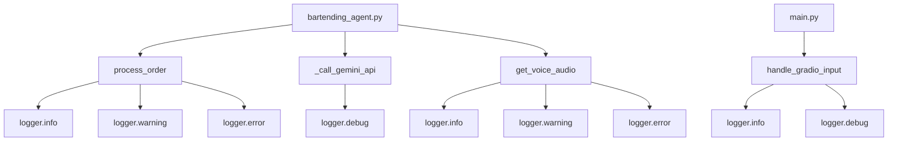
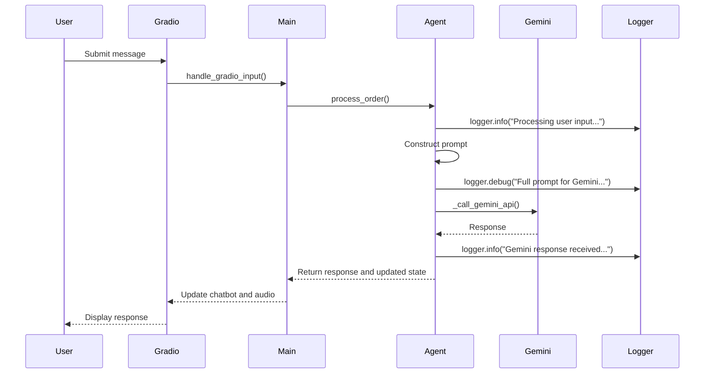
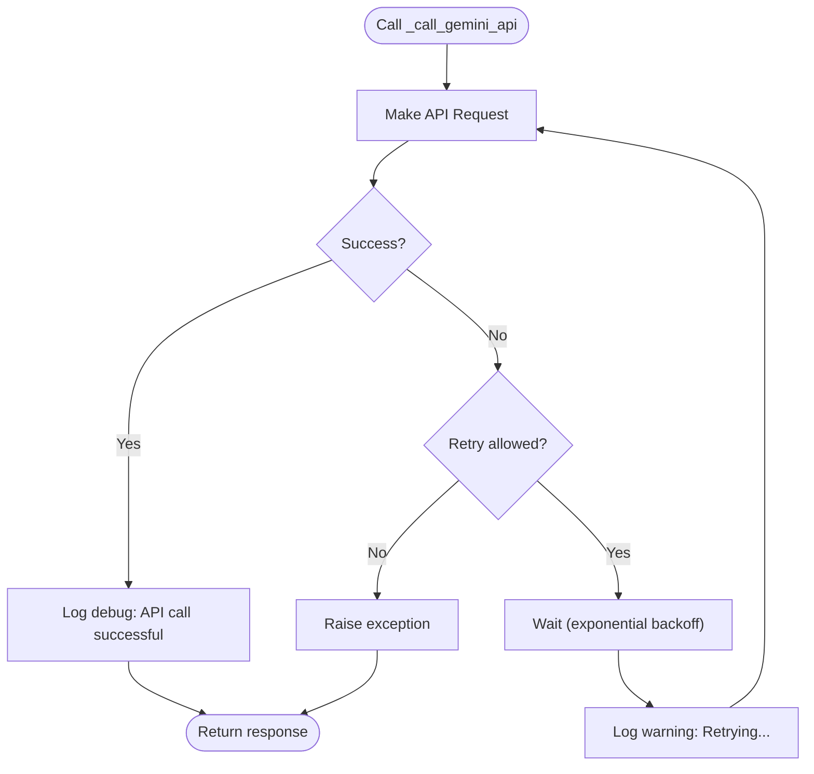
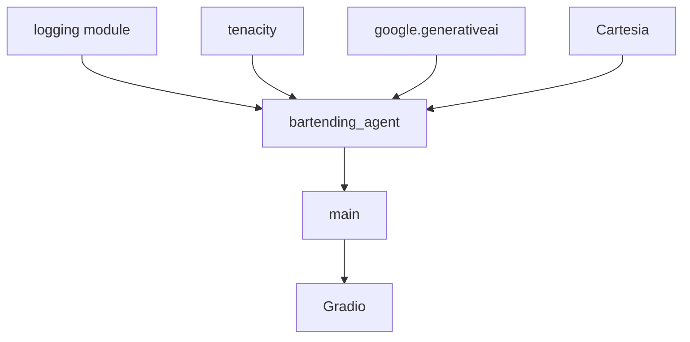

# Error Logging and Monitoring

<cite>
**Referenced Files in This Document**   
- [bartending_agent.py](file://bartending_agent.py)
- [main.py](file://main.py)
</cite>

## Table of Contents
1. [Introduction](#introduction)
2. [Project Structure](#project-structure)
3. [Core Components](#core-components)
4. [Architecture Overview](#architecture-overview)
5. [Detailed Component Analysis](#detailed-component-analysis)
6. [Dependency Analysis](#dependency-analysis)
7. [Performance Considerations](#performance-considerations)
8. [Troubleshooting Guide](#troubleshooting-guide)
9. [Conclusion](#conclusion)

## Introduction
This document provides a comprehensive overview of the error logging and monitoring practices implemented in the bartending agent system. The agent leverages Python’s built-in `logging` module to capture operational events, errors, and debugging information. The logging framework is structured to support traceability, debugging, and runtime monitoring across key functions such as API interactions, order processing, and text-to-speech synthesis. This documentation details the configuration, usage patterns, log levels, contextual logging, and best practices observed in the codebase.

## Project Structure
The project is organized into a modular structure with distinct components for core logic, user interface, and configuration. The primary files involved in logging and monitoring are `bartending_agent.py`, which contains the core agent logic and logging setup, and `main.py`, which initializes the Gradio-based UI and inherits logging configurations.



**Diagram sources**
- [bartending_agent.py](file://bartending_agent.py#L69-L73)
- [main.py](file://main.py#L5-L6)

**Section sources**
- [bartending_agent.py](file://bartending_agent.py#L1-L374)
- [main.py](file://main.py#L1-L142)

## Core Components
The core components responsible for logging include the `process_order` function, which handles user input and state management, the `_call_gemini_api` function for interacting with the Gemini LLM, and the `get_voice_audio` function for TTS synthesis via Cartesia. Each component uses structured logging to capture relevant operational and error events.

**Section sources**
- [bartending_agent.py](file://bartending_agent.py#L167-L299)
- [bartending_agent.py](file://bartending_agent.py#L154-L164)
- [bartending_agent.py](file://bartending_agent.py#L316-L367)

## Architecture Overview
The system follows a stateless, function-driven architecture where session state is passed explicitly between components. Logging is centralized using Python’s `logging` module, configured at the module level with a consistent format that includes timestamps, logger names, log levels, and messages. The architecture supports debugging through detailed trace logs and error recovery via retry mechanisms.

```mermaid
graph TB
User[User Input] --> Gradio[Gradio UI]
Gradio --> Main[main.py]
Main --> Agent[bartending_agent.py]
Agent --> Gemini[Gemini API]
Agent --> Cartesia[Cartesia TTS]
Gemini --> Logger[(Logger)]
Cartesia --> Logger
Agent --> Logger
Logger --> Console[Console Output]
Logger --> File[Log File (if configured)]
```

**Diagram sources**
- [bartending_agent.py](file://bartending_agent.py#L69-L73)
- [main.py](file://main.py#L5-L6)

## Detailed Component Analysis

### process_order Function Analysis
The `process_order` function is the central logic handler for user interactions. It uses contextual logging to record input parameters, constructed prompts, API responses, and internal state changes.

#### Logging Examples in process_order
```python
logger.info(f"Processing user input for session: {user_input_text}")
logger.debug(f"Full prompt for Gemini:\n------\n{full_prompt}\n------")
logger.warning("Received empty user input.")
logger.error("Gemini response has no candidates.")
logger.info(f"Heuristic: Added '{item['name']}' to session order.")
```

These logs provide a chronological trace of the interaction flow, enabling developers to reconstruct the agent’s behavior during debugging.

#### Sequence Diagram for process_order Flow


**Diagram sources**
- [bartending_agent.py](file://bartending_agent.py#L167-L299)
- [main.py](file://main.py#L45-L65)

**Section sources**
- [bartending_agent.py](file://bartending_agent.py#L167-L299)

### _call_gemini_api Function Analysis
This internal function wraps the Gemini API call with retry logic using the `tenacity` library and includes debug-level logging for request/response tracking.

#### Logging in _call_gemini_api
```python
logger.debug("Calling Gemini API...")
logger.debug("Gemini API call successful.")
```

These debug messages help verify API connectivity and response timing during development and troubleshooting.

#### Retry and Logging Interaction
The function uses `before_sleep_log(logger, logging.WARNING)` to emit a warning if a retry is triggered, providing visibility into transient failures.



**Diagram sources**
- [bartending_agent.py](file://bartending_agent.py#L154-L164)

**Section sources**
- [bartending_agent.py](file://bartending_agent.py#L151-L164)

### get_voice_audio Function Analysis
This function handles TTS synthesis using the Cartesia API and includes logging for request initiation, pronunciation adjustments, and error conditions.

#### Logging Examples
```python
logger.info(f"Requesting TTS from Cartesia (Voice ID: {CARTESIA_VOICE_ID}) for: '{text_for_tts[:50]}...'")
logger.warning("get_voice_audio received empty text.")
logger.error("Cartesia client or voice ID not initialized, cannot generate audio.")
```

These logs help diagnose issues related to audio generation, such as invalid voice IDs or empty input.

**Section sources**
- [bartending_agent.py](file://bartending_agent.py#L316-L367)

## Dependency Analysis
The logging system depends on Python’s standard `logging` module and is integrated with third-party libraries such as `tenacity` for retry logging and `google-generativeai` for API interaction logging. No circular dependencies exist, and all logging calls are stateless and thread-safe.



**Diagram sources**
- [bartending_agent.py](file://bartending_agent.py#L1-L374)
- [main.py](file://main.py#L1-L142)

## Performance Considerations
Logging is configured at the `INFO` level by default, minimizing overhead in production. Debug logs are available for detailed tracing but should be enabled selectively. The use of structured formatting ensures log consistency without sacrificing performance. Sensitive data such as API keys are not logged, adhering to security best practices.

## Troubleshooting Guide
This section provides guidance on interpreting logs to diagnose common issues.

### Common Log Patterns and Interpretations
- **"GEMINI_API_KEY not found"**: Indicates missing environment variable or `.env` file.
- **"Prompt Blocked"**: The LLM refused to respond due to safety filters.
- **"Response truncated due to max_tokens"**: The response exceeded the token limit; consider increasing `max_output_tokens`.
- **"Failed to get audio data"**: TTS synthesis failed; check Cartesia API key and voice ID.
- **"Critical error in process_order"**: An unhandled exception occurred; check stack trace for root cause.

### Best Practices for Log Hygiene
- Never log sensitive information (API keys, user credentials).
- Use `logger.exception()` within `except` blocks to capture full stack traces.
- Use `logger.debug()` for verbose internal state, `logger.info()` for milestones, `logger.warning()` for recoverable issues, and `logger.error()` for failures.
- Ensure all log messages are clear, concise, and actionable.

**Section sources**
- [bartending_agent.py](file://bartending_agent.py#L70-L73)
- [bartending_agent.py](file://bartending_agent.py#L151-L152)
- [bartending_agent.py](file://bartending_agent.py#L316-L317)

## Conclusion
The bartending agent employs a robust and structured logging strategy that enhances observability, supports debugging, and facilitates monitoring. By leveraging Python’s `logging` module with consistent formatting and appropriate log levels, the system provides detailed insights into its operation while maintaining performance and security. Developers can use the logs to effectively diagnose issues, understand user interactions, and ensure reliable operation.