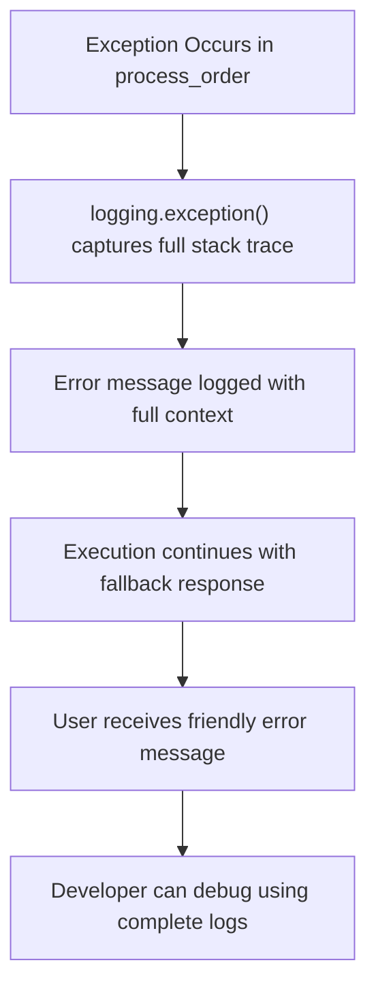
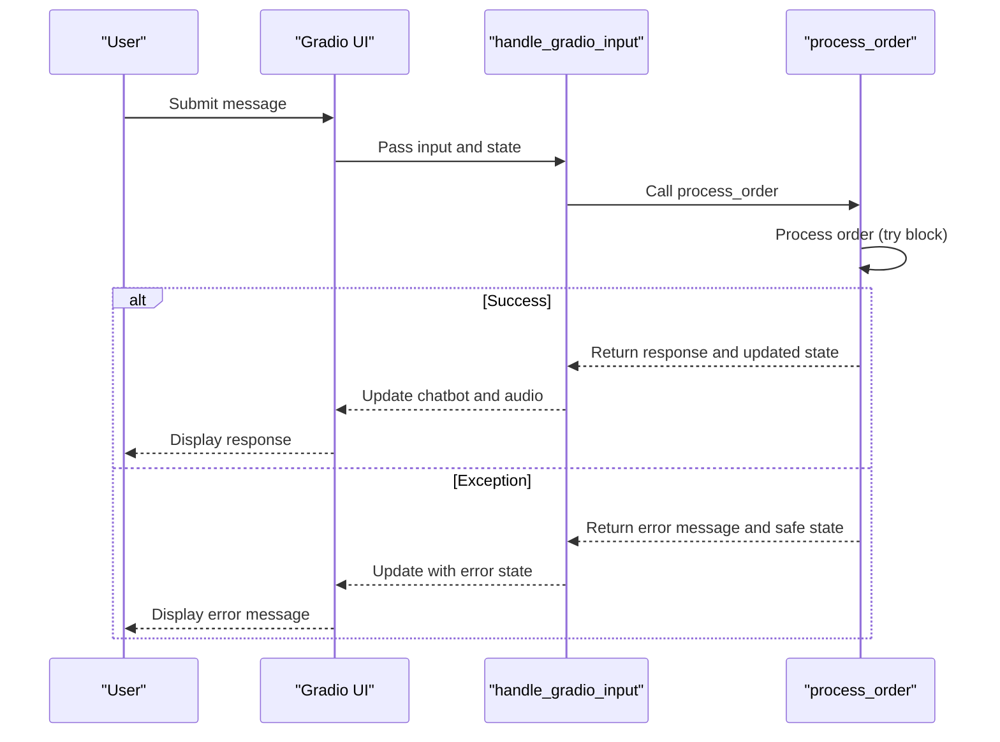

# Exception Handling Patterns

<cite>
**Referenced Files in This Document**   
- [bartending_agent.py](file://bartending_agent.py)
- [main.py](file://main.py)
</cite>

## Table of Contents
1. [Introduction](#introduction)
2. [Exception Handling in process_order Function](#exception-handling-in-process_order-function)
3. [Logging Strategy and Debuggability](#logging-strategy-and-debuggability)
4. [Fallback Response Mechanism](#fallback-response-mechanism)
5. [Safe State Management and History Preservation](#safe-state-management-and-history-preservation)
6. [Integration with Gradio State Management](#integration-with-gradio-state-management)
7. [Conclusion](#conclusion)

## Introduction
This document provides a comprehensive analysis of the exception handling patterns implemented in the bartending agent system. The focus is on how the application maintains robustness and user experience continuity in the face of unexpected errors, particularly within the core `process_order` function. The analysis covers error containment strategies, logging practices, fallback mechanisms, and integration with the Gradio UI framework's state management system.

## Exception Handling in process_order Function

The `process_order` function in `bartending_agent.py` implements a broad try-except block as its primary error containment mechanism. This design ensures that any unhandled exceptions during order processing do not interrupt the conversation flow or crash the application.

The function processes user input, constructs prompts for the Gemini LLM, handles API responses, and updates session state—all within a single try block. This comprehensive coverage allows the system to catch any unexpected errors that may occur during these operations, including:

- API communication failures
- Response parsing errors
- Data structure inconsistencies
- Unexpected LLM behavior

By wrapping the entire processing logic in a try-except block, the system prevents these potential failure points from propagating up the call stack and disrupting the user interface.

**Section sources**
- [bartending_agent.py](file://bartending_agent.py#L152-L292)

## Logging Strategy and Debuggability

The system employs `logging.exception()` as its primary error logging mechanism, which captures full stack traces while maintaining application continuity. This approach strikes a balance between robustness and debuggability.



**Diagram sources**
- [bartending_agent.py](file://bartending_agent.py#L291)

When an exception occurs, the `logger.exception()` call in the except block:
- Automatically includes the full stack trace in the log output
- Preserves the error context for debugging purposes
- Does not expose sensitive technical details to the end user
- Maintains the application's operational state

This logging strategy ensures that developers have complete information for troubleshooting while preventing technical error details from being exposed to users, maintaining a professional user experience.

**Section sources**
- [bartending_agent.py](file://bartending_agent.py#L291)

## Fallback Response Mechanism

The system implements a sophisticated fallback response strategy that returns a safe, user-friendly error message while preserving the current session state when critical failures occur.

```python
error_message = "I'm sorry, an unexpected error occurred. Please try again later."
safe_history = current_session_history[:]
safe_history.append({'role': 'user', 'content': user_input_text})
safe_history.append({'role': 'assistant', 'content': error_message})
return error_message, safe_history, current_session_order
```

The fallback mechanism:
- Uses a pre-defined, user-friendly error message stored in `agent_response_text`
- Returns a safe error message that maintains the conversational tone
- Preserves the existing order state by returning `current_session_order` unchanged
- Prevents state corruption by reverting to input parameters on failure
- Ensures the conversation can continue after the error

This approach prevents the application from entering an inconsistent state while allowing users to continue their interaction after an error occurs.

**Section sources**
- [bartending_agent.py](file://bartending_agent.py#L289-L292)

## Safe State Management and History Preservation

The exception handling system implements a "safe_history" mechanism to prevent state corruption during error conditions. This pattern ensures data integrity by reverting to known-good state parameters when failures occur.

The safe history mechanism works by:
- Creating a copy of the original `current_session_history` rather than modifying it directly
- Only appending the user input and error message to this copy
- Returning the original, unmodified order state (`current_session_order`)
- Preventing any partial or corrupted state updates from being persisted

This approach follows the principle of "fail-safe" state management, where the system defaults to preserving existing state rather than attempting to update it during error conditions. The use of list slicing (`[:]`) to create copies ensures that the original state objects are not modified, preventing unintended side effects.

**Section sources**
- [bartending_agent.py](file://bartending_agent.py#L289-L292)

## Integration with Gradio State Management

The exception handling system is designed to work seamlessly with Gradio's state management architecture, ensuring UI consistency even when errors occur.



**Diagram sources**
- [bartending_agent.py](file://bartending_agent.py#L152-L292)
- [main.py](file://main.py#L30-L55)

The integration works as follows:
- The `handle_gradio_input` function in `main.py` calls `process_order` and handles its return values
- When `process_order` returns an error response, the handler still returns valid state updates
- The Gradio components receive consistent data structures regardless of success or failure
- The UI updates with the error message while maintaining all other state
- The audio component gracefully handles None values when TTS fails

This tight integration ensures that the user interface remains responsive and consistent, even when backend processing encounters errors.

**Section sources**
- [main.py](file://main.py#L30-L55)
- [bartending_agent.py](file://bartending_agent.py#L152-L292)

## Conclusion
The bartending agent implements a robust exception handling system that prioritizes user experience continuity while maintaining debuggability. The broad try-except block in `process_order` acts as a safety net for unexpected errors, while `logging.exception()` provides complete diagnostic information without exposing it to users. The fallback response strategy returns user-friendly messages and preserves session state, and the safe history mechanism prevents state corruption. These patterns work together to create a resilient system that can recover gracefully from errors while maintaining integration with the Gradio UI framework's state management system.