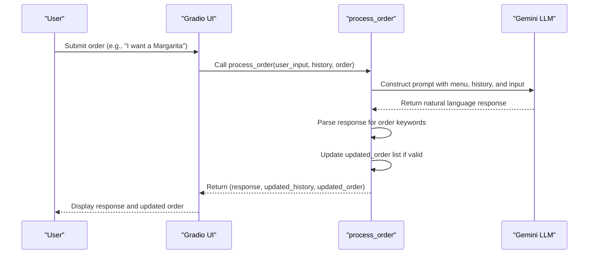

# Order State Tracking

<cite>
**Referenced Files in This Document**   
- [bartending_agent.py](file://bartending_agent.py)
- [main.py](file://main.py)
</cite>

## Table of Contents
1. [Introduction](#introduction)
2. [Order State Data Structure](#order-state-data-structure)
3. [Data Flow from Input to State Mutation](#data-flow-from-input-to-state-mutation)
4. [Order Validation and Menu Integration](#order-validation-and-menu-integration)
5. [Error Handling and Duplicate Prevention](#error-handling-and-duplicate-prevention)
6. [Usage of Order State: Billing and Confirmation](#usage-of-order-state-billing-and-confirmation)
7. [Challenges in Multi-User and Rapid Input Scenarios](#challenges-in-multi-user-and-rapid-input-scenarios)
8. [Extending the Order Model](#extending-the-order-model)
9. [Debugging Tips and Lifecycle Tracking](#debugging-tips-and-lifecycle-tracking)
10. [Conclusion](#conclusion)

## Introduction
The Order State Tracking system in the Maya Bartending Agent manages customer drink orders through a session-based, stateless architecture. Orders are represented as a list of dictionaries, each capturing essential drink attributes such as name, price, and quantity (implied). The system leverages natural language processing via the Gemini LLM to parse user inputs, validate against a predefined menu, and update the order state accordingly. This document details the implementation, data flow, error handling, and extensibility of the order tracking mechanism.

**Section sources**
- [bartending_agent.py](file://bartending_agent.py#L170-L299)
- [main.py](file://main.py#L34-L63)

## Order State Data Structure
The order state is maintained as a list of dictionaries, where each dictionary represents a single drink item. Each item contains the following keys:
- **name**: The full name of the drink (e.g., "Margarita")
- **price**: The cost of the drink as a float (e.g., 10.00)

This structure is defined and used within the `process_order` function in `bartending_agent.py`. The order list is passed as `current_session_order` and returned as `updated_order`, ensuring state immutability by creating local copies via slicing (`[:]`).

Example of order state:
```python
[
    {"name": "Margarita", "price": 10.00},
    {"name": "Old Fashioned", "price": 12.00}
]
```

The total bill can be computed by summing the `price` values across all items.

**Section sources**
- [bartending_agent.py](file://bartending_agent.py#L186-L202)

## Data Flow from Input to State Mutation
The data flow begins when a user submits a text input through the Gradio interface. The `handle_gradio_input` function in `main.py` captures this input along with the current session's history and order state.



**Diagram sources**
- [main.py](file://main.py#L44-L63)
- [bartending_agent.py](file://bartending_agent.py#L170-L299)

**Section sources**
- [main.py](file://main.py#L44-L63)
- [bartending_agent.py](file://bartending_agent.py#L170-L299)

## Order Validation and Menu Integration
Orders are validated against a static menu dictionary defined in `bartending_agent.py`. The menu maps drink IDs to their names and prices. During processing, the agent constructs a prompt that includes the full menu text via `get_menu_text()`, ensuring the LLM is aware of available options.

If a user requests an item not on the menu, the LLM is instructed to respond politely and re-display the menu. The validation is implicit through the LLM's understanding rather than explicit code-level checks.

The prompt construction includes:
- The full menu
- Current order status
- Conversation history
- User's latest input

This context enables the LLM to make informed decisions about order validity.

**Section sources**
- [bartending_agent.py](file://bartending_agent.py#L190-L202)

## Error Handling and Duplicate Prevention
The system includes robust error handling at multiple levels:
- Empty input is rejected with a prompt to order.
- LLM response failures (e.g., safety blocks, empty candidates) trigger fallback messages.
- Exceptions in `process_order` are caught, and a safe response is returned without corrupting state.

Duplicate orders are prevented heuristically: before adding a drink, the system checks if the last item in `updated_order` has the same name. This avoids immediate duplicates but does not prevent non-consecutive repeats.

```python
if not updated_order or item["name"] != updated_order[-1]["name"]:
    updated_order.append(item)
```

This logic resides in the heuristic parsing section of `process_order`.

**Section sources**
- [bartending_agent.py](file://bartending_agent.py#L275-L276)

## Usage of Order State: Billing and Confirmation
The order state is used to:
- Display the current order in the chat history
- Calculate the total bill by summing item prices
- Allow users to request "show my order" for confirmation

The current order is included in the LLM prompt under "Current order:", enabling the agent to generate accurate summaries. The Gradio interface reflects the order state in the chatbot display, providing visual confirmation.

Billing is computed dynamically during response generation, not stored separately.

**Section sources**
- [bartending_agent.py](file://bartending_agent.py#L201-L202)

## Challenges in Multi-User and Rapid Input Scenarios
Although the current implementation is session-based (via Gradio's `gr.State`), it assumes single-user sessions. In a multi-user environment:
- Concurrent modifications could lead to race conditions if state is shared.
- Rapid inputs might overwhelm the LLM API rate limits.
- Session isolation must be enforced to prevent order leakage.

The use of stateless functions (`process_order`) with explicit state passing mitigates some risks, but external session management would be required for scalability.

No explicit throttling or concurrency control is implemented.

**Section sources**
- [main.py](file://main.py#L34-L63)

## Extending the Order Model
The order model can be extended by adding new fields to the drink dictionaries. For example:
- **customizations**: e.g., `{"extra_ice": True, "no_salt": True}`
- **allergens**: list of allergens to flag
- **priority**: integer flag for rush orders
- **notes**: free-text preparation instructions

To implement:
1. Modify the menu items to include default values for new fields.
2. Update the LLM prompt to extract these from user input.
3. Adjust the heuristic parser to populate new fields based on response text.

Example extended structure:
```python
{
    "name": "Mojito",
    "price": 11.00,
    "customizations": ["extra_mint", "less_sugar"],
    "allergens": [],
    "notes": "Muddle gently"
}
```

**Section sources**
- [bartending_agent.py](file://bartending_agent.py#L150-L165)

## Debugging Tips and Lifecycle Tracking
Key debugging strategies:
- Enable logging (`logging.INFO`) to trace input processing and API calls.
- Monitor `full_prompt` output to verify context sent to LLM.
- Check `updated_order` mutations in `process_order`.
- Use `logger.debug()` to inspect session state at entry and exit.

Common issues:
- **Empty responses**: Check API keys and network connectivity.
- **Incorrect order updates**: Review LLM response parsing logic.
- **Voice synthesis failure**: Validate Cartesia API key and voice ID.

Ensure `.env` file contains valid `GEMINI_API_KEY` and `CARTESIA_API_KEY`.

**Section sources**
- [bartending_agent.py](file://bartending_agent.py#L250-L260)

## Conclusion
The Order State Tracking system effectively manages drink orders using a session-based, LLM-driven approach. By maintaining order state as a list of dictionaries and leveraging natural language understanding, the system provides a flexible and conversational interface. While currently designed for single-user sessions, the stateless function design allows for potential scaling with proper session management. Future enhancements can include richer order metadata and improved duplicate handling.