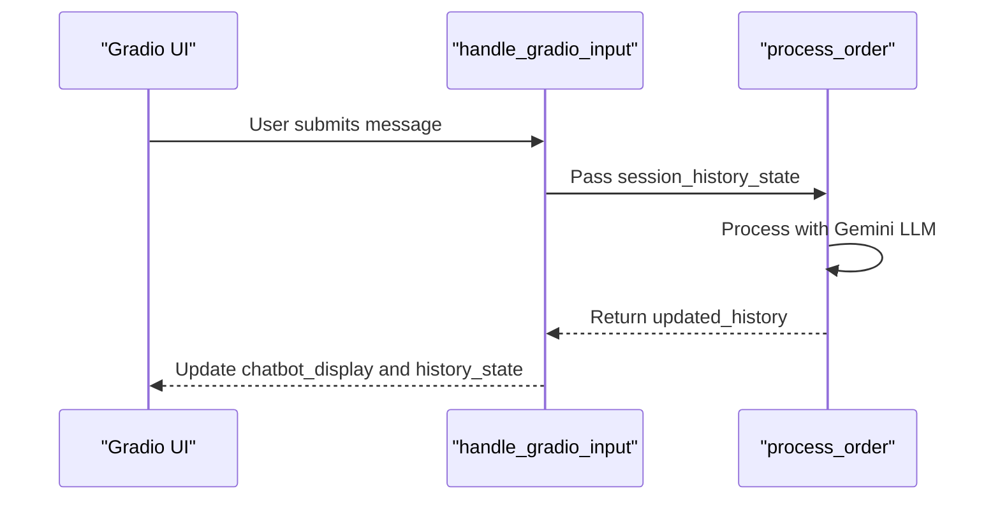
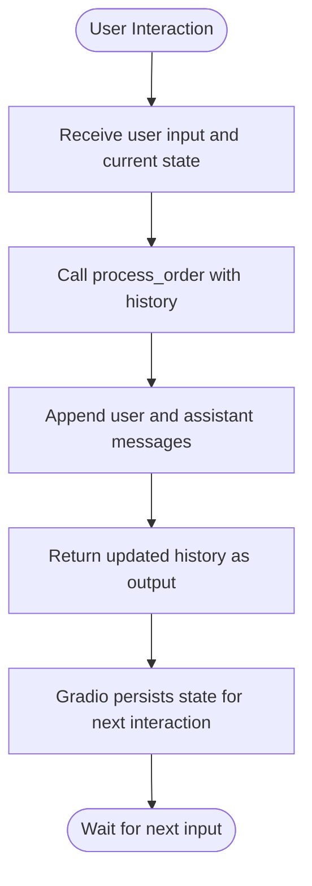

# Session History Management

<cite>
**Referenced Files in This Document**   
- [main.py](file://main.py#L33-L142)
- [bartending_agent.py](file://bartending_agent.py#L200-L350)
</cite>

## Table of Contents
1. [Introduction](#introduction)
2. [Session History Data Structure](#session-history-data-structure)
3. [History Flow Between UI and Backend](#history-flow-between-ui-and-backend)
4. [Context Preservation in LLM Prompts](#context-preservation-in-llm-prompts)
5. [State Management in Gradio](#state-management-in-gradio)
6. [History Truncation and Token Limit Handling](#history-truncation-and-token-limit-handling)
7. [Best Practices for Debugging and Logging](#best-practices-for-debugging-and-logging)
8. [Performance Considerations for Long Conversations](#performance-considerations-for-long-conversations)

## Introduction
This document provides a comprehensive analysis of the session history management system in the Maya Bartending Agent application. It details how conversation context is preserved across user interactions using a structured message history, passed between the Gradio frontend and backend processing logic. The system enables contextual continuity for the Gemini LLM by maintaining a chronological record of user and assistant messages, ensuring coherent multi-turn conversations.

## Session History Data Structure
The session history is implemented as a list of dictionaries, where each dictionary represents a single message in the conversation. Each message contains two key fields:

**Message Structure**
- `role`: Specifies the participant ("user" or "assistant")
- `content`: Contains the actual text of the message

This structure aligns with standard chat-based LLM input formats and enables clear separation of conversational turns.

```python
[
    {"role": "user", "content": "I'd like a Margarita"},
    {"role": "assistant", "content": "Coming right up! Would you like it with salt?"}
]
```

The history list maintains temporal order, with messages appended sequentially as the conversation progresses. This structure is used both in the Gradio UI state and when constructing prompts for the Gemini LLM.

**Section sources**
- [main.py](file://main.py#L33-L40)
- [bartending_agent.py](file://bartending_agent.py#L300-L310)

## History Flow Between UI and Backend
The session history flows through a well-defined pipeline between the Gradio interface and the backend processing functions. This flow ensures that conversational context is preserved across interactions.



**Diagram sources**
- [main.py](file://main.py#L33-L55)
- [bartending_agent.py](file://bartending_agent.py#L200-L350)

The process begins when a user submits a message through the Gradio interface. The `handle_gradio_input` callback receives the current `session_history_state` as input, which is then passed to the `process_order` function in `bartending_agent.py`. After processing, the updated history is returned through the callback chain and used to update both the chat display and the persistent state.

**Section sources**
- [main.py](file://main.py#L33-L55)
- [bartending_agent.py](file://bartending_agent.py#L200-L350)

## Context Preservation in LLM Prompts
The session history plays a critical role in providing contextual awareness to the Gemini LLM. When generating responses, the system constructs a prompt that includes a limited window of recent conversation history.

```python
# In bartending_agent.py
history_limit = 10
limited_history_for_prompt = updated_history[-history_limit:]
```

The system extracts the last 10 message pairs (20 individual messages) from the full history and formats them into the prompt. This approach balances context richness with token efficiency, preventing prompt overflow while maintaining conversational coherence.

The prompt construction follows this pattern:
1. System instructions and role definition
2. Current menu information
3. Current order status
4. Limited conversation history
5. Current user input
6. Response prefix ("Bartender:")

This structured prompt enables the LLM to generate contextually appropriate responses based on the conversation flow.

**Section sources**
- [bartending_agent.py](file://bartending_agent.py#L280-L310)

## State Management in Gradio
Gradio's state management system is leveraged to maintain session persistence in an otherwise stateless web environment. The application uses `gr.State` components to store and pass session data between interactions.

```python
# In main.py
history_state = gr.State([])
order_state = gr.State([])
```

The state management pattern follows these principles:
- **Initialization**: Empty lists are used as initial state values
- **Passing**: State variables are included in both function inputs and outputs
- **Persistence**: Gradio automatically manages the state between interactions
- **Clearing**: A dedicated `clear_chat_state` function resets all state variables

This implementation ensures that each user session maintains its own conversation history without interference from other sessions.



**Diagram sources**
- [main.py](file://main.py#L80-L95)
- [main.py](file://main.py#L110-L125)

**Section sources**
- [main.py](file://main.py#L80-L125)

## History Truncation and Token Limit Handling
To manage computational constraints and prevent token limit exceedances, the system implements strategic history truncation. While the full session history is stored in memory, only a subset is used for LLM prompting.

**Truncation Parameters**
- `history_limit`: Number of recent message pairs to include (set to 10)
- `limited_history_for_prompt`: The sliced history window used in prompts

The truncation occurs during prompt construction, not in the stored state. This means:
- Full history is preserved for UI display
- Only recent context is sent to the LLM
- Users can view complete conversation history
- Token usage is optimized for LLM processing

Additionally, the system handles response truncation from the LLM:
- Monitors `finish_reason` for "MAX_TOKENS"
- Appends truncation indicator ("... (response truncated)")
- Logs warnings for diagnostic purposes

This dual-layer approach ensures both user experience quality and system reliability.

**Section sources**
- [bartending_agent.py](file://bartending_agent.py#L330-L350)

## Best Practices for Debugging and Logging
The application implements comprehensive logging to facilitate debugging and monitoring of session history management.

**Logging Implementation**
```python
logger.debug(f"Received session history state (len {len(session_history_state)}): {session_history_state}")
logger.info(f"Full prompt for Gemini:\n------\n{full_prompt}\n------")
```

Key logging practices include:
- **Debug-level logging**: Detailed history state inspection
- **Info-level logging**: Key processing milestones
- **Error-level logging**: Exception tracking with stack traces
- **Structured messages**: Clear, descriptive log entries

For debugging conversation flows, developers can:
1. Enable debug logging to see complete history state
2. Monitor prompt construction for context accuracy
3. Track message append operations for integrity
4. Verify state persistence across interactions

The logging system provides visibility into the history management pipeline, enabling rapid diagnosis of context-related issues.

**Section sources**
- [main.py](file://main.py#L40-L41)
- [bartending_agent.py](file://bartending_agent.py#L270-L275)

## Performance Considerations for Long Conversations
While the current implementation effectively handles typical conversation lengths, extended sessions may present performance considerations.

**Potential Issues**
- **Memory usage**: Long histories consume increasing memory
- **Processing latency**: Larger prompts require more LLM processing time
- **Network overhead**: Large state transfers between client and server
- **UI rendering**: Long chat histories may impact display performance

**Mitigation Strategies**
1. **History summarization**: Implement periodic summarization of early conversation turns
2. **State compression**: Store only essential context after certain thresholds
3. **Session segmentation**: Automatically start new sessions after duration or message count limits
4. **Asynchronous processing**: Offload history management to background tasks

The current 10-pair history window provides a good balance between context preservation and performance. For applications requiring longer-term context, implementing a summarization strategy would be recommended, where earlier conversation segments are condensed into summary statements while preserving key decisions and order information.

**Section sources**
- [bartending_agent.py](file://bartending_agent.py#L280-L290)
- [main.py](file://main.py#L80-L85)