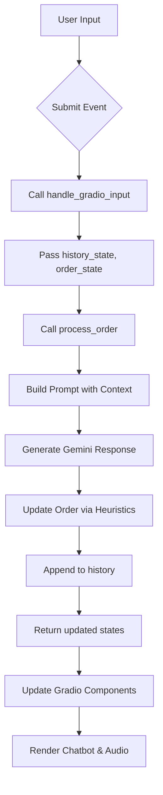

# State Management

<cite>
**Referenced Files in This Document**   
- [main.py](file://main.py#L31-L142)
- [bartending_agent.py](file://bartending_agent.py#L200-L374)
</cite>

## Table of Contents
1. [Introduction](#introduction)
2. [Session History and Order State Structure](#session-history-and-order-state-structure)
3. [Stateless Design Pattern](#stateless-design-pattern)
4. [Data Flow from Input to State Mutation](#data-flow-from-input-to-state-mutation)
5. [Gradio State Management Implementation](#gradio-state-management-implementation)
6. [Challenges in Context Coherence and State Integrity](#challenges-in-context-coherence-and-state-integrity)
7. [Best Practices for Extending the State Model](#best-practices-for-extending-the-state-model)

## Introduction
This document provides a comprehensive analysis of the state management system in the MayaBartendingAgent project. It focuses on how conversation history and order state are maintained, passed between components, and updated across user interactions. The system uses a stateless design pattern where all context is explicitly managed through function parameters and Gradio’s session state mechanism, avoiding reliance on global variables. This approach ensures scalability, testability, and resilience against state corruption.

**Section sources**
- [main.py](file://main.py#L1-L142)
- [bartending_agent.py](file://bartending_agent.py#L1-L374)

## Session History and Order State Structure

The application maintains two primary state structures: session history and session order. These are implemented as lists of dictionaries and are passed between the frontend (Gradio UI) and backend logic functions.

### Session History
The `session_history_state` is a list of message dictionaries, each containing:
- **role**: `"user"` or `"assistant"`
- **content**: The text of the message

This structure aligns with common LLM interaction patterns and is used to preserve conversational context for the Gemini model.

### Order State
The `session_order_state` tracks drink selections and is a list of dictionaries with:
- **name**: Drink name (e.g., "Margarita")
- **price**: Float value representing cost

Each item added to the order is appended as a new dictionary, preserving selection order and enabling accurate price summation.

```python
# Example of session_order_state after two drinks ordered
[
    {"name": "Margarita", "price": 10.00},
    {"name": "Old Fashioned", "price": 12.00}
]
```

**Section sources**
- [main.py](file://main.py#L80-L81)
- [bartending_agent.py](file://bartending_agent.py#L200-L374)

## Stateless Design Pattern

The system follows a strict stateless architecture where no global state is used to store session data. Instead, all context is explicitly passed as function parameters and returned as updated values.

### Key Characteristics:
- **No global history/order variables** in `bartending_agent.py`
- All state is managed externally via Gradio’s `gr.State()`
- Functions like `process_order()` accept current state and return updated versions
- The backend logic module does not retain any session-specific data between calls

This design ensures that each function call is self-contained, making the system:
- **Predictable**: Output depends only on inputs
- **Testable**: Easy to simulate different states
- **Scalable**: No shared mutable state across requests

```python
def process_order(
    user_input_text: str,
    current_session_history: List[Dict[str, str]],
    current_session_order: List[Dict[str, float]]
) -> Tuple[str, List[Dict[str, str]], List[Dict[str, float]]]:
    # Function logic here
    return agent_response_text, updated_history, updated_order
```

**Section sources**
- [bartending_agent.py](file://bartending_agent.py#L200-L374)

## Data Flow from Input to State Mutation

The data flow begins with user input and progresses through processing stages to final state updates.

### Step-by-Step Flow:
1. **User Input**: Text entered in Gradio textbox
2. **Event Trigger**: `msg_input.submit` or `submit_btn.click`
3. **State Injection**: Current `history_state` and `order_state` passed to `handle_gradio_input`
4. **Processing**: `process_order()` called with user input and current state
5. **LLM Prompt Construction**: History and order used to build context-aware prompt
6. **Response Generation**: Gemini returns natural language response
7. **Order Heuristic Update**: Response scanned for drink additions
8. **State Return**: Updated history and order returned to Gradio
9. **UI Update**: Chatbot, audio, and internal states refreshed



**Diagram sources**
- [main.py](file://main.py#L31-L70)
- [bartending_agent.py](file://bartending_agent.py#L200-L374)

## Gradio State Management Implementation

Gradio’s `gr.State()` component is used to persist session data across interactions without relying on server-side global variables.

### State Initialization
```python
history_state = gr.State([])
order_state = gr.State([])
```

These state components are included in both input and output lists of event handlers, ensuring they are updated and returned on each interaction.

### Callback Signature
```python
def handle_gradio_input(
    user_input: str,
    session_history_state: List[Dict[str, str]],
    session_order_state: List[Dict[str, float]]
) -> Tuple[str, List[Dict[str, str]], List[Dict[str, str]], List[Dict[str, float]], Any]:
```

The function returns updated versions of all stateful components, which Gradio automatically binds back to their respective state variables.

### Clear State Function
```python
def clear_chat_state() -> Tuple[List, List, List, None]:
    return [], [], [], None
```

This resets all session data, providing a clean slate for new conversations.

**Section sources**
- [main.py](file://main.py#L31-L142)

## Challenges in Context Coherence and State Integrity

Despite its benefits, this state management approach presents several challenges.

### Context Window Limitation
The full conversation history is truncated before being sent to Gemini:
```python
limited_history_for_prompt = updated_history[-history_limit:]
```
While this prevents exceeding token limits, it risks losing long-term context. Users may reference earlier parts of the conversation that are no longer visible to the model.

### Heuristic-Based Order Updates
The system uses keyword matching to detect drink additions:
```python
if item_name_lower in response_lower and \
   any(add_word in response_lower for add_word in ["added", "adding", ...]):
```
This approach is fragile and may fail with paraphrased responses or miss items if the model doesn't use expected trigger words.

### Risk of State Corruption
Although rare, exceptions during processing could lead to inconsistent state. The current error handling returns safe fallbacks but doesn't validate state integrity before returning.

### Mitigation Strategies
- Implement structured output parsing from LLM responses
- Add explicit order confirmation steps
- Validate state consistency before returning
- Use checksums or versioning for critical state transitions

**Section sources**
- [bartending_agent.py](file://bartending_agent.py#L200-L374)

## Best Practices for Extending the State Model

To safely extend the state model with new attributes like customer preferences or loyalty points, follow these guidelines.

### 1. Maintain Backward Compatibility
Ensure new state fields have safe defaults:
```python
# In initial state
gr.State([{"preferences": {}, "loyalty_points": 0}])
```

### 2. Use Structured State Objects
Instead of flat dictionaries, consider typed state containers:
```python
from typing import TypedDict

class CustomerState(TypedDict):
    history: List[Dict[str, str]]
    order: List[Dict[str, float]]
    preferences: Dict[str, str]
    loyalty_points: int
    session_id: str
```

### 3. Isolate State Transformation Logic
Create dedicated functions for state updates:
```python
def update_customer_preferences(current_state, new_prefs):
    updated = current_state.copy()
    updated['preferences'].update(new_prefs)
    return updated
```

### 4. Validate State Transitions
Add validation before returning updated state:
```python
def validate_order_state(order_list):
    return all('name' in item and 'price' in item for item in order_list)
```

### 5. Document State Schema
Maintain clear documentation of the state structure:
```python
"""
Session State Schema:
- history: List[{role, content}]
- order: List[{name, price}]
- metadata: {preferences, points, session_start}
"""
```

Following these practices ensures the state management system remains robust, maintainable, and scalable as new features are added.

**Section sources**
- [main.py](file://main.py#L31-L142)
- [bartending_agent.py](file://bartending_agent.py#L200-L374)