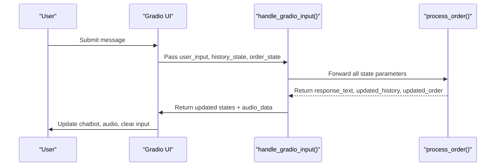
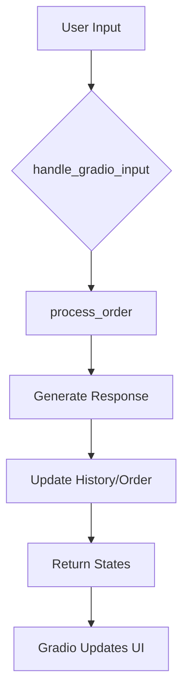

# State Persistence Patterns

<cite>
**Referenced Files in This Document**   
- [main.py](file://main.py#L31-L142)
- [bartending_agent.py](file://bartending_agent.py#L200-L374)
</cite>

## Table of Contents
1. [Introduction](#introduction)
2. [Stateless Functional Design Overview](#stateless-functional-design-overview)
3. [State Flow in Gradio Interface](#state-flow-in-gradio-interface)
4. [Core State Management Functions](#core-state-management-functions)
5. [Advantages of Stateless Architecture](#advantages-of-stateless-architecture)
6. [Comparison with Alternative State Management Approaches](#comparison-with-alternative-state-management-approaches)
7. [Common Pitfalls and Best Practices](#common-pitfalls-and-best-practices)
8. [Performance Implications](#performance-implications)

## Introduction
This document details the state persistence patterns implemented in the MayaBartendingAgent application. The system employs a stateless functional design where all session context—including conversation history, order state, and configuration—is explicitly passed between functions rather than relying on global variables or class attributes. This approach ensures predictable behavior, enhances testability, and aligns with Gradio’s event-driven execution model. The analysis focuses on how state is managed across `main.py` and `bartending_agent.py`, highlighting key implementation strategies and architectural benefits.

**Section sources**
- [main.py](file://main.py#L1-L142)
- [bartending_agent.py](file://bartending_agent.py#L1-L374)

## Stateless Functional Design Overview
The application implements a purely functional state management pattern. Instead of maintaining mutable state within class instances or global variables, all relevant context is passed as parameters to functions and returned as updated values. This design ensures that each function call is deterministic and free from side effects.

Key characteristics:
- **No shared mutable state**: All state is encapsulated in function arguments and return values.
- **Explicit data flow**: State transitions are visible in function signatures and call chains.
- **Idempotent operations**: Identical inputs always produce identical outputs and state updates.

This approach supports concurrency safety and simplifies debugging by eliminating hidden state dependencies.

**Section sources**
- [bartending_agent.py](file://bartending_agent.py#L200-L374)

## State Flow in Gradio Interface
The Gradio interface in `main.py` manages user interaction through stateful components that persist across interactions. These states are passed into backend logic functions and updated based on processing results.



**Diagram sources**
- [main.py](file://main.py#L31-L69)
- [bartending_agent.py](file://bartending_agent.py#L200-L374)

### State Initialization
In the Gradio interface, two primary state variables are initialized:

```python
history_state = gr.State([])
order_state = gr.State([])
```

These represent:
- **Conversation history**: A list of message dictionaries with `role` and `content`.
- **Current order**: A list of ordered drink items with `name` and `price`.

Both are initialized as empty lists and evolve over the session lifecycle.

**Section sources**
- [main.py](file://main.py#L80-L81)

## Core State Management Functions

### handle_gradio_input Function
This callback function serves as the entry point for user interactions in the Gradio interface.

```python
def handle_gradio_input(
    user_input: str,
    session_history_state: List[Dict[str, str]],
    session_order_state: List[Dict[str, float]]
) -> Tuple[str, List[Dict[str, str]], List[Dict[str, str]], List[Dict[str, float]], Any]:
```

**Parameters:**
- `user_input`: Current user message
- `session_history_state`: Complete conversation history
- `session_order_state`: Drinks currently in the order

**Return values:**
- Empty string (to clear input box)
- Updated chatbot display
- Updated history state
- Updated order state
- Audio data for playback

The function orchestrates text processing and TTS generation, returning all updated states for Gradio to render.

**Section sources**
- [main.py](file://main.py#L31-L69)

### process_order Function
Located in `bartending_agent.py`, this function contains the core business logic for handling orders.

```python
def process_order(
    user_input_text: str,
    current_session_history: List[Dict[str, str]],
    current_session_order: List[Dict[str, float]]
) -> Tuple[str, List[Dict[str, str]], List[Dict[str, float]]]:
```

It performs the following steps:
1. Constructs a prompt using menu, history, and current order
2. Calls the Gemini LLM to generate a response
3. Parses the response to detect drink additions
4. Updates local copies of history and order
5. Returns the response text and updated states

Crucially, it operates on **copies** of the input states, ensuring no mutation of external data.

**Section sources**
- [bartending_agent.py](file://bartending_agent.py#L200-L374)

## Advantages of Stateless Architecture

### Testability
Functions like `process_order` can be tested in isolation with mock inputs:

```python
# Example test case
history = [{'role': 'user', 'content': 'I want a Margarita'}, ...]
order = []
response, new_history, new_order = process_order("Add another Margarita", history, order)
assert len(new_order) == 2
```

No setup or teardown of global state is required.

### Concurrency Safety
Since no shared state exists, multiple user sessions can be processed simultaneously without race conditions. Each session’s state is fully contained within its call stack.

### Integration with Gradio
Gradio’s event-driven model naturally aligns with this pattern:
- Component states are automatically passed to callbacks
- Returned values update UI components deterministically
- Session isolation is maintained by the framework



**Diagram sources**
- [main.py](file://main.py#L31-L69)

## Comparison with Alternative State Management Approaches

| Approach | Pros | Cons | Suitability |
|--------|------|------|-------------|
| **Stateless Functions** | High testability, thread-safe, predictable | Larger function signatures, serialization overhead | ✅ Ideal for Gradio apps |
| **Class-Based State** | Encapsulation, shared methods | Risk of state corruption, harder to test | ⚠️ Possible but riskier |
| **External Database** | Persistent storage, shared state | Latency, complexity, overkill for session data | ❌ Unnecessary for this use case |

The chosen stateless approach optimizes for simplicity, reliability, and alignment with the serverless-friendly Gradio execution model.

## Common Pitfalls and Best Practices

### Common Pitfalls
- **Forgetting to return updated state**: If a function modifies state but doesn't return it, changes are lost.
- **Accidental mutation of input state**: Using `list.append()` directly on input lists instead of copying first.
- **Mismatched parameter ordering**: Passing history where order is expected due to similar types.

### Best Practices

**Function Signatures:**
```python
# Always include type hints
def process_order(
    user_input: str,
    history: List[Dict[str, str]],
    order: List[Dict[str, float]]
) -> Tuple[str, List[Dict[str, str]], List[Dict[str, float]]]:
```

**Defensive Programming:**
- Validate input parameters
- Use slicing (`[:]`) to create list copies
- Handle empty or null inputs gracefully

**Error Handling:**
- Wrap LLM calls in retry logic (as done with `tenacity_retry`)
- Provide fallback responses on failure
- Log state before and after processing

**Section sources**
- [bartending_agent.py](file://bartending_agent.py#L200-L374)

## Performance Implications
Passing large state objects across function boundaries incurs serialization costs, particularly when:
- Conversation history grows long
- Audio data is included in state
- Network transmission occurs (in hosted environments)

**Optimization Strategies:**
- Limit history length in prompts (currently capped at last 10 exchanges)
- Stream audio instead of buffering entirely
- Compress state when possible
- Avoid redundant data in state objects

Currently, the application maintains performance by:
- Using shallow copies of lists
- Processing only recent history
- Returning audio as bytes only when needed

For production scaling, consider:
- Client-side state storage
- Server-side session caching
- Pagination of chat history

**Section sources**
- [main.py](file://main.py#L31-L69)
- [bartending_agent.py](file://bartending_agent.py#L200-L374)