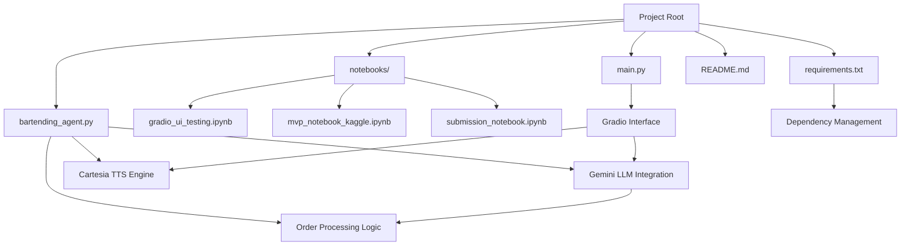
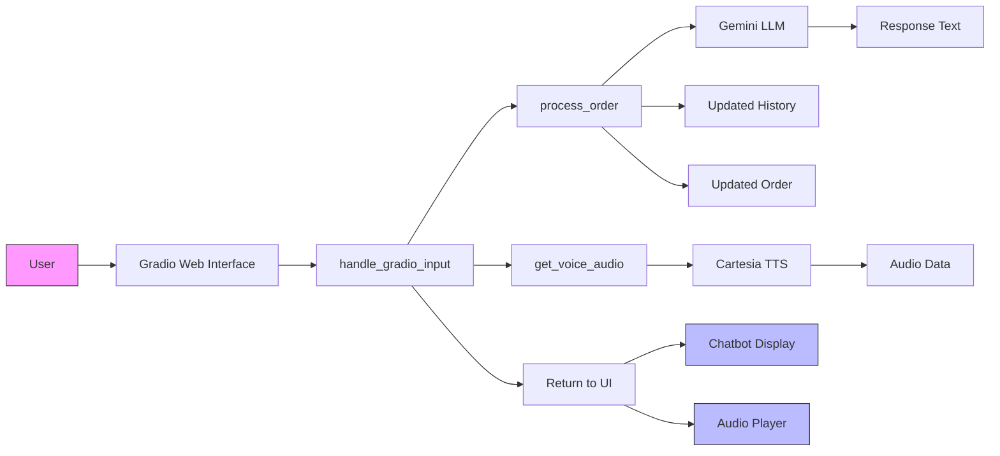
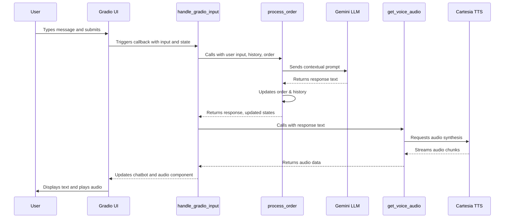
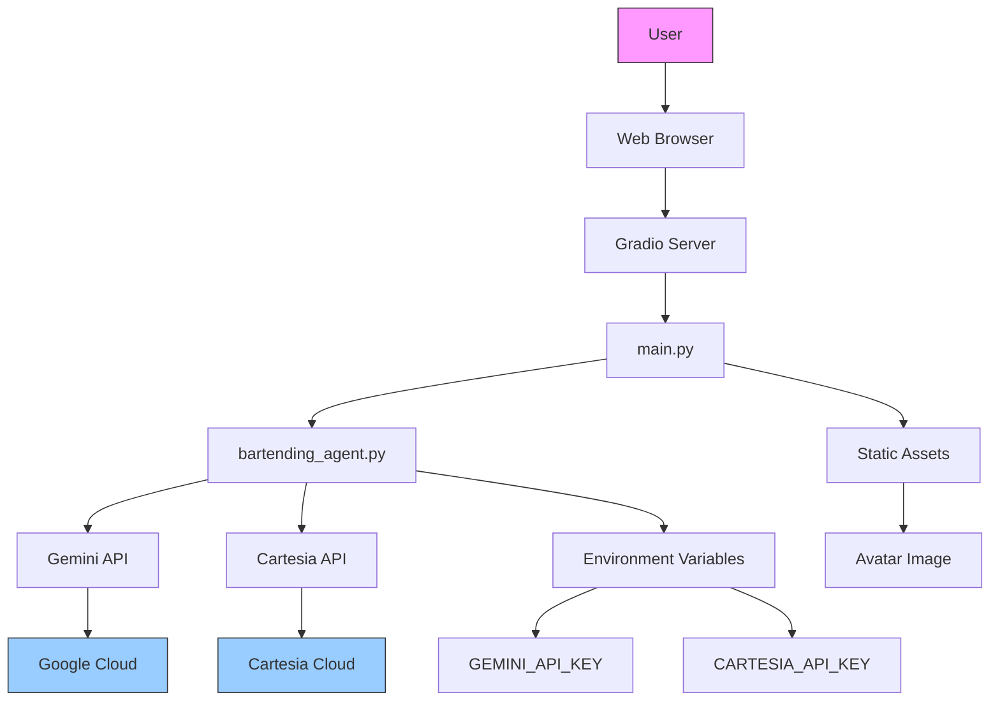

# System Overview

<cite>
**Referenced Files in This Document**   
- [main.py](file://main.py)
- [bartending_agent.py](file://bartending_agent.py)
- [requirements.txt](file://requirements.txt)
- [README.md](file://README.md)
</cite>

## Table of Contents
1. [Introduction](#introduction)
2. [Project Structure](#project-structure)
3. [Core Components](#core-components)
4. [Architecture Overview](#architecture-overview)
5. [User Interaction Flow](#user-interaction-flow)
6. [State Management and Session Handling](#state-management-and-session-handling)
7. [Error Handling and Resilience](#error-handling-and-resilience)
8. [System Context Diagram](#system-context-diagram)
9. [Primary Use Cases](#primary-use-cases)

## Introduction

The Maya Bartending Agent is an AI-powered conversational bartender system designed to simulate a realistic bar ordering experience. It enables users to interact naturally through text input, receive intelligent drink recommendations, place orders, and hear spoken responses via text-to-speech (TTS) synthesis. The system integrates advanced language models with voice generation technology to deliver a dynamic, engaging user experience.

Built primarily in Python, the application leverages the Gradio framework for the web-based frontend, Google's Gemini large language model (LLM) for natural language understanding and response generation, and the Cartesia engine for high-quality voice synthesis. This combination allows the agent to maintain context-aware conversations, manage order states, and respond with lifelike audio output.

The system is designed for three primary purposes: interactive simulation, AI demonstration, and educational use. It serves as a practical example of how modern AI components can be integrated into a cohesive, user-facing application with minimal infrastructure requirements.

**Section sources**
- [README.md](file://README.md#L1-L35)
- [main.py](file://main.py#L1-L142)
- [bartending_agent.py](file://bartending_agent.py#L1-L374)

## Project Structure

The project follows a modular structure with clear separation between frontend interface, backend logic, and configuration. The root directory contains core executable files and dependency definitions, while notebooks are used for development and testing.

Key components include:
- `main.py`: Entry point for the Gradio web application
- `bartending_agent.py`: Core logic module handling LLM interaction, order processing, and TTS
- `requirements.txt`: Lists all external dependencies required for the system
- `notebooks/`: Contains Jupyter notebooks for prototyping and testing
- `README.md`: Provides setup instructions and basic usage guidance

This organization supports both rapid development and deployment, with the main logic decoupled from the UI layer for easier maintenance and testing.

**Diagram sources**
- [main.py](file://main.py#L1-L142)
- [bartending_agent.py](file://bartending_agent.py#L1-L374)
- [requirements.txt](file://requirements.txt#L1-L9)

## Core Components

The system consists of three primary components that work together to deliver the bartending experience:

### Gradio Frontend Interface
The Gradio framework provides a simple yet powerful web interface that enables users to interact with the AI bartender. It features:
- Text input box for user messages
- Chatbot display for conversation history
- Audio output component for spoken responses
- Image display of the bartender avatar
- Clear and submit buttons for managing the session

The interface is defined in `main.py` using Gradio's Blocks API, allowing for flexible layout design and event handling.

### Gemini Large Language Model
The Gemini LLM, accessed through Google's Generative AI SDK, powers the conversational intelligence of the agent. It is responsible for:
- Understanding user intents (ordering drinks, checking menu, asking questions)
- Generating natural, contextually appropriate responses
- Maintaining conversation history awareness
- Providing drink recommendations based on user preferences
- Explaining the meaning of "MOK 5-ha" as "Moksha" when asked

The model is initialized once at module load time in `bartending_agent.py` and used throughout the session for inference.

### Cartesia Text-to-Speech Engine
The Cartesia TTS service converts the text responses from Gemini into spoken audio. Key features include:
- High-fidelity voice synthesis
- Support for custom voice IDs
- Streaming audio generation
- Pronunciation correction (e.g., "MOK 5-ha" → "Moksha")

The TTS functionality is implemented in the `get_voice_audio` function within `bartending_agent.py`, which handles API calls, error recovery, and audio data processing.

**Section sources**
- [main.py](file://main.py#L1-L142)
- [bartending_agent.py](file://bartending_agent.py#L1-L374)

## Architecture Overview

The Maya Bartending Agent follows a client-server architecture with a stateless backend design that relies on Gradio's session state management. The system processes user input through a pipeline that integrates multiple AI services while maintaining conversation context.

**Diagram sources**
- [main.py](file://main.py#L25-L142)
- [bartending_agent.py](file://bartending_agent.py#L150-L374)

## User Interaction Flow

The user interaction follows a clear sequence from input to audio response:

1. **User Input**: The user types a message in the text box and submits it via Enter or the Send button
2. **Event Handling**: Gradio triggers the `handle_gradio_input` callback function
3. **State Passing**: Current conversation history and order state are passed to the processing function
4. **Order Processing**: The `process_order` function constructs a prompt with context and sends it to Gemini
5. **LLM Response**: Gemini generates a text response based on the conversation context and menu
6. **Order Update**: The system heuristically updates the order list if a drink was ordered
7. **History Update**: Both user input and assistant response are added to the conversation history
8. **TTS Generation**: The text response is sent to Cartesia for voice synthesis
9. **Audio Return**: The generated audio data is returned to the Gradio interface
10. **UI Update**: The chatbot displays the text response and automatically plays the audio

This flow ensures a seamless experience where users receive both visual and auditory feedback for their interactions.

**Diagram sources**
- [main.py](file://main.py#L50-L142)
- [bartending_agent.py](file://bartending_agent.py#L150-L374)

## State Management and Session Handling

The system employs a stateless function design pattern where all session data is explicitly passed between components rather than stored in global variables. This approach enhances reliability and scalability while working seamlessly with Gradio's session state mechanism.

### Session State Components
The system maintains two primary state objects:
- **Conversation History**: A list of message dictionaries containing role (user/assistant) and content
- **Order State**: A list of ordered drink dictionaries containing name and price

These states are managed through Gradio's `gr.State` components in `main.py`, which preserve data across user interactions within a session.

### Stateless Function Design
All core functions in `bartending_agent.py` are designed to be stateless:
- `process_order` accepts current states as parameters and returns updated versions
- `get_voice_audio` takes only the text to synthesize and returns audio data
- No global state variables are modified directly

This design ensures that each function call is predictable and testable, with all dependencies explicitly declared.

### State Update Mechanism
When a user submits input:
1. Current state values are read from `gr.State` components
2. These values are passed to `process_order` and `get_voice_audio`
3. Updated state values are returned from the functions
4. The Gradio interface updates the `gr.State` components with new values

This creates a clean data flow where state transitions are explicit and controlled.

**Section sources**
- [main.py](file://main.py#L50-L142)
- [bartending_agent.py](file://bartending_agent.py#L150-L374)

## Error Handling and Resilience

The system implements comprehensive error handling at multiple levels to ensure robust operation:

### API Key Validation
At startup, the system checks for required environment variables:
- `GEMINI_API_KEY` for accessing the Gemini LLM
- `CARTESIA_API_KEY` for TTS functionality

Missing keys result in fatal errors with clear diagnostic messages, preventing the application from launching in an unusable state.

### Retry Mechanisms
Both LLM and TTS services are wrapped with retry logic using the Tenacity library:
- Up to 3 retry attempts for transient failures
- Exponential backoff strategy (2s, 4s, 8s)
- Logging of retry attempts at WARNING level
- Specific retry conditions for network and server errors

This improves reliability when dealing with temporary service outages or rate limiting.

### Safe Response Fallbacks
When errors occur during processing:
- Empty or invalid inputs receive polite error messages
- Failed LLM responses trigger safety-oriented fallbacks
- TTS failures result in silent degradation (text still displayed)
- Unhandled exceptions are caught and converted to user-friendly messages

The system prioritizes maintaining conversation flow over exposing technical details to users.

### Logging Strategy
Comprehensive logging is implemented using Python's logging module:
- INFO level for major events (startup, API calls, responses)
- DEBUG level for detailed context (prompts, state values)
- ERROR level for failures with full stack traces
- Structured log format with timestamps and component names

This facilitates debugging and monitoring without overwhelming users with technical output.

**Section sources**
- [bartending_agent.py](file://bartending_agent.py#L1-L374)

## System Context Diagram

The following diagram illustrates the complete system context, showing all major components and their interactions:

**Diagram sources**
- [main.py](file://main.py#L1-L142)
- [bartending_agent.py](file://bartending_agent.py#L1-L374)
- [README.md](file://README.md#L1-L35)

## Primary Use Cases

The Maya Bartending Agent supports several key use cases:

### Interactive Simulation
Users can engage in natural conversations to:
- Order drinks from the menu
- Receive recommendations based on preferences
- Check their current order status
- Learn about drink options and bar philosophy
- Experience a realistic bartending interaction

The system responds conversationally, asking clarifying questions when orders are ambiguous and providing detailed information about available drinks.

### AI Demonstration
The application serves as a showcase for integrating multiple AI technologies:
- Demonstrates LLM capabilities in customer service scenarios
- Shows real-time text-to-speech synthesis
- Illustrates prompt engineering for role-specific behavior
- Combines multiple AI services into a single coherent experience

This makes it valuable for presentations, workshops, and technology demonstrations.

### Educational Tool
The codebase provides learning opportunities in:
- Building conversational AI applications
- Integrating third-party APIs
- Managing session state in web applications
- Implementing error handling and resilience patterns
- Using environment variables for configuration

The clear separation of concerns and comprehensive comments make it suitable for teaching AI application development concepts.

**Section sources**
- [main.py](file://main.py#L1-L142)
- [bartending_agent.py](file://bartending_agent.py#L1-L374)
- [README.md](file://README.md#L1-L35)