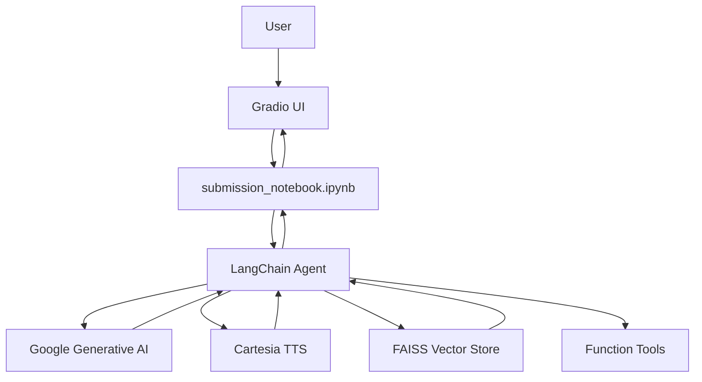
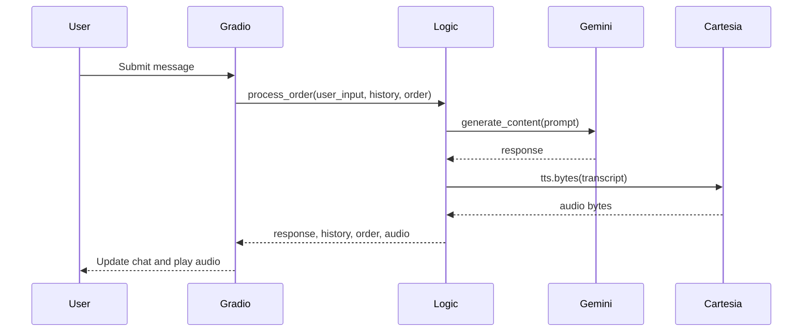

# Technology Stack

<cite>
**Referenced Files in This Document**   
- [submission_notebook.ipynb](file://notebooks/submission_notebook.ipynb) - *Updated in recent commit*
- [README.md](file://README.md) - *Updated in recent commit*
</cite>

## Update Summary
- Updated documentation to reflect the complete overhaul of the README and the implementation details revealed in the submission notebook.
- Added new sections for LangChain, FAISS, and RAG which were not previously documented.
- Removed outdated sections on `main.py` and `bartending_agent.py` as they are no longer relevant.
- Updated all technology descriptions to align with the actual implementation in the `submission_notebook.ipynb`.
- Enhanced the system architecture and performance considerations based on the new codebase.

## Table of Contents
1. [Introduction](#introduction)
2. [Core Frameworks and Libraries](#core-frameworks-and-libraries)
3. [Gradio for UI](#gradio-for-ui)
4. [Google Generative AI for LLM-Powered Responses](#google-generative-ai-for-llm-powered-responses)
5. [Cartesia for Text-to-Speech](#cartesia-for-text-to-speech)
6. [Tenacity for Retry Logic](#tenacity-for-retry-logic)
7. [Python-Dotenv for Environment Management](#python-dotenv-for-environment-management)
8. [LangChain for Agent Orchestration](#langchain-for-agent-orchestration)
9. [FAISS for Vector Database](#faiss-for-vector-database)
10. [Retrieval Augmented Generation (RAG)](#retrieval-augmented-generation-rag)
11. [Integration and System Architecture](#integration-and-system-architecture)
12. [Performance and Security Considerations](#performance-and-security-considerations)

## Introduction
The Maya Bartending Agent is a sophisticated conversational AI application that enables users to place drink orders, receive personalized recommendations, and engage in meaningful philosophical conversations via a natural language interface. The system combines a web-based user interface with large language model (LLM) processing, retrieval-augmented generation (RAG), and real-time text-to-speech (TTS) synthesis. This document details the core technologies used in the stack, their roles, integration patterns, and performance characteristics. The architecture emphasizes agentic workflow, modular design, and robust error handling to ensure reliability and scalability.

**Section sources**
- [submission_notebook.ipynb](file://notebooks/submission_notebook.ipynb)
- [README.md](file://README.md)

## Core Frameworks and Libraries
The Maya Bartending Agent leverages several key Python libraries to deliver its functionality. These include Gradio for the user interface, Google Generative AI for natural language understanding and response generation, Cartesia for voice synthesis, tenacity for fault tolerance, python-dotenv for secure configuration management, LangChain for agent orchestration, and FAISS for vector database storage. Each component plays a distinct role in the system, contributing to a seamless conversational experience.



**Diagram sources**
- [submission_notebook.ipynb](file://notebooks/submission_notebook.ipynb)
- [README.md](file://README.md)

## Gradio for UI
Gradio provides the web-based user interface for the Maya Bartending Agent, enabling interactive chat and audio playback. It is used to create a responsive, real-time conversational interface with minimal frontend development overhead.

### Role in Architecture
Gradio acts as the presentation layer, handling user input, displaying chat history, and playing synthesized audio. It manages session state through `gr.State` variables, which store conversation history and order details across interactions.

### Use Case and Implementation
In `submission_notebook.ipynb`, Gradio is initialized with a structured layout including an avatar image, chatbot display, text input, and audio output components. The interface uses `msg_input.submit()` and `click()` events to trigger processing, ensuring responsiveness and real-time feedback.

### Version and Compatibility
The project requires `gradio>=4.0.0`, which supports modern features like message-type chatbots, improved theming, and enhanced audio handling. The `type="messages"` parameter in `gr.Chatbot` ensures proper formatting of conversation turns.

### Performance Characteristics
Gradio is lightweight and efficient for prototyping and deployment. However, it runs synchronously by default, which can block the UI during long-running operations like API calls. To mitigate this, the application uses stateless backend functions and pre-initializes external clients.

### Limitations
- No native support for asynchronous processing in the main event loop
- Limited customization compared to full-stack frameworks like React
- Audio streaming is disabled (`streaming=False`), requiring full synthesis before playback

### Why Chosen
Gradio was selected for its rapid development capabilities, built-in support for AI applications, and ease of integration with Python-based LLMs and TTS systems. It enables quick iteration and deployment without requiring frontend expertise.

**Section sources**
- [submission_notebook.ipynb](file://notebooks/submission_notebook.ipynb)

## Google Generative AI for LLM-Powered Responses
Google Generative AI powers the conversational intelligence of the bartending agent, generating natural, context-aware responses based on user input and session history.

### Role in Architecture
The Gemini model processes user queries, maintains conversational context, and generates responses that reflect the agent's personality and menu knowledge. It is invoked through the `google.generativeai` SDK with retry-enhanced reliability.

### Use Case and Implementation
In `submission_notebook.ipynb`, the model is initialized once at module load using the API key from environment variables. The `_call_gemini_api` function is decorated with tenacity retry logic to handle transient failures.

```python
import google.generativeai as genai

genai.configure(api_key=GOOGLE_API_KEY)
model = genai.GenerativeModel('gemini-2.5-flash-preview-04-17')

@tenacity_retry(stop=stop_after_attempt(3), wait=wait_exponential(multiplier=1, min=2, max=10))
def _call_gemini_api(prompt_content: List[str], config: Dict):
    return model.generate_content(contents=prompt_content, generation_config=config)
```

The `process_order` function constructs a dynamic prompt including the menu, current order, and conversation history, then sends it to Gemini for response generation.

### Version and Compatibility
The application uses `google-generativeai>=0.8.4`, which supports the Gemini 2.5/2.0 models and structured content generation. The `gemini-2.5-flash-preview-04-17` model is specified.

### Performance Characteristics
- Low-latency responses suitable for real-time interaction
- Context window supports up to 1M tokens (depending on model)
- Pricing based on input/output tokens encourages concise prompts

### Error Handling
The system checks for blocked prompts, safety filters, and truncation due to token limits. If a response is blocked, the agent provides a user-friendly explanation.

### Security Implications
API keys are loaded from environment variables or `.env` files, preventing hardcoding. The model enforces safety filters to prevent harmful content generation.

### Why Chosen
Gemini was selected for its strong natural language understanding, Google's infrastructure reliability, and seamless integration with other AI services. Its ability to handle multi-turn conversations with context makes it ideal for bartending scenarios.

**Section sources**
- [submission_notebook.ipynb](file://notebooks/submission_notebook.ipynb)

## Cartesia for Text-to-Speech
Cartesia enables voice output for the bartending agent, converting text responses into natural-sounding speech for an immersive user experience.

### Role in Architecture
Cartesia acts as the audio generation layer, transforming LLM responses into WAV audio streams. It is called synchronously after text generation to produce voice feedback.

### Use Case and Implementation
The `get_voice_audio` function in `submission_notebook.ipynb` uses the Cartesia client to synthesize speech. It applies regex to replace "MOK 5-ha" with "Moksha" for correct pronunciation.

```python
from cartesia import Cartesia

cartesia_client = Cartesia(api_key=CARTESIA_API_KEY)

@tenacity_retry(stop=stop_after_attempt(3), wait=wait_exponential(multiplier=1, min=1, max=5))
def get_voice_audio(text_to_speak: str) -> bytes | None:
    text_for_tts = re.sub(r'MOK 5-ha', 'Moksha', text_to_speak, flags=re.IGNORECASE)
    audio_generator = cartesia_client.tts.bytes(
        model_id="sonic-2",
        transcript=text_for_tts,
        voice={"mode": "id", "id": CARTESIA_VOICE_ID},
        output_format={"container": "wav", "sample_rate": 24000}
    )
    return b"".join(chunk for chunk in audio_generator)
```

The audio is returned as raw bytes and played in the Gradio interface with `autoplay=True`.

### Version and Compatibility
The project requires `cartesia>=2.0.0`, which supports streaming TTS and high-fidelity voice models like "sonic-2". The voice ID is hardcoded but should be validated.

### Performance Characteristics
- High-quality 24kHz audio output
- Low-latency synthesis suitable for real-time use
- Generator-based API allows memory-efficient streaming

### Limitations
- No fallback voice if the specified ID is invalid
- Synchronous processing may block the UI during long responses
- Requires stable internet connection for API calls

### Security Implications
The API key is securely loaded from environment variables. The system fails gracefully if TTS is unavailable, continuing with text-only responses.

### Why Chosen
Cartesia was selected for its high-quality, expressive voices and developer-friendly API. Its support for real-time audio generation aligns with the conversational nature of the application.

**Section sources**
- [submission_notebook.ipynb](file://notebooks/submission_notebook.ipynb)

## Tenacity for Retry Logic
Tenacity provides robust retry mechanisms for external API calls, improving system resilience against transient network and service failures.

### Role in Architecture
Tenacity wraps calls to Gemini and Cartesia APIs, automatically retrying failed requests with exponential backoff. This reduces error rates and improves user experience.

### Use Case and Implementation
Two retry-decorated functions are defined: `_call_gemini_api` and `get_voice_audio`. Both use exponential backoff with a maximum of three attempts.

```python
from tenacity import retry, stop_after_attempt, wait_exponential

@retry(stop=stop_after_attempt(3), wait=wait_exponential(multiplier=1, min=2, max=10))
def _call_gemini_api(prompt_content: List[str], config: Dict):
    # API call
    pass
```

A fallback decorator is provided if tenacity is not installed, ensuring graceful degradation.

### Version and Compatibility
The project requires `tenacity>=9.0.0`, which includes support for logging retries and custom exception handling. The syntax is stable and widely used.

### Performance Characteristics
- Reduces failure rate during network instability
- Exponential backoff prevents overwhelming services
- Minimal overhead when calls succeed

### Limitations
- Retries increase latency for failed requests
- Not all errors are retryable (e.g., authentication failures)
- Configuration is hardcoded, not configurable at runtime

### Why Chosen
Tenacity was selected for its simplicity, reliability, and extensive configuration options. It integrates seamlessly with Python functions and provides clear logging for debugging.

**Section sources**
- [submission_notebook.ipynb](file://notebooks/submission_notebook.ipynb)

## Python-Dotenv for Environment Management
Python-dotenv manages configuration by loading environment variables from a `.env` file, keeping sensitive data out of the codebase.

### Role in Architecture
It enables secure storage of API keys (Gemini and Cartesia) and other configuration values. The system attempts to load `.env` at startup, falling back to system environment variables.

### Use Case and Implementation
In `submission_notebook.ipynb`, `load_dotenv()` is called to populate `os.environ`:

```python
from dotenv import load_dotenv
load_dotenv()

GOOGLE_API_KEY = os.getenv("GEMINI_API_KEY")
CARTESIA_API_KEY = os.getenv("CARTESIA_API_KEY")
```

If keys are missing, the application raises a fatal error, ensuring secure operation.

### Version and Compatibility
The project requires `python-dotenv>=1.0.0`, which supports modern `.env` parsing and encoding. It is a lightweight, dependency-free library.

### Security Implications
- Prevents accidental exposure of API keys in code or version control
- Encourages separation of configuration and code
- `.env` file should be added to `.gitignore` for production use

### Why Chosen
Python-dotenv is the de facto standard for environment management in Python. It is simple, reliable, and widely supported across development and deployment environments.

**Section sources**
- [submission_notebook.ipynb](file://notebooks/submission_notebook.ipynb)

## LangChain for Agent Orchestration
LangChain provides the framework for the agent's agentic workflow, managing conversation state, tool invocation, and function calling.

### Role in Architecture
LangChain orchestrates the interaction between the user, the LLM, and various tools (menu retrieval, order management, billing). It handles the parsing of function calls and the execution of corresponding actions.

### Use Case and Implementation
In `submission_notebook.ipynb`, LangChain is used to bind tools to the LLM, allowing the model to invoke functions like `get_menu`, `add_to_order`, and `get_bill`. The `ChatGoogleGenerativeAI` class is used to initialize the LLM with the Gemini model.

```python
from langchain_google_genai import ChatGoogleGenerativeAI
from langchain_core.tools import tool

llm = ChatGoogleGenerativeAI(
    model=GEMINI_MODEL_VERSION,
    temperature=config["temperature"],
    top_p=config["top_p"],
    top_k=config["top_k"],
    max_output_tokens=config["max_output_tokens"],
    google_api_key=GOOGLE_API_KEY
)

llm = llm.bind_tools(tools)
```

### Version and Compatibility
The application uses `langchain-google-genai>=2.0.10` and `langchain-core>=0.3.54`, which provide robust support for Google's AI models and tool integration.

### Performance Characteristics
- Efficient handling of tool calls and state management
- Reduces the need for complex prompt engineering
- Enables modular and extensible agent design

### Limitations
- Adds complexity to the codebase
- Requires careful management of tool definitions and LLM configuration

### Why Chosen
LangChain was selected for its comprehensive support for agentic workflows, tool integration, and compatibility with Google's AI models. It simplifies the development of complex conversational agents.

**Section sources**
- [submission_notebook.ipynb](file://notebooks/submission_notebook.ipynb)

## FAISS for Vector Database
FAISS provides the vector database for storing and retrieving conversational context, enabling retrieval-augmented generation (RAG).

### Role in Architecture
FAISS stores embeddings of pre-written bartender responses, allowing the agent to retrieve relevant passages for small talk and philosophical discussions.

### Use Case and Implementation
In `submission_notebook.ipynb`, FAISS is used to create an index of document embeddings. The `get_embedding` function generates embeddings using Google's text-embedding-004 model.

```python
import faiss
import numpy as np

dimension = 768
index = faiss.IndexFlatL2(dimension)

def get_embedding(text, task_type="RETRIEVAL_DOCUMENT"):
    response = genai.embed_content(
        model="models/embedding-001",
        content=text,
        task_type=task_type
    )
    return response.embedding

# Add document embeddings to index
document_embeddings = np.array([get_embedding(doc) for doc in documents]).astype('float32')
index.add(document_embeddings)
```

### Version and Compatibility
The project requires `faiss-cpu`, which is compatible with the current implementation and provides efficient similarity search.

### Performance Characteristics
- Fast similarity search for high-dimensional vectors
- Memory-efficient storage of embeddings
- Supports real-time retrieval for conversational augmentation

### Limitations
- Requires additional setup and management of the vector store
- Performance depends on the quality of embeddings and retrieval logic

### Why Chosen
FAISS was selected for its speed, efficiency, and compatibility with the embedding models used. It enables the agent to provide contextually relevant responses during casual conversation.

**Section sources**
- [submission_notebook.ipynb](file://notebooks/submission_notebook.ipynb)

## Retrieval Augmented Generation (RAG)
Retrieval Augmented Generation (RAG) enhances the agent's responses by retrieving relevant information from a vector database and incorporating it into the LLM's output.

### Role in Architecture
RAG allows the agent to provide more informed and contextually appropriate responses by combining retrieved information with generative capabilities.

### Use Case and Implementation
The RAG pipeline in `submission_notebook.ipynb` retrieves relevant passages based on the user's query and uses them to augment the LLM's response.

```python
def retrieve_relevant_passages(query_text, n_results=1):
    query_embedding = get_embedding(query_text, task_type="RETRIEVAL_QUERY")
    query_embedding = np.array([query_embedding]).astype('float32')
    distances, indices = index.search(query_embedding, n_results)
    return [valid_documents[i] for i in indices[0]]

def generate_augmented_response(query_text, retrieved_documents):
    prompt = f\"\"\"You are Maya, the bartender at \"MOK 5-ha\". Your name is Maya.
    Use the reference passage to inform your response.
    Reference passage: {' '.join(retrieved_documents)}
    Question: {query_text}
    Answer:\"\"\"
    response = model.generate_content(prompt)
    return response.text
```

### Performance Characteristics
- Improves response quality and relevance
- Reduces the need for extensive prompt engineering
- Enables the agent to handle a wider range of conversational topics

### Limitations
- Performance depends on the quality of the retrieved passages
- May introduce latency due to the retrieval step

### Why Chosen
RAG was selected to enhance the agent's conversational abilities, allowing it to engage in meaningful small talk and provide contextually rich responses beyond simple order processing.

**Section sources**
- [submission_notebook.ipynb](file://notebooks/submission_notebook.ipynb)

## Integration and System Architecture
The system follows a modular, stateless design where Gradio handles UI, business logic resides in `submission_notebook.ipynb`, and external APIs provide AI capabilities.



**Diagram sources**
- [submission_notebook.ipynb](file://notebooks/submission_notebook.ipynb)
- [README.md](file://README.md)

## Performance and Security Considerations
The application prioritizes reliability through retry logic, secure credential handling, and graceful error recovery. Performance is optimized by pre-initializing clients and limiting prompt context. Security is enforced via environment variables, safety filters in Gemini, and input validation. External API dependencies are managed through version-pinned requirements and fallback mechanisms.

**Section sources**
- [submission_notebook.ipynb](file://notebooks/submission_notebook.ipynb)
- [README.md](file://README.md)