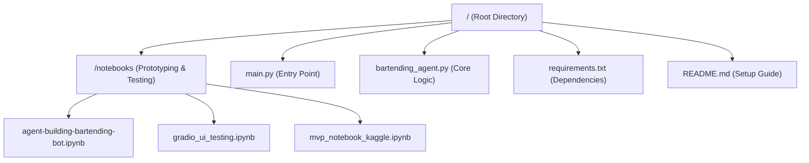
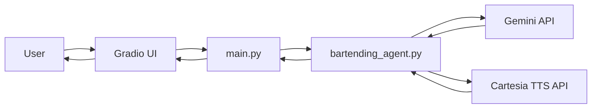
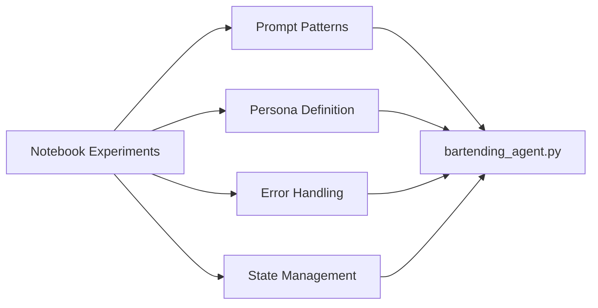

# Agent Building and Design Exploration Notebook

<cite>
**Referenced Files in This Document**   
- [notebooks/agent-building-bartending-bot.ipynb](file://notebooks/agent-building-bartending-bot.ipynb)
- [bartending_agent.py](file://bartending_agent.py)
- [main.py](file://main.py)
- [README.md](file://README.md)
</cite>

## Table of Contents
1. [Introduction](#introduction)
2. [Project Structure](#project-structure)
3. [Core Components](#core-components)
4. [Architecture Overview](#architecture-overview)
5. [Detailed Component Analysis](#detailed-component-analysis)
6. [Agent Design and Persona Engineering](#agent-design-and-persona-engineering)
7. [Prompt Architecture Experiments](#prompt-architecture-experiments)
8. [Evaluation Techniques](#evaluation-techniques)
9. [Integration with Final Implementation](#integration-with-final-implementation)
10. [Conclusion](#conclusion)

## Introduction
This document provides a comprehensive analysis of the agent-building notebook used for designing and prototyping an AI bartender named Maya. The notebook serves as a conceptual sandbox for exploring key aspects of conversational agent development, including persona design, tone of interaction, prompt engineering, and evaluation methodologies. It documents iterative experiments that inform the final implementation in `bartending_agent.py`. The goal is to create a friendly, conversational AI capable of handling drink orders, answering menu questions, and maintaining coherent dialogue.

**Section sources**
- [notebooks/agent-building-bartending-bot.ipynb](file://notebooks/agent-building-bartending-bot.ipynb)

## Project Structure
The project follows a modular structure with distinct directories for notebooks, core logic, and application entry points. The `notebooks/` directory contains experimental Jupyter notebooks used for prototyping and testing different agent behaviors. The root directory includes the main application files and configuration.



**Diagram sources**
- [README.md](file://README.md#L1-L35)
- [bartending_agent.py](file://bartending_agent.py#L0-L374)

**Section sources**
- [README.md](file://README.md#L1-L35)
- [bartending_agent.py](file://bartending_agent.py#L0-L374)

## Core Components
The core components of the system include the agent logic in `bartending_agent.py`, the interactive notebook prototypes, and the Gradio-based UI in `main.py`. The agent uses Google's Gemini model for natural language understanding and generation, with Cartesia for text-to-speech capabilities. The stateless design ensures session independence, with conversation history and order state managed externally.

**Section sources**
- [bartending_agent.py](file://bartending_agent.py#L0-L374)
- [main.py](file://main.py)

## Architecture Overview
The system architecture is built around a stateless agent function that processes user input, generates responses using a large language model, and updates session state. The frontend (Gradio) handles user interaction, while the backend (`bartending_agent.py`) manages business logic and API integrations.



**Diagram sources**
- [bartending_agent.py](file://bartending_agent.py#L0-L374)
- [main.py](file://main.py)

## Detailed Component Analysis

### Agent State Management
The agent uses a stateless design where session data (conversation history and order) is passed as parameters and returned as updated values. This allows for clean separation between UI state and business logic.

```python
def process_order(
    user_input_text: str,
    current_session_history: List[Dict[str, str]],
    current_session_order: List[Dict[str, float]]
) -> Tuple[str, List[Dict[str, str]], List[Dict[str, float]]]:
    # Process input and return updated state
    return response_text, updated_history, updated_order
```

**Section sources**
- [bartending_agent.py](file://bartending_agent.py#L150-L350)

### Menu System and Order Handling
The menu is defined as a static dictionary, providing drink names and prices. The system uses heuristic parsing to detect when drinks are added to the order based on the agent's response content.

```python
menu: Dict[str, Dict[str, float]] = {
    "1": {"name": "Old Fashioned", "price": 12.00},
    "2": {"name": "Margarita", "price": 10.00},
    # ... additional items
}
```

**Section sources**
- [bartending_agent.py](file://bartending_agent.py#L130-L148)

## Agent Design and Persona Engineering

### Maya's Personality Traits
The AI bartender, Maya, is designed with specific personality traits to enhance user engagement:
- **Friendly and conversational**: Uses natural language and maintains a warm tone
- **Helpful and patient**: Asks clarifying questions when orders are ambiguous
- **Knowledgeable**: Provides accurate information about menu items and modifiers
- **Brand-aligned**: Explains the meaning of "MOK 5-ha" (Moksha) when asked

These traits are encoded in the system prompt and reinforced through example interactions in the notebook.

**Section sources**
- [notebooks/agent-building-bartending-bot.ipynb](file://notebooks/agent-building-bartending-bot.ipynb#L0-L0)

### Speech Style and Tone
The speech style is designed to be:
- **Conversational**: Uses contractions and natural phrasing
- **Polite**: Includes pleasantries like "How may I serve you today?"
- **Clear**: Avoids overly complex language
- **Engaging**: Maintains user interest through responsive dialogue

The tone adapts based on context, becoming more enthusiastic when confirming orders or more explanatory when discussing menu items.

**Section sources**
- [notebooks/agent-building-bartending-bot.ipynb](file://notebooks/agent-building-bartending-bot.ipynb#L0-L0)

## Prompt Architecture Experiments

### Zero-Shot vs Few-Shot Learning
The notebook explores different prompt architectures to optimize response quality:

#### Zero-Shot Approach
Provides only the system instruction and current input:
```
"You are a Bartender-Bot... Here is the menu: [menu]. User: I want a cocktail with rum. Assistant:"
```

#### Few-Shot Approach
Includes example dialogues to guide behavior:
```
User: What do you recommend?
Assistant: If you like fruity drinks, I'd suggest a Daiquiri.
User: I want something strong.
Assistant: The Old Fashioned has a robust whiskey flavor.
User: I want a cocktail with rum.
Assistant: [Generated response]
```

The few-shot approach generally produces more consistent and on-brand responses by providing behavioral examples.

**Section sources**
- [notebooks/agent-building-bartending-bot.ipynb](file://notebooks/agent-building-bartending-bot.ipynb#L0-L0)

### System Instruction Design
The system instruction in the notebook defines the agent's behavior, including:
- Role definition ("You are a Bartender-Bot")
- Menu knowledge and pricing
- Order management procedures
- Conversation tone and style
- Special handling for modifiers and recommendations

```python
BARTENDERBOT_SYSINT = (
    "system",
    "You are a Bartender-Bot, an interactive drink ordering system. A human will talk to you about the "
    "available products you have and you will answer any questions about menu items and their prices."
    "Be conversational and friendly with the customer as they may intearct with you."
    # ... additional instructions
)
```

**Section sources**
- [notebooks/agent-building-bartending-bot.ipynb](file://notebooks/agent-building-bartending-bot.ipynb#L0-L0)

## Evaluation Techniques

### Conversational Coherence Assessment
The notebook implements evaluation methods to assess response quality:
- **Context preservation**: Checking if the agent maintains conversation history
- **Consistency**: Verifying that responses align with previous statements
- **Relevance**: Ensuring responses directly address user queries
- **Naturalness**: Evaluating the fluency and human-likeness of responses

These are assessed through manual testing and example dialogues in the notebook environment.

### User Engagement Metrics
Engagement is evaluated based on:
- **Response length and detail**: More informative responses tend to engage users
- **Question asking**: The agent's ability to seek clarification when needed
- **Personalization**: Using the user's preferences and order history
- **Emotional tone**: Maintaining a friendly and welcoming demeanor

The notebook includes test cases that simulate various customer personalities to evaluate adaptability.

**Section sources**
- [notebooks/agent-building-bartending-bot.ipynb](file://notebooks/agent-building-bartending-bot.ipynb#L0-L0)

## Integration with Final Implementation

### From Notebook to Production Code
The experiments in `agent-building-bartending-bot.ipynb` directly informed the implementation in `bartending_agent.py`:
- **Prompt engineering insights** were translated into the `process_order` function's context construction
- **Persona traits** were encoded in the prompt context string
- **Error handling patterns** from notebook testing were implemented with retry logic
- **State management approaches** evolved from notebook prototypes to the final stateless function design



**Diagram sources**
- [notebooks/agent-building-bartending-bot.ipynb](file://notebooks/agent-building-bartending-bot.ipynb#L0-L0)
- [bartending_agent.py](file://bartending_agent.py#L0-L374)

**Section sources**
- [notebooks/agent-building-bartending-bot.ipynb](file://notebooks/agent-building-bartending-bot.ipynb#L0-L0)
- [bartending_agent.py](file://bartending_agent.py#L0-L374)

### Key Design Decisions
Several critical design decisions emerged from the notebook exploration:
- **Stateless architecture**: Enables easier scaling and session management
- **Heuristic order tracking**: Uses response content analysis instead of complex tool calling
- **Retry mechanisms**: Implements tenacity for robust API calls
- **Pronunciation handling**: Special processing for "MOK 5-ha" → "Moksha"
- **Safety fallbacks**: Comprehensive error handling with user-friendly messages

These decisions reflect lessons learned during the prototyping phase documented in the notebooks.

**Section sources**
- [bartending_agent.py](file://bartending_agent.py#L0-L374)
- [notebooks/agent-building-bartending-bot.ipynb](file://notebooks/agent-building-bartending-bot.ipynb#L0-L0)

## Conclusion
The agent-building notebook serves as a crucial design and experimentation platform for the AI bartender system. Through iterative testing of persona traits, prompt architectures, and interaction patterns, it provides valuable insights that directly shape the production implementation. The transition from notebook prototypes to the final `bartending_agent.py` module demonstrates an effective development workflow where conceptual exploration informs robust, production-ready code. This approach ensures that the AI bartender not only functions correctly but also delivers an engaging and personality-driven user experience.