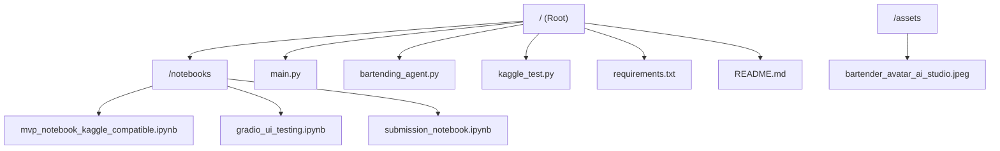
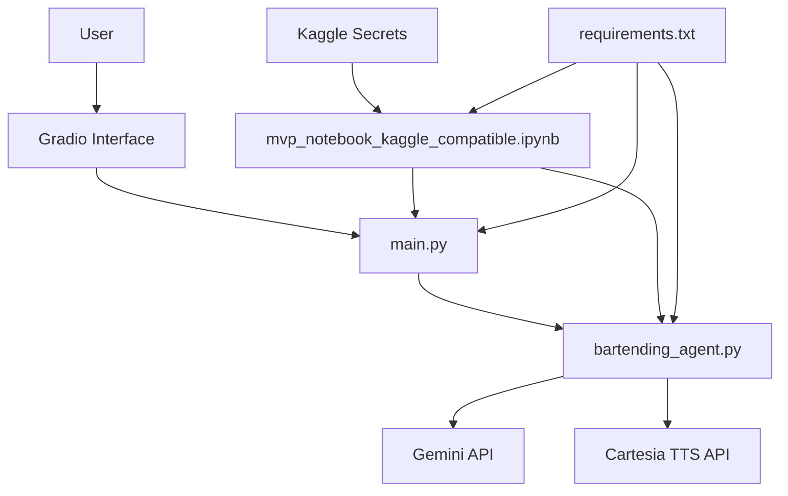
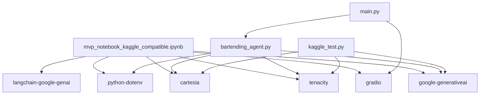

# Compatibility-Focused MVP Notebook

<cite>
**Referenced Files in This Document**   
- [notebooks/mvp_notebook_kaggle_compatible.ipynb](file://notebooks/mvp_notebook_kaggle_compatible.ipynb)
- [requirements.txt](file://requirements.txt)
- [kaggle_test.py](file://kaggle_test.py)
- [bartending_agent.py](file://bartending_agent.py)
- [main.py](file://main.py)
</cite>

## Table of Contents
1. [Introduction](#introduction)
2. [Project Structure](#project-structure)
3. [Core Components](#core-components)
4. [Architecture Overview](#architecture-overview)
5. [Detailed Component Analysis](#detailed-component-analysis)
6. [Dependency Analysis](#dependency-analysis)
7. [Performance Considerations](#performance-considerations)
8. [Troubleshooting Guide](#troubleshooting-guide)
9. [Conclusion](#conclusion)

## Introduction

This document provides a comprehensive analysis of the `mvp_notebook_kaggle_compatible.ipynb` notebook, designed to ensure cross-platform compatibility of the Maya Bartending Agent within Kaggle's execution environment. The notebook is engineered to function reliably in constrained or containerized environments by adapting dependencies, file paths, and API calls. It aligns library versions with Kaggle’s pre-installed packages, reduces memory footprint, and implements conditional logic for environment detection. The analysis covers modifications for dependency management, secure API key handling via Kaggle Secrets, and fallback mechanisms for robust execution. Additionally, it explains how developers use this notebook to validate core functionalities such as LLM inference and TTS preprocessing without relying on local configuration files or external servers. Common issues like import errors, timeouts, and permission restrictions in sandboxed platforms are also addressed.

## Project Structure

The project follows a modular structure with distinct directories and files organized for clarity and maintainability. The root directory contains core application logic, configuration, and entry points, while the `notebooks` directory houses Jupyter notebooks tailored for different environments, particularly Kaggle.



**Diagram sources**
- [mvp_notebook_kaggle_compatible.ipynb](file://notebooks/mvp_notebook_kaggle_compatible.ipynb)
- [requirements.txt](file://requirements.txt)
- [main.py](file://main.py)

**Section sources**
- [mvp_notebook_kaggle_compatible.ipynb](file://notebooks/mvp_notebook_kaggle_compatible.ipynb)
- [requirements.txt](file://requirements.txt)

## Core Components

The core components of the Maya Bartending Agent include the MVP notebook for Kaggle compatibility, the main application logic in `bartending_agent.py`, the Gradio interface launcher in `main.py`, and environment-specific utilities in `kaggle_test.py`. These components work together to provide a seamless AI bartending experience across different deployment environments.

The `mvp_notebook_kaggle_compatible.ipynb` serves as the primary entry point for Kaggle users, ensuring that all dependencies are installed and configured correctly. It leverages Kaggle Secrets for secure API key storage and uses conditional imports to handle environment-specific configurations. The `bartending_agent.py` module encapsulates the stateless logic for processing user orders, integrating with the Gemini LLM and Cartesia TTS service. The `main.py` script initializes the Gradio web interface, managing session state and orchestrating interactions between the UI and backend logic.

**Section sources**
- [mvp_notebook_kaggle_compatible.ipynb](file://notebooks/mvp_notebook_kaggle_compatible.ipynb)
- [bartending_agent.py](file://bartending_agent.py)
- [main.py](file://main.py)

## Architecture Overview

The system architecture is designed to be modular, stateless, and environment-agnostic, enabling deployment across local development, cloud platforms, and Kaggle notebooks. The architecture separates concerns into distinct layers: presentation (Gradio UI), business logic (agent functions), and external services (Gemini LLM, Cartesia TTS).



**Diagram sources**
- [main.py](file://main.py#L1-L142)
- [bartending_agent.py](file://bartending_agent.py#L1-L374)
- [mvp_notebook_kaggle_compatible.ipynb](file://notebooks/mvp_notebook_kaggle_compatible.ipynb#L1-L104)

## Detailed Component Analysis

### MVP Notebook for Kaggle Compatibility

The `mvp_notebook_kaggle_compatible.ipynb` notebook is specifically designed to function within Kaggle's restricted environment. It avoids Google Colab-specific code and instead uses Kaggle-native features such as secrets management and pre-installed packages.

#### Setup and Dependency Management
The notebook begins by installing required packages using pip, with the `--quiet` flag to minimize output in the constrained Kaggle console. The installed packages include:
- `google-generativeai`: For interacting with the Gemini API
- `langchain-google-genai`: For LangChain integration with Google models
- `gradio`: For building the interactive UI
- `cartesia`: For text-to-speech synthesis
- `python-dotenv`: For loading environment variables
- `tenacity`: For retry logic on API calls

```python
!pip install --quiet google-generativeai>=0.3.0 tenacity>=8.2.3 gradio>=4.0.0 cartesia>=2.0.0 python-dotenv>=1.0.0 langchain-google-genai langchain-core
```

#### Secure API Key Handling
Instead of hardcoding API keys, the notebook retrieves them securely from Kaggle Secrets using the `UserSecretsClient`. This ensures that sensitive credentials are not exposed in the notebook or version control.

```python
from kaggle_secrets import UserSecretsClient
user_secrets = UserSecretsClient()
os.environ['GEMINI_API_KEY'] = user_secrets.get_secret("GEMINI_API_KEY")
```

This approach allows users to add their API keys via the Kaggle UI under **Add-ons > Secrets**, mapping the key to the name `GEMINI_API_KEY`.

#### Environment Detection and Fallbacks
While the notebook is optimized for Kaggle, the broader project (via `kaggle_test.py`) demonstrates fallback mechanisms. If API keys are not found in Kaggle Secrets, the system attempts to retrieve them from environment variables, enabling local testing without modifying code.

```python
CARTESIA_API_KEY = os.environ.get("CARTESIA_API_KEY")
GOOGLE_API_KEY = os.environ.get("GOOGLE_API_KEY")
```

**Section sources**
- [mvp_notebook_kaggle_compatible.ipynb](file://notebooks/mvp_notebook_kaggle_compatible.ipynb#L1-L104)
- [kaggle_test.py](file://kaggle_test.py#L1-L122)

### Bartending Agent Logic

The `bartending_agent.py` module contains the core logic for processing user input, managing the drink menu, and interfacing with external APIs.

#### Stateless Design
The agent functions are designed to be stateless, accepting session history and order as input parameters and returning updated versions. This design enables easy integration with Gradio's session state mechanism and ensures thread safety in web deployments.

```python
def process_order(
    user_input_text: str,
    current_session_history: List[Dict[str, str]],
    current_session_order: List[Dict[str, float]]
) -> Tuple[str, List[Dict[str, str]], List[Dict[str, float]]]:
```

#### Retry Mechanisms
The module uses the `tenacity` library to implement exponential backoff retries for API calls, improving reliability in unstable network conditions.

```python
@tenacity_retry(
    stop=stop_after_attempt(3),
    wait=wait_exponential(multiplier=1, min=2, max=10),
    before_sleep=before_sleep_log(logger, logging.WARNING),
    reraise=True
)
def _call_gemini_api(prompt_content: List[str], config: Dict) -> ggenai.types.GenerateContentResponse:
```

A similar retry wrapper is applied to the Cartesia TTS API call.

#### Menu Management
The drink menu is defined as a static dictionary, ensuring consistency across sessions.

```python
menu: Dict[str, Dict[str, float]] = {
    "1": {"name": "Old Fashioned", "price": 12.00},
    "2": {"name": "Margarita", "price": 10.00},
    ...
}
```

**Section sources**
- [bartending_agent.py](file://bartending_agent.py#L1-L374)

### Gradio Interface

The `main.py` script defines the Gradio web interface, using `gr.Blocks` to create a responsive UI with an avatar image, chatbot, audio output, and input controls.

#### Session State Management
Gradio's `gr.State` components are used to maintain session history and order state across interactions.

```python
history_state = gr.State([])
order_state = gr.State([])
```

#### Event Handling
The `handle_gradio_input` function serves as the primary callback, orchestrating the flow from user input to LLM response and TTS generation.

```python
def handle_gradio_input(
    user_input: str,
    session_history_state: List[Dict[str, str]],
    session_order_state: List[Dict[str, float]]
) -> Tuple[str, List[Dict[str, str]], List[Dict[str, str]], List[Dict[str, float]], Any]:
```

It calls `process_order` for text generation and `get_voice_audio` for speech synthesis, returning updates to the UI components.

**Section sources**
- [main.py](file://main.py#L1-L142)

## Dependency Analysis

The project's dependencies are carefully managed to ensure compatibility across environments. The `requirements.txt` file lists all required packages with minimum version constraints.



**Diagram sources**
- [requirements.txt](file://requirements.txt#L1-L9)
- [mvp_notebook_kaggle_compatible.ipynb](file://notebooks/mvp_notebook_kaggle_compatible.ipynb#L1-L104)

**Section sources**
- [requirements.txt](file://requirements.txt#L1-L9)

## Performance Considerations

The system is optimized for performance in constrained environments like Kaggle by:
- Using lightweight models (e.g., `gemini-2.5-flash-preview-04-17`)
- Limiting prompt history to the last 10 interactions
- Implementing retry logic with exponential backoff to handle transient failures
- Minimizing memory footprint through stateless function design
- Using efficient data structures (lists, dictionaries) for session state

The TTS system streams audio data in chunks, reducing memory usage during synthesis.

## Troubleshooting Guide

Common issues and their solutions:

**Import Errors**: Ensure all packages in `requirements.txt` are installed. In Kaggle, use the notebook's built-in package installer or add them via the environment settings.

**API Key Errors**: Verify that `GEMINI_API_KEY` and `CARTESIA_API_KEY` are correctly added to Kaggle Secrets with exact names. Check for typos or extra spaces.

**Model Initialization Failures**: Confirm that the model name (`gemini-2.5-flash-preview-04-17`) is valid and accessible with your API key. Update to a supported model if necessary.

**TTS Generation Failures**: Check that `CARTESIA_VOICE_ID` is set to a valid voice ID from the Cartesia dashboard. Replace the placeholder ID in `bartending_agent.py`.

**Timeouts in Kaggle**: Kaggle has execution time limits. Optimize prompts to be concise and use faster models. Avoid long-running operations.

**Permission Restrictions**: Kaggle notebooks run in sandboxed environments. Do not attempt to write to the filesystem or access network resources outside approved APIs.

**Section sources**
- [kaggle_test.py](file://kaggle_test.py#L1-L122)
- [bartending_agent.py](file://bartending_agent.py#L1-L374)

## Conclusion

The `mvp_notebook_kaggle_compatible.ipynb` successfully adapts the Maya Bartending Agent for Kaggle's execution environment through careful dependency management, secure API key handling, and environment-specific configurations. By leveraging Kaggle Secrets, conditional imports, and fallback mechanisms, the notebook ensures reliable operation in constrained or containerized platforms. The modular architecture separates concerns between UI, business logic, and external services, enabling easy maintenance and extension. Developers can use this notebook to validate core features like LLM inference and TTS preprocessing without relying on local configurations, making it an essential tool for cross-platform deployment.