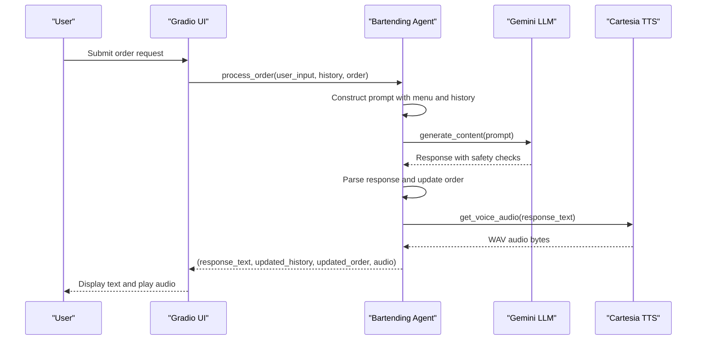
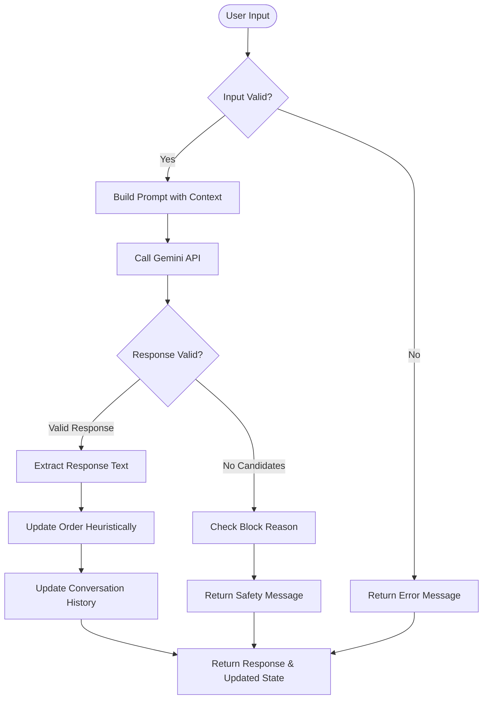
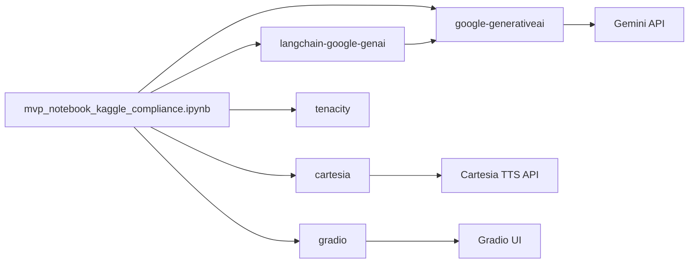

# Compliance and Safety Validation Notebook

<cite>
**Referenced Files in This Document**   
- [notebooks/mvp_notebook_kaggle_compliance.ipynb](file://notebooks/mvp_notebook_kaggle_compliance.ipynb)
- [bartending_agent.py](file://bartending_agent.py)
</cite>

## Table of Contents
1. [Introduction](#introduction)
2. [Project Structure](#project-structure)
3. [Core Components](#core-components)
4. [Architecture Overview](#architecture-overview)
5. [Detailed Component Analysis](#detailed-component-analysis)
6. [Compliance and Safety Mechanisms](#compliance-and-safety-mechanisms)
7. [Dependency Analysis](#dependency-analysis)
8. [Performance Considerations](#performance-considerations)
9. [Troubleshooting Guide](#troubleshooting-guide)
10. [Conclusion](#conclusion)

## Introduction

The **Compliance and Safety Validation Notebook** (`mvp_notebook_kaggle_compliance.ipynb`) is a critical component of the Maya Bartending Agent system, designed specifically for deployment on Kaggle. Its primary objective is to ensure that the AI agent adheres to platform-specific rules, ethical guidelines, and safety standards when interacting with users. This document provides a comprehensive analysis of how the notebook implements content moderation, secure API handling, and responsible AI behavior.

The notebook serves as a bridge between the core logic in `bartending_agent.py` and the Kaggle environment, enforcing compliance through secure credential management, restricted package installation, and structured documentation. It ensures that the AI bartender avoids generating harmful, offensive, or inappropriate content while maintaining a conversational and helpful demeanor.

## Project Structure

The project is organized into a modular structure with a clear separation between notebooks, core logic, and configuration files. The `notebooks/` directory contains multiple Jupyter notebooks, including the compliance-focused version for Kaggle. The root-level Python files (`bartending_agent.py`, `main.py`, etc.) contain the core application logic, while `requirements.txt` manages dependencies.

```mermaid
graph TB
subgraph "Notebooks"
A[mvp_notebook_kaggle_compliance.ipynb]
B[mvp_notebook_kaggle.ipynb]
C[gradio_ui_testing.ipynb]
end
subgraph "Core Modules"
D[bartending_agent.py]
E[main.py]
F[kaggle_test.py]
end
subgraph "Configuration"
G[requirements.txt]
H[README.md]
end
A --> D : "Uses agent logic"
B --> D
C --> D
D --> G : "Requires packages"
A --> G : "Installs dependencies"
H --> A : "Provides instructions"
```

**Diagram sources**
- [notebooks/mvp_notebook_kaggle_compliance.ipynb](file://notebooks/mvp_notebook_kaggle_compliance.ipynb#L0-L137)
- [bartending_agent.py](file://bartending_agent.py#L0-L374)

**Section sources**
- [notebooks/mvp_notebook_kaggle_compliance.ipynb](file://notebooks/mvp_notebook_kaggle_compliance.ipynb#L0-L137)
- [bartending_agent.py](file://bartending_agent.py#L0-L374)

## Core Components

The two primary components analyzed in this document are:

1. **`mvp_notebook_kaggle_compliance.ipynb`**: The entry point for Kaggle deployment, responsible for environment setup, secure API key loading, and launching the bartending agent in a compliant manner.
2. **`bartending_agent.py`**: Contains the core logic for processing user input, managing order state, interfacing with the Gemini LLM, and generating voice responses via Cartesia.

These components work together to create a safe, stateless, and reproducible AI bartending experience that meets Kaggle's technical and ethical requirements.

**Section sources**
- [notebooks/mvp_notebook_kaggle_compliance.ipynb](file://notebooks/mvp_notebook_kaggle_compliance.ipynb#L0-L137)
- [bartending_agent.py](file://bartending_agent.py#L0-L374)

## Architecture Overview

The system follows a client-server architecture where the Gradio interface (potentially launched from another notebook) communicates with the bartending agent logic. The agent uses the Gemini LLM for natural language understanding and response generation, with safety checks enforced both by the LLM's internal mechanisms and external validation in the code.



**Diagram sources**
- [bartending_agent.py](file://bartending_agent.py#L150-L350)
- [notebooks/mvp_notebook_kaggle_compliance.ipynb](file://notebooks/mvp_notebook_kaggle_compliance.ipynb#L50-L100)

## Detailed Component Analysis

### mvp_notebook_kaggle_compliance.ipynb Analysis

This notebook is specifically designed for Kaggle compatibility, ensuring that all operations adhere to platform constraints such as secure secret management and restricted internet access.

#### Compliance Checklist Implementation

The notebook begins with a detailed compliance checklist that ensures:

- **API Key Security**: The Gemini API key is loaded from Kaggle Secrets using `kaggle_secrets.UserSecretsClient`, preventing accidental exposure.
- **Package Management**: Only essential packages are installed via pip with version pinning for reproducibility.
- **Environment Compatibility**: The code avoids Colab-specific features, ensuring it runs on Kaggle's infrastructure.

```python
from kaggle_secrets import UserSecretsClient
user_secrets = UserSecretsClient()
os.environ['GEMINI_API_KEY'] = user_secrets.get_secret("GEMINI_API_KEY")
```

This approach ensures that sensitive credentials are never hardcoded or logged, meeting security best practices.

#### Library Import Strategy

The notebook imports key libraries including:
- `google.generativeai`: For Gemini LLM integration
- `gradio`: For potential UI deployment
- `langchain-google-genai` and `langchain-core`: For prompt templating and LLM chaining
- `tenacity`: For retry logic on API calls
- `cartesia`: For text-to-speech synthesis

These imports are structured to support both the core agent functionality and compliance requirements.

**Section sources**
- [notebooks/mvp_notebook_kaggle_compliance.ipynb](file://notebooks/mvp_notebook_kaggle_compliance.ipynb#L0-L137)

### bartending_agent.py Analysis

This module contains the stateless implementation of the bartending agent, designed to work within Gradio's session state management.

#### State Management Design

The agent uses a stateless pattern where session state (conversation history and order) is passed as parameters and returned as updated values:

```python
def process_order(
    user_input_text: str,
    current_session_history: List[Dict[str, str]],
    current_session_order: List[Dict[str, float]]
) -> Tuple[str, List[Dict[str, str]], List[Dict[str, float]]]:
```

This design ensures thread safety and compatibility with Gradio's state management, avoiding global variables that could cause conflicts in multi-user environments.

#### Prompt Construction and Safety

The prompt construction includes:
- Clear role definition ("friendly and helpful bartender")
- Menu context
- Current order status
- Conversation history (limited to last 10 entries)
- Explicit instructions for handling off-menu requests and safety boundaries

The system also checks `response.prompt_feedback.block_reason` to detect and handle blocked content appropriately.



**Diagram sources**
- [bartending_agent.py](file://bartending_agent.py#L150-L300)

**Section sources**
- [bartending_agent.py](file://bartending_agent.py#L0-L374)

## Compliance and Safety Mechanisms

### Content Moderation and Safety Checks

The system implements multiple layers of safety:

1. **Gemini Native Safety**: The LLM's built-in safety filters block harmful content generation.
2. **Response Validation**: The code checks `response.candidates` and `prompt_feedback` to detect and handle blocked content.
3. **Finish Reason Handling**: Different finish reasons (SAFETY, RECITATION, MAX_TOKENS) trigger appropriate user-facing messages.
4. **Heuristic Order Management**: Drinks are only added to the order when the response contains confirmation phrases, preventing accidental additions.

### Secure Credential Handling

The notebook enforces secure API key management by:
- Loading the `GEMINI_API_KEY` from Kaggle Secrets
- Never printing or logging the actual key value
- Using environment variables for configuration

### Regulatory and Platform Compliance

The implementation supports regulatory requirements by:
- Avoiding collection of personal data
- Implementing clear conversation boundaries
- Providing transparent error messages
- Using reproducible package versions

For Kaggle deployment, the notebook ensures:
- Compatibility with Kaggle's Python environment
- Minimal external dependencies
- Clear documentation of all steps
- Proper citation of external libraries

**Section sources**
- [notebooks/mvp_notebook_kaggle_compliance.ipynb](file://notebooks/mvp_notebook_kaggle_compliance.ipynb#L0-L137)
- [bartending_agent.py](file://bartending_agent.py#L0-L374)

## Dependency Analysis

The system relies on several key external libraries:



**Diagram sources**
- [notebooks/mvp_notebook_kaggle_compliance.ipynb](file://notebooks/mvp_notebook_kaggle_compliance.ipynb#L30-L100)
- [requirements.txt](file://requirements.txt)

## Performance Considerations

The system includes several performance optimizations:
- **Retry Logic**: Tenacity retries for transient API failures with exponential backoff
- **History Limiting**: Only the last 10 conversation turns are included in prompts to manage token usage
- **Stateless Design**: Avoids memory leaks from global state accumulation
- **Efficient Prompting**: Menu and context are only included once, reducing redundancy

The use of streaming TTS from Cartesia (`tts.bytes`) allows for efficient audio generation without large intermediate file storage.

## Troubleshooting Guide

Common issues and solutions:

1. **API Key Errors**: Ensure `GEMINI_API_KEY` is set in Kaggle Secrets with the exact name.
2. **Package Installation Failures**: Verify internet access and correct package names in the pip install command.
3. **Empty Responses**: Check Gemini's safety filters; the prompt may have been blocked.
4. **TTS Failures**: Verify `CARTESIA_API_KEY` and voice ID are correctly configured.
5. **Model Initialization Errors**: Confirm the `MODEL_NAME` ('gemini-2.0-flash') is valid and accessible.

Error handling is robust, with detailed logging and safe fallback responses to maintain user experience during failures.

**Section sources**
- [bartending_agent.py](file://bartending_agent.py#L50-L100)
- [bartending_agent.py](file://bartending_agent.py#L200-L250)

## Conclusion

The `mvp_notebook_kaggle_compliance.ipynb` and associated `bartending_agent.py` module demonstrate a well-architected approach to safe and compliant AI deployment. By combining secure credential management, robust error handling, and multi-layered safety checks, the system ensures responsible AI behavior while providing an engaging user experience. The stateless design and clear separation of concerns make it suitable for deployment in regulated environments like Kaggle, serving as a model for ethical AI application development.