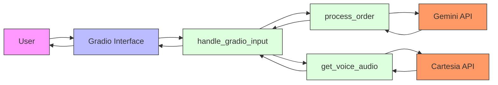
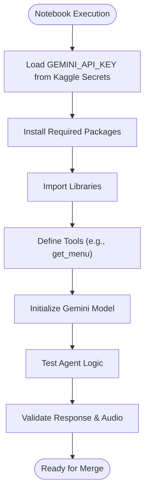
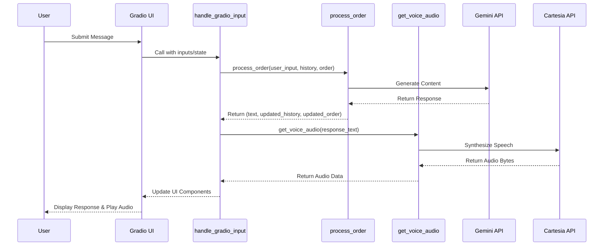
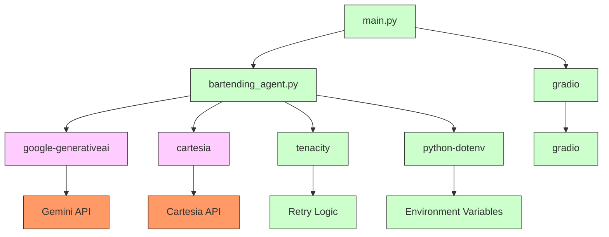

# Integrated MVP Feature Merge Notebook

<cite>
**Referenced Files in This Document**   
- [notebooks/mvp_notebook_kaggle_merged.ipynb](file://notebooks/mvp_notebook_kaggle_merged.ipynb)
- [main.py](file://main.py)
- [bartending_agent.py](file://bartending_agent.py)
- [README.md](file://README.md)
</cite>

## Table of Contents
1. [Introduction](#introduction)
2. [Project Structure](#project-structure)
3. [Core Components](#core-components)
4. [Architecture Overview](#architecture-overview)
5. [Detailed Component Analysis](#detailed-component-analysis)
6. [Dependency Analysis](#dependency-analysis)
7. [Performance Considerations](#performance-considerations)
8. [Troubleshooting Guide](#troubleshooting-guide)
9. [Conclusion](#conclusion)

## Introduction
The **mvp_notebook_kaggle_merged.ipynb** serves as a central integration environment for consolidating experimental features and improvements from earlier MVP notebooks into a unified staging ground. This notebook is specifically designed to reconcile divergent implementations of prompt templates, state management logic, and error recovery mechanisms before they are promoted to the main application via `main.py`. It plays a critical role in ensuring that new conversational flows, order handling enhancements, and text-to-speech (TTS) readiness are thoroughly tested in isolation. By providing a controlled environment for merging and validating changes, this notebook enables developers to verify end-to-end functionality—such as taking a customer order, generating a natural language response, and synthesizing audio—before committing code to the production pipeline. The document outlines the structure, purpose, and integration points of this key development artifact.

## Project Structure

The project follows a modular organization with a clear separation between experimental notebooks, core application logic, and configuration files. The `notebooks/` directory houses various Jupyter notebooks used for iterative development and testing, while the root directory contains the main executable components and dependencies.

```mermaid
graph TB
subgraph "Notebooks"
A[mvp_notebook_kaggle_merged.ipynb]
B[mvp_notebook_kaggle.ipynb]
C[gradio_ui_testing.ipynb]
D[submission_notebook.ipynb]
end
subgraph "Core Application"
E[main.py]
F[bartending_agent.py]
end
subgraph "Configuration & Docs"
G[requirements.txt]
H[README.md]
end
A --> E : "Merges into"
A --> F : "Tests logic from"
E --> F : "Imports functions"
G --> E : "Installs dependencies"
H --> A : "Provides setup guide"
```

**Diagram sources**
- [README.md](file://README.md#L1-L35)
- [main.py](file://main.py#L1-L142)

**Section sources**
- [README.md](file://README.md#L1-L35)
- [main.py](file://main.py#L1-L142)

## Core Components

The core functionality of the bartending agent is distributed across three primary components: the merged notebook for experimentation, the main application entry point, and the stateless logic module. The `mvp_notebook_kaggle_merged.ipynb` integrates features from multiple earlier versions, focusing on Kaggle compliance and full implementation fidelity. It ensures secure handling of the Gemini API key through Kaggle Secrets, installs required packages silently, and avoids any Google Colab-specific code to maintain compatibility with the Kaggle runtime environment. The notebook acts as a sandbox where developers can test prompt variations, debug state transitions, and evaluate TTS output without affecting the main application.

The `main.py` file defines the Gradio web interface and manages session state using `gr.State`. It imports key functions—`process_order`, `get_menu_text`, and `get_voice_audio`—from `bartending_agent.py`, demonstrating a clean separation between UI presentation and business logic. Session history and order state are passed explicitly between the frontend and backend, enabling stateless processing on the server side. The `handle_gradio_input` function orchestrates the flow by first processing the user's message, then generating a voice response if applicable, and finally returning updated UI elements.

The `bartending_agent.py` module encapsulates all stateless logic, including Gemini API interaction with retry logic via Tenacity, menu management, order processing heuristics, and TTS synthesis using Cartesia. It initializes the Gemini and Cartesia clients at module load time and uses global variables for configuration, ensuring efficient resource reuse across requests. The `process_order` function constructs a dynamic prompt based on the current session history and order state, calls the LLM, and applies heuristic rules to update the order list when drinks are added.

**Section sources**
- [notebooks/mvp_notebook_kaggle_merged.ipynb](file://notebooks/mvp_notebook_kaggle_merged.ipynb#L1-L194)
- [main.py](file://main.py#L1-L142)
- [bartending_agent.py](file://bartending_agent.py#L1-L374)

## Architecture Overview

The system architecture follows a layered pattern with a clear separation between the user interface, application logic, and external AI services. The Gradio frontend provides a conversational interface with an avatar image, chat display, and voice output. User input is processed through a callback function that interacts with the stateless agent logic module. This module communicates with two external LLM and TTS APIs—Google's Gemini and Cartesia—to generate responses and synthesize speech.



**Diagram sources**
- [main.py](file://main.py#L1-L142)
- [bartending_agent.py](file://bartending_agent.py#L1-L374)

## Detailed Component Analysis

### mvp_notebook_kaggle_merged.ipynb Analysis

The merged notebook combines compliance requirements with full implementation logic. It begins with a checklist ensuring adherence to Kaggle competition rules, including secure API key handling, permitted package installation, and environmental compatibility. The notebook loads the Gemini API key from Kaggle Secrets using the `UserSecretsClient`, preventing accidental exposure. It installs required packages such as `google-generativeai`, `gradio`, `cartesia`, and `langchain-core` in quiet mode to minimize output clutter.

The notebook imports standard libraries for logging, regular expressions, typing, and image handling, along with LangChain components for message formatting and tool integration. Although the actual agent logic is not fully implemented within the notebook (as indicated by the placeholder comment), it is intended to import and test the same functions used in `main.py`. This allows developers to experiment with different prompt templates, test error recovery scenarios, and compare response outputs side by side before merging changes.



**Diagram sources**
- [notebooks/mvp_notebook_kaggle_merged.ipynb](file://notebooks/mvp_notebook_kaggle_merged.ipynb#L1-L194)

**Section sources**
- [notebooks/mvp_notebook_kaggle_merged.ipynb](file://notebooks/mvp_notebook_kaggle_merged.ipynb#L1-L194)

### main.py Analysis

The `main.py` file implements the production-ready Gradio interface with proper error handling and logging. It uses session state variables (`history_state`, `order_state`) to maintain conversation context across interactions. The `handle_gradio_input` function is the central callback that processes user messages, updates chat history, and triggers TTS synthesis. It calls `process_order` with the current session state and receives a tuple containing the response text, updated history, and updated order.

The TTS integration is conditional: audio is only generated if the response text is non-empty. The `get_voice_audio` function returns raw WAV bytes, which are directly passed to the Gradio `Audio` component for playback. The `clear_chat_state` function resets all session variables, providing a clean slate for new conversations.



**Diagram sources**
- [main.py](file://main.py#L1-L142)

**Section sources**
- [main.py](file://main.py#L1-L142)

### bartending_agent.py Analysis

The `bartending_agent.py` module is designed to be stateless and reusable. It defines a static menu and provides `get_menu_text()` to format it for prompts. The `process_order` function constructs a dynamic prompt that includes the menu, current order, conversation history, and user input. It uses a heuristic based on keyword matching to detect when a drink has been added to the order, preventing duplicates by checking the last item in the order list.

The `_call_gemini_api` function is wrapped with Tenacity retry logic to handle transient API failures. Similarly, `get_voice_audio` includes retry logic for Cartesia API calls. Both functions use exponential backoff and log warnings before retrying. The TTS function also performs text preprocessing, replacing "MOK 5-ha" with "Moksha" to ensure correct pronunciation.

```mermaid
flowchart TD
A[process_order] --> B{Input Valid?}
B --> |No| C[Return Error Message]
B --> |Yes| D[Build Prompt Context]
D --> E[Include Menu]
D --> F[Include Current Order]
D --> G[Include Limited History]
D --> H[Add User Input]
H --> I[Call Gemini API]
I --> J{Response Valid?}
J --> |No| K[Handle Error/Failures]
J --> |Yes| L[Extract Response Text]
L --> M{Contains Drink + Add Keyword?}
M --> |Yes| N[Add to Order (if not duplicate)]
M --> |No| O[Skip Order Update]
N --> P[Update History]
O --> P
P --> Q[Return (text, history, order)]
```

**Diagram sources**
- [bartending_agent.py](file://bartending_agent.py#L1-L374)

**Section sources**
- [bartending_agent.py](file://bartending_agent.py#L1-L374)

## Dependency Analysis

The project relies on a combination of external AI services and Python libraries to deliver its functionality. The dependency graph shows a clear separation between the UI layer, logic layer, and external APIs.



**Diagram sources**
- [main.py](file://main.py#L1-L142)
- [bartending_agent.py](file://bartending_agent.py#L1-L374)
- [requirements.txt](file://requirements.txt)

**Section sources**
- [main.py](file://main.py#L1-L142)
- [bartending_agent.py](file://bartending_agent.py#L1-L374)

## Performance Considerations

The system is designed with performance and reliability in mind. The use of stateless functions in `bartending_agent.py` allows for efficient scaling, as no session data is stored globally. API calls to Gemini and Cartesia are wrapped with retry logic to handle transient network issues, reducing the likelihood of failed requests due to temporary outages. The prompt construction limits the conversation history to the last 10 turns, preventing excessive token usage and maintaining response quality.

TTS synthesis is performed synchronously within the request cycle, which may introduce latency. For high-concurrency scenarios, this could be optimized by moving audio generation to a background task or using streaming responses. The menu and model configurations are loaded once at startup, minimizing initialization overhead for subsequent requests.

## Troubleshooting Guide

Common issues and their solutions include:

- **Gemini API Key Not Found**: Ensure the `GEMINI_API_KEY` is set in the environment or `.env` file. In Kaggle, verify the secret name is exactly `GEMINI_API_KEY`.
- **Cartesia API Key Not Found**: Confirm `CARTESIA_API_KEY` is available in the environment. The voice ID in `bartending_agent.py` must be valid.
- **Empty or Truncated Responses**: Check the `max_output_tokens` setting and ensure the prompt does not exceed model limits. Review safety filters if responses are blocked.
- **No Audio Output**: Verify the TTS function receives non-empty text. Check Cartesia API status and network connectivity.
- **Order Not Updating**: The heuristic for detecting drink additions relies on specific keywords. If the LLM response does not contain words like "added" or "coming right up," the order will not be updated.

**Section sources**
- [bartending_agent.py](file://bartending_agent.py#L1-L374)
- [main.py](file://main.py#L1-L142)

## Conclusion

The `mvp_notebook_kaggle_merged.ipynb` plays a vital role in the development workflow by serving as a consolidation point for experimental features. It enables safe testing of prompt engineering, state management, and TTS integration before changes are promoted to the main application. The architecture emphasizes modularity, statelessness, and error resilience, with clear separation between UI, logic, and external services. By following version control best practices and using the notebook for thorough validation, developers can ensure reliable and high-quality user experiences in the final product.