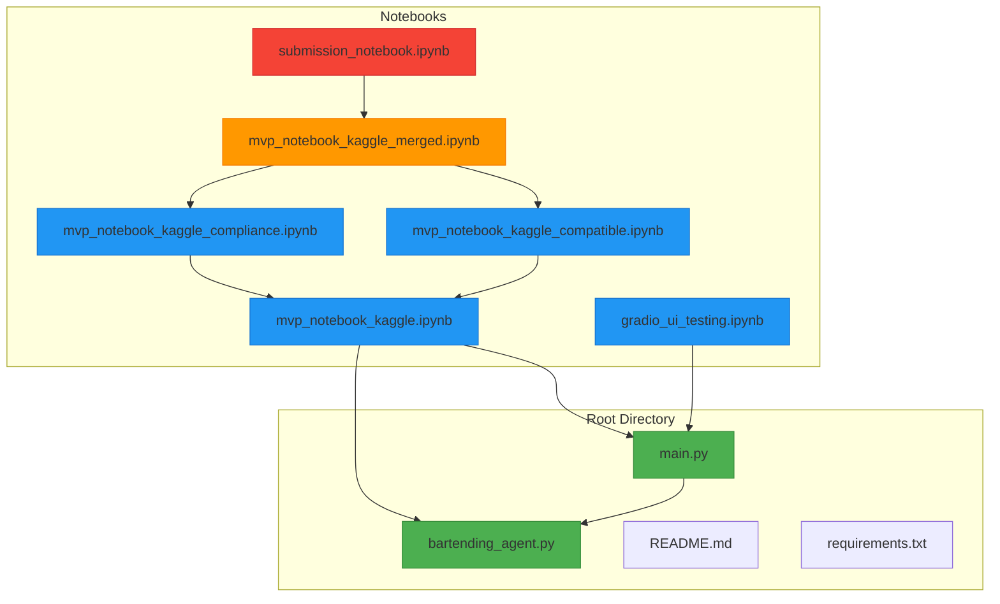
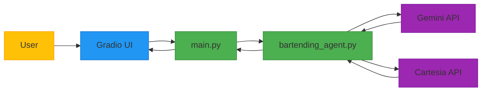
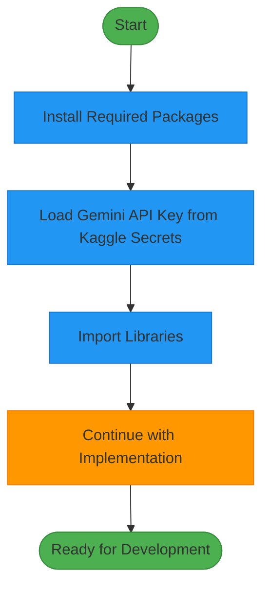
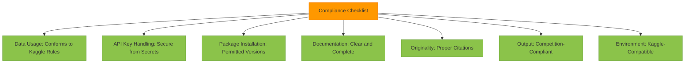
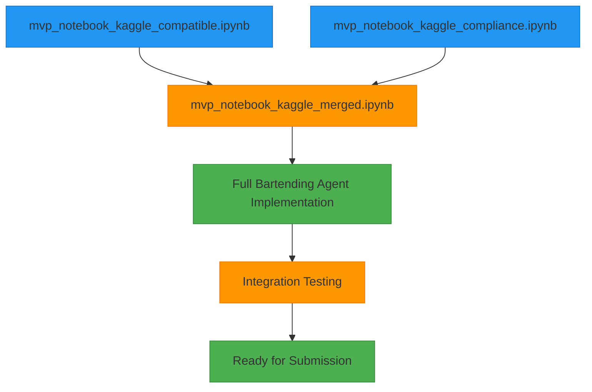
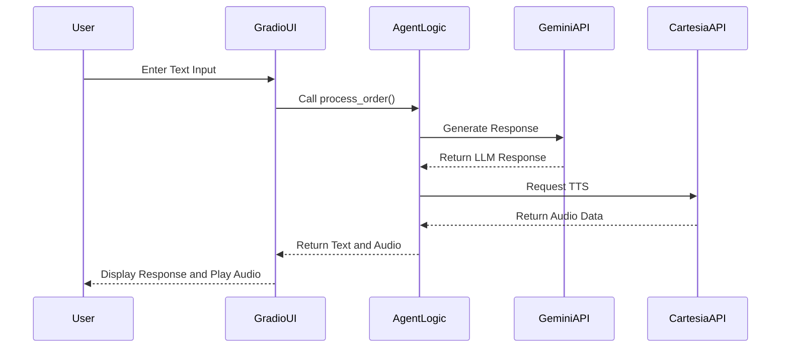
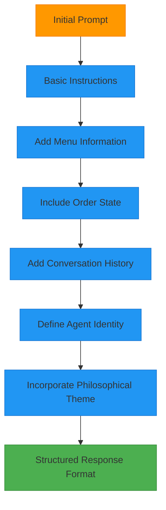
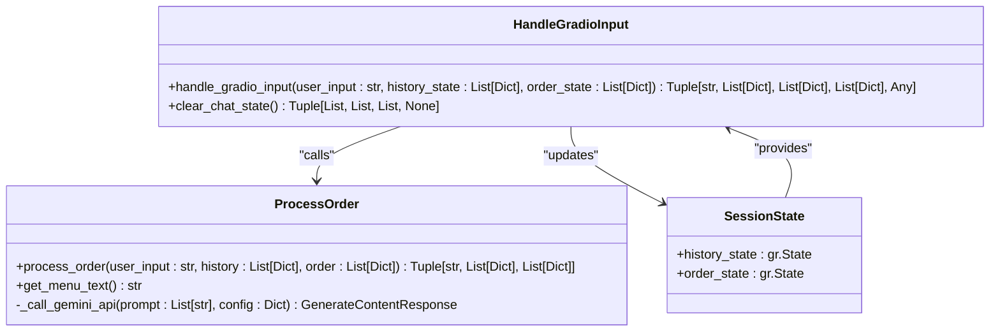
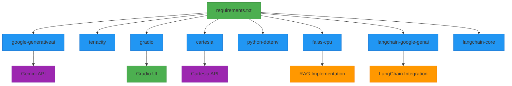

# MVP Development and Iteration Notebooks

<cite>
**Referenced Files in This Document**   
- [notebooks/mvp_notebook_kaggle.ipynb](file://notebooks/mvp_notebook_kaggle.ipynb)
- [notebooks/mvp_notebook_kaggle_compatible.ipynb](file://notebooks/mvp_notebook_kaggle_compatible.ipynb)
- [notebooks/mvp_notebook_kaggle_compliance.ipynb](file://notebooks/mvp_notebook_kaggle_compliance.ipynb)
- [notebooks/mvp_notebook_kaggle_merged.ipynb](file://notebooks/mvp_notebook_kaggle_merged.ipynb)
- [notebooks/gradio_ui_testing.ipynb](file://notebooks/gradio_ui_testing.ipynb)
- [notebooks/submission_notebook.ipynb](file://notebooks/submission_notebook.ipynb)
- [main.py](file://main.py)
- [bartending_agent.py](file://bartending_agent.py)
- [README.md](file://README.md)
</cite>

## Table of Contents
1. [Introduction](#introduction)
2. [Project Structure](#project-structure)
3. [Core Components](#core-components)
4. [Architecture Overview](#architecture-overview)
5. [Detailed Component Analysis](#detailed-component-analysis)
6. [Dependency Analysis](#dependency-analysis)
7. [Performance Considerations](#performance-considerations)
8. [Troubleshooting Guide](#troubleshooting-guide)
9. [Conclusion](#conclusion)

## Introduction
This document provides a comprehensive analysis of the iterative development process for the Maya Bartending Agent, focusing on the series of MVP notebooks used throughout the project lifecycle. These notebooks serve distinct purposes in the development workflow, enabling experimentation, compatibility testing, compliance validation, and feature integration before deployment. The evolution of the core bartending logic is traced through these notebooks, highlighting advancements in prompt engineering, state management, and API interactions with the Gemini and Cartesia services. Developers leverage these notebooks to test various LLM configurations, menu structures, and response templates in isolation, ensuring robustness before merging changes into the main application files. This documentation also addresses version drift risks and outlines synchronization strategies between notebook experiments and the production codebase in `main.py` and `bartending_agent.py`.

## Project Structure
The project follows a modular structure with a clear separation between development artifacts and production code. The `notebooks/` directory contains all experimental and testing Jupyter notebooks, while the root directory houses the core application files. This organization supports an iterative development workflow where features are prototyped in notebooks before being integrated into the main application.



**Diagram sources**
- [main.py](file://main.py#L1-L143)
- [bartending_agent.py](file://bartending_agent.py#L1-L375)
- [notebooks/mvp_notebook_kaggle.ipynb](file://notebooks/mvp_notebook_kaggle.ipynb#L1-L2467)
- [notebooks/mvp_notebook_kaggle_compatible.ipynb](file://notebooks/mvp_notebook_kaggle_compatible.ipynb#L1-L105)
- [notebooks/mvp_notebook_kaggle_compliance.ipynb](file://notebooks/mvp_notebook_kaggle_compliance.ipynb#L1-L138)
- [notebooks/mvp_notebook_kaggle_merged.ipynb](file://notebooks/mvp_notebook_kaggle_merged.ipynb#L1-L195)
- [notebooks/gradio_ui_testing.ipynb](file://notebooks/gradio_ui_testing.ipynb#L1-L573)
- [notebooks/submission_notebook.ipynb](file://notebooks/submission_notebook.ipynb#L1-L1)

**Section sources**
- [main.py](file://main.py#L1-L143)
- [bartending_agent.py](file://bartending_agent.py#L1-L375)
- [notebooks/mvp_notebook_kaggle.ipynb](file://notebooks/mvp_notebook_kaggle.ipynb#L1-L2467)

## Core Components
The core functionality of the bartending agent is distributed between `main.py` and `bartending_agent.py`. The `bartending_agent.py` file contains the stateless logic for processing orders, managing the menu, and interfacing with the Gemini and Cartesia APIs. This separation allows the core agent logic to be tested independently in notebooks while `main.py` focuses on the Gradio UI integration and session state management.

The agent implements a stateless design pattern where session state (conversation history and order) is passed as parameters to functions and returned as updated values. This approach facilitates testing and ensures that each interaction is deterministic based on the input state. The `process_order` function in `bartending_agent.py` is the central component, responsible for constructing prompts with context from the menu, current order, and conversation history, then processing the LLM response and updating the order state based on heuristics.

**Section sources**
- [main.py](file://main.py#L1-L143)
- [bartending_agent.py](file://bartending_agent.py#L1-L375)

## Architecture Overview
The system architecture follows a client-server model with a modular design that separates concerns between UI presentation, business logic, and external service integration. The Gradio interface serves as the client-facing component, handling user input and displaying responses with both text and audio output. The backend logic is implemented in `bartending_agent.py`, which acts as an intermediary between the UI and external AI services.



**Diagram sources**
- [main.py](file://main.py#L1-L143)
- [bartending_agent.py](file://bartending_agent.py#L1-L375)

## Detailed Component Analysis

### MVP Notebook Variants and Their Purposes
The series of MVP notebooks represents an iterative development workflow designed to address specific development challenges and requirements. Each notebook variant serves a distinct purpose in the development lifecycle, enabling targeted experimentation and validation before integration into the main codebase.

#### Compatibility Testing Notebook
The `mvp_notebook_kaggle_compatible.ipynb` notebook is specifically designed for compatibility with the Kaggle platform. It contains minimal setup code focused on installing required packages and loading API keys from Kaggle Secrets, ensuring that the environment matches Kaggle's execution constraints. This notebook serves as a template for developers to verify that their code will run successfully in the Kaggle environment without platform-specific dependencies or configurations.



**Diagram sources**
- [notebooks/mvp_notebook_kaggle_compatible.ipynb](file://notebooks/mvp_notebook_kaggle_compatible.ipynb#L1-L105)

**Section sources**
- [notebooks/mvp_notebook_kaggle_compatible.ipynb](file://notebooks/mvp_notebook_kaggle_compatible.ipynb#L1-L105)

#### Compliance Validation Notebook
The `mvp_notebook_kaggle_compliance.ipynb` notebook includes a comprehensive compliance checklist for Kaggle competitions, ensuring that the implementation adheres to platform rules and best practices. This notebook goes beyond basic compatibility by addressing critical aspects such as data usage policies, secure API key handling, package installation protocols, and documentation standards. The compliance checklist serves as both a verification tool and an educational resource for developers, highlighting the requirements for competition submission.



**Diagram sources**
- [notebooks/mvp_notebook_kaggle_compliance.ipynb](file://notebooks/mvp_notebook_kaggle_compliance.ipynb#L1-L138)

**Section sources**
- [notebooks/mvp_notebook_kaggle_compliance.ipynb](file://notebooks/mvp_notebook_kaggle_compliance.ipynb#L1-L138)

#### Feature Merging and Integration Notebook
The `mvp_notebook_kaggle_merged.ipynb` notebook represents the integration phase where compatibility and compliance requirements are combined with the full implementation of the bartending agent. This notebook serves as a staging environment where developers can test the complete functionality while ensuring it meets all platform requirements. It contains the merged setup from both the compatibility and compliance notebooks, providing a comprehensive template for final testing before submission.



**Diagram sources**
- [notebooks/mvp_notebook_kaggle_merged.ipynb](file://notebooks/mvp_notebook_kaggle_merged.ipynb#L1-L195)

**Section sources**
- [notebooks/mvp_notebook_kaggle_merged.ipynb](file://notebooks/mvp_notebook_kaggle_merged.ipynb#L1-L195)

#### Standalone Execution and UI Testing Notebook
The `gradio_ui_testing.ipynb` notebook is designed for standalone execution and UI testing, allowing developers to validate the Gradio interface independently of the main application. This notebook contains a complete implementation of the bartending agent with UI components, enabling comprehensive testing of the user experience. It serves as a sandbox for experimenting with different UI configurations, theme variations, and layout options before implementing changes in the production code.



**Diagram sources**
- [notebooks/gradio_ui_testing.ipynb](file://notebooks/gradio_ui_testing.ipynb#L1-L573)
- [main.py](file://main.py#L1-L143)

**Section sources**
- [notebooks/gradio_ui_testing.ipynb](file://notebooks/gradio_ui_testing.ipynb#L1-L573)
- [main.py](file://main.py#L1-L143)

### Core Bartending Logic Evolution
The evolution of the core bartending logic is evident when comparing the implementation across different notebooks and the main application files. The logic has progressed from a monolithic design to a modular, stateless architecture that facilitates testing and maintenance.

#### Prompt Engineering Development
The prompt engineering approach has evolved to incorporate more contextual information and structured guidance for the LLM. Early implementations used basic prompts, while the current version in `mvp_notebook_kaggle.ipynb` includes detailed instructions, menu information, order state, and conversation history. The prompt template explicitly defines the agent's identity as "Maya" and incorporates the philosophical theme of "Moksha," creating a consistent character voice across interactions.



**Diagram sources**
- [notebooks/mvp_notebook_kaggle.ipynb](file://notebooks/mvp_notebook_kaggle.ipynb#L1-L2467)
- [bartending_agent.py](file://bartending_agent.py#L1-L375)

**Section sources**
- [notebooks/mvp_notebook_kaggle.ipynb](file://notebooks/mvp_notebook_kaggle.ipynb#L1-L2467)
- [bartending_agent.py](file://bartending_agent.py#L1-L375)

#### State Management Implementation
The state management system has been refactored to use a stateless design pattern where session state is passed as parameters and returned as updated values. This approach eliminates global variables and makes the logic more predictable and easier to test. The `process_order` function accepts the current session history and order as parameters and returns the updated versions, allowing the Gradio UI to manage state through `gr.State` components.



**Diagram sources**
- [main.py](file://main.py#L1-L143)
- [bartending_agent.py](file://bartending_agent.py#L1-L375)

**Section sources**
- [main.py](file://main.py#L1-L143)
- [bartending_agent.py](file://bartending_agent.py#L1-L375)

#### API Interaction Patterns
The API interaction patterns have been enhanced with robust error handling and retry mechanisms. The `_call_gemini_api` function in `bartending_agent.py` is decorated with `tenacity_retry`, providing automatic retry functionality for transient errors. Similarly, the `get_voice_audio` function includes retry logic for the Cartesia API, ensuring reliable audio generation even under unstable network conditions.

```mermaid
sequenceDiagram
participant Client
participant Agent
participant Gemini
participant Cartesia
Client->>Agent : Send Request
loop Retry Logic
Agent->>Gemini : API Call
alt Success
Gemini-->>Agent : Response
break Continue
else Error
Agent->>Agent : Wait Exponential
end
end
loop Retry Logic
Agent->>Cartesia : TTS Request
alt Success
Cartesia-->>Agent : Audio Data
break Continue
else Error
Agent->>Agent : Wait Exponential
end
end
Agent-->>Client : Final Response
```

**Diagram sources**
- [bartending_agent.py](file://bartending_agent.py#L1-L375)

**Section sources**
- [bartending_agent.py](file://bartending_agent.py#L1-L375)

## Dependency Analysis
The project dependencies are managed through a combination of the `requirements.txt` file and inline package installation in the notebooks. The core dependencies include `google-generativeai` for LLM interactions, `cartesia` for text-to-speech functionality, `gradio` for the UI interface, `tenacity` for retry logic, and `langchain-google-genai` for advanced agent capabilities. The notebooks also include `faiss-cpu` and `langchain-core` for the RAG implementation, demonstrating the use of vector databases for enhanced conversational capabilities.



**Diagram sources**
- [requirements.txt](file://requirements.txt)
- [notebooks/mvp_notebook_kaggle.ipynb](file://notebooks/mvp_notebook_kaggle.ipynb#L1-L2467)

**Section sources**
- [requirements.txt](file://requirements.txt)
- [notebooks/mvp_notebook_kaggle.ipynb](file://notebooks/mvp_notebook_kaggle.ipynb#L1-L2467)

## Performance Considerations
The performance of the bartending agent is influenced by several factors, including LLM response times, audio generation latency, and network conditions. The implementation includes several optimizations to mitigate performance issues, such as limiting the conversation history to the last 10 turns to reduce prompt length and using retry mechanisms with exponential backoff to handle transient API failures. The use of synchronous API calls in the current implementation may create blocking behavior, suggesting a potential improvement through asynchronous processing for better responsiveness.

## Troubleshooting Guide
Common issues in the development and deployment of the bartending agent include API key configuration errors, package compatibility issues, and environment-specific constraints. The notebooks provide targeted solutions for these problems, with the compatibility notebook addressing Kaggle-specific requirements and the compliance notebook ensuring adherence to competition rules. When debugging conversation logic, developers can use the standalone `gradio_ui_testing.ipynb` notebook to isolate and resolve issues without affecting the main application. For refining AI-generated responses, the prompt engineering components in `mvp_notebook_kaggle.ipynb` can be modified and tested iteratively to achieve the desired conversational quality.

**Section sources**
- [notebooks/mvp_notebook_kaggle.ipynb](file://notebooks/mvp_notebook_kaggle.ipynb#L1-L2467)
- [notebooks/mvp_notebook_kaggle_compatible.ipynb](file://notebooks/mvp_notebook_kaggle_compatible.ipynb#L1-L105)
- [notebooks/mvp_notebook_kaggle_compliance.ipynb](file://notebooks/mvp_notebook_kaggle_compliance.ipynb#L1-L138)
- [notebooks/gradio_ui_testing.ipynb](file://notebooks/gradio_ui_testing.ipynb#L1-L573)

## Conclusion
The series of MVP notebooks in the Maya Bartending Agent project demonstrates a systematic approach to iterative development, where each notebook variant serves a specific purpose in the development lifecycle. The compatibility notebook ensures platform-specific requirements are met, the compliance notebook verifies adherence to competition rules, the merged notebook integrates these requirements with the full implementation, and the UI testing notebook provides a sandbox for standalone execution and interface validation. This structured workflow enables developers to experiment with different LLM configurations, menu structures, and response templates in isolation before integrating changes into the main application. The evolution of the core bartending logic reflects improvements in prompt engineering, state management, and API interactions, resulting in a robust and maintainable system. To mitigate version drift risks, developers should establish a synchronization protocol that regularly merges changes from the main application files into the notebooks and validates that notebook experiments are properly integrated back into `main.py` and `bartending_agent.py`.