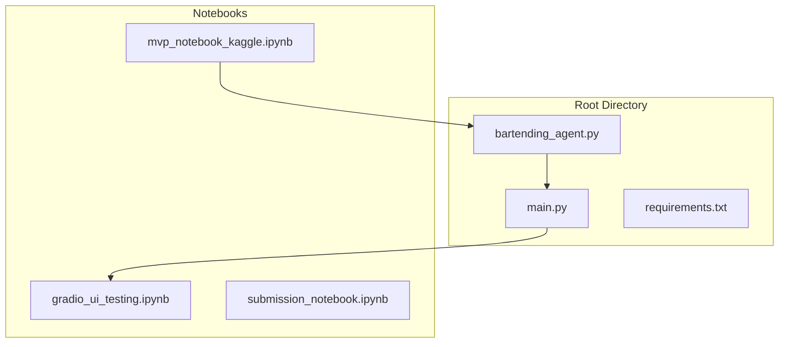
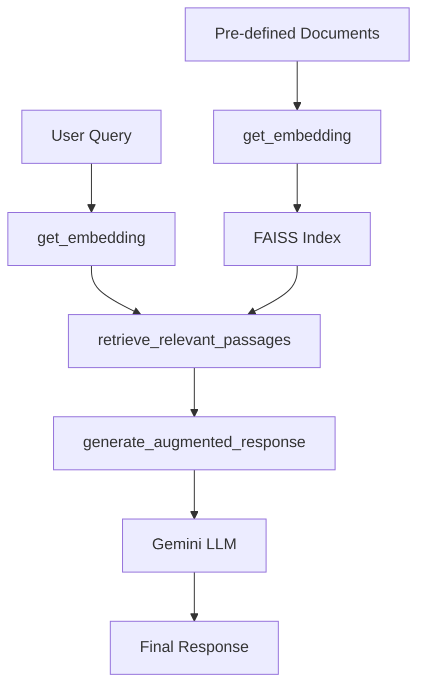
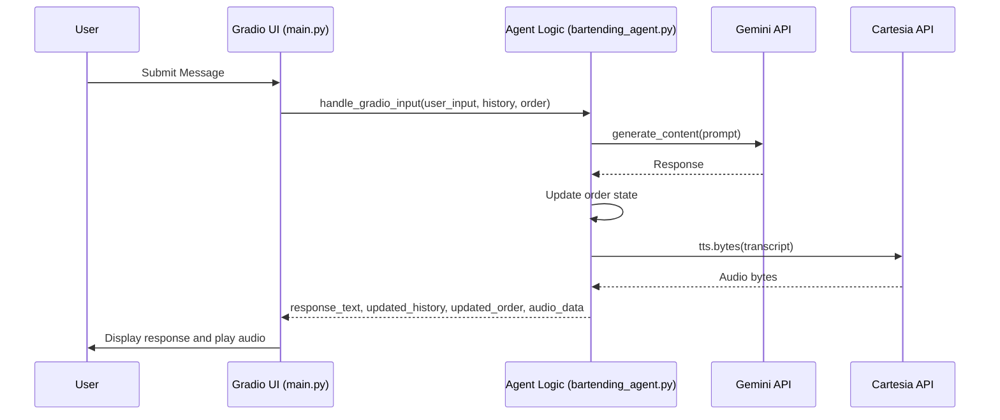
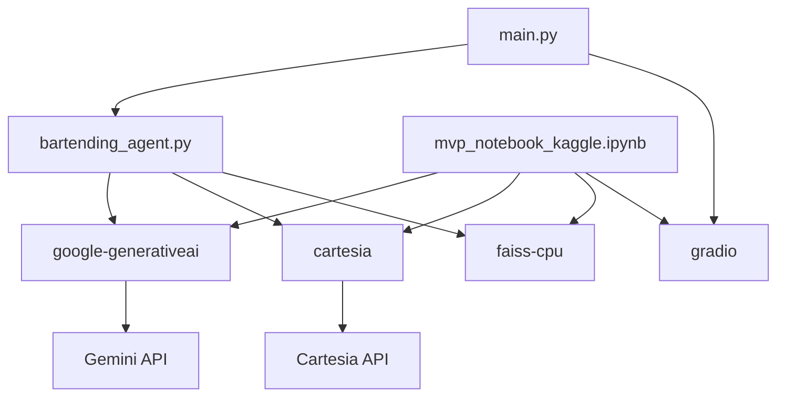

# MVP Notebook for Kaggle Integration

<cite>
**Referenced Files in This Document**   
- [mvp_notebook_kaggle.ipynb](file://notebooks/mvp_notebook_kaggle.ipynb)
- [bartending_agent.py](file://bartending_agent.py)
- [main.py](file://main.py)
</cite>

## Table of Contents
1. [Introduction](#introduction)
2. [Project Structure](#project-structure)
3. [Core Components](#core-components)
4. [Architecture Overview](#architecture-overview)
5. [Detailed Component Analysis](#detailed-component-analysis)
6. [Dependency Analysis](#dependency-analysis)
7. [Performance Considerations](#performance-considerations)
8. [Troubleshooting Guide](#troubleshooting-guide)
9. [Conclusion](#conclusion)

## Introduction
The **mvp_notebook_kaggle.ipynb** serves as the foundational development environment for the Maya Bartending Agent, specifically tailored for integration with the Kaggle platform. This notebook functions as a critical prototyping and testing ground for the core AI bartender logic before deployment in a full Gradio UI application. It isolates and validates essential functionalities such as user input handling, interaction with the Gemini Large Language Model (LLM), response generation, and state management. The document details how this notebook enables iterative development of AI prompts, testing of response parsing, and verification of API connectivity, providing a streamlined workflow for developers to refine the agent's conversational and functional capabilities.

## Project Structure
The project is organized in a modular structure, with distinct directories and files serving specific purposes. The `notebooks/` directory contains the primary development and testing notebooks, including the `mvp_notebook_kaggle.ipynb` which is the focus of this documentation. The root directory houses the core application logic in `bartending_agent.py`, the Gradio UI controller in `main.py`, and the `requirements.txt` file for dependency management. This separation allows for a clear workflow where core logic is developed and tested in the notebook, then refactored into reusable modules for the production application.



**Diagram sources**
- [mvp_notebook_kaggle.ipynb](file://notebooks/mvp_notebook_kaggle.ipynb)
- [bartending_agent.py](file://bartending_agent.py)
- [main.py](file://main.py)

**Section sources**
- [mvp_notebook_kaggle.ipynb](file://notebooks/mvp_notebook_kaggle.ipynb)
- [main.py](file://main.py)

## Core Components
The core components of the Maya Bartending Agent system are the `mvp_notebook_kaggle.ipynb`, the `bartending_agent.py` module, and the `main.py` script. The notebook is responsible for prototyping and testing the agent's AI logic, including Retrieval-Augmented Generation (RAG), function calling, and Text-to-Speech (TTS) integration. The `bartending_agent.py` file contains the stateless, reusable business logic for processing orders and generating responses, while `main.py` orchestrates the Gradio user interface, managing session state and connecting user interactions to the backend logic. This modular design ensures that the AI's core intelligence can be developed independently of the UI.

**Section sources**
- [mvp_notebook_kaggle.ipynb](file://notebooks/mvp_notebook_kaggle.ipynb)
- [bartending_agent.py](file://bartending_agent.py)
- [main.py](file://main.py)

## Architecture Overview
The system architecture follows a layered pattern, separating the user interface, business logic, and external services. The Gradio UI, defined in `main.py`, acts as the presentation layer, receiving user input and displaying responses. It manages session state using `gr.State` variables for conversation history and order details. This state is passed to the `process_order` function in `bartending_agent.py`, which forms the application logic layer. This function constructs a prompt using the current state and the menu, then calls the Gemini LLM via the Google Generative AI API. The response is processed, and the order state is updated. For audio output, the `get_voice_audio` function in `bartending_agent.py` uses the Cartesia API to generate speech from the text response. The notebook `mvp_notebook_kaggle.ipynb` provides a development environment where each of these layers can be tested and debugged in isolation.

```mermaid
graph TD
A[Gradio UI<br>(main.py)] --> B[Session State<br>(history, order)]
B --> C[Agent Logic<br>(bartending_agent.py)]
C --> D[Gemini LLM API]
C --> E[Cartesia TTS API]
C --> F[Menu Data]
D --> C
E --> C
C --> A
A --> G[User]
```

**Diagram sources**
- [mvp_notebook_kaggle.ipynb](file://notebooks/mvp_notebook_kaggle.ipynb)
- [bartending_agent.py](file://bartending_agent.py)
- [main.py](file://main.py)

## Detailed Component Analysis

### MVP Notebook for Kaggle Integration
The `mvp_notebook_kaggle.ipynb` is a comprehensive Jupyter notebook designed for iterative development and testing of the Maya Bartending Agent on the Kaggle platform. It begins with a detailed setup section that installs all necessary Python packages, including `google-generativeai`, `langchain-google-genai`, `gradio`, `cartesia`, and `faiss-cpu`. The notebook then imports the required libraries and configures logging for debugging. A critical part of the setup is the API key configuration, which requires both a Gemini API key for LLM access and a Cartesia API key for Text-to-Speech functionality. The notebook provides detailed instructions for obtaining these keys, including setting up billing for the Gemini API.

#### RAG Implementation
The notebook implements a Retrieval-Augmented Generation (RAG) system to give the AI bartender a consistent personality and enable engaging small talk. It uses the `google-generativeai` library to create embeddings for a set of pre-defined "personality" phrases (e.g., "If there's one thing Bartending teaches you, it's patience."). These embeddings are stored in a FAISS vector database, which is used as an alternative to ChromaDB due to local compilation issues on macOS. The RAG pipeline consists of three key functions: `get_embedding()` to create vector representations, `retrieve_relevant_passages()` to find the most contextually similar pre-written responses to a user's query, and `generate_augmented_response()` to generate a final response using the Gemini LLM, incorporating the retrieved passage as context. This allows the agent to respond in a character-consistent manner, such as explaining that the bar's name "MOK 5-ha" (pronounced "Moksha") represents liberation in Eastern philosophy.



**Diagram sources**
- [mvp_notebook_kaggle.ipynb](file://notebooks/mvp_notebook_kaggle.ipynb)

**Section sources**
- [mvp_notebook_kaggle.ipynb](file://notebooks/mvp_notebook_kaggle.ipynb)

#### Tooling and Function Calling
The notebook defines a `get_menu()` tool using the `@tool` decorator from LangChain. This tool returns a comprehensive string representation of the drink menu, including cocktails, beer, non-alcoholic beverages, modifiers, drink term explanations, and a preference guide. This structured menu data is a cornerstone of the agent's functionality, enabling it to accurately process complex drink orders with specific requests like "neat" or "on the rocks." The use of function calling allows the LLM to invoke this tool when it needs up-to-date information about available drinks and prices, ensuring accurate and consistent responses. This tool is a key component in the agent's ability to manage orders and calculate bills correctly.

**Section sources**
- [mvp_notebook_kaggle.ipynb](file://notebooks/mvp_notebook_kaggle.ipynb)

### Core Agent Logic Module
The `bartending_agent.py` file contains the stateless core logic for the bartending agent. Its primary function, `process_order()`, takes the user's input text and the current session's history and order state as inputs, and returns the agent's response along with the updated history and order. This function constructs a dynamic prompt that includes the menu, the current order, and a limited conversation history, ensuring the LLM has all necessary context. It uses a retry mechanism via the `tenacity` library to handle transient API errors when calling the Gemini LLM. The function also includes heuristic logic to update the order state by parsing the LLM's response for keywords indicating a drink has been added. A separate function, `get_voice_audio()`, uses the Cartesia API to generate speech from the text response, with its own retry logic for robustness.

**Section sources**
- [bartending_agent.py](file://bartending_agent.py)

### Gradio UI Controller
The `main.py` script is responsible for creating the Gradio web interface. It imports the `process_order` and `get_voice_audio` functions from `bartending_agent.py` and uses them within a Gradio callback function, `handle_gradio_input`. This callback is triggered when a user submits a message. It receives the user input and the current session state (history and order) from `gr.State` components, calls `process_order` to get a text response and updated state, and then calls `get_voice_audio` to generate a corresponding audio file. The script returns the updated chatbot display, the updated state variables, and the audio data, which Gradio automatically renders. The UI features a two-column layout with an avatar image on the left and the chat interface on the right, along with a "Clear Conversation" button that resets all state variables.



**Diagram sources**
- [main.py](file://main.py)
- [bartending_agent.py](file://bartending_agent.py)

## Dependency Analysis
The Maya Bartending Agent relies on a combination of external APIs and Python libraries. The primary external dependencies are the **Google Generative AI API** for LLM capabilities and the **Cartesia API** for Text-to-Speech. The project uses several key Python packages: `google-generativeai` and `langchain-google-genai` for interacting with Gemini, `cartesia` for TTS, `gradio` for the web UI, `faiss-cpu` for the vector database, and `tenacity` for retry logic. The `dotenv` library is used to load API keys from a `.env` file. The dependency chain starts with the Gradio UI in `main.py`, which depends on the functions in `bartending_agent.py`, which in turn depend on the external APIs and their respective client libraries. The `mvp_notebook_kaggle.ipynb` has a similar dependency structure but is used for development rather than production.



**Diagram sources**
- [mvp_notebook_kaggle.ipynb](file://notebooks/mvp_notebook_kaggle.ipynb)
- [bartending_agent.py](file://bartending_agent.py)
- [main.py](file://main.py)

## Performance Considerations
Performance in this system is influenced by several factors. The most significant is the latency of the external API calls to Gemini and Cartesia, which can vary based on network conditions and service load. The use of retry logic with exponential backoff in both `process_order` and `get_voice_audio` functions helps to mitigate transient failures but can increase the total response time. The RAG implementation in the notebook uses a local FAISS index, which provides fast retrieval times for the small set of personality documents. However, the overall response time for a user query is the sum of the LLM generation time and the TTS synthesis time. To optimize performance, the Gradio UI limits the conversation history sent to the LLM to the last 10 exchanges, preventing the prompt from becoming too large and slow to process. Running the application on Kaggle provides a consistent computational environment, minimizing local hardware variability.

## Troubleshooting Guide
Common issues with the Maya Bartending Agent often stem from configuration and connectivity problems. The most frequent issue is missing or incorrect API keys. Users must ensure that both `GEMINI_API_KEY` and `CARTESIA_API_KEY` are correctly set in their environment variables or `.env` file, as the code will raise a fatal error if they are not found. For the Gemini API, users must have an active Google Cloud project with billing enabled and the Gemini API activated. If the model name (e.g., `gemini-2.5-flash-preview-04-17`) is not accessible, the code will fail to initialize. For the notebook, users may encounter package installation issues; the provided `pip install` command should be run in the correct environment. If the Cartesia voice ID is not valid, the TTS functionality will fail. In the Gradio app, if the avatar image does not load, the path `assets/bartender_avatar_ai_studio.jpeg` must be verified. Finally, if the LLM response is blocked for safety reasons, the prompt may need to be adjusted.

**Section sources**
- [mvp_notebook_kaggle.ipynb](file://notebooks/mvp_notebook_kaggle.ipynb)
- [bartending_agent.py](file://bartending_agent.py)
- [main.py](file://main.py)

## Conclusion
The `mvp_notebook_kaggle.ipynb` is an essential component of the Maya Bartending Agent development workflow. It provides a powerful, isolated environment for prototyping and testing the core AI logic, including RAG for personality, function calling for menu access, and TTS integration. By separating the development of AI functionality from the UI in `main.py`, the project enables a highly efficient and iterative development process. The use of stateless functions in `bartending_agent.py` promotes code reusability and testability. This well-structured approach, combining a development notebook with a modular application, ensures that the agent's conversational abilities and order processing logic are robust and well-validated before deployment, making it a successful foundation for the Kaggle-integrated bartending agent.