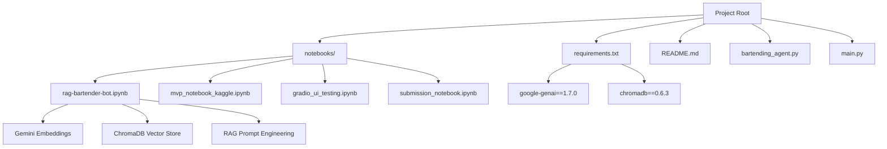
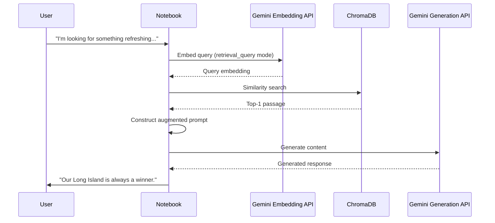

# RAG Implementation Notebook

<cite>
**Referenced Files in This Document**   
- [notebooks/rag-bartender-bot.ipynb](file://notebooks/rag-bartender-bot.ipynb)
- [requirements.txt](file://requirements.txt)
- [README.md](file://README.md)
</cite>

## Table of Contents
1. [Introduction](#introduction)
2. [Project Structure](#project-structure)
3. [Core Components](#core-components)
4. [Architecture Overview](#architecture-overview)
5. [Detailed Component Analysis](#detailed-component-analysis)
6. [RAG Pipeline: Embedding, Retrieval, and Generation](#rag-pipeline-embedding-retrieval-and-generation)
7. [Performance and Optimization Considerations](#performance-and-optimization-considerations)
8. [Extensibility and Maintenance Guidance](#extensibility-and-maintenance-guidance)
9. [Conclusion](#conclusion)

## Introduction

This document provides a comprehensive analysis of the Retrieval-Augmented Generation (RAG) implementation in the `rag-bartender-bot.ipynb` notebook, part of the MayaBartendingAgent project. The system enables a conversational AI bartender to provide contextually relevant responses by retrieving knowledge from a curated database of drink recommendations, customer interactions, and bar-related phrases. It leverages Google's Gemini models for embedding generation and text synthesis, with ChromaDB serving as the vector database for efficient similarity search. The goal is to enhance response accuracy and relevance by grounding the LLM’s output in external, domain-specific knowledge.

The RAG pipeline consists of three key stages: embedding creation, semantic retrieval, and prompt augmentation. This documentation details each stage, explains the integration of components, and provides insights into performance, scalability, and extensibility.

## Project Structure

The project follows a modular structure typical of data science and AI experimentation workflows, with notebooks serving as primary development and testing environments. The core logic resides in Jupyter notebooks, while configuration and dependencies are managed through standard Python files.



**Diagram sources**
- [notebooks/rag-bartender-bot.ipynb](file://notebooks/rag-bartender-bot.ipynb#L0-L500)
- [requirements.txt](file://requirements.txt#L1-L5)

**Section sources**
- [notebooks/rag-bartender-bot.ipynb](file://notebooks/rag-bartender-bot.ipynb)
- [README.md](file://README.md)

## Core Components

The primary component of this RAG system is the `rag-bartender-bot.ipynb` notebook, which encapsulates the full pipeline from data ingestion to response generation. Key elements include:

- **GeminiEmbeddingFunction**: A custom embedding function that interfaces with Google’s `text-embedding-004` model via the `google-genai` SDK.
- **ChromaDB Collection**: A persistent vector store named `bartenderbotdb` that holds embedded textual knowledge.
- **Retrieval Logic**: Query-time embedding and similarity search to fetch the most relevant passage.
- **Prompt Augmentation**: Dynamic construction of LLM prompts that include retrieved context.
- **Response Generation**: Final output synthesis using the `gemini-2.0-flash` model.

These components work together to ensure that the bartender bot responds based on factual, pre-defined knowledge rather than hallucination.

**Section sources**
- [notebooks/rag-bartender-bot.ipynb](file://notebooks/rag-bartender-bot.ipynb#L100-L400)

## Architecture Overview

The RAG system follows a clean separation between indexing and querying phases, with distinct modes for document and query embeddings. The architecture integrates Google’s generative AI services with an open-source vector database to achieve scalable, low-latency retrieval.

```mermaid
graph TB
subgraph "Knowledge Base"
D[Raw Text Documents] --> E[Gemini Embedding Model]
E --> F[Vector Embeddings]
F --> G[ChromaDB Collection]
end
subgraph "Query Flow"
H[User Query] --> I[Gemini Embedding Model <br/> (Query Mode)]
I --> J[Similarity Search in ChromaDB]
J --> K[Top-1 Retrieved Passage]
K --> L[Prompt Construction]
L --> M[Gemini LLM <br/> (gemini-2.0-flash)]
M --> N[Final Response]
end
G --> J
```

**Diagram sources**
- [notebooks/rag-bartender-bot.ipynb](file://notebooks/rag-bartender-bot.ipynb#L200-L500)

## Detailed Component Analysis

### Gemini Embedding Function Implementation

The `GeminiEmbeddingFunction` class is a crucial bridge between ChromaDB and Google’s embedding API. It supports dual modes—document and query—by setting the `task_type` parameter appropriately during embedding calls.

```python
class GeminiEmbeddingFunction(EmbeddingFunction):
    document_mode = True

    @retry.Retry(predicate=is_retriable)
    def __call__(self, input: Documents) -> Embeddings:
        if self.document_mode:
            embedding_task = "retrieval_document"
        else:
            embedding_task = "retrieval_query"

        response = client.models.embed_content(
            model="models/text-embedding-004",
            contents=input,
            config=types.EmbedContentConfig(task_type=embedding_task),
        )
        return [e.values for e in response.embeddings]
```

This design ensures optimal performance and compliance with Google’s API guidelines for retrieval tasks. The retry decorator handles rate limiting (HTTP 429/503 errors), improving robustness in production-like environments.

**Section sources**
- [notebooks/rag-bartender-bot.ipynb](file://notebooks/rag-bartender-bot.ipynb#L150-L200)

### ChromaDB Vector Store Initialization

The notebook initializes a ChromaDB client and creates a collection specifically for bartender knowledge. Documents are added with simple numeric IDs.

```python
chroma_client = chromadb.Client()
db = chroma_client.get_or_create_collection(name=DB_NAME, embedding_function=embed_fn)
db.add(documents=documents, ids=[str(i) for i in range(len(documents))])
```

The use of in-memory storage (default ChromaDB behavior) is suitable for prototyping but may require persistence configuration for long-term deployment.

**Section sources**
- [notebooks/rag-bartender-bot.ipynb](file://notebooks/rag-bartender-bot.ipynb#L200-L250)

## RAG Pipeline: Embedding, Retrieval, and Generation

### Step 1: Embedding Process

During indexing, all 10 predefined documents are embedded using the `text-embedding-004` model in `retrieval_document` mode. This ensures embeddings are optimized for downstream semantic search.

### Step 2: Query Retrieval Logic

At query time, the embedding function switches to `retrieval_query` mode before performing a similarity search:

```python
embed_fn.document_mode = False
result = db.query(query_texts=[query], n_results=1)
```

The system retrieves the single most relevant passage based on cosine similarity in the vector space.

### Step 3: Context Injection into Prompt

The retrieved passage is injected into a structured prompt that guides the LLM’s behavior:

```text
You are a bartender bot at "Mok-5-sha Bar" that is conversational and interacts with customers
using text from the reference passage included below. 
Be sure to respond in a complete sentence while maintaining a modest and humorous tone. 
If the passage is irrelevant to the answer, you may ignore it.

QUESTION: I'm looking for something refreshing, what do you recommend?
PASSAGE: If you're looking for something refreshing, our Long Island is always a winner.
```

This prompt engineering technique ensures the model grounds its response in the provided context.

### Step 4: Response Generation

The final step uses `gemini-2.0-flash` to generate a natural language response. In the example, the output directly echoes the passage, indicating faithful context usage.



**Diagram sources**
- [notebooks/rag-bartender-bot.ipynb](file://notebooks/rag-bartender-bot.ipynb#L300-L500)

**Section sources**
- [notebooks/rag-bartender-bot.ipynb](file://notebooks/rag-bartender-bot.ipynb#L300-L500)

## Performance and Optimization Considerations

### Indexing Latency

Embedding 10 small documents is fast, but scaling to hundreds or thousands would benefit from batched embedding calls. Currently, embeddings are generated individually per document during `db.add()`.

### Memory Usage

ChromaDB runs in-memory by default. For larger knowledge bases, consider persistent storage via `chromadb.PersistentClient()` to avoid memory overflow.

### Retrieval Accuracy

The current setup uses default similarity metrics (cosine). Fine-tuning can include:
- Increasing `n_results` and re-ranking
- Adding metadata filtering (e.g., by drink type)
- Using query expansion or rephrasing

### Rate Limiting and Retry

The retry mechanism on 429/503 errors improves reliability, but exponential backoff could further enhance resilience under heavy load.

## Extensibility and Maintenance Guidance

### Expanding the Knowledge Base

To add new content:
1. Append strings to the `documents` list
2. Re-run the indexing cell to update the ChromaDB collection
3. Optionally, use metadata for categorization (e.g., {"category": "cocktail"})

### Tuning Similarity Thresholds

While ChromaDB does not expose direct similarity thresholds in `.query()`, relevance can be improved by:
- Post-processing scores from `result['distances']`
- Filtering results below a confidence threshold
- Implementing re-ranking with cross-encoders

### Integration with External Data

Future enhancements could include:
- Loading drink recipes from JSON or CSV
- Pulling bartender scripts from a database
- Auto-updating embeddings on content change

### Deployment Readiness

For production use:
- Replace in-memory ChromaDB with persistent storage
- Wrap logic in a Flask/FastAPI service
- Add logging and monitoring
- Cache frequent queries

## Conclusion

The RAG implementation in `rag-bartender-bot.ipynb` demonstrates a functional and well-structured approach to enhancing LLM responses with domain-specific knowledge. By leveraging Google’s Gemini embedding and generation models alongside ChromaDB, the system achieves accurate, context-aware responses suitable for a conversational bartender agent. The code is clean, modular, and extensible, providing a solid foundation for scaling into a full-fledged service. With minor improvements in persistence, error handling, and performance optimization, this prototype can evolve into a robust AI-powered customer interaction system.