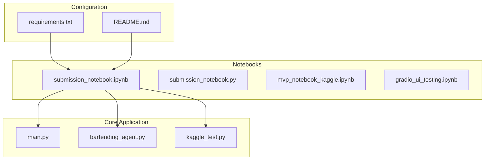
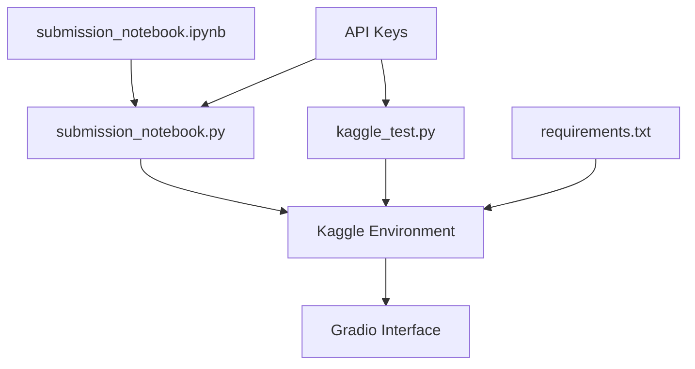
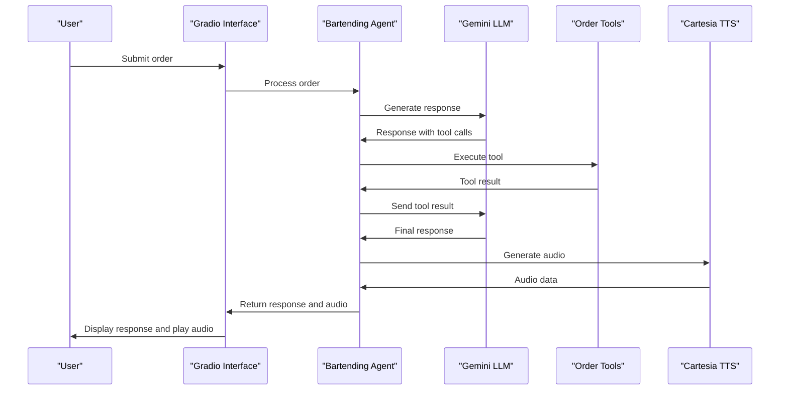
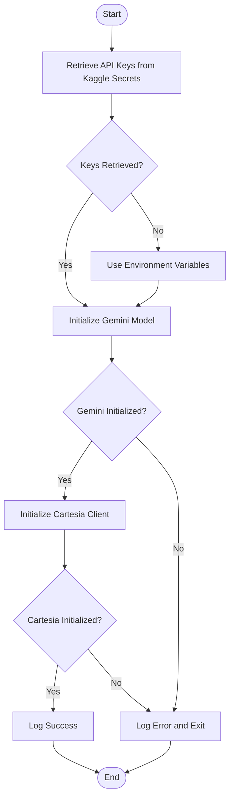
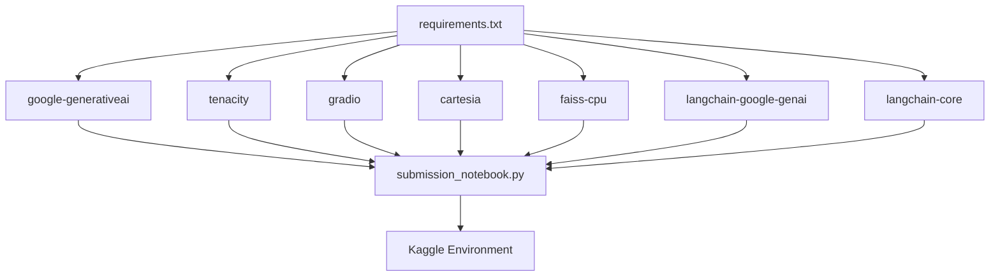

# Submission and Kaggle Integration Notebooks

<cite>
**Referenced Files in This Document**   
- [submission_notebook.ipynb](file://notebooks/submission_notebook.ipynb)
- [submission_notebook.py](file://notebooks/submission_notebook.py)
- [kaggle_test.py](file://kaggle_test.py)
- [bartending_agent.py](file://bartending_agent.py)
- [main.py](file://main.py)
- [requirements.txt](file://requirements.txt)
</cite>

## Table of Contents
1. [Introduction](#introduction)
2. [Project Structure](#project-structure)
3. [Core Components](#core-components)
4. [Architecture Overview](#architecture-overview)
5. [Detailed Component Analysis](#detailed-component-analysis)
6. [Dependency Analysis](#dependency-analysis)
7. [Performance Considerations](#performance-considerations)
8. [Troubleshooting Guide](#troubleshooting-guide)
9. [Conclusion](#conclusion)

## Introduction
This document provides a comprehensive analysis of the submission notebooks designed for Kaggle competition entries within the MayaBartendingAgent project. It details how the `submission_notebook.ipynb` packages core functionality into a self-contained, reproducible format that complies with Kaggle's execution environment. The analysis covers the conversion process from `.ipynb` to `.py`, the role of `kaggle_test.py` in validating submission correctness, and the constraints imposed by Kaggle such as internet access and dependency limits. The document also outlines best practices for structuring submissions, managing API keys securely, ensuring deterministic behavior, and provides troubleshooting tips for common submission failures.

## Project Structure
The project is organized with a clear separation between development notebooks, core application logic, and configuration files. The `notebooks/` directory contains various Jupyter notebooks, including the primary `submission_notebook.ipynb` and its Python counterpart `submission_notebook.py`. The root directory houses the main application files (`main.py`, `bartending_agent.py`), the Kaggle-specific test file (`kaggle_test.py`), and essential configuration files (`requirements.txt`, `README.md`). This structure supports both local development and deployment to Kaggle.

**Diagram sources**
- [submission_notebook.ipynb](file://notebooks/submission_notebook.ipynb)
- [main.py](file://main.py)
- [requirements.txt](file://requirements.txt)

**Section sources**
- [submission_notebook.ipynb](file://notebooks/submission_notebook.ipynb)
- [main.py](file://main.py)
- [requirements.txt](file://requirements.txt)

## Core Components
The core components of the submission system are the `submission_notebook.ipynb`, its converted Python script `submission_notebook.py`, and the `kaggle_test.py` validation script. The `submission_notebook.ipynb` serves as the primary development environment where the bartending agent's functionality is implemented using LangChain, Google's Gemini API, and Cartesia for text-to-speech. The notebook is designed to be self-contained, with all necessary imports, API key handling, and tool definitions in a single file. The `kaggle_test.py` script is crucial for validating that the submission will work correctly in Kaggle's environment by testing API key retrieval and model initialization.

**Section sources**
- [submission_notebook.ipynb](file://notebooks/submission_notebook.ipynb)
- [kaggle_test.py](file://kaggle_test.py)
- [submission_notebook.py](file://notebooks/submission_notebook.py)

## Architecture Overview
The architecture of the submission system is designed to be modular and reproducible. The `submission_notebook.ipynb` contains the complete implementation of the bartending agent, including RAG (Retrieval Augmented Generation) with FAISS, tool definitions for order management, and the Gradio interface. This notebook is converted to a Python script for easier integration and version control. The `kaggle_test.py` script acts as a lightweight validator that ensures the submission can access necessary API keys and initialize the required models. The system is designed to work within Kaggle's constraints, using environment variables and secrets for API key management.

**Diagram sources**
- [submission_notebook.ipynb](file://notebooks/submission_notebook.ipynb)
- [kaggle_test.py](file://kaggle_test.py)
- [requirements.txt](file://requirements.txt)

## Detailed Component Analysis

### Submission Notebook Analysis
The `submission_notebook.ipynb` is the central component of the Kaggle submission. It implements a complete bartending agent with multiple capabilities including function calling, agent workflows, RAG, vector search with FAISS, audio processing, and structured output. The notebook is structured with clear sections for setup, API key configuration, RAG implementation, tool definitions, model initialization, and the Gradio interface. It uses the `kaggle_secrets` module to securely access API keys, which is essential for Kaggle compatibility.

#### For API/Service Components:

**Diagram sources**
- [submission_notebook.ipynb](file://notebooks/submission_notebook.ipynb)
- [bartending_agent.py](file://bartending_agent.py)

**Section sources**
- [submission_notebook.ipynb](file://notebooks/submission_notebook.ipynb)
- [submission_notebook.py](file://notebooks/submission_notebook.py)

### Kaggle Test Script Analysis
The `kaggle_test.py` script is a critical component for ensuring submission correctness. It validates that the necessary API keys can be retrieved from Kaggle secrets and that the required models can be initialized. The script attempts to retrieve the `CARTESIA_API_KEY` and `GOOGLE_API_KEY` from Kaggle secrets, with a fallback to environment variables. It then initializes the Gemini model and the Cartesia client, logging success or failure. This script serves as a pre-flight check to catch configuration issues before submission.

#### For Complex Logic Components:

**Diagram sources**
- [kaggle_test.py](file://kaggle_test.py)

**Section sources**
- [kaggle_test.py](file://kaggle_test.py)

## Dependency Analysis
The project's dependencies are managed through the `requirements.txt` file, which lists all necessary packages including `google-generativeai`, `tenacity`, `gradio`, `cartesia`, `faiss-cpu`, `langchain-google-genai`, and `langchain-core`. These dependencies are critical for the functionality of the bartending agent, providing access to the Gemini API, retry logic, the Gradio interface, text-to-speech capabilities, vector search, and LangChain integration. The `kaggle_test.py` script ensures that these dependencies are correctly installed and accessible in the Kaggle environment.

**Diagram sources**
- [requirements.txt](file://requirements.txt)
- [submission_notebook.py](file://notebooks/submission_notebook.py)

**Section sources**
- [requirements.txt](file://requirements.txt)
- [submission_notebook.py](file://notebooks/submission_notebook.py)

## Performance Considerations
The submission is optimized for Kaggle's execution environment with several performance considerations. The use of FAISS for vector search provides efficient similarity matching for the RAG component. The notebook implements retry logic with exponential backoff for API calls to handle transient failures. The Gradio interface is configured with appropriate height and scaling for a good user experience. However, there are potential performance limitations including the 2048 token limit on responses, which might truncate detailed explanations, and the use of global state variables which are not designed for multiple concurrent users.

## Troubleshooting Guide
Common issues with Kaggle submissions include missing API keys, dependency installation failures, and timeout errors. To troubleshoot missing API keys, ensure they are correctly added to Kaggle secrets with the exact names `CARTESIA_API_KEY` and `GOOGLE_API_KEY`. For dependency issues, verify that all required packages are listed in `requirements.txt` and that the versions are compatible. Timeout errors can often be resolved by optimizing the code for faster execution or by simplifying complex operations. The `kaggle_test.py` script can be used to validate the submission before final submission to catch configuration issues early.

**Section sources**
- [kaggle_test.py](file://kaggle_test.py)
- [submission_notebook.ipynb](file://notebooks/submission_notebook.ipynb)

## Conclusion
The submission notebooks in the MayaBartendingAgent project are well-structured for Kaggle competition entries. The `submission_notebook.ipynb` provides a comprehensive implementation of a bartending agent with multiple advanced AI capabilities, packaged in a self-contained format. The conversion to Python and the use of `kaggle_test.py` for validation ensure that the submission is reproducible and compliant with Kaggle's environment. By following best practices for API key management, dependency specification, and error handling, the project demonstrates a robust approach to creating competitive Kaggle submissions.