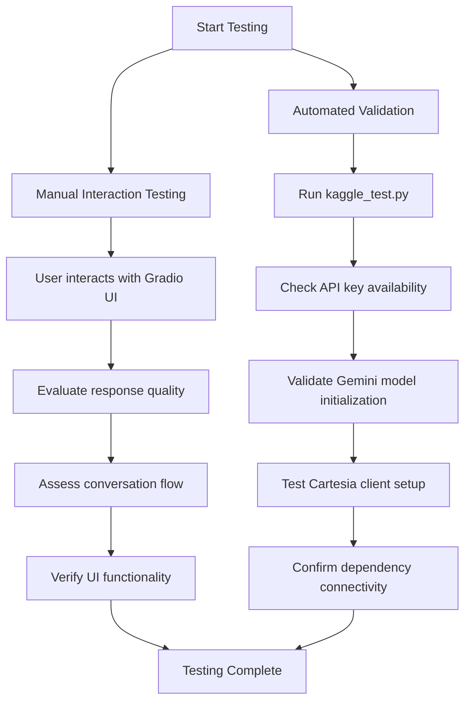

# Testing and Development Notebooks

<cite>
**Referenced Files in This Document**   
- [gradio_ui_testing.ipynb](file://notebooks/gradio_ui_testing.ipynb)
- [mvp_notebook_kaggle.ipynb](file://notebooks/mvp_notebook_kaggle.ipynb)
- [submission_notebook.ipynb](file://notebooks/submission_notebook.ipynb)
- [kaggle_test.py](file://kaggle_test.py)
</cite>

## Table of Contents
1. [Overview of Development and Testing Notebooks](#overview-of-development-and-testing-notebooks)
2. [Purpose of Key Notebooks](#purpose-of-key-notebooks)
3. [Experimental Sandbox Functionality](#experimental-sandbox-functionality)
4. [Testing Strategies and Validation](#testing-strategies-and-validation)
5. [Debugging and Response Quality Analysis](#debugging-and-response-quality-analysis)
6. [Notebook Structure and Production Code Separation](#notebook-structure-and-production-code-separation)

## Overview of Development and Testing Notebooks

The Jupyter notebooks in the `notebooks/` directory serve as the primary environment for iterative development, interface validation, and competition submission preparation. These notebooks provide a flexible and interactive platform for experimenting with AI prompts, testing user interface components, and refining agent behavior before integration into the main application. The notebook ecosystem supports rapid prototyping while maintaining a clean separation from production code, enabling developers to explore new features and configurations without destabilizing the core system.

**Section sources**
- [gradio_ui_testing.ipynb](file://notebooks/gradio_ui_testing.ipynb#L1-L572)
- [mvp_notebook_kaggle.ipynb](file://notebooks/mvp_notebook_kaggle.ipynb#L1-L2467)

## Purpose of Key Notebooks

### gradio_ui_testing.ipynb: Interface Validation

The `gradio_ui_testing.ipynb` notebook is dedicated to validating the Gradio user interface within the notebook environment. This notebook ensures that the UI components function correctly before deployment, particularly when transitioning from local development to cloud-based platforms like Google Colab or Kaggle. It initializes the Gemini API, configures the Gradio interface with session state management, and implements a stateless agent logic pattern that processes user inputs and maintains conversation history. The notebook includes comprehensive error handling, retry mechanisms for API calls, and a clear separation between UI components and backend logic.

Key features include:
- Dynamic session state management using `gr.State` for conversation history and order tracking
- Integration with the Gemini API for AI-powered responses
- Heuristic-based order management that detects drink additions from agent responses
- Clear separation of concerns between UI callbacks and core processing functions

### mvp_notebook_kaggle.ipynb: Iterative Feature Development

The `mvp_notebook_kaggle.ipynb` notebook serves as the primary environment for iterative development of the bartending agent's core capabilities. This notebook implements an agentic workflow with Retrieval Augmented Generation (RAG), function calling, and Text-to-Speech (TTS) integration. It provides a comprehensive implementation of the agent's personality and conversational abilities, using a FAISS vector database to store and retrieve pre-defined responses that give the agent a consistent character.

The notebook demonstrates:
- RAG pipeline implementation with document embedding and retrieval
- Agent identity establishment through prompt engineering and named persona ("Maya")
- Integration with Cartesia API for audio generation
- Small talk capabilities through contextual response retrieval
- Menu tool implementation with drink modifiers and preference guidance

### submission_notebook.ipynb: Kaggle Competition Entries

The `submission_notebook.ipynb` notebook is specifically designed for Kaggle competition submissions. It contains a streamlined version of the agent implementation optimized for the Kaggle environment, with proper API key management using Kaggle secrets. This notebook follows the competition requirements for package installation, API configuration, and model initialization, ensuring compatibility with the Kaggle platform's constraints and security policies.

Key aspects include:
- Secure API key retrieval from Kaggle secrets
- Environment-specific configuration for Kaggle's execution environment
- Optimized dependencies and package installation
- Compliance with Kaggle's submission guidelines and restrictions

**Section sources**
- [gradio_ui_testing.ipynb](file://notebooks/gradio_ui_testing.ipynb#L1-L572)
- [mvp_notebook_kaggle.ipynb](file://notebooks/mvp_notebook_kaggle.ipynb#L1-L2467)
- [submission_notebook.ipynb](file://notebooks/submission_notebook.ipynb#L1-L2887)

## Experimental Sandbox Functionality

The notebooks function as experimental sandboxes where developers can safely test new AI prompts, TTS configurations, and menu designs without affecting the production application. This sandbox environment enables rapid iteration on agent behavior, allowing for experimentation with different prompt structures, response styles, and interaction patterns.

For example, developers can modify the prompt template in `mvp_notebook_kaggle.ipynb` to adjust the agent's tone or personality, test different embedding models for the RAG system, or experiment with various voice parameters in the Cartesia TTS integration. The notebooks also support testing of menu modifications, such as adding new drinks, changing prices, or introducing new modifiers, with immediate feedback on how these changes affect the agent's responses and order processing.

This sandbox approach facilitates exploration of edge cases and corner scenarios, such as handling ambiguous orders, managing multiple drink requests, or responding to off-topic customer inquiries. By isolating these experiments in notebooks, the team can validate new features and improvements before integrating them into the main codebase.

**Section sources**
- [mvp_notebook_kaggle.ipynb](file://notebooks/mvp_notebook_kaggle.ipynb#L1-L2467)
- [gradio_ui_testing.ipynb](file://notebooks/gradio_ui_testing.ipynb#L1-L572)

## Testing Strategies and Validation

The development process employs a combination of manual interaction testing and automated checks to ensure the reliability and correctness of the bartending agent. The `gradio_ui_testing.ipynb` notebook enables manual testing of the Gradio interface, allowing developers to interact with the agent in real-time and evaluate the quality of responses, conversation flow, and UI behavior.

Complementing this manual testing, the `kaggle_test.py` script provides automated validation of API connectivity and model initialization. This script verifies that the necessary API keys are available, successfully configures the Google Generative AI client, and initializes the specified Gemini model. It also tests the Cartesia client initialization for TTS functionality, ensuring that all external dependencies are properly configured.

The testing strategy includes:
- **Manual interaction testing**: Direct user interaction with the agent through the Gradio interface to assess conversational quality and naturalness
- **Automated dependency validation**: Script-based verification of API key availability and service connectivity
- **Environment-specific testing**: Validation of notebook functionality in both local development and Kaggle competition environments
- **Error handling verification**: Testing of retry mechanisms and fallback behaviors for API failures

**Diagram sources**
- [gradio_ui_testing.ipynb](file://notebooks/gradio_ui_testing.ipynb#L1-L572)
- [kaggle_test.py](file://kaggle_test.py#L1-L122)

**Section sources**
- [gradio_ui_testing.ipynb](file://notebooks/gradio_ui_testing.ipynb#L1-L572)
- [kaggle_test.py](file://kaggle_test.py#L1-L122)

## Debugging and Response Quality Analysis

The notebooks provide powerful tools for debugging conversation flows and analyzing AI response quality. Developers can leverage the detailed logging capabilities and prompt inspection features to understand how the agent processes user inputs and generates responses. The `gradio_ui_testing.ipynb` notebook includes debug logging that captures the full prompt sent to the Gemini API, allowing developers to analyze the context provided to the model and identify potential issues with prompt construction.

For response quality analysis, the notebooks enable developers to:
- Examine the agent's interpretation of user requests and order modifications
- Evaluate the effectiveness of the RAG system in retrieving relevant conversational responses
- Assess the accuracy of order tracking and billing calculations
- Test the agent's handling of edge cases and ambiguous inputs

The stateless design pattern used in the notebooks, where session history and order state are passed as parameters and returned as updated values, facilitates systematic debugging by making the data flow explicit and predictable. This approach allows developers to reproduce specific conversation states and test targeted improvements to the agent's behavior.

**Section sources**
- [gradio_ui_testing.ipynb](file://notebooks/gradio_ui_testing.ipynb#L1-L572)
- [mvp_notebook_kaggle.ipynb](file://notebooks/mvp_notebook_kaggle.ipynb#L1-L2467)

## Notebook Structure and Production Code Separation

The notebook structure supports rapid prototyping while maintaining a clean separation from production code. This architectural approach allows developers to experiment freely in the notebooks, with successful features and improvements later integrated into the main application files like `bartending_agent.py` and `main.py`. The notebooks serve as a proving ground for new ideas, where concepts can be validated before undergoing the more rigorous testing and review process required for production code.

This separation provides several benefits:
- **Reduced risk**: Experimental changes in notebooks cannot directly impact the stability of the production application
- **Faster iteration**: Developers can make and test changes in notebooks without following the full development workflow
- **Clear progression**: Successful notebook experiments can be systematically refined and integrated into the main codebase
- **Environment-specific optimization**: Notebooks can be tailored to specific platforms (e.g., Kaggle) without affecting the core application

The structure also facilitates knowledge sharing and collaboration, as notebooks provide a self-contained environment that documents the development process, including code, results, and explanatory text. This makes it easier for team members to understand the rationale behind design decisions and contribute to ongoing development efforts.

**Section sources**
- [gradio_ui_testing.ipynb](file://notebooks/gradio_ui_testing.ipynb#L1-L572)
- [mvp_notebook_kaggle.ipynb](file://notebooks/mvp_notebook_kaggle.ipynb#L1-L2467)
- [submission_notebook.ipynb](file://notebooks/submission_notebook.ipynb#L1-L2887)