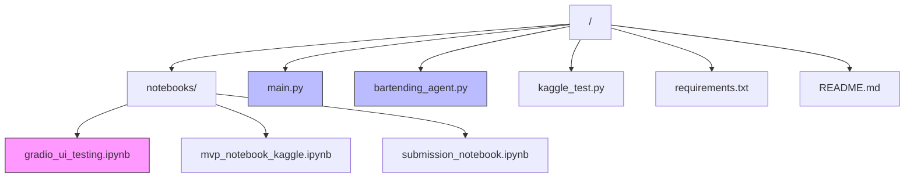
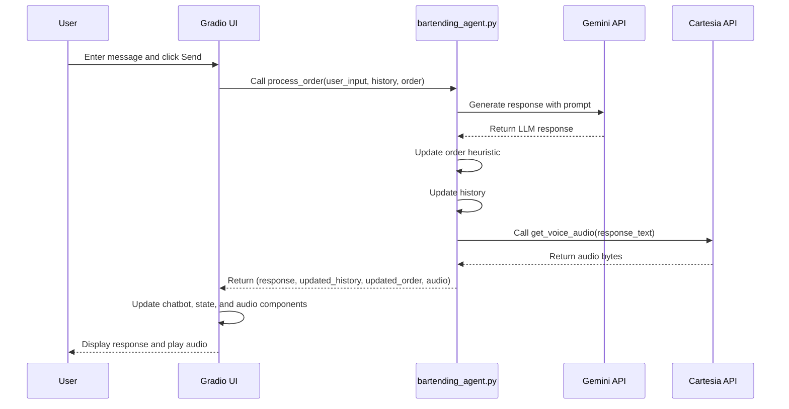
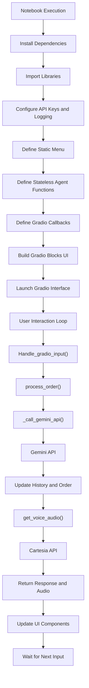
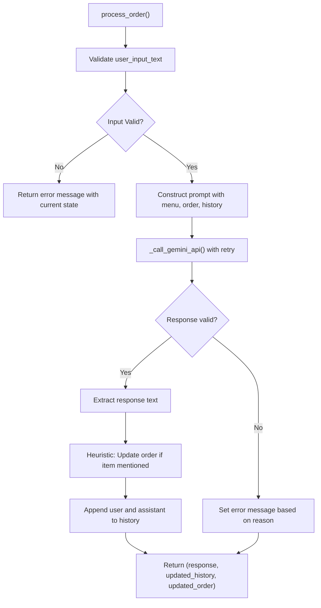
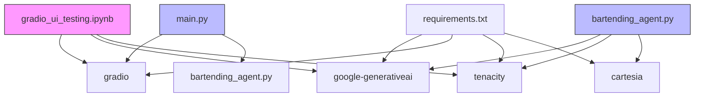

# UI Testing Notebooks

<cite>
**Referenced Files in This Document**   
- [gradio_ui_testing.ipynb](file://notebooks/gradio_ui_testing.ipynb)
- [main.py](file://main.py)
- [bartending_agent.py](file://bartending_agent.py)
</cite>

## Table of Contents
1. [Introduction](#introduction)
2. [Project Structure](#project-structure)
3. [Core Components](#core-components)
4. [Architecture Overview](#architecture-overview)
5. [Detailed Component Analysis](#detailed-component-analysis)
6. [Dependency Analysis](#dependency-analysis)
7. [Performance Considerations](#performance-considerations)
8. [Troubleshooting Guide](#troubleshooting-guide)
9. [Conclusion](#conclusion)

## Introduction
This document provides a comprehensive analysis of the Gradio UI testing notebook (`gradio_ui_testing.ipynb`) within the MayaBartendingAgent project. The notebook serves as a dedicated environment for validating the frontend interface components such as chat display, audio output, and user input handling. It isolates the Gradio integration from the core business logic to enable rapid UI iteration and visual debugging. This document details test scenarios, mock data usage, extension guidance, and troubleshooting methods for common UI issues.

## Project Structure

The project follows a modular structure with a clear separation between notebooks, core logic, and configuration files.

**Diagram sources**
- [gradio_ui_testing.ipynb](file://notebooks/gradio_ui_testing.ipynb)
- [main.py](file://main.py)
- [bartending_agent.py](file://bartending_agent.py)

**Section sources**
- [gradio_ui_testing.ipynb](file://notebooks/gradio_ui_testing.ipynb)
- [main.py](file://main.py)

## Core Components

The core components of the UI testing framework are centered around the Gradio interface, state management, and interaction with the backend agent logic. The `gradio_ui_testing.ipynb` notebook imports and configures the necessary libraries, defines the agent's behavior using Gemini, and sets up a Gradio Blocks interface for user interaction. Key components include:

- **Session State Management**: Uses `gr.State` to maintain conversation history and order state across interactions.
- **Input/Output Handling**: Processes user text input and returns updated chat history, state, and audio output.
- **Error Handling and Logging**: Implements structured logging and exception handling for debugging.
- **External API Integration**: Interfaces with Google's Gemini API for LLM responses and Cartesia for text-to-speech synthesis.

**Section sources**
- [gradio_ui_testing.ipynb](file://notebooks/gradio_ui_testing.ipynb#L260-L350)
- [main.py](file://main.py#L40-L100)

## Architecture Overview

The architecture follows a stateless service pattern where the core logic is decoupled from the UI layer. The Gradio interface manages session state and routes user input to the processing function.

**Diagram sources**
- [gradio_ui_testing.ipynb](file://notebooks/gradio_ui_testing.ipynb#L260-L350)
- [main.py](file://main.py#L40-L100)
- [bartending_agent.py](file://bartending_agent.py#L150-L300)

## Detailed Component Analysis

### Gradio UI Testing Notebook Analysis

The `gradio_ui_testing.ipynb` notebook is designed for in-notebook testing of the Gradio interface. It allows developers to validate UI components without deploying the full application.

#### For UI/Service Components:

**Diagram sources**
- [gradio_ui_testing.ipynb](file://notebooks/gradio_ui_testing.ipynb)

**Section sources**
- [gradio_ui_testing.ipynb](file://notebooks/gradio_ui_testing.ipynb)

### Core Agent Logic Analysis

The `bartending_agent.py` file contains the stateless core logic for processing user input and generating responses.

#### For Complex Logic Components:

**Diagram sources**
- [bartending_agent.py](file://bartending_agent.py#L150-L300)

**Section sources**
- [bartending_agent.py](file://bartending_agent.py#L150-L300)

## Dependency Analysis

The project has a clear dependency hierarchy with well-defined import relationships.

**Diagram sources**
- [requirements.txt](file://requirements.txt)
- [main.py](file://main.py)
- [gradio_ui_testing.ipynb](file://notebooks/gradio_ui_testing.ipynb)

**Section sources**
- [requirements.txt](file://requirements.txt)
- [main.py](file://main.py)
- [gradio_ui_testing.ipynb](file://notebooks/gradio_ui_testing.ipynb)

## Performance Considerations

The UI testing notebook is designed for development and debugging rather than production performance. Key considerations include:

- **API Latency**: The response time is primarily determined by the Gemini and Cartesia API calls. Network latency and API processing time can significantly impact user experience.
- **Retry Logic**: The use of `tenacity_retry` with exponential backoff helps handle transient API failures but may increase perceived latency during retries.
- **State Management**: The use of session state (`gr.State`) ensures persistence across interactions but requires careful management to avoid memory leaks in long-running sessions.
- **Audio Processing**: The synchronous TTS generation in `get_voice_audio()` blocks the response until audio is fully generated, which can lead to longer wait times.

## Troubleshooting Guide

This section addresses common issues encountered during UI testing and their resolution methods.

**Section sources**
- [gradio_ui_testing.ipynb](file://notebooks/gradio_ui_testing.ipynb)
- [main.py](file://main.py)
- [bartending_agent.py](file://bartending_agent.py)

### State Reset Bugs
**Issue**: Session state does not reset properly when clicking the "Clear Conversation" button.
**Diagnosis**: Verify that the `clear_chat_state()` function returns empty lists for all state components.
**Resolution**: Ensure the `clear_outputs` list in the `clear_btn.click()` event includes all stateful components (chatbot, history_state, order_state, audio_output).

### Audio Rendering Failures
**Issue**: Audio component does not play or shows an error.
**Diagnosis**: Check the browser console for media playback errors and verify the `get_voice_audio()` function returns valid WAV bytes.
**Resolution**: 
1. Confirm `CARTESIA_API_KEY` is set and valid.
2. Verify the `CARTESIA_VOICE_ID` is correct and accessible.
3. Check that the Cartesia client initialization succeeds.
4. Ensure the audio format is correctly specified as WAV with appropriate sample rate.

### Empty or Invalid Responses
**Issue**: The agent returns an empty response or generic error message.
**Diagnosis**: Examine the logs for API call failures, blocked prompts, or safety filters.
**Resolution**:
1. Check the `GOOGLE_API_KEY` is valid and has sufficient quota.
2. Review the prompt construction to ensure it includes all necessary context.
3. Handle `finish_reason` codes like `SAFETY`, `MAX_TOKENS`, or `RECITATION` appropriately in the response processing logic.

### Dependency Installation Issues
**Issue**: Required packages fail to install in the notebook environment.
**Resolution**: Use the provided `requirements.txt` and ensure all dependencies are compatible. For Kaggle environments, explicitly uninstall conflicting packages before installation.

## Conclusion

The `gradio_ui_testing.ipynb` notebook serves as a critical tool for validating the frontend interface of the bartending agent. By isolating the UI layer from core logic, it enables rapid iteration and visual debugging of chat display, audio output, and user input handling. The use of session state allows for realistic conversation flow testing, while mock data and error handling scenarios help verify robustness. This documentation provides a foundation for extending the notebook to test new UI features and troubleshoot common issues, ensuring a high-quality user experience in the final application.