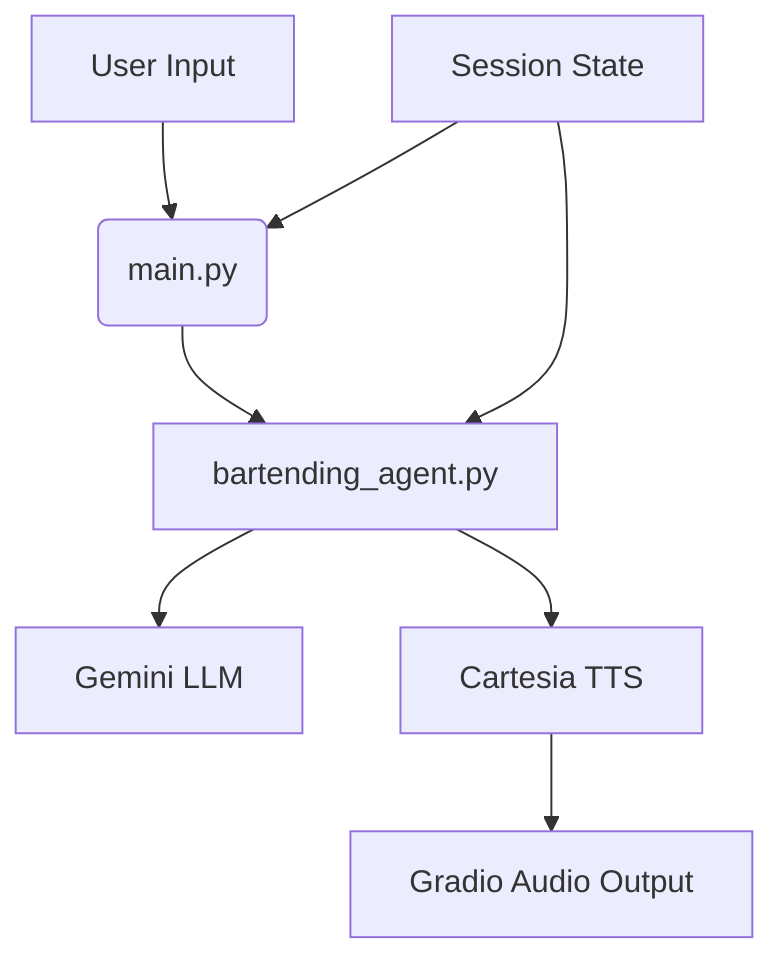
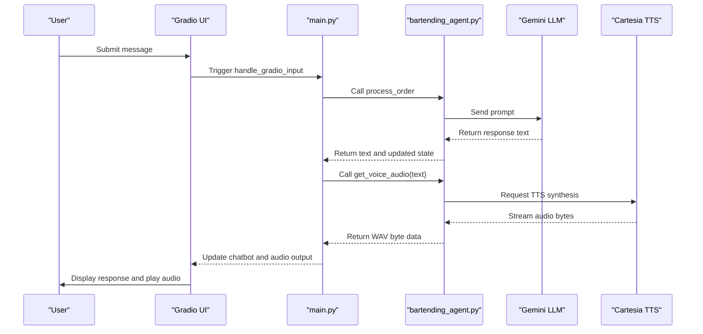

# Audio Generation Workflow

<cite>
**Referenced Files in This Document**   
- [bartending_agent.py](file://bartending_agent.py)
- [main.py](file://main.py)
</cite>

## Table of Contents
1. [Introduction](#introduction)
2. [Project Structure](#project-structure)
3. [Core Components](#core-components)
4. [Audio Generation Workflow](#audio-generation-workflow)
5. [Text Preprocessing and Special Handling](#text-preprocessing-and-special-handling)
6. [Performance and Latency Management](#performance-and-latency-management)
7. [Best Practices for Conversational Flow](#best-practices-for-conversational-flow)
8. [Conclusion](#conclusion)

## Introduction
This document details the audio generation workflow in the MayaBartendingAgent application, which transforms AI-generated text responses into audible speech delivered through a Gradio interface. The process begins with a user input, proceeds through natural language processing via Google's Gemini model, and culminates in Text-to-Speech (TTS) synthesis using Cartesia. The resulting audio is returned as a byte stream for client-side playback. This workflow emphasizes low-latency, high-fidelity audio delivery while maintaining a natural conversational experience.

## Project Structure
The project follows a modular architecture with distinct separation between core logic and user interface components. The main application entry point is `main.py`, which initializes the Gradio web interface and manages session state. Business logic, including order processing and TTS integration, resides in `bartending_agent.py`. Supporting notebooks are used for testing and development, while configuration and dependencies are managed via `requirements.txt` and environment variables.



**Diagram sources**
- [main.py](file://main.py#L1-L142)
- [bartending_agent.py](file://bartending_agent.py#L1-L374)

**Section sources**
- [main.py](file://main.py#L1-L142)
- [bartending_agent.py](file://bartending_agent.py#L1-L374)

## Core Components
The system relies on two primary components: the `process_order` function for text generation and the `get_voice_audio` function for speech synthesis. These functions are stateless, accepting session data as parameters and returning updated states, enabling seamless integration with Gradio’s session management. The `handle_gradio_input` callback orchestrates the interaction between these components, ensuring a cohesive user experience.

**Section sources**
- [bartending_agent.py](file://bartending_agent.py#L200-L374)
- [main.py](file://main.py#L30-L80)

## Audio Generation Workflow
The audio generation workflow begins when a user submits a message through the Gradio interface. The input is passed to the `handle_gradio_input` function in `main.py`, which calls `process_order` to generate a textual response using the Gemini LLM. If a valid response is produced, the system invokes `get_voice_audio` to convert the text into speech via the Cartesia TTS API.

The `get_voice_audio` function performs synchronous TTS synthesis, returning raw WAV audio data as bytes. This data is directly assigned to the Gradio `Audio` component, which handles playback in the browser with `autoplay=True`. No intermediate file storage is required, as Gradio supports streaming binary audio data.



**Diagram sources**
- [main.py](file://main.py#L30-L80)
- [bartending_agent.py](file://bartending_agent.py#L319-L372)

**Section sources**
- [main.py](file://main.py#L30-L80)
- [bartending_agent.py](file://bartending_agent.py#L319-L372)

## Text Preprocessing and Special Handling
Before TTS synthesis, the text undergoes preprocessing to ensure accurate pronunciation. Specifically, the string "MOK 5-ha" is replaced with "Moksha" using a case-insensitive regular expression. This substitution ensures that the bar's name is pronounced correctly as "Moksha," reflecting its spiritual meaning of liberation.

The preprocessing occurs within the `get_voice_audio` function:
```python
text_for_tts = re.sub(r'MOK 5-ha', 'Moksha', text_to_speak, flags=re.IGNORECASE)
```
This step is critical for maintaining brand identity and enhancing user experience. Additionally, the function validates input text and checks for proper initialization of the Cartesia client and voice ID, preventing runtime errors during audio generation.

**Section sources**
- [bartending_agent.py](file://bartending_agent.py#L328-L332)

## Performance and Latency Management
Audio latency is managed through synchronous TTS calls with retry logic. The `get_voice_audio` function uses the `tenacity` library to retry failed requests up to three times with exponential backoff, improving reliability under transient network conditions. The Cartesia API is configured to return high-quality audio at 24 kHz sample rate using the `sonic-2` model, balancing clarity and response speed.

To minimize delays, the system avoids unnecessary file I/O by returning audio data directly as bytes. The Gradio interface handles this stream efficiently, enabling immediate playback without buffering delays. However, the synchronous nature of the TTS call means the UI waits for audio generation before updating, which can affect perceived responsiveness during high load.

**Section sources**
- [bartending_agent.py](file://bartending_agent.py#L319-L372)

## Best Practices for Conversational Flow
To maintain a smooth conversational experience, the following best practices are implemented:
- **Stateless Design**: All session data is passed explicitly, avoiding global state and enabling scalability.
- **Error Resilience**: Comprehensive logging and fallback responses ensure graceful degradation during API failures.
- **Input Validation**: Empty or invalid inputs are handled gracefully, preventing silent failures.
- **Pronunciation Optimization**: Key terms like "MOK 5-ha" are normalized for accurate speech synthesis.
- **Efficient Prompting**: Conversation history is truncated to the last 10 exchanges, reducing prompt length and LLM processing time.

Caching is not currently implemented, but frequently used phrases (e.g., menu items, greetings) could be pre-synthesized to reduce TTS latency. Future improvements might include asynchronous audio generation or client-side caching of common audio clips.

**Section sources**
- [bartending_agent.py](file://bartending_agent.py#L200-L372)
- [main.py](file://main.py#L30-L80)

## Conclusion
The audio generation workflow in the MayaBartendingAgent application effectively integrates AI-driven text generation with high-quality speech synthesis. By leveraging Gemini for natural language understanding and Cartesia for TTS, the system delivers a responsive and engaging conversational interface. The architecture prioritizes simplicity, reliability, and user experience, with clear pathways for future optimization through caching and asynchronous processing.