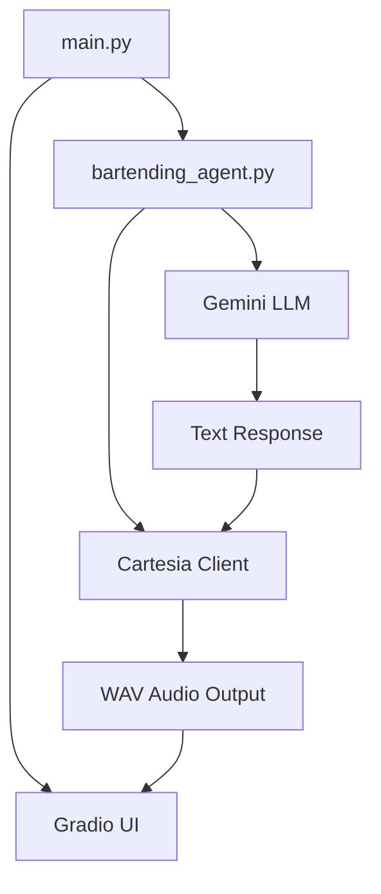
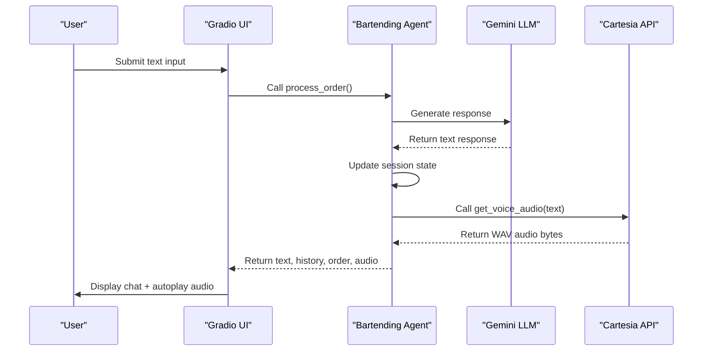
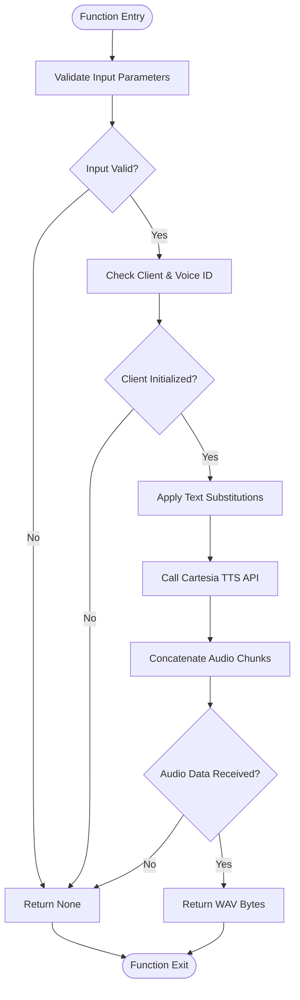
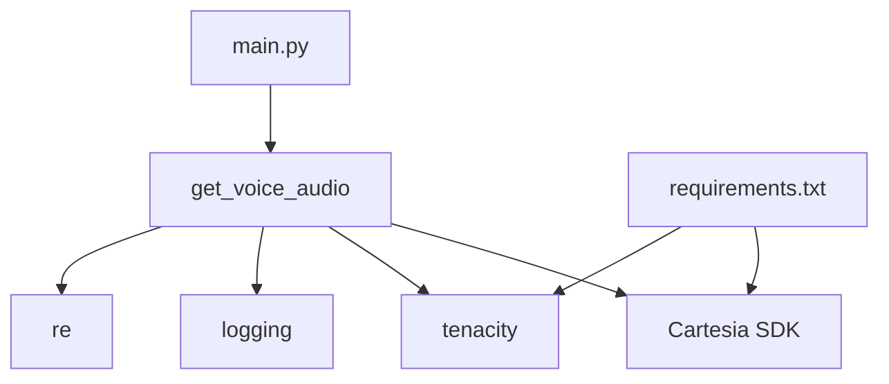

# Cartesia API Integration

<cite>
**Referenced Files in This Document**   
- [bartending_agent.py](file://bartending_agent.py)
- [main.py](file://main.py)
</cite>

## Table of Contents
1. [Introduction](#introduction)
2. [Project Structure](#project-structure)
3. [Core Components](#core-components)
4. [Architecture Overview](#architecture-overview)
5. [Detailed Component Analysis](#detailed-component-analysis)
6. [Dependency Analysis](#dependency-analysis)
7. [Performance Considerations](#performance-considerations)
8. [Troubleshooting Guide](#troubleshooting-guide)
9. [Conclusion](#conclusion)

## Introduction
This document provides a comprehensive analysis of the Cartesia API integration within the MayaBartendingAgent project. It details how the Cartesia client is initialized, configured, and used to generate audio from text responses generated by the AI bartender agent. The integration enables voice output for the Gradio-based user interface, enhancing user experience through spoken responses. The documentation covers initialization parameters, request/response handling, error resilience via retry mechanisms, and interaction with the broader AI response pipeline.

## Project Structure
The project is structured around a modular design where core logic is separated from the user interface. The Cartesia integration resides primarily in `bartending_agent.py`, which handles text-to-speech (TTS) functionality, while `main.py` manages the Gradio UI and state orchestration.



**Diagram sources**
- [bartending_agent.py](file://bartending_agent.py#L1-L374)
- [main.py](file://main.py#L1-L142)

**Section sources**
- [bartending_agent.py](file://bartending_agent.py#L1-L374)
- [main.py](file://main.py#L1-L142)

## Core Components
The core components involved in the Cartesia integration are:
- **Cartesia Client Initialization**: Performed once at module load using environment variables.
- **Text-to-Speech Function (`get_voice_audio`)**: Converts AI-generated text into audio bytes.
- **Retry Logic with Tenacity**: Ensures robustness against transient API failures.
- **Voice Configuration**: Uses a predefined voice ID and model settings for consistent audio output.
- **Integration with Gradio**: Delivers synthesized audio directly to the frontend for playback.

**Section sources**
- [bartending_agent.py](file://bartending_agent.py#L341-L374)
- [main.py](file://main.py#L50-L80)

## Architecture Overview
The system architecture follows a layered pattern where user input flows through the Gradio interface, is processed by the AI agent using Gemini, and then passed to Cartesia for audio synthesis. The resulting audio is returned to the UI for autoplay.



**Diagram sources**
- [bartending_agent.py](file://bartending_agent.py#L341-L374)
- [main.py](file://main.py#L50-L80)

## Detailed Component Analysis

### Cartesia Client Initialization
The Cartesia client is initialized globally in `bartending_agent.py` using the API key from environment variables. This ensures a single, reusable client instance across all requests.

```python
cartesia_client = Cartesia(
    api_key=os.getenv("CARTESIA_API_KEY"),
)
```

Initialization occurs at module load time, and failure to initialize results in a fatal error, ensuring the service only runs when TTS is available.

**Section sources**
- [bartending_agent.py](file://bartending_agent.py#L75-L85)

### Audio Generation Function
The `get_voice_audio` function is responsible for converting text into audio using the Cartesia TTS service.



**Diagram sources**
- [bartending_agent.py](file://bartending_agent.py#L341-L374)

**Section sources**
- [bartending_agent.py](file://bartending_agent.py#L341-L374)

#### Configuration Parameters
The following parameters are used in the Cartesia TTS request:

- **model_id**: `"sonic-2"` – A high-quality voice synthesis model optimized for natural speech.
- **voice_id**: `"6f84f4b8-58a2-430c-8c79-688dad597532"` – A specific voice profile selected for tone and clarity.
- **language**: `"en"` – Specifies English language for pronunciation.
- **output_format**: 
  - container: `"wav"`
  - sample_rate: `24000`
  - encoding: `"pcm_f32le"`

These settings produce high-fidelity audio suitable for direct playback in the browser.

#### Text Preprocessing
Before sending text to Cartesia, the function applies a regex substitution to replace `"MOK 5-ha"` with `"Moksha"` to ensure correct pronunciation:

```python
text_for_tts = re.sub(r'MOK 5-ha', 'Moksha', text_to_speak, flags=re.IGNORECASE)
```

This ensures brand name consistency and accurate phonetic rendering.

### Retry Mechanism with Tenacity
The `get_voice_audio` function is decorated with `@tenacity_retry` to handle transient failures:

```python
@tenacity_retry(
    stop=stop_after_attempt(3),
    wait=wait_exponential(multiplier=1, min=1, max=5),
    retry=retry_if_exception_type((ConnectionError, TimeoutError)),
    before_sleep=before_sleep_log(logger, logging.WARNING),
    reraise=True
)
```

This configuration:
- Retries up to 3 times
- Uses exponential backoff (1s, 2s, 4s)
- Only retries on network-related exceptions
- Logs warnings before each retry
- Re-raises the final exception if all retries fail

**Section sources**
- [bartending_agent.py](file://bartending_agent.py#L320-L340)

### Integration with AI Response Pipeline
In `main.py`, the `handle_gradio_input` function orchestrates the flow from text generation to audio synthesis:

```python
response_text, updated_history, updated_order = process_order(...)
audio_data = get_voice_audio(response_text)
return "", updated_history, updated_history, updated_order, audio_data
```

If audio generation fails, `audio_data` is set to `None`, and Gradio handles this gracefully without breaking the UI.

**Section sources**
- [main.py](file://main.py#L50-L80)

## Dependency Analysis
The Cartesia integration depends on several external and internal components:



**Diagram sources**
- [requirements.txt](file://requirements.txt#L1-L9)
- [bartending_agent.py](file://bartending_agent.py#L1-L374)

**Section sources**
- [requirements.txt](file://requirements.txt#L1-L9)
- [bartending_agent.py](file://bartending_agent.py#L1-L374)

## Performance Considerations
- **Latency**: Audio generation adds ~1-3 seconds per response depending on text length.
- **Caching**: No audio caching is implemented; each response is synthesized in real-time.
- **Bandwidth**: WAV output at 24kHz sample rate consumes ~2.5 KB/s per channel.
- **Concurrency**: The synchronous `bytes()` method blocks the event loop; consider async alternatives for high-load scenarios.

## Troubleshooting Guide
Common issues and solutions:

- **Authentication Failures**: Ensure `CARTESIA_API_KEY` is set in `.env` or environment variables.
- **Voice Latency**: Long responses increase synthesis time; consider truncating or summarizing.
- **Audio Quality Degradation**: Verify `sample_rate` and `encoding` match frontend expectations.
- **Empty Audio Output**: Check for empty or whitespace-only text input; validate voice ID exists.
- **Model Not Found**: Confirm `"sonic-2"` is a valid model ID in your Cartesia account.
- **Retry Exhaustion**: Monitor logs for repeated network errors; check API status.

**Section sources**
- [bartending_agent.py](file://bartending_agent.py#L341-L374)
- [main.py](file://main.py#L50-L80)

## Conclusion
The Cartesia API integration successfully enables voice output for the bartending agent, enhancing user engagement through natural-sounding speech. The implementation is robust, leveraging retry logic and proper error handling to maintain reliability. Configuration is centralized and extensible, allowing easy adjustments to voice characteristics and audio quality. Future improvements could include audio caching, streaming support, and dynamic voice selection.