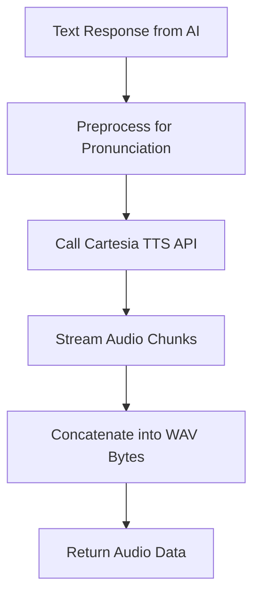
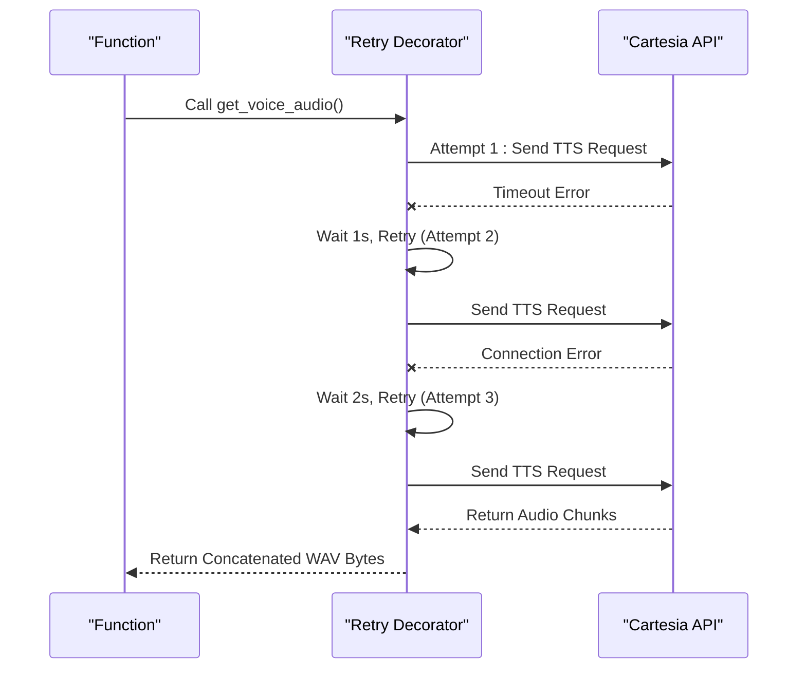

# Text-to-Speech System

<cite>
**Referenced Files in This Document**   
- [bartending_agent.py](file://bartending_agent.py#L280-L374)
- [main.py](file://main.py#L45-L142)
</cite>

## Table of Contents
1. [Text-to-Speech System](#text-to-speech-system)
2. [Voice Selection and Configuration](#voice-selection-and-configuration)
3. [Audio Generation Workflow](#audio-generation-workflow)
4. [Code Implementation and Error Handling](#code-implementation-and-error-handling)
5. [Integration with Gradio Interface](#integration-with-gradio-interface)
6. [Pronunciation Handling for Special Terms](#pronunciation-handling-for-special-terms)
7. [Customization and Optimization Guidance](#customization-and-optimization-guidance)

## Voice Selection and Configuration

The text-to-speech (TTS) functionality in the Maya Bartending Agent is powered by the Cartesia API, which enables high-quality audio synthesis from textual responses generated by the AI bartender. Voice characteristics are configured through static variables defined at the module level in `bartending_agent.py`.

**Key Configuration Parameters:**
- **CARTESIA_VOICE_ID**: Specifies the unique identifier for the selected voice model. Currently set to `"6f84f4b8-58a2-430c-8c79-688dad597532"` as a placeholder; this should be replaced with a valid voice ID from the Cartesia platform.
- **model_id**: The TTS model used for synthesis is `"sonic-2"`, a high-fidelity model optimized for natural-sounding speech.
- **output_format**: Configured to generate WAV audio with a sample rate of 24,000 Hz and 32-bit floating-point PCM encoding (`pcm_f32le`), ensuring high audio fidelity suitable for real-time playback.

The Cartesia client is initialized once during module loading using the API key retrieved from environment variables (`CARTESIA_API_KEY`). This ensures efficient reuse across multiple TTS requests without reinitializing the connection.

**Section sources**
- [bartending_agent.py](file://bartending_agent.py#L78-L95)
- [bartending_agent.py](file://bartending_agent.py#L280-L374)

## Audio Generation Workflow

The audio generation process follows a synchronous, request-response pattern that converts AI-generated text into playable WAV audio. The workflow proceeds as follows:

1. **Text Input**: The textual response from the Gemini-powered AI bartender is passed to the `get_voice_audio()` function.
2. **Pronunciation Preprocessing**: Before synthesis, the text undergoes preprocessing to ensure correct pronunciation of special terms like "MOK 5-ha", which is replaced with "Moksha" using regex substitution.
3. **API Request**: The processed text is sent to the Cartesia API via the `tts.bytes()` method, which returns an iterator of binary audio chunks.
4. **Audio Assembly**: Chunks are concatenated into a single byte string representing the complete WAV file.
5. **Return Audio Data**: The resulting audio bytes are returned for integration with the Gradio interface.

This workflow ensures low-latency audio delivery while maintaining high quality through synchronous processing.



**Diagram sources**
- [bartending_agent.py](file://bartending_agent.py#L280-L374)

**Section sources**
- [bartending_agent.py](file://bartending_agent.py#L280-L374)

## Code Implementation and Error Handling

The core TTS function, `get_voice_audio()`, is implemented with robust error handling and retry logic using the `tenacity` library to handle transient API failures.

### Function Signature
```python
def get_voice_audio(text_to_speak: str) -> bytes | None:
```

### Retry Logic
- **Maximum Attempts**: 3 retries
- **Backoff Strategy**: Exponential backoff with initial delay of 1 second, doubling each time (up to 5 seconds)
- **Retry Conditions**: Retries on `ConnectionError` and `TimeoutError`
- **Logging**: Warnings are logged before each retry attempt

### Error Conditions Handled
- Empty or invalid input text
- Uninitialized Cartesia client or missing voice ID
- Empty audio response from API
- Network or server-side exceptions during TTS generation

If any error persists after retries, the function returns `None`, allowing the Gradio interface to proceed without audio while logging the failure.



**Diagram sources**
- [bartending_agent.py](file://bartending_agent.py#L280-L374)

**Section sources**
- [bartending_agent.py](file://bartending_agent.py#L280-L374)

## Integration with Gradio Interface

The generated audio is seamlessly integrated into the Gradio web interface for real-time playback. In `main.py`, the `handle_gradio_input()` function orchestrates the flow between text processing and audio synthesis.

### Audio Output Component
```python
agent_audio_output = gr.Audio(
    label="Agent Voice",
    autoplay=True,
    streaming=False,
    format="wav",
    show_label=True,
    interactive=False
)
```

### Integration Logic
- After receiving a text response from `process_order()`, the system calls `get_voice_audio()` to generate speech.
- If audio data is successfully generated, it is returned directly to the `gr.Audio` component.
- If audio generation fails, `None` is returned, causing the audio player to remain silent or display no content.
- The `autoplay=True` setting ensures immediate playback once audio is available.

This integration allows users to hear the bartender's responses in real time, enhancing the interactive experience.

**Section sources**
- [main.py](file://main.py#L45-L142)

## Pronunciation Handling for Special Terms

To ensure accurate pronunciation of domain-specific terminology, particularly the bar name "MOK 5-ha", the system applies preprocessing rules before sending text to the TTS engine.

### Key Substitution Rule
- **Pattern**: Case-insensitive match for "MOK 5-ha"
- **Replacement**: "Moksha" (phonetically correct pronunciation)
- **Implementation**: Uses `re.sub()` with `flags=re.IGNORECASE`

This substitution ensures that the synthesized speech correctly pronounces the bar's name as intended, avoiding mispronunciations that could degrade user experience.

Additionally, cocktail names such as "Margarita", "Mojito", and "Negroni" are preserved exactly as they appear in the menu, relying on the Cartesia model’s built-in linguistic knowledge for proper enunciation.

**Section sources**
- [bartending_agent.py](file://bartending_agent.py#L318-L322)

## Customization and Optimization Guidance

### Voice Customization
Users can customize the voice by:
- Changing the `CARTESIA_VOICE_ID` to select different vocal characteristics (e.g., gender, tone, accent).
- Experimenting with alternative `model_id` values such as `"sonic-1"` for faster but slightly lower-quality synthesis.
- Adjusting `output_format` parameters:
  - Lower `sample_rate` (e.g., 16000 Hz) reduces file size and latency.
  - Switching to compressed formats (if supported) can improve performance.

### Latency vs. Quality Trade-offs
| Setting | Latency | Quality | Use Case |
|-------|--------|--------|---------|
| 24000 Hz, pcm_f32le | Higher | High | Best for local development |
| 16000 Hz, pcm_s16le | Lower | Medium | Production with bandwidth limits |
| Streaming mode | Lowest | Variable | Real-time applications |

### Best Practices
- Always validate the `CARTESIA_VOICE_ID` against the Cartesia dashboard.
- Monitor logs for TTS failures and adjust retry settings if needed.
- Cache frequently used audio responses (e.g., menu listing) to reduce API calls.
- Consider asynchronous TTS generation in future versions to prevent UI blocking.

By tuning these parameters, developers can optimize the system for either high fidelity or low latency based on deployment requirements.

**Section sources**
- [bartending_agent.py](file://bartending_agent.py#L78-L95)
- [bartending_agent.py](file://bartending_agent.py#L300-L310)