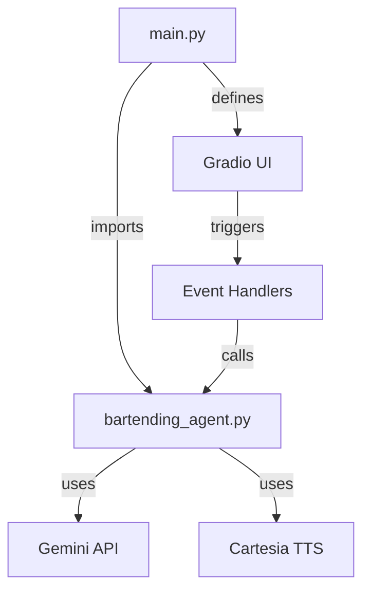
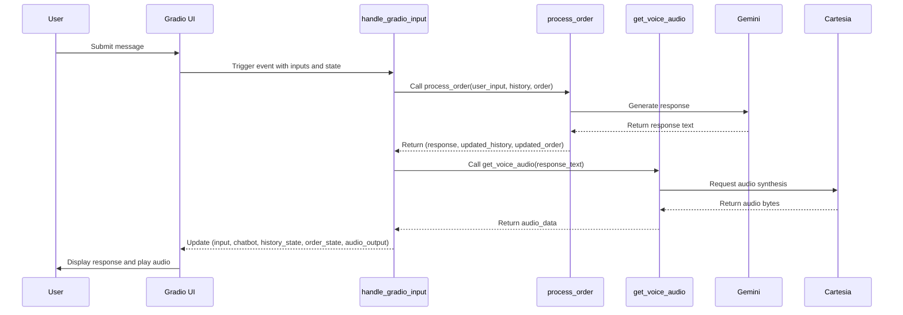

# Event Handling and State Management

<cite>
**Referenced Files in This Document**   
- [main.py](file://main.py#L31-L142)
- [bartending_agent.py](file://bartending_agent.py#L1-L374)
</cite>

## Table of Contents
1. [Introduction](#introduction)
2. [Project Structure](#project-structure)
3. [Core Components](#core-components)
4. [Event Handling in Gradio UI](#event-handling-in-gradio-ui)
5. [State Management with gr.State](#state-management-with-grstate)
6. [Data Flow from Input to Output](#data-flow-from-input-to-output)
7. [Clearing State with clear_chat_state](#clearing-state-with-clear_chat_state)
8. [Best Practices for Gradio Callbacks](#best-practices-for-gradio-callbacks)
9. [Common Issues and Debugging Strategies](#common-issues-and-debugging-strategies)
10. [Conclusion](#conclusion)

## Introduction
This document provides a comprehensive analysis of the event handling and state management mechanisms in the Gradio-based bartending agent application. It details how user interactions are captured, processed through backend logic, and reflected in the UI, with a focus on the integration between frontend components and backend state. The system uses Gradio's `gr.State` to maintain conversation history and order data across interactions, enabling a persistent and responsive user experience.

## Project Structure
The project is structured to separate UI logic from business logic. The main entry point, `main.py`, defines the Gradio interface and event handlers, while `bartending_agent.py` contains the core agent logic, including order processing, menu handling, and text-to-speech functionality. Notebooks are present for testing and development but are not part of the production flow.



**Diagram sources**
- [main.py](file://main.py#L1-L142)
- [bartending_agent.py](file://bartending_agent.py#L1-L374)

**Section sources**
- [main.py](file://main.py#L1-L142)
- [bartending_agent.py](file://bartending_agent.py#L1-L374)

## Core Components
The system consists of two primary components:
- **main.py**: Manages the Gradio UI, event bindings, and session state.
- **bartending_agent.py**: Implements the conversational logic, order tracking, and audio synthesis.

Key functions include `handle_gradio_input` (callback for user input), `clear_chat_state` (resets session), and `process_order` (business logic). The agent uses Gemini for natural language understanding and Cartesia for voice output.

**Section sources**
- [main.py](file://main.py#L31-L69)
- [bartending_agent.py](file://bartending_agent.py#L150-L374)

## Event Handling in Gradio UI
User interactions are captured through two primary events: `msg_input.submit` and `submit_btn.click`. Both are bound to the same callback function, `handle_gradio_input`, ensuring consistent behavior whether the user presses Enter or clicks the Send button.

```python
msg_input.submit(handle_gradio_input, submit_inputs, submit_outputs)
submit_btn.click(handle_gradio_input, submit_inputs, submit_outputs)
```

The `submit_inputs` list includes the message input box and two state variables (`history_state`, `order_state`). The `submit_outputs` list specifies the components to be updated: the input box (to clear it), the chatbot display, the two state variables, and the audio output.

This dual binding ensures accessibility and usability, allowing users to interact naturally with the interface.

**Section sources**
- [main.py](file://main.py#L127-L128)

## State Management with gr.State
Gradio's `gr.State` is used to persist session-specific data across interactions. Two state variables are defined:
- `history_state`: Stores the conversation history as a list of dictionaries with `role` and `content`.
- `order_state`: Maintains the current drink order as a list of items with `name` and `price`.

```python
history_state = gr.State([])
order_state = gr.State([])
```

These states are passed into the `handle_gradio_input` function and returned as updated values. This mechanism allows the backend to maintain context without relying on global variables, making the system scalable and thread-safe.

The state is updated within the `process_order` function in `bartending_agent.py`, which receives the current state, modifies it based on user input, and returns the updated version.

**Section sources**
- [main.py](file://main.py#L110-L113)
- [bartending_agent.py](file://bartending_agent.py#L150-L250)

## Data Flow from Input to Output
The data flow begins when a user submits input via text or button. The `handle_gradio_input` function is triggered with the following inputs:
- `user_input`: The text entered by the user.
- `session_history_state`: The current conversation history.
- `session_order_state`: The current order.

The function calls `process_order`, which constructs a prompt using the menu, history, and current order, then queries the Gemini model. The response is used to update the order heuristically (e.g., adding a drink if mentioned positively). The updated history and order are returned along with the response text.

Next, `get_voice_audio` is called to synthesize speech using Cartesia. If successful, the audio data is returned; otherwise, it remains `None`.

Finally, the function returns:
- Empty string to clear the input box.
- Updated history for the chatbot.
- Updated order state.
- Audio data for autoplay.



**Diagram sources**
- [main.py](file://main.py#L31-L63)
- [bartending_agent.py](file://bartending_agent.py#L150-L374)

**Section sources**
- [main.py](file://main.py#L31-L63)
- [bartending_agent.py](file://bartending_agent.py#L150-L374)

## Clearing State with clear_chat_state
The `clear_btn.click` event is bound to the `clear_chat_state` function, which resets all session data:

```python
clear_btn.click(clear_chat_state, None, clear_outputs)
```

The `clear_chat_state` function returns empty lists for the chatbot, history, and order states, and `None` for the audio component:

```python
def clear_chat_state() -> Tuple[List, List, List, None]:
    return [], [], [], None
```

This effectively resets the UI to its initial state, allowing the user to start a new conversation. The use of `None` for audio ensures that any playing audio is stopped and the component is cleared.

**Section sources**
- [main.py](file://main.py#L65-L69)

## Best Practices for Gradio Callbacks
This implementation follows several best practices:
- **Stateless Core Logic**: The `process_order` function is stateless, accepting and returning state explicitly. This makes it testable and reusable.
- **Separation of Concerns**: UI logic (`main.py`) is separated from business logic (`bartending_agent.py`).
- **Error Handling**: Comprehensive logging and fallback responses ensure robustness.
- **Input Validation**: Empty inputs are handled gracefully.
- **Session Isolation**: Each user session maintains its own state, preventing cross-user contamination.
- **Modular Design**: Functions are focused and reusable (e.g., `get_menu_text`, `get_voice_audio`).

Additionally, the use of `tenacity` for retrying API calls improves reliability in the face of transient network issues.

## Common Issues and Debugging Strategies
Common issues in such systems include:
- **State Persistence Bugs**: Caused by incorrect state updates or mutations. Solved by using copies (`[:]`) and returning new state.
- **Race Conditions**: Multiple rapid inputs can cause overlapping API calls. Mitigated by Gradio's queuing mechanism.
- **API Failures**: Handled via retry decorators and fallback responses.
- **Audio Playback Issues**: Addressed by checking for `None` audio and logging failures.

Debugging strategies:
- Use `logging.debug` to trace state values.
- Validate state structure before and after updates.
- Test edge cases (empty input, malformed responses).
- Monitor API call logs and error messages.

## Conclusion
The event handling and state management system in this Gradio application is well-structured, leveraging `gr.State` for session persistence and clear callback patterns for user interaction. The separation of UI and logic, combined with robust error handling and state management, creates a reliable and maintainable conversational agent. By following best practices and anticipating common issues, the system provides a smooth user experience while remaining scalable and debuggable.