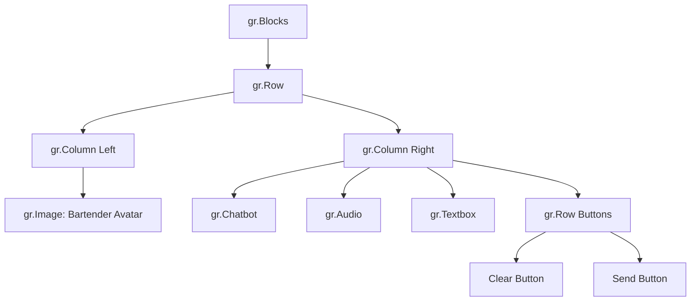

# Layout and Styling

<cite>
**Referenced Files in This Document**   
- [main.py](file://main.py#L1-L142)
- [bartending_agent.py](file://bartending_agent.py#L1-L374)
- [assets/bartender_avatar_ai_studio.jpeg](file://assets/bartender_avatar_ai_studio.jpeg)
</cite>

## Table of Contents
1. [Layout and Styling](#layout-and-styling)
2. [Gradio Interface Structure](#gradio-interface-structure)
3. [Two-Column Layout Implementation](#two-column-layout-implementation)
4. [Styling and Theme Configuration](#styling-and-theme-configuration)
5. [Component Sizing and Spacing](#component-sizing-and-spacing)
6. [Responsive Behavior and Mobile Considerations](#responsive-behavior-and-mobile-considerations)
7. [Customization and Extensibility](#customization-and-extensibility)

## Gradio Interface Structure

The Gradio interface for the Maya Bartending Agent is defined in `main.py` using `gr.Blocks`, which provides a flexible and programmatic way to build complex UI layouts. The application is structured as a conversational agent interface where users can place drink orders and receive responses from an AI bartender.

The core structure begins with a `gr.Blocks` context that encapsulates the entire UI. Inside this block:
- A title and welcome message are displayed using `gr.Markdown`.
- Session state is managed using `gr.State` components for `history_state` and `order_state`, enabling persistence of conversation and order data across interactions without relying on global variables.
- The main layout is divided into two columns using `gr.Row` and `gr.Column`, creating a balanced visual design.

This modular structure allows for clear separation of concerns between layout, state management, and interactivity.

**Section sources**
- [main.py](file://main.py#L45-L142)

## Two-Column Layout Implementation

The interface employs a two-column layout within a `gr.Row` container to organize visual and interactive components effectively.

### Left Column: Bartender Avatar
The left column (`gr.Column(scale=1, min_width=200)`) contains a static image of the bartender avatar:
- **Image Source**: The avatar is loaded from `assets/bartender_avatar_ai_studio.jpeg`.
- **Fixed Dimensions**: The image is set to a height of 600 pixels to maintain consistent visual proportions.
- **Non-Interactive**: The image is not clickable or interactive (`interactive=False`).
- **CSS Styling**: The `elem_classes=["avatar-image"]` attribute allows for targeted CSS customization, such as borders, shadows, or responsive adjustments.

### Right Column: Chat Interface
The right column (`gr.Column(scale=1)`) houses the interactive components:
- **Chatbot Display**: A `gr.Chatbot` component shows the conversation history in message format, with `bubble_full_width=False` to preserve a compact appearance.
- **Audio Output**: A `gr.Audio` component enables text-to-speech playback with `autoplay=True`, allowing users to hear the bartender's responses.
- **Text Input**: A `gr.Textbox` labeled "Your Order / Message" accepts user input with a placeholder prompt.
- **Action Buttons**: Two buttons, "Clear Conversation" and "Send", are arranged horizontally using a nested `gr.Row`.

Both columns are assigned equal `scale=1`, ensuring they occupy equal space and create a balanced, symmetrical layout.

**Diagram sources**
- [main.py](file://main.py#L78-L114)

**Section sources**
- [main.py](file://main.py#L78-L114)

## Styling and Theme Configuration

The visual appearance of the interface is customized using Gradio's theming system:
- **Theme**: `gr.themes.Citrus()` is applied to the `gr.Blocks` instance, providing a vibrant, modern color scheme with citrus-inspired accents.
- **Impact**: The theme affects component colors, button styles, font choices, and overall UI aesthetics, contributing to a lively and engaging user experience consistent with a bar-themed application.

Additionally, custom CSS classes are used for fine-grained control:
- The `avatar-image` class can be extended in external CSS to apply animations, hover effects, or responsive scaling.
- Gradio's `elem_id` and `elem_classes` attributes enable integration with custom stylesheets for branding or accessibility enhancements.

**Section sources**
- [main.py](file://main.py#L75-L76)

## Component Sizing and Spacing

Precise control over component dimensions ensures a clean and professional layout:
- **Chatbot Height**: Set to 450 pixels to provide ample space for conversation history without overwhelming the interface.
- **Avatar Height**: Fixed at 600 pixels to maintain a prominent visual presence.
- **Minimum Width**: The left column has `min_width=200` to prevent collapse on narrow screens.
- **Spacing**: Default Gradio spacing is used between components, with buttons aligned horizontally for intuitive interaction.

These sizing choices balance visual hierarchy and usability, ensuring key elements are clearly visible and accessible.

**Section sources**
- [main.py](file://main.py#L88-L92)
- [main.py](file://main.py#L96-L103)

## Responsive Behavior and Mobile Considerations

While the current layout is optimized for desktop viewing, the use of relative scaling (`scale=1`) provides some responsiveness:
- On narrower screens, both columns will shrink proportionally.
- The fixed heights may lead to scrolling in the chatbot or avatar areas on smaller devices.

Potential enhancements for mobile responsiveness include:
- Using CSS media queries to adjust `height` and `min_width` dynamically.
- Implementing a stacked layout (avatar above chat) on mobile via conditional rendering or CSS.
- Adding touch-friendly button sizing and input fields.

Currently, no explicit mobile-first adjustments are implemented, but the foundation supports such extensions.

**Section sources**
- [main.py](file://main.py#L88-L114)

## Customization and Extensibility

The layout is designed for easy adaptation:
- **Branding**: The `Citrus` theme can be replaced with custom themes or branded color schemes.
- **Avatar Updates**: The image path can be changed to reflect different bartenders or seasonal themes.
- **Layout Scaling**: Column `scale` values can be adjusted (e.g., `scale=2` for a wider chat area).
- **CSS Targeting**: `elem_classes` allows for granular styling without modifying core Gradio components.

Developers can extend the interface by adding new components (e.g., order summary panels, drink images) within the existing column structure or by introducing additional rows for menus and promotions.

**Section sources**
- [main.py](file://main.py#L75-L114)