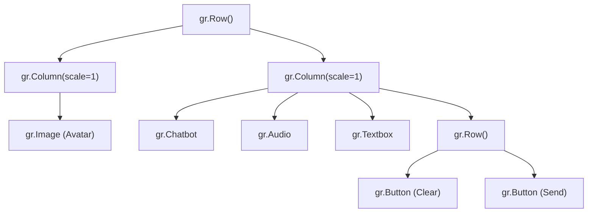

# UI Components

<cite>
**Referenced Files in This Document**   
- [main.py](file://main.py)
- [bartending_agent.py](file://bartending_agent.py)
</cite>

## Table of Contents
1. [Introduction](#introduction)
2. [Core UI Components](#core-ui-components)
3. [Layout and Structure](#layout-and-structure)
4. [State Management and Interactivity](#state-management-and-interactivity)
5. [Accessibility and User Experience](#accessibility-and-user-experience)
6. [Customization Guidance](#customization-guidance)

## Introduction
This document provides a detailed breakdown of the individual UI components used in the Gradio interface for the Maya Bartending Agent, as defined in `main.py`. It explains the configuration, purpose, and integration of each component, including `chatbot_display`, `msg_input`, `agent_audio_output`, `clear_btn`, and `submit_btn`. The analysis includes how these components interact with session state, support accessibility, and contribute to the overall user experience. Code examples are drawn directly from the implementation to illustrate key properties and behaviors.

## Core UI Components

The Gradio interface is composed of several key components that facilitate user interaction with the bartending agent. Each component is configured with specific parameters to ensure functionality, usability, and visual consistency.

### chatbot_display
The `chatbot_display` component is a `gr.Chatbot` instance responsible for rendering the conversation history between the user and the agent.

**Configuration Parameters:**
- **label**: "Conversation" — Provides an accessible label for screen readers and UI clarity.
- **height**: 450 — Sets a fixed height for the chat window, ensuring a consistent layout.
- **type**: "messages" — Specifies that the chatbot uses a structured message format, where each entry contains a `role` (e.g., "user", "assistant") and `content`. This aligns with the session state structure used in `handle_gradio_input`.
- **bubble_full_width**: False — Ensures message bubbles do not span the full width of the container, improving readability.
- **elem_id**: "chatbot" — Allows for CSS customization via the `elem_classes` system.

This component is bound to the `history_state` variable, which maintains the conversation history across interactions. The `type="messages"` setting ensures compatibility with the `updated_history` list returned by `process_order`, which contains dictionaries with `role` and `content` keys.

**Section sources**
- [main.py](file://main.py#L100-L107)

### msg_input
The `msg_input` component is a `gr.Textbox` that allows users to input their orders or messages.

**Configuration Parameters:**
- **label**: "Your Order / Message" — Describes the purpose of the input field.
- **placeholder**: "What can I get for you? (e.g., 'I'd like a Margarita', 'Show my order')" — Provides an example to guide user input.
- **interactive**: True by default — Enables user typing.

This component is the primary input mechanism and is linked to the `handle_gradio_input` callback, which processes the text and updates the conversation and order state.

**Section sources**
- [main.py](file://main.py#L116-L118)

### agent_audio_output
The `agent_audio_output` component is a `gr.Audio` element that plays synthesized voice responses from the agent.

**Configuration Parameters:**
- **label**: "Agent Voice" — Identifies the audio output for accessibility.
- **autoplay**: True — Automatically plays the generated audio after a response, enhancing the conversational experience.
- **format**: "wav" — Specifies the audio format returned by the `get_voice_audio` function in `bartending_agent.py`.
- **streaming**: False — Indicates that the audio is delivered as a complete file rather than a stream.
- **interactive**: False — Prevents user modification of the audio, as it is system-generated.

The component receives audio data from the `get_voice_audio` function, which uses the Cartesia API to synthesize speech from the agent's text response. If no audio is generated (e.g., empty response), the component remains silent.

**Section sources**
- [main.py](file://main.py#L108-L115)
- [bartending_agent.py](file://bartending_agent.py#L349-L385)

### clear_btn
The `clear_btn` is a `gr.Button` that resets the conversation and order state.

**Configuration:**
- **Label**: "Clear Conversation" — Clearly indicates the button's function.
- **Action**: Triggers the `clear_chat_state` function, which returns empty lists for `chatbot_display`, `history_state`, and `order_state`, and `None` for `agent_audio_output`, effectively resetting the UI.

This button ensures users can start a new session without reloading the page.

**Section sources**
- [main.py](file://main.py#L121-L122)

### submit_btn
The `submit_btn` is a `gr.Button` that submits the user's input for processing.

**Configuration:**
- **Label**: "Send" — Standard label for message submission.
- **variant**: "primary" — Applies a visually distinct style to emphasize its importance.
- **Action**: Also triggers `handle_gradio_input`, mirroring the `msg_input.submit` event for consistency.

This dual-trigger design (Enter key and button click) improves accessibility and user convenience.

**Section sources**
- [main.py](file://main.py#L122-L123)

## Layout and Structure

The UI layout is organized using `gr.Row` and `gr.Column` to create a responsive two-column design.

### Row and Column Hierarchy


**Diagram sources**
- [main.py](file://main.py#L88-L124)

### Equal Scaling
Both columns use `scale=1`, ensuring they occupy equal horizontal space. This creates a balanced layout where the avatar and chat interface are visually weighted equally. The `min_width=200` on the avatar column ensures it remains visible on smaller screens.

The `height=600` on the avatar and `height=450` on the chatbot are set to maintain a proportional visual hierarchy, with the avatar slightly taller to emphasize the agent's presence.

## State Management and Interactivity

The interface uses `gr.State` to manage session-specific data without relying on global variables.

### Session State Variables
- **history_state**: Tracks the conversation history as a list of message dictionaries.
- **order_state**: Maintains the current drink order as a list of menu items.

These states are passed into and returned from the `handle_gradio_input` function, enabling persistent session data across interactions.

### Event Handling
The following event bindings connect user actions to backend logic:

```python
msg_input.submit(handle_gradio_input, submit_inputs, submit_outputs)
submit_btn.click(handle_gradio_input, submit_inputs, submit_outputs)
clear_btn.click(clear_chat_state, None, clear_outputs)
```

**Section sources**
- [main.py](file://main.py#L125-L133)

The `submit_inputs` and `submit_outputs` lists define the data flow between components and the callback functions, ensuring synchronized updates across the UI.

## Accessibility and User Experience

The UI components are configured with accessibility in mind:

- **Labels**: All interactive components have descriptive labels for screen readers.
- **Keyboard Navigation**: The `msg_input` supports Enter key submission, and buttons are focusable.
- **Visual Feedback**: The `primary` variant on the submit button highlights the main action.
- **Autoplay Audio**: While convenient, autoplay may be blocked by browser settings; users should be informed if audio fails to play.

The placeholder text in `msg_input` guides new users, and the clear button provides a way to reset without losing context.

## Customization Guidance

The UI can be customized for different deployment contexts:

- **Theme**: The `gr.themes.Citrus()` theme can be replaced with other Gradio themes for different visual styles.
- **Avatar**: The image path in `gr.Image` can be updated to use a different bartender avatar.
- **Audio Settings**: `autoplay` can be disabled if browser policies interfere, requiring a manual play action.
- **Component Heights**: The `height` values can be adjusted for different screen sizes or design preferences.
- **Labels and Placeholders**: Text can be localized or rephrased to match brand voice.

For mobile optimization, consider using responsive units or conditional layouts based on screen size.

**Section sources**
- [main.py](file://main.py#L88-L133)
- [bartending_agent.py](file://bartending_agent.py#L349-L385)