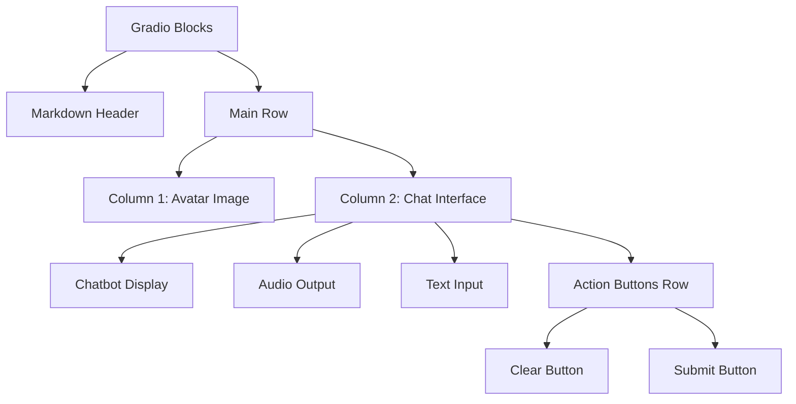
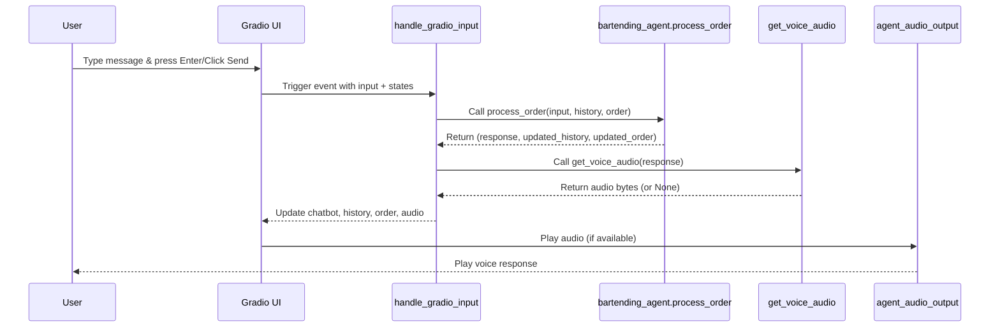

# User Interface

<cite>
**Referenced Files in This Document**   
- [main.py](file://main.py#L1-L142)
- [bartending_agent.py](file://bartending_agent.py#L1-L374)
</cite>

## Table of Contents
1. [User Interface](#user-interface)
2. [UI Components Overview](#ui-components-overview)
3. [Layout and Styling](#layout-and-styling)
4. [Event Handling and State Management](#event-handling-and-state-management)
5. [User Experience Flow](#user-experience-flow)
6. [Accessibility and Responsive Design](#accessibility-and-responsive-design)
7. [Customization Guidance](#customization-guidance)

## UI Components Overview

The Gradio-based user interface defined in `main.py` provides a conversational bartending agent experience. It integrates text, audio, and visual elements to simulate a realistic interaction with a bartender at "MOK 5-ha". The interface is composed of several key components:

- **Chat Display**: A `gr.Chatbot` component that renders the conversation history between the user and the agent.
- **Text Input**: A `gr.Textbox` for users to type their drink orders or questions.
- **Audio Output**: A `gr.Audio` component that plays synthesized voice responses from the agent.
- **Clear Button**: A button to reset the conversation and session state.
- **Avatar Image**: A static image representing the bartender, enhancing the immersive experience.

These components are orchestrated through Gradio’s event system and state management features.

**Section sources**
- [main.py](file://main.py#L50-L142)

## Layout and Styling

The UI layout is structured using Gradio’s `Blocks` and nested `Row`/`Column` components to create a visually balanced and intuitive interface. The design emphasizes clarity and user engagement.



**Diagram sources**
- [main.py](file://main.py#L75-L120)

### Component Layout Details

- **Header**: Uses `gr.Markdown` to display the title and welcome message.
- **Avatar Column**: Contains a `gr.Image` component with a fixed width (`scale=1`) showing the bartender avatar.
- **Chat Column**: Contains all interactive components (`Chatbot`, `Audio`, `Textbox`, `Buttons`) and shares equal width with the avatar column.
- **Styling**: The `gr.themes.Citrus()` theme is applied for a vibrant and modern appearance.

The `elem_classes=["avatar-image"]` allows for potential CSS customization if needed.

**Section sources**
- [main.py](file://main.py#L75-L120)

## Event Handling and State Management

The interface uses Gradio’s `gr.State` to manage session-specific data without relying on global variables. Two state variables are defined:

- `history_state`: Tracks the conversation history as a list of message dictionaries.
- `order_state`: Maintains the current drink order as a list of ordered items.

```python
history_state = gr.State([])
order_state = gr.State([])
```

### Callback Functions

Two primary callbacks handle user interactions:

#### `handle_gradio_input`

This function processes user input, calls the backend logic, and updates the UI:

```python
def handle_gradio_input(
    user_input: str,
    session_history_state: List[Dict[str, str]],
    session_order_state: List[Dict[str, float]]
) -> Tuple[str, List[Dict[str, str]], List[Dict[str, str]], List[Dict[str, float]], Any]:
    # Calls process_order from bartending_agent.py
    response_text, updated_history, updated_order = process_order(
        user_input,
        session_history_state,
        session_order_state
    )
    # Generates TTS audio
    audio_data = get_voice_audio(response_text) if response_text.strip() else None
    return "", updated_history, updated_history, updated_order, audio_data
```

#### `clear_chat_state`

Resets all session data when the user clicks the "Clear Conversation" button:

```python
def clear_chat_state() -> Tuple[List, List, List, None]:
    return [], [], [], None
```

### Event Wiring

The event handlers are connected using Gradio’s `.submit()` and `.click()` methods:

```python
msg_input.submit(handle_gradio_input, submit_inputs, submit_outputs)
submit_btn.click(handle_gradio_input, submit_inputs, submit_outputs)
clear_btn.click(clear_chat_state, None, clear_outputs)
```

This ensures that both pressing Enter in the textbox and clicking the Send button trigger the same processing logic.



**Diagram sources**
- [main.py](file://main.py#L50-L142)
- [bartending_agent.py](file://bartending_agent.py#L250-L350)

**Section sources**
- [main.py](file://main.py#L50-L142)

## User Experience Flow

The user experience follows a clear and intuitive sequence:

1. **Initial Load**: The interface displays the bartender avatar, welcome message, and an empty chat.
2. **User Input**: The user types a message (e.g., "I'd like a Margarita") and submits it.
3. **Processing**: The backend processes the input using the Gemini LLM to generate a response and potentially update the order.
4. **TTS Generation**: The textual response is converted to speech using Cartesia TTS.
5. **Response Display**: The chat history is updated, and the audio is played automatically (`autoplay=True`).
6. **Next Interaction**: The user can continue the conversation or click "Clear Conversation" to start over.

This flow ensures a natural, voice-enabled interaction that mimics real-world bartender-customer dynamics.

**Section sources**
- [main.py](file://main.py#L50-L142)

## Accessibility and Responsive Design

The interface includes several accessibility and responsiveness considerations:

- **Autoplay Audio**: Enabled for immediate feedback, but can be disabled for accessibility compliance if needed.
- **Labeling**: All interactive components (`Textbox`, `Audio`, `Buttons`) include descriptive labels.
- **Keyboard Navigation**: Gradio components are inherently keyboard-navigable.
- **Responsive Layout**: The use of `scale` in columns ensures proportional resizing across devices.
- **Visual Hierarchy**: Clear separation between avatar and chat interface improves focus.

However, additional enhancements could include:
- Adding ARIA labels for screen readers.
- Providing a text-only mode.
- Supporting keyboard shortcuts for common actions.

**Section sources**
- [main.py](file://main.py#L75-L120)

## Customization Guidance

The interface can be customized for different deployment scenarios:

### Appearance Customization
- **Theme**: Replace `gr.themes.Citrus()` with other Gradio themes (e.g., `gr.themes.Soft()`).
- **Avatar**: Update the image path in `gr.Image(value="assets/bartender_avatar_ai_studio.jpeg")`.
- **Colors**: Use `elem_classes` and custom CSS (via `gr.HTML`) for advanced styling.

### Behavior Customization
- **Autoplay**: Set `autoplay=False` in `gr.Audio` to give users control over audio playback.
- **Input Placeholder**: Modify the `placeholder` text in `gr.Textbox`.
- **Button Labels**: Change button text (e.g., "Send" → "Submit Order").

### Functional Extensions
- **Session Persistence**: Integrate with Gradio’s `state` or external storage for longer sessions.
- **Multi-language Support**: Add language selection and TTS voice switching.
- **Order Confirmation**: Add visual indicators for added items.

Example of theme customization:
```python
theme = gr.themes.Soft()
with gr.Blocks(theme=theme) as demo:
    # ... rest of UI
```

**Section sources**
- [main.py](file://main.py#L75-L120)