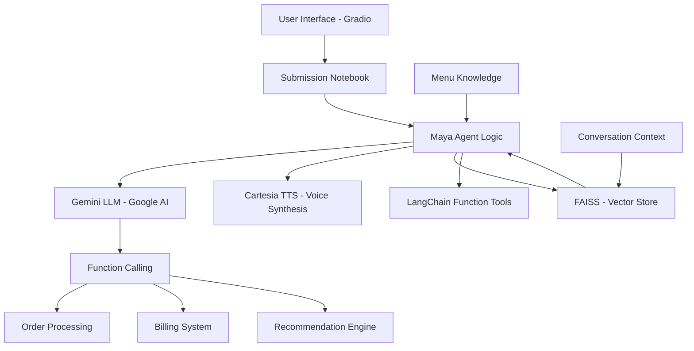

# Maya Bartending Agent 🍸🍺

## Gen AI Intensive Course Capstone Project 2025Q1

A sophisticated AI-powered bartending agent that demonstrates advanced conversational AI capabilities through order taking, personalized recommendations, and meaningful customer interactions.

### 🎯 **Kaggle Competition Submission**
- **Competition**: [Gen AI Intensive Course Capstone 2025Q1](https://www.kaggle.com/competitions/gen-ai-intensive-course-capstone-2025q1/rules)
- **Live Submission**: [Maya Bartending Agent on Kaggle](https://www.kaggle.com/code/jacquelinehernanez/bartending-agent-maya)

---

## 🥂 Use Case

Maya is a proof-of-concept agentic AI bartender for "MOK-5ha" (Moksha) - a philosophically-themed bar where liberation meets libation. The agent can:

- **Take Complex Orders**: Process multi-item drink orders with modifiers and customizations
- **Make Personalized Recommendations**: Suggest drinks based on customer preferences (sobering, classy, fruity, strong, burning)
- **Engage in Meaningful Conversation**: Conduct philosophical discussions while maintaining professional bartending service
- **Manage Complete Transactions**: Handle ordering, billing, tips, and payment processes
- **Provide Multi-Modal Experience**: Respond with both text and high-quality voice synthesis

---

## 🫗 How It Works

1. **Customer Interaction**: Users interact through a Gradio web interface with text input
2. **Order Processing**: Maya processes natural language requests using Google's Gemini frontier model
3. **State Management**: The system maintains conversation history and order state across interactions
4. **Voice Response**: Maya responds with both text and synthesized speech via Cartesia API
5. **Transaction Completion**: Maya handles billing, tips, and provides order summaries

---

## 🦾 AI Capabilities Demonstrated

### ✅ **Function Calling**
- LangChain and Gemini API function calling for order management
- Tool integration for menu retrieval, order tracking, and billing

### ✅ **Agent Architecture**
- Agentic workflow with conversation state management
- Multi-turn interaction handling with context preservation

### ✅ **Retrieval Augmented Generation (RAG)**
- FAISS vector database for conversational context
- Semantic search for relevant response augmentation
- Menu knowledge integration for accurate order processing

### ✅ **Vector Search/Database**
- FAISS implementation for storing and retrieving conversational content
- Embedding-based similarity search for contextual responses

### ✅ **Audio Understanding & Generation**
- Text-to-Speech via Cartesia API
- High-quality voice synthesis with custom voice selection
- Audio response integration with web interface

### ✅ **Long Context Window**
- Extended conversation history management
- Context-aware responses across multiple interaction turns

### ✅ **Embeddings**
- Google's text-embedding-004 model for vectorizing content
- Semantic matching for RAG pipeline

### ✅ **Structured Output/JSON Mode**
- Consistent order format generation
- Structured billing and recommendation responses

---

## 🏗️ Architecture Overview



### Current Architecture

- **`submission_notebook.ipynb`**: Complete self-contained implementation with all functionality
- **Gradio Interface**: Web-based user interaction layer (within notebook)
- **Maya Agent Logic**: Core business logic, LLM integration, and TTS (all within notebook)
- **Vector Store**: FAISS for conversational context and RAG
- **LangChain Tools**: Order management, billing, and recommendation systems
- **Function Calling**: Gemini-powered tool invocation for order processing

---

## 🚀 Quick Start

### Prerequisites

1. **Python 3.8+**
2. **API Keys**:
   - Google Gemini API key
   - Cartesia API key (for text-to-speech)

### Installation

1. **Clone the repository**:
   ```bash
   git clone https://github.com/MOK-5-ha/MayaBartendingAgent.git
   cd MayaBartendingAgent
   ```

2. **Set up environment variables**:
   ```bash
   export GOOGLE_API_KEY="your_gemini_api_key_here"
   export CARTESIA_API_KEY="your_cartesia_api_key_here"
   ```

3. **Run the submission notebook**:
   ```bash
   jupyter notebook notebooks/submission_notebook.ipynb
   ```

   Or open directly in your preferred Jupyter environment and run all cells.

### Kaggle Deployment

The notebook is designed to run seamlessly on Kaggle with API keys stored as Kaggle Secrets:
- Add your `GOOGLE_API_KEY` and `CARTESIA_API_KEY` to Kaggle Secrets
- Import and run the submission notebook
- All dependencies are installed automatically within the notebook

---

## 💡 Key Features

### 🍹 **Comprehensive Menu System**
- Full bar inventory with pricing
- Cocktails, beer, wine, and non-alcoholic options
- Modifier support (neat, on the rocks, dirty, etc.)
- Preference-based recommendations

### 🧠 **Intelligent Conversation Management**
- Context-aware responses using RAG
- Philosophical discussions themed around "Moksha" (liberation)
- Personality-driven interactions with consistent character

### 📝 **Advanced Order Processing**
- Natural language order parsing
- Quantity and modifier handling
- Real-time order tracking and bill calculation
- Tip processing and payment simulation

### 🎵 **Voice Synthesis**
- High-quality text-to-speech via Cartesia
- Custom voice configuration for Maya's personality
- Pronunciation optimization for special terms

### 🔧 **Robust Error Handling**
- Exponential backoff retry mechanisms
- Graceful API failure handling
- Fallback responses for service disruptions

---

## 📋 Menu Highlights

### 🍸 **Signature Cocktails**
- **Moksha Martini** ($15) - Liberation in a glass
- **Samsara Sour** ($12) - The cycle of flavors
- **Nirvana Negroni** ($14) - Enlightened bitters

### 🍹 **Classic Cocktails**
- Old Fashioned, Margarita, Negroni, Cosmopolitan
- Premium spirits and house-made mixers
- Expert preparation with traditional techniques

### 🍾 **Preference Categories**
- **Sobering**: Non-alcoholic options for clear-headed choices
- **Classy**: Sophisticated, elegant drinks for refined tastes
- **Fruity**: Sweet, refreshing drinks with vibrant flavors
- **Strong**: Higher alcohol content for experienced drinkers
- **Burning**: Intense sensation with premium spirits

---

## 🛠️ Technical Implementation

### LLM Integration
- **Model**: Google Gemini 2.5 Flash
- **Framework**: LangChain for function calling and tool integration
- **Context Management**: Dynamic prompt construction with conversation history and phase tracking

### Vector Database
- **Engine**: FAISS for in-memory vector storage
- **Embeddings**: Google's text-embedding-004 model
- **Purpose**: RAG pipeline for contextual conversation enhancement

### Text-to-Speech
- **Service**: Cartesia API for high-quality voice synthesis
- **Quality**: 24kHz WAV format with custom voice configuration
- **Features**: Pronunciation optimization and audio streaming

### Web Interface
- **Framework**: Gradio for rapid prototyping and deployment
- **Features**: Text input, chat history, audio playback, and avatar display
- **Design**: Two-column layout optimized for conversational interaction

---

## 🎭 Maya's Personality

Maya embodies the philosophical theme of "Moksha" - she's knowledgeable about both cocktails and consciousness, providing:

- **Professional Service**: Accurate order taking and recommendations
- **Philosophical Depth**: Thoughtful conversations about life and liberation
- **Humble Wisdom**: Insightful without being pretentious
- **Warm Hospitality**: Friendly and engaging personality

---

## 📊 Project Structure

```
MayaBartendingAgent/
├── README.md                   # This file
└── notebooks/
    ├── agent-building-bartending-bot.ipynb  # Historical: Initial LangGraph function calling implementation
    ├── gradio_ui_testing.ipynb     # Historical: UI development & testing
    ├── mvp_notebook_kaggle.ipynb   # Historical: MVP development notebook
    ├── rag-bartender-bot.ipynb # Historical : Initial RAG implementation
    └── submission_notebook.ipynb    # Complete self-contained implementation

```

### Implementation Architecture

The submission notebook contains a complete, self-contained implementation organized into logical sections:

- **Environment Setup**: Automatic dependency installation and API key configuration
- **RAG System**: FAISS vector database with Google embeddings for conversation enhancement
- **LangChain Integration**: Function calling tools for order management, billing, and recommendations
- **Agent Logic**: Conversation phase management and state tracking across interactions
- **Gemini LLM**: Natural language understanding with structured tool invocation
- **Cartesia TTS**: High-quality voice synthesis with pronunciation optimization
- **Gradio Interface**: Complete web UI with real-time chat and audio playback
- **Deployment Ready**: Works seamlessly in both local Jupyter and Kaggle environments

The historical notebooks (`gradio_ui_testing.ipynb` and `mvp_notebook_kaggle.ipynb`) showcase the iterative development process that led to the final submission, demonstrating various approaches to UI design, agent architecture, and integration patterns.

---

## 🔮 Limitations & Future Enhancements

### Current Limitations
- **Single User**: Global state variables limit concurrent usage
- **Session Persistence**: No memory between application restarts
- **Payment Simulation**: No real payment processing integration
- **Mobile Optimization**: Interface may not scale well on small screens
- **Language Support**: Currently English-only

### Potential Enhancements
- Multi-user session management
- Persistent conversation history
- Real payment gateway integration
- Mobile-responsive design
- Multilingual support
- Extended menu customization capabilities

---

## 🏆 Competition Results

This project demonstrates advanced AI capabilities required for the Gen AI Intensive Course Capstone, including:

- ✅ Function calling with complex tool integration
- ✅ Agentic behavior with state management
- ✅ RAG implementation with vector databases
- ✅ Audio processing and synthesis
- ✅ Long context conversations
- ✅ Structured output generation
- ✅ Robust error handling and retry mechanisms

---

## 🤝 Contributors

- **Primary Development**:
    - [Joshua Elamin](https://github.com/JAaron93)
    - [Jacqueline Hernandez](https://github.com/jacquelinehrndz)
- **Kaggle Submission**: [Bartending Agent: MAYA](https://www.kaggle.com/code/jacquelinehernanez/bartending-agent-maya)

---

## 📜 License

This project is licensed under the Apache License 2.0. See the LICENSE file for details.

Developed for educational purposes as part of the Gen AI Intensive Course Capstone 2025Q1.

---


*"Welcome to MOK-5ha, where every sip is a step towards liberation. I'm Maya, your guide through both spirits and spirit. What can I craft for your journey today?"* 🌟